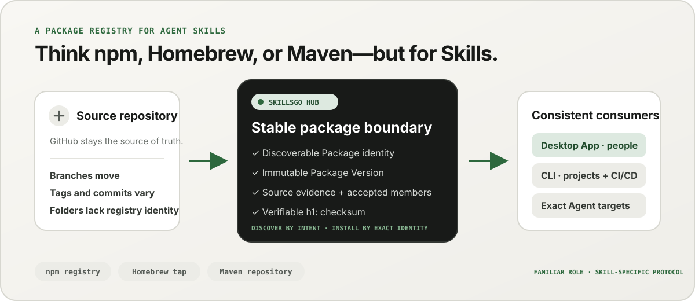

<p align="center">
  
</p>

**One workflow for Agent Skills —** Discover source-verifiable Skills, pin immutable versions, and operate the same installations through a desktop App or automation-friendly CLI.

<!-- README-I18N:START -->

  <p>
    <strong>English</strong> ·
    <a href="./docs/readme/README.zh-CN.md">简体中文</a> ·
    <a href="./docs/readme/README.zh-TW.md">繁體中文（台灣）</a> ·
    <a href="./docs/readme/README.zh-HK.md">繁體中文（香港）</a> ·
    <a href="./docs/readme/README.ja.md">日本語</a> ·
    <a href="./docs/readme/README.ko.md">한국어</a> ·
    <a href="./docs/readme/README.fr.md">Français</a> ·
    <a href="./docs/readme/README.de.md">Deutsch</a> ·
    <a href="./docs/readme/README.it.md">Italiano</a> ·
    <a href="./docs/readme/README.es.md">Español</a> ·
    <a href="./docs/readme/README.pt-BR.md">Português (Brasil)</a> ·
    <a href="./docs/readme/README.ru.md">Русский</a> ·
    <a href="./docs/readme/README.ar.md">العربية</a> ·
    <a href="./docs/readme/README.hi.md">हिन्दी</a> ·
    <a href="./docs/readme/README.id.md">Bahasa Indonesia</a> ·
    <a href="./docs/readme/README.tr.md">Türkçe</a> ·
    <a href="./docs/readme/README.nl.md">Nederlands</a> ·
    <a href="./docs/readme/README.pl.md">Polski</a> ·
    <a href="./docs/readme/README.th.md">ไทย</a> ·
    <a href="./docs/readme/README.vi.md">Tiếng Việt</a> ·
    <a href="./docs/readme/README.ms.md">Bahasa Melayu</a> ·
    <a href="./docs/readme/README.sv.md">Svenska</a> ·
    <a href="./docs/readme/README.uk.md">Українська</a>
  </p>
<!-- README-I18N:END -->

SkillsGo is a source-verifiable ecosystem for discovering, versioning, and operating Agent Skills. Use the desktop App to explore and manage Skills, the CLI to make installations reproducible, and the Hub as the shared or self-hosted distribution origin for immutable Package Versions.

> **Think npm, Homebrew, or Maven—but for Agent Skills.** GitHub remains the source of truth for code; the SkillsGo Hub turns supported sources into discoverable, immutable, checksum-verifiable Skill Packages that the App and CLI can install consistently across Agents and machines.

<p align="center">
  
</p>

**From moving source to stable dependency —** The Hub gives people intent-based discovery while giving machines exact Package identity, immutable versions, accepted Skill membership, and checksums.

## Choose your operating model

| Mode | Best for | What SkillsGo provides |
| --- | --- | --- |
| **Personal App** | Discovering and managing Skills interactively | Source evidence, supported-Agent targets, project and global Libraries, safe update previews, and local context-footprint insights |
| **CLI and CI/CD** | Repeatable developer environments and automation | Machine-readable commands, exact Skill selection, `skills.yaml`, `skills-lock.yaml`, checksum verification, offline cache recovery, and scope-aware updates |
| **Self-hosted Hub** | Teams that need a controlled Skill catalog | A configurable Hub Origin with the same public protocol, immutable Package Versions, searchable metadata, static Git artifacts, and optional access control |

The comparison is about the role, not protocol compatibility:

| Familiar model | What the SkillsGo Hub brings to Agent Skills |
| --- | --- |
| **npm registry** | Searchable Package identity and explicit immutable versions instead of copying an unknown folder from a moving branch |
| **Homebrew tap** | One trusted distribution origin that the App or CLI can use across developer machines |
| **Maven repository** | Stable coordinates, immutable artifacts, checksums, and lockable dependency resolution |
| **Skill-specific layer** | Source evidence, accepted Skill membership, exact member selection, supported-Agent metadata, and installation targets |

The Hub does not replace GitHub or pretend to be npm, Homebrew, or Maven compatible. It gives Agent Skills the registry and distribution guarantees those ecosystems made familiar for other kinds of software.

## Why SkillsGo

- **Source evidence before installation** — inspect the source repository, immutable release, supported Agents, files, and rendered `SKILL.md` before changing a machine.
- **Reproducible environments** — resolve a tag, branch, or commit once, persist the resulting immutable version, and restore it through a strict manifest and lock.
- **One Package, explicit members** — distribute a complete Package Version while selecting exact Skill names or paths and the Agent targets that should receive them.
- **Local-first safety** — protect local modifications, keep derived state rebuildable, and continue local inventory work when a Hub is unavailable.
- **Context footprint insights** — estimate the character footprint of resident Skill names and descriptions, then identify Skills with no observed calls in the last 45 or 90 days. This is a local context proxy, not model billing telemetry.
- **Two product interfaces, one protocol** — use the App for interactive workflows and the CLI for automation; both speak to the same Hub contract.

## See the App in action

The desktop App connects discovery, source evidence, installation targets, and local inventory in one human-friendly journey. Personal use is accountless.

<p align="center">
  
</p>

**Live Hub discovery —** Browse a continuously updated catalog without signing in, so useful Skills are visible before any local installation or configuration change.

### Discover and inspect

Search by Skill or source repository, explore ranking and search results, and inspect the source repository, immutable release, supported Agents, translated summary, and rendered `SKILL.md` before installation.

<p align="center">
  
</p>

**Source-aware search —** Find Skills by capability or repository and see their Package context, helping you compare related Skills instead of trusting an isolated snippet.

<p align="center">
  
</p>

**Inspect before installing —** Review the immutable version, supported Agents, source files, and rendered instructions first, reducing supply-chain surprises and accidental machine changes.

### Install and govern local Skills

Install globally or into selected projects, choose the Agent targets that should receive the same Skill release, and review the consequences of a Package update before applying it.

<p align="center">
  
</p>

**Explicit installation targets —** Choose global or project scope and the exact Agents that receive a Skill, keeping one release consistent without copying files by hand.

<p align="center">
  
</p>

**Impact-aware updates —** See version transitions and removed Skills before applying an update, so dependency changes remain deliberate and recoverable.

<p align="center">
  
</p>

**Global Library insights —** Compare 45/90-day local usage, context footprint, and Agent visibility in one inventory, making unused Skills and resident context easier to govern.

<p align="center">
  
</p>

**Project-scoped governance —** Narrow the same inventory to one project, so its installations, usage evidence, and unmanaged Skills can be reviewed without global noise.

## Versioned distribution through CLI and Hub

The CLI and Hub form the engineering surface of SkillsGo. The Hub converts a moving source repository into a stable dependency boundary: a Package is the distribution unit, and each Package Version is an immutable snapshot of one source revision and its complete accepted Skill membership. This lets people discover by intent while machines install by exact identity.

```yaml
dependencies:
  github.com/acme/skills:
    version: v1.2.3
    skills: [review, design]
    agents: [codex, claude-code]
```

`skills.yaml` records the desired Package version, selected members, and Agent targets. The generated `skills-lock.yaml` binds that version to its Package `h1:` sum. A fresh machine or CI job can run the same install flow and verify the same artifact instead of following a moving branch.

```sh
# Discover and inspect
npx skillsgo find typescript
npx skillsgo show github.com/acme/skills@v1.2.3

# Add exact members to a project or the global scope
npx skillsgo add github.com/acme/skills@v1.2.3 \
  --skill review --agent codex

# Restore, preview, and update reproducibly
npx skillsgo install
npx skillsgo update --dry-run
npx skillsgo update --yes
```

The same commands can target another Hub Origin:

```sh
npx skillsgo add github.com/acme/skills@v1.2.3 \
  --hub https://hub.example.com \
  --skill review --agent codex
```

## Self-hosted Hub for teams

Organizations can run a Hub Origin that implements the same SkillsGo protocol as the official service. This makes it possible to curate an approved catalog, keep Package Version history immutable, expose searchable metadata, serve verified artifacts, and point the App or CLI at one controlled origin.

```text
Source repository
       │
       ▼
Hub Package Version ── immutable metadata, artifact, and h1: sum
       │
       ├── SkillsGo App (interactive discovery and management)
       └── SkillsGo CLI (projects, CI/CD, and repeatable installs)
```

The public Hub contract currently focuses on supported public Skill Sources. A private Hub can provide controlled distribution of approved Packages; private-source ingestion and enterprise identity integrations are separate deployment capabilities, not assumptions hidden in the client.

## How it works

<p align="center">
  
</p>

**A shared immutable protocol —** The Hub resolves source evidence once, while the App and CLI consume the same Package Version and checksum, giving interactive and automated installs the same result.

1. A supported source is resolved to one immutable Package Version.
2. The Hub publishes Package metadata, accepted Skill membership, a static Git artifact, and a verifiable Package sum.
3. The App or CLI reads the same protocol and lets the user choose exact members, scopes, and Agent targets.
4. The CLI materializes protected local Package trees and Agent projections from the manifest and lock.
5. Updates resolve a new immutable version and show the impact before changing local state.

## Explore the monorepo

```text
skillsgo/
├── app/       Flutter desktop client and user experience
├── cli/       Go CLI, local state, and Skill execution engine
├── hub/       Public Hub service and reusable self-host runtime
├── protocol/  Shared executable contracts used by CLI and Hub
├── web/       Public product, Hub, and documentation surface
└── e2e/       Cross-product CLI/Hub and desktop journeys
```

Read [`CONTEXT-MAP.md`](CONTEXT-MAP.md) for product boundaries and domain language. The public release and artifact model is documented in [`docs/release-design.md`](docs/release-design.md).

## Run it locally

The unified development topology currently targets macOS and requires Flutter, Go, Docker, [Process Compose](https://github.com/F1bonacc1/process-compose), and [Air](https://github.com/air-verse/air).

```sh
make dev
```

This starts PostgreSQL, the local Hub, a freshly built CLI, and the Flutter desktop App under one supervised session. To validate all configured workspaces:

```sh
make test
```

Focused entry points are available for each workspace:

| Workspace | Development or validation |
| --- | --- |
| App | `cd app && flutter run -d macos` |
| CLI | `cd cli && go test ./...` |
| Hub | `cd hub && go test ./...` |
| Protocol | `cd protocol && go test ./...` |
| Web | `cd web && pnpm install && pnpm dev` |

See [CONTRIBUTING.md](CONTRIBUTING.md) before changing product behavior.

## Project status

SkillsGo is in active early release development. App, CLI, Hub, and Protocol are developed as separate release units, while package-manager outputs and native archives are assembled from the same verified CLI build matrix. See the [release design](docs/release-design.md) for supported targets, artifact integrity, update behavior, and supply-chain requirements.

## Community

- Use [GitHub Discussions](https://github.com/skillsgo/skillsgo/discussions) for questions, troubleshooting, and early ideas.
- Use the focused [issue forms](https://github.com/skillsgo/skillsgo/issues/new/choose) for reproducible bugs, concrete feature requests, and documentation problems.
- Follow [SECURITY.md](SECURITY.md) to report vulnerabilities privately.
- Participation is governed by the [Code of Conduct](CODE_OF_CONDUCT.md) and the [governance model](GOVERNANCE.md).

## License

SkillsGo is licensed under the [Apache License 2.0](LICENSE).

The Hub contains code derived from [Athens](https://github.com/gomods/athens), which remains subject to the Athens MIT License and attribution notices. See [`NOTICE`](NOTICE) and [`THIRD_PARTY_LICENSES/ATHENS-LICENSE`](THIRD_PARTY_LICENSES/ATHENS-LICENSE).
