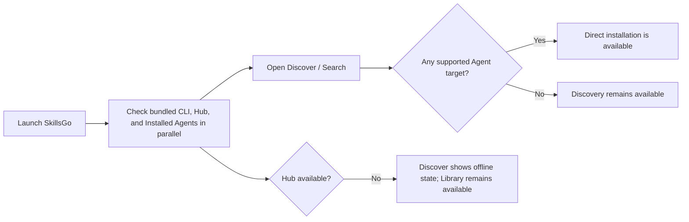

# SkillsGo User Journeys and Information Architecture

This document defines navigation, core journeys, page states, and interaction boundaries for the Personal desktop App. Users should be able to discover, inspect, and manage every local Agent Skill without understanding CLI arguments, Store layout, or Agent directories.

## Product Principles

1. **Useful before configured**: open Discover immediately instead of forcing first-run setup.
2. **Inventory reflects the machine**: include both SkillsGo-managed targets and External Installations discovered in Agent directories.
3. **Skill is the primary object**: aggregate the Library by logical Skill; location, Agent, and version belong to Installation Targets.
4. **Mutations are explicit**: show the exact targets affected before install, update, or removal.
5. **Multi-target is not a fake transaction**: commit targets independently and retain successful targets after partial failure.
6. **Projects require authorization**: inspect only projects explicitly added by the user.
7. **The terminal is not a prerequisite**: production App releases bundle a compatible SkillsGo CLI.

## Information Architecture

The top-level navigation remains a centered three-item capsule with a white selected state and spring movement:

```text
Discover    Library    Settings
```

Each destination displays a Burrow-inspired floating rounded left rail. Project and Agent entries require visible labels instead of icon-only navigation. Each destination keeps its own ambient color and accent.

### Discover

```text
Search
Ranking
Trending
Hot
```

- **Search**: search by name, description, source, and capability terms. This is the default destination.
- **Ranking**: order by all-time accepted install count.
- **Trending**: order by installs during the latest 24-hour window.
- **Hot**: highlight short-term installation velocity and its change from the comparison period.

### Library

```text
All
User Scope
Project A
Project B
+ Add Project
────────
Codex
Claude Code
Cursor
```

- All aggregates every known location and Agent.
- User Scope shows only user-level targets.
- Projects include only directories explicitly added by the user.
- The entries after the divider include every Installed Agent, even when an Agent has zero Skills.
- Project and Agent entries are mutually exclusive navigation destinations. Only one rail item is selected at a time; they do not form an intersection filter.
- Long names stay on one line, truncate, and reveal the full name and path on hover.
- Dynamic entries may scroll, while All and Add Project remain easy to reach.

### Settings

```text
General
Agents
Hub
Installation Policy
Storage
About
```

- **General**: follow-system language, explicit language override, startup behavior, reduced motion, and reduced transparency.
- **Agents**: detection state, paths, re-detection, and adapter guidance.
- **Hub**: official or self-hosted Origin, connection health, and reset to default.
- **Installation Policy**: symlink or copy defaults, conflict handling, risk confirmation, and install telemetry.
- **Storage**: Store path, disk usage, reveal in file manager, and safe pruning of unreferenced artifacts.
- **About**: App and bundled CLI versions, updates, repositories, licenses, and privacy.

## First Launch



First launch requires no account, project, or external CLI. Health checks must not delay the window:

- A bundled CLI failure provides retry and diagnostics.
- A supported Agent remains an installation target even when its application is not currently installed; SkillsGo creates the target directory when needed.
- While the Hub is offline, the Library, local details, projects, and Agent views remain available.

## Journey 1: Discover and Install a Skill

### Browse

Search, Ranking, Trending, and Hot use one Skill-card model. Each card shows at least:

- repository avatar or owner fallback, name, and short description;
- source repository;
- install count or ranking-specific metric;
- installed state and target count.

Trust, immutable version, risk, and artifact audit metadata remain in Skill detail instead of competing with discovery comparison. Discovery cards use a responsive three-, two-, or one-column grid based on the available content width.

Clicking the card opens detail. Every discovery card uses the compact “Install” action, which opens the location selector directly. Existing targets remain visibly installed and cannot be selected again, so concise discovery copy never permits a duplicate installation.

### Pre-install Detail

Detail preserves the originating query, ranking position, and scroll state. It includes:

- name, description, source, version, Trust Level, and install count;
- rendered `SKILL.md`;
- files and script or executable warnings;
- Risk Assessment and installation guidance;
- existing Installation Targets and Version Divergence;
- immutable source and version information.

Back navigation restores the exact originating list state instead of returning to the Discover root.

### Select Installation Targets

The installation sheet uses a location-by-Agent matrix. Rows include User Scope and every Added Project; columns include every supported Agent. Installed Agents are selected by default; supported but uninstalled Agents remain available explicitly.

| Location | Codex | Claude Code | Cursor |
| --- | ---: | ---: | ---: |
| User Scope | ✓ |  | ✓ |
| Project A | ✓ | ✓ |  |
| Project B |  | ✓ |  |

- Select individual cells, a complete row, or a complete column.
- Create only explicitly selected cells; never generate an automatic Cartesian product from two independent multi-selects.
- An existing target at the same version displays Installed and cannot be duplicated.
- A different version, same-name different source, or Local Modification displays a conflict on that cell.
- Add Project is available inside the sheet and the new project immediately becomes a row.
- The App may remember the previous matrix selection, but every operation still displays the complete plan.

### Preflight and Confirmation

Before execution, show:

- artifact version and source;
- counts for create, replace, skip, conflict, and risky targets;
- Workspace Manifests that will change;
- the selected resolution for each conflict;
- any additional High or Critical risk confirmation.

### Execution and Result

Each Installation Target commits independently. The result groups success, skipped, conflict, and failure outcomes:

```text
5 targets installed, 1 failed

✓ User Scope / Codex
✓ Project A / Codex
✓ Project A / Claude Code
…
✕ Project B / Claude Code    Directory is not writable
```

The user can Retry Failed Targets, View in Library, or remain on the current detail. One failure never rolls back other successful targets.

## Journey 2: Browse the Library

### Inventory Sources

The Library merges facts from:

- the Content-addressed Store and Installation Receipts;
- `skillsgo.mod` and `skillsgo.sum` in Added Projects;
- user-level Skill directories for Installed Agents;
- Agent Skill directories inside Added Projects;
- Hub source, version, trust, and risk metadata.

Hub Skills aggregate by stable Skill ID. Local Skills aggregate by inventory key. External Installations without a managed Skill ID must not merge only because their names match.

### Library Rows

One logical Skill appears as one Library Entry regardless of target count. The
row keeps the Skill identity primary and shows:

- name and description, with installation coverage as the fallback summary;
- the Agents that can discover or own targets for the Skill.

Each row has a selection checkbox. Selecting one or more rows opens a floating
selection bar for the existing Update and Manage Targets journeys. These
journeys retain their per-entry preflight, exact-target review, confirmation,
progress, and result behavior. Health, provenance, target count, versions, risk,
and update details remain available in Skill detail rather than as row status or
row actions.

### View Semantics

- **All**: every Library Entry.
- **User Scope**: entries with at least one user-level target; detail opens with user-level targets as the current context.
- **Project A**: every Skill used by any Agent in the project; an empty project prompts the user to install its first Skill.
- **Codex**: every Skill with at least one Codex target across all locations; an empty Agent prompts discovery.

Changing the rail selection replaces the current view and never retains a project-and-Agent intersection. Search within the list filters only the current view by name, description, and source.

## Journey 3: Manage an Installed Skill

Installed detail presents the Skill first and lists the relevant targets:

| Location | Agent | Version | Type | State |
| --- | --- | --- | --- | --- |
| User Scope | Codex | v1.4 | Hub | Current |
| Project A | Codex | v1.2 | Hub | Update available |
| Project A | Claude Code | v1.2 | Hub | Update available |
| Project B | Cursor | local-1 | Local | No online updates |

Primary actions include:

- install to more targets;
- check for updates;
- update selected targets;
- remove selected targets;
- repair missing or redirected targets;
- inspect files, risk, source, and Local Modifications;
- export a Local Skill.

### Update

- Resolve the update source and available version for every managed target.
- Permit projects to retain different versions.
- Require explicit target selection in the matrix.
- Update a project's Workspace Manifest after confirmation.
- Do not label a fixed commit without a movable reference as updateable.
- Exclude External Installations and Local Skills without online sources from Hub updates.
- Permit partial success and retry failed targets.

### Remove

- Show only targets belonging to the current Skill.
- Require explicit target selection instead of an ambiguous Delete Skill action.
- Removing one target never affects other targets for the same Skill.
- Removing the final target does not immediately prune Store content still referenced by a recoverable Workspace Manifest.
- Allow exact-path External Installation removal after reviewed confirmation; do not require or perform adoption.

## Journey 4: Adopt an External Installation

An item found in an Agent directory without an Installation Receipt appears as an External Installation. Users may inspect its `SKILL.md`, files, and risk, but update and removal remain disabled.

Bring Under Management performs the following journey:

1. Compute the current content digest.
2. Attempt to match an immutable Hub artifact.
3. If matched, show source and version and ask the user to confirm the association.
4. If unmatched, allow import as a Local Skill.
5. Store the Local Skill so it can be installed elsewhere, exported, or removed without gaining an online update source.
6. Never publish content to the Hub as a side effect of import.

Import preserves current content and never replaces an External Installation with a Hub version without explicit confirmation.

## Journey 5: Add and Manage a Project

Add Project performs the following journey:

1. Select one directory through the operating-system file picker.
2. Grant and persist explicit access to that directory.
3. Read the Workspace Manifest and Workspace Manifest when present.
4. Inspect known Agent Skill directories inside the project.
5. Merge managed targets and External Installations.
6. Pin the project in the left rail and open its view.

A project need not be a Git repository and need not contain SkillsGo files. Removing it from the App never deletes its directory, declarations, Lock, or Skills.

When a project is moved, deleted, or inaccessible, keep a diagnosable rail state with Relocate and Remove from List actions instead of forgetting it silently.

## Navigation and State Preservation

- Start at Discover / Search.
- Each top-level destination remembers its last subpage, scroll position, and input state for the current session.
- Switching destinations preserves active installs, updates, and scans.
- Skill detail carries origin context and restores query, ranking page, Library view, and scroll position on Back.
- Completion does not force navigation; results offer an explicit View in Library action.
- Reduced motion replaces spring and large movement with immediate changes or short fades.

Suggested logical routes:

```text
/discover/search
/discover/ranking
/discover/trending
/discover/hot
/discover/skill/:skillId

/library/all
/library/user
/library/project/:projectId
/library/agent/:agentId
/library/skill/:libraryEntryId

/settings/general
/settings/agents
/settings/hub
/settings/install
/settings/storage
/settings/about
```

## Required Page States

| Scenario | Required experience |
| --- | --- |
| Hub offline | Discover provides retry; Library remains available |
| No Installed Agent | Discovery remains available; install explains the missing targets |
| No Added Project | Keep Add Project visible without fake placeholder projects |
| Empty project | Prompt installation of the project's first Skill |
| Agent with zero Skills | Keep the Agent entry and prompt discovery |
| External Installation | Allow inspection and exact-path removal; disable update, repair, and adoption |
| Version Divergence | Display versions and targets without treating it as an error |
| Partial failure | Retain successes, show per-target causes, and retry failures |
| Manually replaced target | Mark unhealthy; do not delete automatically; offer repair or stop managing |
| Inaccessible project | Keep the entry and offer Relocate or Remove from List |

## Gap Between Current Implementation and Target Journey

The current App is a validation build with one Discover page, user-level Codex installation, and a global list. Before implementing the target UI, stabilize these App-to-CLI JSON contracts:

1. list every Agent Adapter and detection state;
2. read unified inventory across User Scope and Added Projects;
3. detect and identify External Installations;
4. return Library Entries with their Installation Targets;
5. execute a multi-location, multi-Agent Installation Plan with per-target results;
6. adopt an External Installation as a Hub Skill or Local Skill;
7. check, update, remove, repair, and retry selected targets;
8. read Ranking, Trending, and Hot Hub collections;
9. bundle and validate the matching CLI in each App release.

The UI must not reconstruct inventory or operation results by parsing human-oriented CLI text while these contracts are being built.
