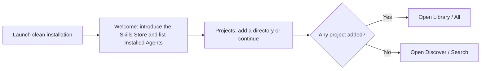

# SkillsGo User Journeys and Information Architecture

This document defines navigation, core journeys, page states, and interaction boundaries for the Personal desktop App. Users should be able to discover, inspect, and manage every local Agent Skill without understanding CLI arguments, Store layout, or Agent directories.

## Product Principles

1. **Orient before entry**: require a short, resumable first-launch Onboarding before exposing the main destinations on a clean installation.
2. **Inventory reflects the machine**: include both SkillsGo-managed targets and External Installations discovered in Agent directories.
3. **Skill is the primary object**: aggregate the Library by logical Skill; location, Agent, and version belong to Installation Targets.
4. **Mutations are explicit**: show the exact targets affected before install, update, or removal.
5. **Multi-target is not a fake transaction**: commit targets independently and retain successful targets after partial failure.
6. **Projects require authorization**: inspect only projects explicitly selected by the user.
7. **The terminal is not a prerequisite**: production App releases bundle a compatible SkillsGo CLI.

## Information Architecture

The top-level navigation remains a centered three-item capsule with a white selected state and spring movement:

```text
Discover    Library    Settings
```

Library and Settings display a Burrow-inspired floating rounded left rail. Project entries require visible labels instead of icon-only navigation. Each destination keeps its own ambient color and accent.

### Discover

```text
Search
Ranking
Trending
Hot
```

- **Search**: search by name, description, source, and capability terms. This is the default destination.
- **Ranking**: order by all-time accepted install count.
- **Trending**: order by installs during the latest 24-hour window.
- **Hot**: highlight short-term installation velocity and its change from the comparison period.

### Library

```text
All Skills
Global
Project A
Project B
+ Add Project
```

- All Skills aggregates every known location and Agent.
- Global is the user-facing label for User Scope and shows only user-level targets.
- Projects include only directories explicitly added by the user.
- The content toolbar keeps search, update status, and an Agent multi-select separate from location navigation. Every Installed Agent remains available even when it has zero Skills.
- One location route and any Agent subset may be combined. The project dropdown is removed so the rail is the only location-navigation control.
- Long names stay on one line, truncate, and reveal the full name and path on hover.
- Dynamic project entries may scroll, while All Skills and Global remain at the top and Add Project stays pinned at the bottom.

### Settings

```text
General
Agents
Advanced
```

- **General**: language, appearance, folder theme, wallpaper, and reminder preferences.
- **Agents**: detection state, paths, re-detection, and adapter guidance.
- **Advanced**: official or self-hosted Hub Origin health, bundled CLI recovery and developer override, storage status, Critical-risk policy, and restarting Onboarding without deleting data.

## First Launch



Clean installations must complete the two-step Mandatory Onboarding before entering Discover, Library, or Settings. Existing users upgrading from an earlier version are treated as complete when existing App state proves prior use.

- Welcome uses one bundled-CLI read to render the complete Installed Agent set without per-Agent progress or Skill counts.
- Welcome performs no Skill scan and starts no background migration.
- Projects permits repeated manual additions before completion.
- Additions persist immediately. Closing and reopening resumes Onboarding at the Projects step without losing added projects.
- The Stepper finish action always reads **Start Using SkillsGo**. It permanently completes Onboarding whether or not the user added a project.
- A bundled CLI failure provides retry and diagnostics because the App cannot establish a valid local boundary without it.
- Hub health is not part of Onboarding and cannot block local setup.

## Journey 1: Discover and Install a Skill

### Browse

Search, Ranking, Trending, and Hot use one Skill-card model. Each card shows at least:

- repository avatar or owner fallback, name, and short description;
- source repository;
- install count or ranking-specific metric;
- installed state and target count.

Trust, immutable version, risk, and artifact audit metadata remain in Skill detail instead of competing with discovery comparison. Discovery cards use a responsive three-, two-, or one-column grid based on the available content width.

Clicking the card opens detail. Every discovery card uses the compact “Install” action, which opens the location selector directly. Existing targets remain visibly installed and cannot be selected again, so concise discovery copy never permits a duplicate installation.

### Pre-install Detail

Detail preserves the originating query, ranking position, and scroll state. It includes:

- name, description, source, version, Trust Level, and install count;
- rendered `SKILL.md`;
- files and script or executable warnings;
- Risk Assessment and installation guidance;
- existing Installation Targets and Version Divergence;
- immutable source and version information.

Back navigation restores the exact originating list state instead of returning to the Discover root.

### Select Installation Targets

The installation sheet exposes Global and every Added Project as explicit locations, then lists the Installed Agents available for each chosen location. Supported but undetected Agents are not selectable.

- Select one or more explicit location-and-Agent targets.
- Create only the submitted target selections; never infer extra locations or Agents.
- An existing target at the same version displays Installed and cannot be duplicated.
- A different version, same-name different source, or Local Modification produces an explicit conflict or confirmation state.
- Add Project is available inside the sheet and the new project immediately becomes a selectable location.

### Confirmation

The App submits one direct Installation Request. The CLI may prepare concrete actions internally, but that preparation is process-local and does not become a second user-facing review step. The App adds only the confirmation required by the configured High or Critical risk policy and reports target-specific results.

### Execution and Result

Each Installation Target commits independently. The result groups success, skipped, conflict, and failure outcomes:

```text
5 targets installed, 1 failed

✓ Global / Codex
✓ Project A / Codex
✓ Project A / Claude Code
…
✕ Project B / Claude Code    Directory is not writable
```

The user can Retry Failed Targets, View in Library, or remain on the current detail. One failure never rolls back other successful targets.

## Journey 2: Browse the Library

### Inventory Sources

The Library merges facts from:

- the Content-addressed Store and Installation Receipts;
- `skillsgo.mod` and `skillsgo.sum` in Added Projects;
- user-level Skill directories for Installed Agents;
- Agent Skill directories inside Added Projects;
- Hub source, version, trust, and risk metadata.

Hub Skills aggregate by stable Skill ID. Local Skills aggregate by inventory key. External Installations without a managed Skill ID must not merge only because their names match.

### Library Rows

One logical Skill appears as one Library Entry regardless of target count. The
row keeps the Skill identity primary and shows:

- name and description, with installation coverage as the fallback summary;
- the Agents that can discover or own targets for the Skill.

Each row has a selection checkbox. Selecting one or more rows opens a floating
selection bar for the existing Update and Manage Targets journeys. These
journeys retain their per-entry preflight, exact-target review, confirmation,
progress, and result behavior. Health, provenance, target count, versions, risk,
and update details remain available in Skill detail rather than as row status or
row actions.

### View Semantics

- **All Skills**: every Library Entry.
- **Global**: entries with at least one user-level target; detail opens with user-level targets as the current context.
- **Project A**: every Skill used by any Agent in the project; an empty project prompts the user to install its first Skill.
- **Codex filter**: within the selected location, every Skill with at least one Codex target; an empty result prompts discovery.

Batch Takeover uses the selected location as its complete scope boundary. All Skills scans User Scope and every accessible Added Project, Global scans only User Scope, and a Project route scans only that Project. An independent preflight displays the exact eligible count beside every location and on the current action. It never silently adds another location to the requested batch.

Changing the rail selection replaces the current location while retaining search, update status, and Agent filters. Search within the list filters only the resulting view by name, description, and source.

## Journey 3: Manage an Installed Skill

Installed detail presents the Skill first and lists the relevant targets:

| Location | Agent | Version | Type | State |
| --- | --- | --- | --- | --- |
| Global | Codex | v1.4 | Hub | Current |
| Project A | Codex | v1.2 | Hub | Update available |
| Project A | Claude Code | v1.2 | Hub | Update available |
| Project B | Cursor | local-1 | Local | No online updates |

Primary actions include:

- install to more targets;
- check for updates;
- update selected targets;
- remove selected targets;
- repair missing or redirected targets;
- inspect files, risk, source, and Local Modifications;
- export a Local Skill.

### Update

- Resolve the update source and available version for every managed target.
- Permit projects to retain different versions.
- Require explicit target selection in the reviewed Update Plan.
- Update a project's Workspace Manifest after confirmation.
- Do not label a fixed commit without a movable reference as updateable.
- Exclude External Installations and Local Skills without online sources from Hub updates.
- Permit partial success and retry failed targets.

### Remove

- Show only targets belonging to the current Skill.
- Require explicit target selection instead of an ambiguous Delete Skill action.
- Removing one target never affects other targets for the same Skill.
- Removing the final target does not immediately prune Store content still referenced by a recoverable Workspace Manifest.
- Allow exact-path External Installation removal after reviewed confirmation; do not require or perform adoption.

## Journey 4: Take Over External Installations

An item found in an Agent directory without a SkillsGo receipt appears as an External Installation. Users may inspect it and may remove its exact path after reviewed confirmation. It cannot be updated or repaired while External.

Batch Takeover performs the following journey within the currently selected Library location:

1. Preflight External copies reported by the CLI across User Scope and every accessible Added Project without changing Agent targets or authoritative SkillsGo metadata.
2. Accept only copies backed by a supported external lock with trusted source identity, then show exact All, Global, and per-Project eligible counts from one state-bound plan.
3. Confirm only the currently selected location and execute that subset of the same plan.
4. Revalidate each authorized copy, capture its complete current content digest as its Store baseline, and register it as a normal managed Installation Target without modifying its files.
5. Skip unmatched, invalid, unsupported-lock, missing, or post-preflight-changed copies independently and report their target-specific reasons; never include newly appeared copies without another preflight.

Local import remains a separate explicit journey and never happens as an implicit Batch Takeover fallback.

## Journey 5: Add and Manage a Project

Add Project performs the following journey:

1. Select one directory through the operating-system file picker.
2. Grant and persist explicit access to that directory.
3. Read the Workspace Manifest and Workspace Sum when present.
4. Inspect known Agent Skill directories inside the project.
5. Merge managed targets and External Installations.
6. Pin the project in the left rail and open its view.

A project need not be a Git repository and need not contain SkillsGo files. Removing it from the App never deletes its directory, declarations, Lock, or Skills.

When a project is moved, deleted, or inaccessible, keep a diagnosable rail state with Relocate and Remove from List actions instead of forgetting it silently.

## Navigation and State Preservation

- Start at Discover / Search.
- Each top-level destination remembers its last subpage, scroll position, and input state for the current session.
- Switching destinations preserves active installs, updates, and scans.
- Skill detail carries origin context and restores query, ranking page, Library view, and scroll position on Back.
- Completion does not force navigation; results offer an explicit View in Library action.
- Reduced motion replaces spring and large movement with immediate changes or short fades.

Suggested logical routes:

```text
/discover/search
/discover/ranking
/discover/trending
/discover/hot
/discover/skill/:skillId

/library/all
/library/global
/library/project/:projectId
/library/skill/:libraryEntryId

/settings/general
/settings/agents
/settings/advanced
```

## Required Page States

| Scenario | Required experience |
| --- | --- |
| Hub offline | Discover provides retry; Library remains available |
| No Installed Agent | Discovery remains available; install explains the missing targets |
| No Added Project | Keep Add Project visible without fake placeholder projects |
| Empty project | Prompt installation of the project's first Skill |
| Agent with zero Skills | Keep the Agent entry and prompt discovery |
| External Installation | Allow inspection, exact-path removal, and explicit scoped Batch Takeover; disable update and repair until managed |
| Version Divergence | Display versions and targets without treating it as an error |
| Partial failure | Retain successes, show per-target causes, and retry failures |
| Manually replaced target | Mark unhealthy; do not delete automatically; offer repair or stop managing |
| Inaccessible project | Keep the entry and offer Relocate or Remove from List |

## Implemented Contract Posture

The App uses versioned CLI machine contracts for Agent inspection, unified local inventory, public discovery, immutable detail, direct Installation Requests, scoped Batch Takeover, exact target management, and Update Plans. The UI does not call the Hub directly, parse human-oriented CLI text, or reconstruct mutation results from filesystem guesses.
