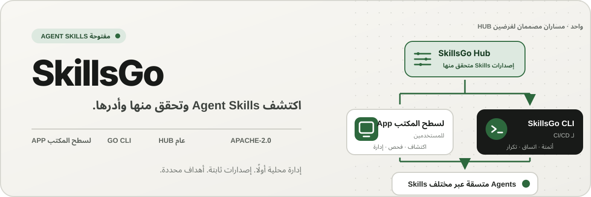
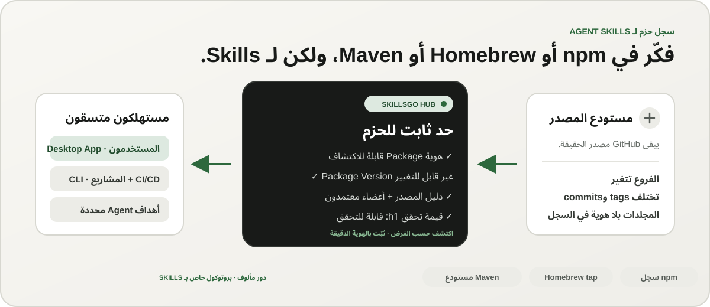
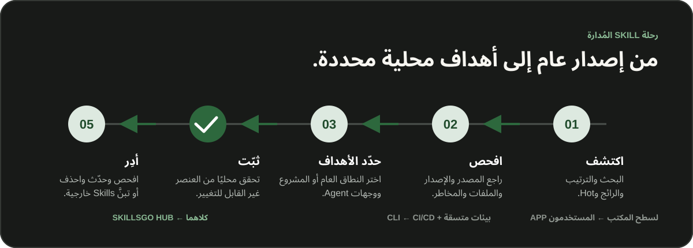

<p align="center">
  
</p>

**سير عمل واحد لـ Agent Skills —** اكتشف Skills التي يمكن التحقق من مصادرها، وثبّت إصداراتها غير القابلة للتغيير، وأدِر عمليات التثبيت نفسها عبر App لسطح المكتب أو CLI الملائم للأتمتة.

<!-- README-I18N:START -->

  <p>
    <a href="../../README.md">English</a> ·
    <a href="./README.zh-CN.md">简体中文</a> ·
    <a href="./README.zh-TW.md">繁體中文（台灣）</a> ·
    <a href="./README.zh-HK.md">繁體中文（香港）</a> ·
    <a href="./README.ja.md">日本語</a> ·
    <a href="./README.ko.md">한국어</a> ·
    <a href="./README.fr.md">Français</a> ·
    <a href="./README.de.md">Deutsch</a> ·
    <a href="./README.it.md">Italiano</a> ·
    <a href="./README.es.md">Español</a> ·
    <a href="./README.pt-BR.md">Português (Brasil)</a> ·
    <a href="./README.ru.md">Русский</a> ·
    <strong>العربية</strong> ·
    <a href="./README.hi.md">हिन्दी</a> ·
    <a href="./README.id.md">Bahasa Indonesia</a> ·
    <a href="./README.tr.md">Türkçe</a> ·
    <a href="./README.nl.md">Nederlands</a> ·
    <a href="./README.pl.md">Polski</a> ·
    <a href="./README.th.md">ไทย</a> ·
    <a href="./README.vi.md">Tiếng Việt</a> ·
    <a href="./README.ms.md">Bahasa Melayu</a> ·
    <a href="./README.sv.md">Svenska</a> ·
    <a href="./README.uk.md">Українська</a>
  </p>
<!-- README-I18N:END -->

يقدّم SkillsGo نظامًا بيئيًا قابلًا للتحقق من المصدر لاكتشاف Agent Skills وإدارة إصداراتها وتشغيلها. استخدم App لسطح المكتب لاستكشاف Skills وإدارتها، وCLI لجعل عمليات التثبيت قابلة للتكرار، وHub كمصدر توزيع مشترك أو مستضاف ذاتيًا لإصدارات Package غير القابلة للتغيير.

> **فكّر في npm أو Homebrew أو Maven، ولكن لـ Agent Skills.** يظل GitHub مصدر الحقيقة للشفرة المصدرية، بينما يحوّل SkillsGo Hub المصادر المدعومة إلى حزم Skills قابلة للاكتشاف وغير قابلة للتغيير ويمكن التحقق من سلامتها عبر قيم التحقق، بحيث يستطيع App وCLI تثبيتها بصورة متسقة لمختلف Agents وعلى مختلف الأجهزة.

<p align="center">
  
</p>

**من مصدر متغير إلى تبعية مستقرة —** يتيح Hub للمستخدمين الاكتشاف حسب الغرض، ويمنح الأنظمة في الوقت نفسه هوية Package دقيقة وإصدارات غير قابلة للتغيير وقائمة Skills معتمدة وقيم تحقق موثوقة.

## اختر نموذج التشغيل الخاص بك

| الوضع | الأفضل لـ | ما يوفره SkillsGo |
| --- | --- | --- |
| **App شخصي** | اكتشاف Skills وإدارتها بشكل تفاعلي | أدلة المصدر، وأهداف Agent المدعومة، ومكتبات المشروع والمكتبات العامة، ومعاينات آمنة للتحديث، ومؤشرات محلية لبصمة السياق |
| **CLI وCI/CD** | بيئات التطوير المتكررة والأتمتة | أوامر قابلة للقراءة آليًا، واختيار Skill الدقيق، و`skills.yaml`، و`skills-lock.yaml`، والتحقق من المجموع الاختباري، واسترداد ذاكرة التخزين المؤقت دون اتصال، وتحديثات مدركة للنطاق |
| **Hub مستضاف ذاتيًا** | الفرق التي تحتاج إلى كتالوج Skills خاضع للتحكم | مصدر Hub قابل للتكوين يستخدم البروتوكول العام نفسه، وإصدارات Package غير قابلة للتغيير، وبيانات وصفية قابلة للبحث، وعناصر Git ثابتة، وتحكم اختياري في الوصول |

تتعلق المقارنة بالدور وليس بتوافق البروتوكول:

| نموذج مألوف | ما يجلبه SkillsGo Hub إلى Agent Skills |
| --- | --- |
| **سجل npm** | هوية Package قابلة للبحث وإصدارات صريحة غير قابلة للتغيير بدلاً من نسخ مجلد مجهول من فرع متغير |
| **Homebrew tap** | مصدر توزيع موثوق يمكن أن يستخدمه App أو CLI على مختلف أجهزة المطورين |
| **مستودع Maven** | إحداثيات مستقرة وعناصر غير قابلة للتغيير وقيم تحقق وإمكانية تثبيت نتائج حل التبعيات |
| **طبقة خاصة بـ Skill** | دليل المصدر، وعضوية Skill المقبولة، والاختيار الدقيق للأعضاء، وبيانات تعريف Agent المدعومة، وأهداف التثبيت |

لا يحل Hub محل GitHub أو يتظاهر بأنه متوافق مع npm أو Homebrew أو Maven. إنه يمنح Agent Skills ضمانات التسجيل والتوزيع لتلك الأنظمة البيئية المألوفة لأنواع أخرى من البرامج.

## لماذا SkillsGo

- **دليل المصدر قبل التثبيت** — افحص مستودع المصدر والإصدار غير القابل للتغيير وAgents المدعومين والملفات ونسخة `SKILL.md` المعروضة قبل إجراء أي تغيير على الجهاز.
- **بيئات قابلة للتكرار** — ثبّت tag أو branch أو commit مرة واحدة، واحفظ الإصدار غير القابل للتغيير الناتج، ثم استعده باستخدام ملف manifest وملف lock صارمين.
- **Package واحدة، وأعضاء محددون بوضوح** — وزّع إصدار Package كاملًا مع تحديد أسماء Skills أو مساراتها بدقة، إلى جانب أهداف Agent التي ينبغي أن تستقبلها.
- **السلامة المحلية أولاً** — احمِ التعديلات المحلية، وحافظ على إمكانية إعادة بناء الحالة المشتقة، وواصل استخدام المخزون المحلي عندما لا يتوفر Hub.
- **مؤشرات بصمة السياق** — قدّر عدد المحارف التي تشغلها أسماء Skills المثبتة وأوصافها، ثم حدّد Skills التي لم تُرصد لها أي استدعاءات خلال آخر 45 أو 90 يومًا. هذا مؤشر محلي تقريبي لاستهلاك السياق، وليس نموذج قياس عن بُعد للفوترة.
- **واجهتا منتج، وبروتوكول واحد** — استخدم App لسير العمل التفاعلي وCLI للأتمتة؛ كلاهما يتحدثان إلى نفس عقد Hub.

## شاهد App أثناء العمل

يجمع App لسطح المكتب بين الاكتشاف وأدلة المصدر وأهداف التثبيت والمخزون المحلي ضمن تجربة واحدة سهلة للمستخدم. ولا يخضع الاستخدام الشخصي للقياس أو احتساب الاستهلاك.

<p align="center">
  
</p>

**الاكتشاف المباشر لـ Hub —** تصفح الكتالوج الذي يتم تحديثه باستمرار دون تسجيل الدخول، لذلك تكون ملفات Skill المفيدة مرئية قبل أي تثبيت محلي أو تغيير في التكوين.

### اكتشف وفحص

ابحث باستخدام اسم Skill أو مستودع المصدر، واستكشف الترتيب ونتائج البحث، ثم افحص مستودع المصدر والإصدار غير القابل للتغيير وAgents المدعومين والملخص المترجم ومعاينة `SKILL.md` قبل التثبيت.

<p align="center">
  
</p>

**بحث يراعي سياق المصدر —** ابحث عن Skill حسب القدرة أو المستودع، واطّلع على سياق Package الخاصة بها، لتتمكن من مقارنة Skills المرتبطة بدلًا من الوثوق بمقتطف معزول.

<p align="center">
  
</p>

**الفحص قبل التثبيت —** راجع أولًا الإصدار غير القابل للتغيير وAgents المدعومين وملفات المصدر والتعليمات المعروضة، مما يقلل مفاجآت سلسلة التوريد والتغييرات غير المقصودة على الجهاز.

### تثبيت وإدارة Skills المحلية

قم بالتثبيت عالميًا أو في مشاريع محددة، واختر أهداف Agent التي يجب أن تتلقى نفس إصدار Skill، وراجع عواقب تحديث Package قبل تطبيقه.

<p align="center">
  
</p>

**أهداف التثبيت الصريحة —** اختر النطاق العام أو نطاق المشروع وAgents المحددة التي تتلقى Skill، مع الحفاظ على اتساق إصدار واحد دون نسخ الملفات يدويًا.

<p align="center">
  
</p>

**تحديثات مدركة للتأثير —** راجع انتقالات الإصدار وإزالة Skill قبل تطبيق التحديث، بحيث تظل تغييرات التبعية متعمدة وقابلة للاسترداد.

<p align="center">
  
</p>

**مؤشرات المكتبة العامة —** قارن الاستخدام المحلي خلال 45 أو 90 يومًا وبصمة السياق ومدى ظهور Skills لكل Agent ضمن مخزون واحد، لتسهيل إدارة Skills غير المستخدمة والسياق المقيم.

<p align="center">
  
</p>

**الإدارة على مستوى المشروع —** احصر المخزون نفسه في مشروع واحد، بحيث يمكنك مراجعة عمليات التثبيت وأدلة الاستخدام وSkills غير المُدارة دون تشويش عناصر النطاق العام.

## توزيع الإصدارات من خلال CLI وHub

يشكّل CLI وHub الواجهة الهندسية لـ SkillsGo. يحوّل Hub مستودع مصدر متغيرًا إلى حد ثابت للتبعيات: تمثل Package وحدة التوزيع، ويمثل كل Package Version لقطة غير قابلة للتغيير لمراجعة مصدر واحدة تضم القائمة الكاملة المعتمدة من Skills. يتيح ذلك للمستخدمين الاكتشاف حسب الغرض، بينما تثبّت الأنظمة الحزمة باستخدام هويتها الدقيقة.

```yaml
dependencies:
  github.com/acme/skills:
    version: v1.2.3
    skills: [review, design]
    agents: [codex, claude-code]
```

يسجل `skills.yaml` إصدار Package المطلوب والأعضاء المحددين وأهداف Agent. ويربط `skills-lock.yaml` الناتج هذا الإصدار بقيمة تحقق Package ذات البادئة `h1:`. يمكن لجهاز جديد أو مهمة CI تشغيل مسار التثبيت نفسه والتحقق من العنصر نفسه بدلًا من تتبع فرع متغير.

```sh
# Discover and inspect
npx skillsgo find typescript
npx skillsgo show github.com/acme/skills@v1.2.3

# Add exact members to a project or the global scope
npx skillsgo add github.com/acme/skills@v1.2.3 \
  --skill review --agent codex

# Restore, preview, and update reproducibly
npx skillsgo install
npx skillsgo update --dry-run
npx skillsgo update --yes
```

يمكن لنفس الأوامر استهداف أصل Hub آخر:

```sh
npx skillsgo add github.com/acme/skills@v1.2.3 \
  --hub https://hub.example.com \
  --skill review --agent codex
```

## Hub مستضاف ذاتيًا للفرق

يمكن للمؤسسات تشغيل Hub Origin يطبّق بروتوكول SkillsGo نفسه الذي تستخدمه الخدمة الرسمية. يتيح ذلك تنظيم كتالوج معتمد، والاحتفاظ بسجل غير قابل للتغيير من إصدارات Package، ونشر بيانات وصفية قابلة للبحث، وتقديم عناصر متحقق منها، وتوجيه App أو CLI إلى مصدر واحد خاضع للتحكم.

```text
Source repository
       │
       ▼
Hub Package Version ── immutable metadata, artifact, and h1: sum
       │
       ├── SkillsGo App (interactive discovery and management)
       └── SkillsGo CLI (projects, CI/CD, and repeatable installs)
```

يركز عقد Hub العام حاليًا على مصادر Skill العامة المدعومة. يمكن أن يوفر Hub الخاص توزيعًا متحكمًا لـ Package المعتمدة؛ يعد استيعاب المصدر الخاص وتكامل هوية المؤسسة بمثابة إمكانات نشر منفصلة، وليست افتراضات مخفية في العميل.

## كيف يعمل

<p align="center">
  
</p>

**بروتوكول مشترك غير قابل للتغيير —** يتحقق Hub من دليل المصدر مرة واحدة، بينما يستخدم App وCLI إصدار Package نفسه وقيمة التحقق نفسها، فتنتج عمليات التثبيت التفاعلية والمؤتمتة النتيجة ذاتها.

1. يُحدَّد للمصدر المدعوم Package Version واحد غير قابل للتغيير.
2. ينشر Hub بيانات Package الوصفية وقائمة Skills المعتمدة وعنصر Git ثابتًا وقيمة تحقق قابلة للتحقق لـ Package.
3. يقرأ App أو CLI نفس البروتوكول ويتيح للمستخدم اختيار الأعضاء والنطاقات وأهداف Agent بدقة.
4. ينشئ CLI فعليًا أشجار Package المحلية المحمية ونسخ Agent المشتقة من ملفي manifest وlock.
5. تحدد التحديثات إصدارًا جديدًا غير قابل للتغيير، وتعرض أثره قبل تغيير الحالة المحلية.

## استكشف المستودع الأحادي

```text
skillsgo/
├── app/       Flutter desktop client and user experience
├── cli/       Go CLI, local state, and Skill execution engine
├── hub/       Public Hub service and reusable self-host runtime
├── protocol/  Shared executable contracts used by CLI and Hub
├── web/       Public product, Hub, and documentation surface
└── e2e/       Cross-product CLI/Hub and desktop journeys
```

اقرأ [`CONTEXT-MAP.md`](../../CONTEXT-MAP.md) لمعرفة حدود المنتج ولغة المجال. تم توثيق الإصدار العام ونموذج المنتج في [`docs/release-design.md`](../release-design.md).

## التشغيل محليًا

تستهدف طوبولوجيا التطوير الموحدة حاليًا نظام التشغيل macOS وتتطلب Flutter وGo وDocker و[Process Compose](https://github.com/F1bonacc1/process-compose) و[Air](https://github.com/air-verse/air).

```sh
make dev
```

يؤدي ذلك إلى تشغيل PostgreSQL وHub المحلي وCLI الذي أُعيد بناؤه وFlutter Desktop App ضمن جلسة واحدة خاضعة للإشراف. للتحقق من صحة جميع مساحات العمل المكوّنة:

```sh
make test
```

تتوفر نقاط الدخول المركزة لكل مساحة عمل:

| مساحة العمل | التطوير أو التحقق من الصحة |
| --- | --- |
| App | `cd app && flutter run -d macos` |
| CLI | `cd cli && go test ./...` |
| Hub | `cd hub && go test ./...` |
| Protocol | `cd protocol && go test ./...` |
| Web | `cd web && pnpm install && pnpm dev` |

راجع [CONTRIBUTING.md](../../CONTRIBUTING.md) قبل تغيير سلوك المنتج.

## حالة المشروع

لا يزال SkillsGo قيد التطوير النشط استعدادًا لإصدار مبكر. يُطوَّر App وCLI وHub وProtocol كوحدات إصدار مستقلة، بينما تُنشأ حزم مديري الحزم والأرشيفات الأصلية من مصفوفة بناء CLI الموثّقة نفسها. راجع [تصميم الإصدار](../release-design.md) لمعرفة الأهداف المدعومة وسلامة العناصر وسلوك التحديث ومتطلبات سلسلة التوريد.

## المجتمع

- استخدم [مناقشات GitHub](https://github.com/skillsgo/skillsgo/discussions) للأسئلة واستكشاف الأخطاء وإصلاحها والأفكار المبكرة.
- استخدم [نماذج المشكلات](https://github.com/skillsgo/skillsgo/issues/new/choose) المركزة للأخطاء القابلة للتكرار وطلبات الميزات الملموسة ومشكلات التوثيق.
- اتبع [SECURITY.md](../../SECURITY.md) للإبلاغ عن نقاط الضعف بشكل خاص.
- تخضع المشاركة لـ [قواعد السلوك](../../CODE_OF_CONDUCT.md) و[نموذج الحوكمة](../../GOVERNANCE.md).

## الترخيص

يخضع SkillsGo لـ [ترخيص Apache 2.0](../../LICENSE).

يحتوي Hub على شفرة مشتقة من [Athens](https://github.com/gomods/athens)، وتظل هذه الشفرة خاضعة لترخيص Athens MIT وإشعارات النسب. راجع [`NOTICE`](../../NOTICE) و[`THIRD_PARTY_LICENSES/ATHENS-LICENSE`](../../THIRD_PARTY_LICENSES/ATHENS-LICENSE).
