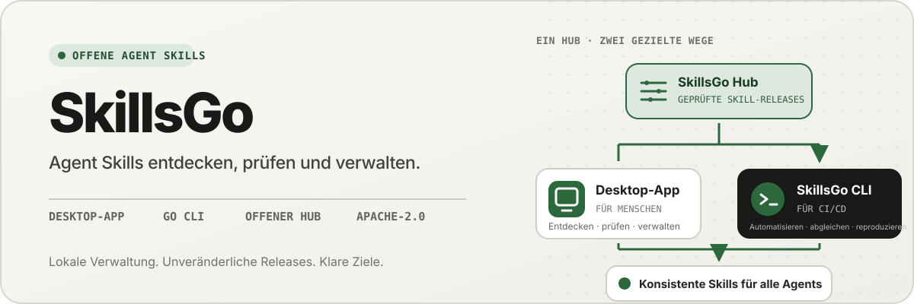
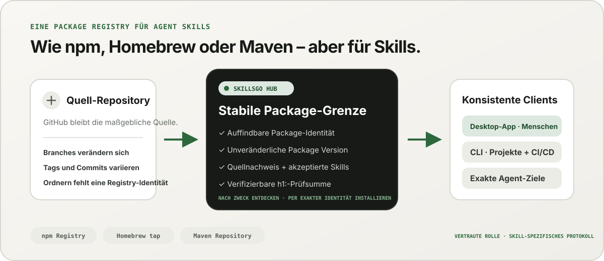
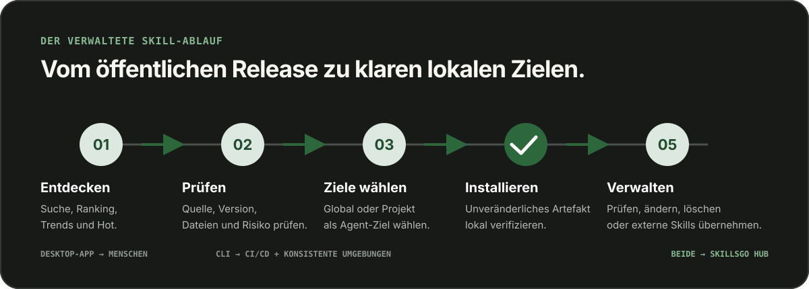

<p align="center">
  
</p>

**Ein Workflow für Agent Skills —** Entdecken Sie anhand der Quelle überprüfbare Skills, fixieren Sie unveränderliche Versionen und verwalten Sie dieselben Installationen über eine Desktop-App oder eine automatisierungsfreundliche CLI.

<!-- README-I18N:START -->

  <p>
    <a href="../../README.md">English</a> ·
    <a href="./README.zh-CN.md">简体中文</a> ·
    <a href="./README.zh-TW.md">繁體中文（台灣）</a> ·
    <a href="./README.zh-HK.md">繁體中文（香港）</a> ·
    <a href="./README.ja.md">日本語</a> ·
    <a href="./README.ko.md">한국어</a> ·
    <a href="./README.fr.md">Français</a> ·
    <strong>Deutsch</strong> ·
    <a href="./README.it.md">Italiano</a> ·
    <a href="./README.es.md">Español</a> ·
    <a href="./README.pt-BR.md">Português (Brasil)</a> ·
    <a href="./README.ru.md">Русский</a> ·
    <a href="./README.ar.md">العربية</a> ·
    <a href="./README.hi.md">हिन्दी</a> ·
    <a href="./README.id.md">Bahasa Indonesia</a> ·
    <a href="./README.tr.md">Türkçe</a> ·
    <a href="./README.nl.md">Nederlands</a> ·
    <a href="./README.pl.md">Polski</a> ·
    <a href="./README.th.md">ไทย</a> ·
    <a href="./README.vi.md">Tiếng Việt</a> ·
    <a href="./README.ms.md">Bahasa Melayu</a> ·
    <a href="./README.sv.md">Svenska</a> ·
    <a href="./README.uk.md">Українська</a>
  </p>
<!-- README-I18N:END -->

SkillsGo ist ein anhand der Quelle überprüfbares Ökosystem zum Entdecken, Versionieren und Verwalten von Agent Skills. Verwenden Sie die Desktop-App, um Skills zu erkunden und zu verwalten, die CLI für reproduzierbare Installationen und den Hub als gemeinsamen oder selbst gehosteten Verteilungsursprung für unveränderliche Package Versions.

> **Denken Sie an npm, Homebrew oder Maven – aber für Agent Skills.** GitHub bleibt die maßgebliche Quelle für den Code; der SkillsGo Hub verwandelt unterstützte Quellen in auffindbare, unveränderliche und per Prüfsumme verifizierbare Skill Packages, die sich mit der App und der CLI konsistent auf verschiedenen Agents und Rechnern installieren lassen.

<p align="center">
  
</p>

**Von einer veränderlichen Quelle zur stabilen Abhängigkeit –** Der Hub ermöglicht Menschen eine absichtsbasierte Suche und gibt Maschinen gleichzeitig eine exakte Package-Identität, unveränderliche Versionen, die akzeptierten Skills und Prüfsummen.

## Wählen Sie Ihr Betriebsmodell

| Modus | Am besten für | Was SkillsGo bietet |
| --- | --- | --- |
| **Persönliche App** | Interaktives Entdecken und Verwalten von Skills | Quellennachweise, unterstützte Agent-Ziele, projektbezogene und globale Bibliotheken, sichere Update-Vorschauen und Einblicke in den lokalen Kontext-Fußabdruck |
| **CLI und CI/CD** | Wiederholbare Entwicklerumgebungen und Automatisierung | Maschinenlesbare Befehle, genaue Skill-Auswahl, `skills.yaml`, `skills-lock.yaml`, Prüfsummenüberprüfung, Offline-Cache-Wiederherstellung und bereichsbezogene Updates |
| **Selbst gehosteter Hub** | Teams, die einen kontrollierten Skill-Katalog benötigen | Ein konfigurierbarer Hub Origin mit demselben öffentlichen Protokoll, unveränderlichen Package Versions, durchsuchbaren Metadaten, statischen Git-Artefakten und optionaler Zugriffskontrolle |

Beim Vergleich geht es um die Rolle, nicht um die Protokollkompatibilität:

| Bekanntes Modell | Was der SkillsGo Hub zum Agent Skills bringt |
| --- | --- |
| **npm Registry** | Durchsuchbare Package-Identität und explizite unveränderliche Versionen, statt einen unbekannten Ordner aus einem sich verändernden Branch zu kopieren |
| **Homebrew Tap** | Ein vertrauenswürdiger Verteilungsursprung, den App oder CLI auf allen Entwicklercomputern verwenden können |
| **Maven-Repository** | Stabile Koordinaten, unveränderliche Artefakte, Prüfsummen und sperrbare Abhängigkeitsauflösung |
| **Skill-spezifische Ebene** | Quellennachweis, akzeptierte Skill-Mitgliedschaft, genaue Mitgliederauswahl, unterstützte Agent-Metadaten und Installationsziele |

Der Hub ersetzt GitHub nicht und gibt auch nicht vor, mit npm, Homebrew oder Maven kompatibel zu sein. Er bietet Agent Skills die Registry- und Verteilungsgarantien, die diese Ökosysteme für andere Arten von Software etabliert haben.

## Warum SkillsGo

- **Quellennachweis vor der Installation** – Überprüfen Sie das Quell-Repository, die unveränderliche Version, unterstützte Agents, Dateien und gerenderte `SKILL.md`, bevor Sie eine Maschine ändern.
- **Reproduzierbare Umgebungen** – Lösen Sie ein Tag, einen Branch oder einen Commit einmal auf, speichern Sie die resultierende unveränderliche Version und stellen Sie sie über ein striktes Manifest und eine Lockdatei wieder her.
- **Ein Package, explizite Mitglieder** – Verteilen Sie eine vollständige Package Version und wählen Sie dabei exakte Skill-Namen oder -Pfade sowie die Agent-Ziele aus, die sie erhalten sollen.
- **Lokale Sicherheit** – lokale Änderungen schützen, abgeleiteten Zustand wiederherstellbar halten und lokale Inventarisierungsarbeiten fortsetzen, wenn ein Hub nicht verfügbar ist.
- **Einblicke in den Kontext-Footprint** – Schätzen Sie den Zeichen-Footprint installierter Skill-Namen und -Beschreibungen und identifizieren Sie dann Skills, bei denen in den letzten 45 oder 90 Tagen keine Aufrufe beobachtet wurden. Dies ist ein lokaler Kontext-Proxy, keine Telemetrie zur Modellabrechnung.
- **Zwei Produktschnittstellen, ein Protokoll** – verwenden Sie die App für interaktive Arbeitsabläufe und die CLI für die Automatisierung; beide nutzen denselben Hub-Vertrag.

## Sehen Sie die App in Aktion

Die Desktop-App verbindet Entdeckung, Quellennachweise, Installationsziele und lokales Inventar zu einem benutzerfreundlichen Ablauf. Die persönliche Nutzung erfolgt ohne Konto.

<p align="center">
  
</p>

**Live-Entdeckung über den Hub –** Durchsuchen Sie einen kontinuierlich aktualisierten Katalog, ohne sich anzumelden, sodass nützliche Skills vor jeder lokalen Installation oder Konfigurationsänderung sichtbar sind.

### Entdecken und inspizieren

Suchen Sie nach Skill oder Quell-Repository, erkunden Sie Rangfolge und Suchergebnisse und überprüfen Sie vor der Installation das Quell-Repository, die unveränderliche Version, die unterstützten Agents, die übersetzte Zusammenfassung und das gerenderte `SKILL.md`.

<p align="center">
  
</p>

**Quellenbezogene Suche –** Finden Sie Skills nach Funktion oder Repository und sehen Sie sich ihren Package-Kontext an. So können Sie verwandte Skills vergleichen, anstatt einem isolierten Snippet zu vertrauen.

<p align="center">
  
</p>

**Vor der Installation prüfen —** Überprüfen Sie zuerst die unveränderliche Version, die unterstützten Agents, Quelldateien und gerenderten Anweisungen, um Überraschungen in der Lieferkette und unbeabsichtigte Änderungen am Rechner zu vermeiden.

### Lokale Skills installieren und verwalten

Installieren Sie global oder in ausgewählten Projekten, wählen Sie die Agent-Ziele aus, die die gleiche Skill-Version erhalten sollen, und überprüfen Sie die Konsequenzen eines Package-Updates, bevor Sie es anwenden.

<p align="center">
  
</p>

**Explizite Installationsziele –** Wählen Sie einen globalen oder Projektumfang und die genauen Agents, die einen Skill erhalten, um die Konsistenz einer Version aufrechtzuerhalten, ohne dass Dateien manuell kopiert werden müssen.

<p align="center">
  
</p>

**Auswirkungsbewusste Updates –** Sehen Sie sich Versionsübergänge und entfernte Skills an, bevor Sie ein Update anwenden, damit Abhängigkeitsänderungen bewusst und wiederherstellbar bleiben.

<p align="center">
  
</p>

**Einblicke in die globale Library —** Vergleichen Sie die lokale Nutzung über 45/90 Tage, den Kontext-Footprint und die Agent-Sichtbarkeit in einem Inventar, damit sich ungenutzte Skills und lokal verfügbarer Kontext leichter verwalten lassen.

<p align="center">
  
</p>

**Projektbezogene Governance –** Beschränken Sie dasselbe Inventar auf ein Projekt, sodass dessen Installationen, Nutzungsnachweise und nicht verwalteten Skills ohne globale Störungen überprüft werden können.

## Versionierte Verteilung über CLI und Hub

CLI und Hub bilden die technische Oberfläche von SkillsGo. Der Hub wandelt ein sich veränderndes Quell-Repository in eine stabile Abhängigkeitsgrenze um: Ein Package ist die Verteilungseinheit, und jede Package Version ist ein unveränderlicher Snapshot einer Quellrevision mit allen akzeptierten Skills. So können Menschen nach Zweck entdecken, während Maschinen anhand einer exakten Identität installieren.

```yaml
dependencies:
  github.com/acme/skills:
    version: v1.2.3
    skills: [review, design]
    agents: [codex, claude-code]
```

`skills.yaml` zeichnet die gewünschte Package-Version, ausgewählte Mitglieder und Agent-Ziele auf. Der generierte `skills-lock.yaml` bindet diese Version an ihre Package `h1:`-Summe. Eine neue Maschine oder ein neuer CI-Job kann denselben Installationsablauf ausführen und dasselbe Artefakt überprüfen, anstatt einem sich bewegenden Zweig zu folgen.

```sh
# Discover and inspect
npx skillsgo find typescript
npx skillsgo show github.com/acme/skills@v1.2.3

# Add exact members to a project or the global scope
npx skillsgo add github.com/acme/skills@v1.2.3 \
  --skill review --agent codex

# Restore, preview, and update reproducibly
npx skillsgo install
npx skillsgo update --dry-run
npx skillsgo update --yes
```

Dieselben Befehle können auf einen anderen Hub-Ursprung abzielen:

```sh
npx skillsgo add github.com/acme/skills@v1.2.3 \
  --hub https://hub.example.com \
  --skill review --agent codex
```

## Selbst gehosteter Hub für Teams

Organisationen können einen Hub Origin betreiben, der dasselbe SkillsGo-Protokoll wie der offizielle Dienst implementiert. Dadurch ist es möglich, einen genehmigten Katalog zu kuratieren, den Verlauf der Package Versions unveränderlich zu halten, durchsuchbare Metadaten bereitzustellen, verifizierte Artefakte auszuliefern und die App oder CLI auf einen kontrollierten Ursprung zu verweisen.

```text
Source repository
       │
       ▼
Hub Package Version ── immutable metadata, artifact, and h1: sum
       │
       ├── SkillsGo App (interactive discovery and management)
       └── SkillsGo CLI (projects, CI/CD, and repeatable installs)
```

Der öffentliche Hub-Vertrag konzentriert sich derzeit auf unterstützte öffentliche Skill-Quellen. Ein privater Hub kann eine kontrollierte Verteilung genehmigter Packages ermöglichen; Die Erfassung aus privaten Quellen und die Integration von Unternehmensidentitäten sind separate Bereitstellungsfunktionen und keine im Client verborgenen Annahmen.

## Wie es funktioniert

<p align="center">
  
</p>

**Ein gemeinsames, unveränderliches Protokoll —** Der Hub löst Quellnachweise einmal auf, während die App und die CLI dieselbe Package Version und dieselbe Prüfsumme verwenden. Dadurch liefern interaktive und automatisierte Installationen dasselbe Ergebnis.

1. Eine unterstützte Quelle wird in eine unveränderliche Package Version aufgelöst.
2. Der Hub veröffentlicht Package-Metadaten, akzeptierte Skill-Mitgliedschaft, ein statisches Git-Artefakt und eine überprüfbare Package-Summe.
3. Die App oder CLI liest dasselbe Protokoll und lässt den Benutzer genaue Mitglieder, Bereiche und Agent-Ziele auswählen.
4. Die CLI materialisiert geschützte lokale Package-Bäume und Agent-Projektionen aus Manifest und Lockdatei.
5. Updates lösen eine neue unveränderliche Version auf und zeigen die Auswirkungen an, bevor sich der lokale Status ändert.

## Entdecken Sie das Monorepo

```text
skillsgo/
├── app/       Flutter desktop client and user experience
├── cli/       Go CLI, local state, and Skill execution engine
├── hub/       Public Hub service and reusable self-host runtime
├── protocol/  Shared executable contracts used by CLI and Hub
├── web/       Public product, Hub, and documentation surface
└── e2e/       Cross-product CLI/Hub and desktop journeys
```

Lesen Sie [`CONTEXT-MAP.md`](../../CONTEXT-MAP.md) für Produktgrenzen und Domänensprache. Das öffentliche Release- und Artefaktmodell ist in [`docs/release-design.md`](../release-design.md) dokumentiert.

## Führen Sie es lokal aus

Die einheitliche Entwicklungstopologie zielt derzeit auf macOS ab und erfordert Flutter, Go, Docker, [Process Compose](https://github.com/F1bonacc1/process-compose) und [Air](https://github.com/air-verse/air).

```sh
make dev
```

Dadurch werden PostgreSQL, der lokale Hub, eine frisch erstellte CLI und die Flutter-Desktop-App in einer überwachten Sitzung gestartet. So validieren Sie alle konfigurierten Arbeitsbereiche:

```sh
make test
```

Für jeden Arbeitsbereich stehen gezielte Einstiegspunkte zur Verfügung:

| Arbeitsbereich | Entwicklung oder Validierung |
| --- | --- |
| App | `cd app && flutter run -d macos` |
| CLI | `cd cli && go test ./...` |
| Hub | `cd hub && go test ./...` |
| Protokoll | `cd protocol && go test ./...` |
| Web | `cd web && pnpm install && pnpm dev` |

Lesen Sie [CONTRIBUTING.md](../../CONTRIBUTING.md), bevor Sie das Produktverhalten ändern.

## Projektstatus

SkillsGo befindet sich in der aktiven frühen Release-Entwicklung. App, CLI, Hub und Protocol werden als separate Release-Einheiten entwickelt, während Paketmanager-Ausgaben und native Archive aus derselben verifizierten CLI-Build-Matrix zusammengestellt werden. Informationen zu unterstützten Zielen, Artefaktintegrität, Aktualisierungsverhalten und Lieferkettenanforderungen finden Sie im [Release-Design](../release-design.md).

## Gemeinschaft

- Verwenden Sie [GitHub-Diskussionen](https://github.com/skillsgo/skillsgo/discussions) für Fragen, Fehlerbehebung und erste Ideen.
- Verwenden Sie die fokussierten [Problemformulare](https://github.com/skillsgo/skillsgo/issues/new/choose) für reproduzierbare Fehler, konkrete Funktionsanfragen und Dokumentationsprobleme.
- Folgen Sie [SECURITY.md](../../SECURITY.md), um Schwachstellen privat zu melden.
- Die Teilnahme unterliegt dem [Verhaltenskodex](../../CODE_OF_CONDUCT.md) und dem [Governance-Modell](../../GOVERNANCE.md).

## Lizenz

SkillsGo ist unter der [Apache-Lizenz 2.0](../../LICENSE) lizenziert.

Der Hub enthält Code, der von [Athens](https://github.com/gomods/athens) abgeleitet ist und weiterhin der Athens MIT-Lizenz sowie den Quellenangabehinweisen unterliegt. Siehe [`NOTICE`](../../NOTICE) und [`THIRD_PARTY_LICENSES/ATHENS-LICENSE`](../../THIRD_PARTY_LICENSES/ATHENS-LICENSE).
