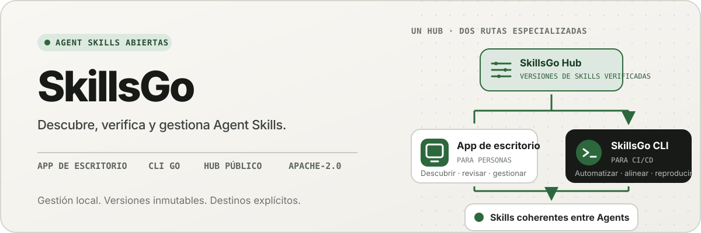
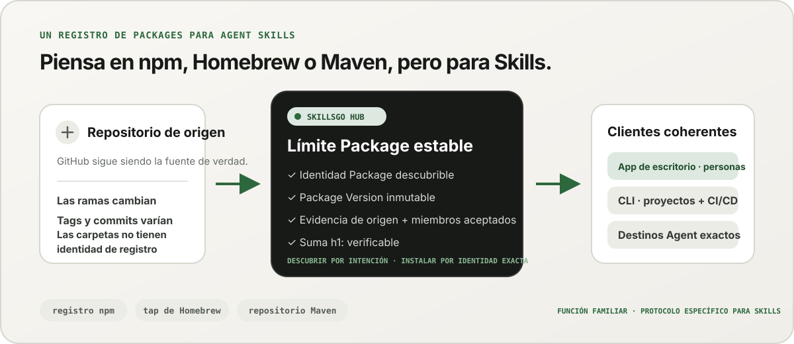
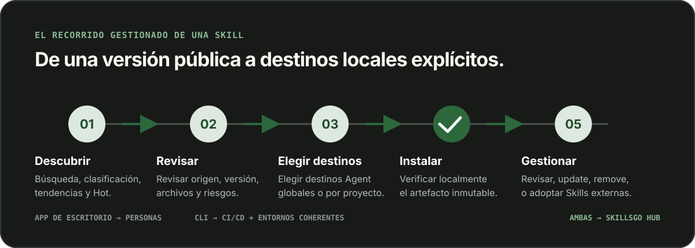

<p align="center">
  
</p>

**Un flujo de trabajo para Agent Skills —** Descubra Skill de origen verificable, fije versiones inmutables y opere las mismas instalaciones a través de un App de escritorio o un CLI compatible con automatización.

<!-- README-I18N:START -->

  <p>
    <a href="../../README.md">English</a> ·
    <a href="./README.zh-CN.md">简体中文</a> ·
    <a href="./README.zh-TW.md">繁體中文（台灣）</a> ·
    <a href="./README.zh-HK.md">繁體中文（香港）</a> ·
    <a href="./README.ja.md">日本語</a> ·
    <a href="./README.ko.md">한국어</a> ·
    <a href="./README.fr.md">Français</a> ·
    <a href="./README.de.md">Deutsch</a> ·
    <a href="./README.it.md">Italiano</a> ·
    <strong>Español</strong> ·
    <a href="./README.pt-BR.md">Português (Brasil)</a> ·
    <a href="./README.ru.md">Русский</a> ·
    <a href="./README.ar.md">العربية</a> ·
    <a href="./README.hi.md">हिन्दी</a> ·
    <a href="./README.id.md">Bahasa Indonesia</a> ·
    <a href="./README.tr.md">Türkçe</a> ·
    <a href="./README.nl.md">Nederlands</a> ·
    <a href="./README.pl.md">Polski</a> ·
    <a href="./README.th.md">ไทย</a> ·
    <a href="./README.vi.md">Tiếng Việt</a> ·
    <a href="./README.ms.md">Bahasa Melayu</a> ·
    <a href="./README.sv.md">Svenska</a> ·
    <a href="./README.uk.md">Українська</a>
  </p>
<!-- README-I18N:END -->

SkillsGo es un ecosistema de origen verificable para descubrir, versionar y utilizar Agent Skills. Use la App de escritorio para explorar y gestionar Skills, la CLI para hacer que las instalaciones sean reproducibles y el Hub como origen de distribución compartido o autohospedado para Package Versions inmutables.

> **Piense en npm, Homebrew o Maven, pero para Agent Skills.** GitHub sigue siendo la fuente de verdad para el código; SkillsGo Hub convierte las fuentes admitidas en Skill Package reconocibles, inmutables y verificables mediante suma de verificación que App y CLI pueden instalar de manera consistente en Agent y máquinas.

<p align="center">
  
</p>

**De una fuente cambiante a una dependencia estable:** El Hub permite descubrir por intención y, al mismo tiempo, proporciona a las máquinas una identidad Package exacta, versiones inmutables, la lista exacta de Skills incluidas y sumas de verificación.

## Elige tu modelo operativo

| Modo | Lo mejor para | Qué ofrece SkillsGo |
| --- | --- | --- |
| **App personal** | Descubrir y gestionar Skills de forma interactiva | Evidencia de origen, Agents compatibles, bibliotecas globales y de proyecto, vistas previas seguras de las actualizaciones e información sobre la huella del contexto local |
| **CLI y CI/CD** | Automatización y entornos de desarrollador repetibles | Comandos legibles por máquina, selección exacta de Skill, `skills.yaml`, `skills-lock.yaml`, verificación de suma de comprobación, recuperación de caché sin conexión y actualizaciones basadas en el alcance |
| **Hub autohospedado** | Equipos que necesitan un catálogo Skill controlado | Un origen Hub configurable con el mismo protocolo público, Package Version inmutables, metadatos con capacidad de búsqueda, artefactos Git estáticos y control de acceso opcional |

La comparación se trata de la función, no de la compatibilidad del protocolo:

| Modelo familiar | Lo que aporta el SkillsGo Hub al Agent Skills |
| --- | --- |
| **Registro npm** | Identidad Package con capacidad de búsqueda y versiones inmutables explícitas en lugar de copiar una carpeta desconocida desde una rama en movimiento |
| **Tap de Homebrew** | Un origen de distribución confiable que la App o la CLI pueden usar en las máquinas de desarrollo |
| **Repositorio Maven** | Coordenadas estables, artefactos inmutables, sumas de verificación y resolución de dependencia bloqueable |
| **Capa específica de Skill** | Evidencia de origen, membresía aceptada de Skill, selección exacta de miembros, metadatos de Agent admitidos y destinos de instalación |

El Hub no sustituye a GitHub ni pretende ser compatible con npm, Homebrew o Maven. Aporta a Agent Skills las garantías de registro y distribución que esos ecosistemas hicieron habituales para otros tipos de software.

## Por qué SkillsGo

- **Evidencia de origen antes de la instalación**: inspeccione el repositorio de origen, la versión inmutable, los Agent admitidos, los archivos y el `SKILL.md` renderizado antes de cambiar una máquina.
- **Entornos reproducibles**: resuelva una etiqueta, rama o commit una vez, conserve la versión inmutable resultante y restáurela mediante un manifiesto y un archivo de bloqueo estrictos.
- **Un Package, miembros explícitos**: distribuya un Package Version completo mientras selecciona nombres o rutas exactas de Skill y los objetivos de Agent que deberían recibirlos.
- **Seguridad local primero**: proteja las modificaciones locales, mantenga reconstruible el estado derivado y continúe el trabajo de inventario local cuando un Hub no esté disponible.
- **Información sobre la huella del contexto**: calcule la huella en caracteres de los nombres y descripciones de las Skills instaladas e identifique las que no hayan registrado llamadas en los últimos 45 o 90 días. Es un indicador local del contexto, no telemetría de facturación del modelo.
- **Dos interfaces de producto, un protocolo**: use la App para flujos de trabajo interactivos y la CLI para automatización; ambas utilizan el mismo contrato Hub.

## Vea la App en acción

La App de escritorio reúne el descubrimiento, la evidencia de origen, los destinos de instalación y el inventario local en un recorrido fácil de seguir. El uso personal no requiere una cuenta.

<p align="center">
  
</p>

**Descubrimiento de Hub en vivo:** Explore un catálogo continuamente actualizado sin iniciar sesión, de modo que los útiles Skill estén visibles antes de cualquier instalación local o cambio de configuración.

### Descubrir e inspeccionar

Busque por Skill o repositorio de origen, explore la clasificación y los resultados de búsqueda, e inspeccione el repositorio de origen, la versión inmutable, los Agent compatibles, el resumen traducido y el `SKILL.md` renderizado antes de la instalación.

<p align="center">
  
</p>

**Búsqueda basada en el código fuente:** Encuentre Skill por capacidad o repositorio y vea su contexto Package, lo que le ayudará a comparar Skill relacionados en lugar de confiar en un fragmento aislado.

<p align="center">
  
</p>

**Inspeccionar antes de instalar:** Revise primero la versión inmutable, los Agent compatibles, los archivos fuente y las instrucciones renderizadas, lo que reduce las sorpresas en la cadena de suministro y los cambios accidentales en la máquina.

### Instalar y controlar los Skill locales

Instálelo globalmente o en proyectos seleccionados, elija los objetivos Agent que deberían recibir la misma versión Skill y revise las consecuencias de una actualización Package antes de aplicarla.

<p align="center">
  
</p>

**Objetivos de instalación explícitos:** Elija el alcance global o del proyecto y los Agent exactos que reciben un Skill, manteniendo una versión consistente sin copiar archivos a mano.

<p align="center">
  
</p>

**Actualizaciones que tienen en cuenta los impactos:** Vea las transiciones de versión y los Skill eliminados antes de aplicar una actualización, para que los cambios de dependencia sigan siendo deliberados y recuperables.

<p align="center">
  
</p>

**Información sobre la biblioteca global:** Compare el uso local de 45/90 días, la huella de contexto y la visibilidad del Agent en un solo inventario, lo que facilita la gestión de los Skill no utilizados y del contexto residente.

<p align="center">
  
</p>

**Gobierno con alcance de proyecto:** Limite el mismo inventario a un proyecto, de modo que sus instalaciones, evidencia de uso y Skill no administrados puedan revisarse sin ruido global.

## Distribución versionada a través de CLI y Hub

CLI y Hub forman la superficie de ingeniería de SkillsGo. El Hub convierte un repositorio de código fuente móvil en un límite de dependencia estable: un Package es la unidad de distribución, y cada Package Version es una instantánea inmutable de una revisión de código fuente y su membresía Skill completamente aceptada. Esto permite a las personas descubrir por intención, mientras que las máquinas instalan por identidad exacta.

```yaml
dependencies:
  github.com/acme/skills:
    version: v1.2.3
    skills: [review, design]
    agents: [codex, claude-code]
```

`skills.yaml` registra la versión Package deseada, los miembros seleccionados y los objetivos Agent. El `skills-lock.yaml` generado vincula esa versión a su suma Package `h1:`. Una máquina nueva o un trabajo de CI puede ejecutar el mismo flujo de instalación y verificar el mismo artefacto en lugar de seguir una rama en movimiento.

```sh
# Discover and inspect
npx skillsgo find typescript
npx skillsgo show github.com/acme/skills@v1.2.3

# Add exact members to a project or the global scope
npx skillsgo add github.com/acme/skills@v1.2.3 \
  --skill review --agent codex

# Restore, preview, and update reproducibly
npx skillsgo install
npx skillsgo update --dry-run
npx skillsgo update --yes
```

Los mismos comandos pueden apuntar a otro origen Hub:

```sh
npx skillsgo add github.com/acme/skills@v1.2.3 \
  --hub https://hub.example.com \
  --skill review --agent codex
```

## Hub autohospedado para equipos

Las organizaciones pueden ejecutar un Hub Origin que implemente el mismo protocolo SkillsGo que el servicio oficial. Así pueden seleccionar un catálogo aprobado, mantener inmutable el historial de Package Versions, exponer metadatos de búsqueda, ofrecer artefactos verificados y configurar la App o la CLI para usar un origen controlado.

```text
Source repository
       │
       ▼
Hub Package Version ── immutable metadata, artifact, and h1: sum
       │
       ├── SkillsGo App (interactive discovery and management)
       └── SkillsGo CLI (projects, CI/CD, and repeatable installs)
```

El contrato público Hub actualmente se centra en fuentes públicas compatibles Skill. Un Hub privado puede proporcionar una distribución controlada de Package aprobados; La ingesta de fuentes privadas y las integraciones de identidades empresariales son capacidades de implementación independientes, no suposiciones ocultas en el cliente.

## Cómo funciona

<p align="center">
  
</p>

**Un protocolo inmutable compartido:** El Hub resuelve la evidencia de origen una vez, mientras que la App y la CLI consumen la misma Package Version y la misma suma de comprobación, de modo que las instalaciones interactivas y automatizadas obtienen el mismo resultado.

1. Una fuente compatible se resuelve en un Package Version inmutable.
2. Hub publica metadatos de Package, membresía aceptada de Skill, un artefacto Git estático y una suma de Package verificable.
3. El App o el CLI leen el mismo protocolo y permiten al usuario elegir miembros, alcances y objetivos exactos del Agent.
4. La CLI materializa árboles Package locales protegidos y proyecciones Agent a partir del manifiesto y del archivo de bloqueo.
5. Las actualizaciones resuelven una nueva versión inmutable y muestran el impacto antes de cambiar el estado local.

## Explora el monorepo

```text
skillsgo/
├── app/       Flutter desktop client and user experience
├── cli/       Go CLI, local state, and Skill execution engine
├── hub/       Public Hub service and reusable self-host runtime
├── protocol/  Shared executable contracts used by CLI and Hub
├── web/       Public product, Hub, and documentation surface
└── e2e/       Cross-product CLI/Hub and desktop journeys
```

Lea [`CONTEXT-MAP.md`](../../CONTEXT-MAP.md) para conocer los límites del producto y el idioma del dominio. El modelo de lanzamiento público y artefacto está documentado en [`docs/release-design.md`](../release-design.md).

## Ejecútelo localmente

La topología de desarrollo unificada actualmente está dirigida a macOS y requiere Flutter, Go, Docker, [Process Compose](https://github.com/F1bonacc1/process-compose) y [Air](https://github.com/air-verse/air).

```sh
make dev
```

Esto inicia PostgreSQL, el Hub local, un CLI recién creado y el escritorio Flutter App en una sesión supervisada. Para validar todos los espacios de trabajo configurados:

```sh
make test
```

Hay puntos de entrada específicos disponibles para cada espacio de trabajo:

| Espacio de trabajo | Desarrollo o validación |
| --- | --- |
| App | `cd app && flutter run -d macos` |
| CLI | `cd cli && go test ./...` |
| Hub | `cd hub && go test ./...` |
| Protocolo | `cd protocol && go test ./...` |
| Web | `cd web && pnpm install && pnpm dev` |

Consulte [CONTRIBUTING.md](../../CONTRIBUTING.md) antes de cambiar el comportamiento del producto.

## Estado del proyecto

SkillsGo se encuentra en desarrollo activo de lanzamiento temprano. App, CLI, Hub y Protocol se desarrollan como unidades de lanzamiento separadas, mientras que las salidas del administrador de paquetes y los archivos nativos se ensamblan a partir de la misma matriz de compilación CLI verificada. Consulte el [diseño de lanzamiento](../release-design.md) para conocer los objetivos admitidos, la integridad de los artefactos, el comportamiento de las actualizaciones y los requisitos de la cadena de suministro.

## Comunidad

- Utilice [Discusiones GitHub](https://github.com/skillsgo/skillsgo/discussions) para preguntas, solución de problemas e ideas iniciales.
- Utilice los [formularios específicos](https://github.com/skillsgo/skillsgo/issues/new/choose) para errores reproducibles, solicitudes de funciones concretas y problemas de documentación.
- Siga [SECURITY.md](../../SECURITY.md) para informar vulnerabilidades de forma privada.
- La participación se rige por el [Código de Conducta](../../CODE_OF_CONDUCT.md) y el [modelo de gobernanza](../../GOVERNANCE.md).

## Licencia

SkillsGo tiene la licencia [Licencia Apache 2.0](../../LICENSE).

El Hub contiene código derivado de [Athens](https://github.com/gomods/athens), que permanece sujeto a la licencia MIT de Athens y a los avisos de atribución. Consulte [`NOTICE`](../../NOTICE) y [`THIRD_PARTY_LICENSES/ATHENS-LICENSE`](../../THIRD_PARTY_LICENSES/ATHENS-LICENSE).
