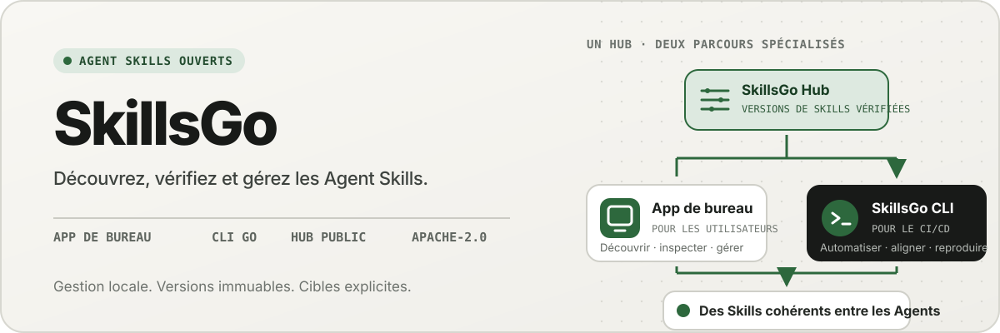
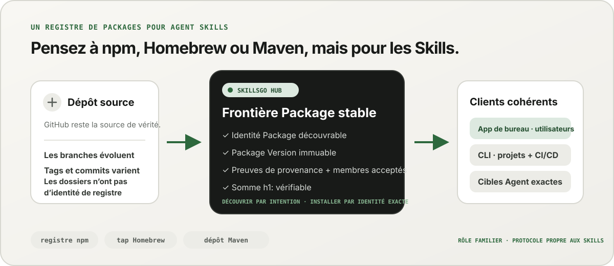
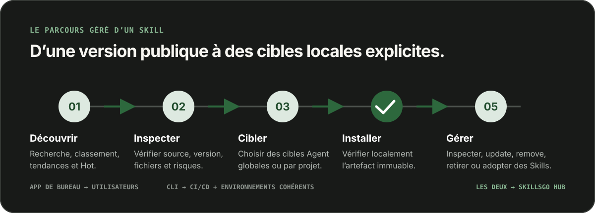

<p align="center">
  
</p>

**Un flux de travail pour Agent Skills —** Découvrez les Skill dont la source est vérifiable, épinglez des versions immuables et exploitez les mêmes installations via un App de bureau ou un CLI convivial pour l'automatisation.

<!-- README-I18N:START -->

  <p>
    <a href="../../README.md">English</a> ·
    <a href="./README.zh-CN.md">简体中文</a> ·
    <a href="./README.zh-TW.md">繁體中文（台灣）</a> ·
    <a href="./README.zh-HK.md">繁體中文（香港）</a> ·
    <a href="./README.ja.md">日本語</a> ·
    <a href="./README.ko.md">한국어</a> ·
    <strong>Français</strong> ·
    <a href="./README.de.md">Deutsch</a> ·
    <a href="./README.it.md">Italiano</a> ·
    <a href="./README.es.md">Español</a> ·
    <a href="./README.pt-BR.md">Português (Brasil)</a> ·
    <a href="./README.ru.md">Русский</a> ·
    <a href="./README.ar.md">العربية</a> ·
    <a href="./README.hi.md">हिन्दी</a> ·
    <a href="./README.id.md">Bahasa Indonesia</a> ·
    <a href="./README.tr.md">Türkçe</a> ·
    <a href="./README.nl.md">Nederlands</a> ·
    <a href="./README.pl.md">Polski</a> ·
    <a href="./README.th.md">ไทย</a> ·
    <a href="./README.vi.md">Tiếng Việt</a> ·
    <a href="./README.ms.md">Bahasa Melayu</a> ·
    <a href="./README.sv.md">Svenska</a> ·
    <a href="./README.uk.md">Українська</a>
  </p>
<!-- README-I18N:END -->

SkillsGo est un écosystème à la source vérifiable pour découvrir, versionner et exploiter des Agent Skills. Utilisez l’App de bureau pour explorer et gérer les Skills, la CLI pour rendre les installations reproductibles et le Hub comme origine de distribution partagée ou auto-hébergée pour les Package Versions immuables.

> **Pensez à npm, Homebrew ou Maven, mais pour les Agent Skills.** GitHub reste la source de vérité pour le code ; le SkillsGo Hub transforme les sources prises en charge en Skill Packages découvrables, immuables et vérifiables par somme de contrôle, que l’App et la CLI peuvent installer de manière cohérente sur différents Agents et différentes machines.

<p align="center">
  
</p>

**D’une source évolutive à une dépendance stable —** Le Hub permet aux utilisateurs de rechercher par intention tout en fournissant aux machines l’identité exacte du Package, des versions immuables, la liste exacte des Skills inclus et leurs sommes de contrôle.

## Choisissez votre modèle opérationnel

| Mode | Idéal pour | Ce que fournit le SkillsGo |
| --- | --- | --- |
| **App personnelle** | Découverte et gestion interactive des Skills | Preuves de provenance, Agents pris en charge, bibliothèques par projet et globale, aperçus sûrs des mises à jour et informations sur l’empreinte contextuelle locale |
| **CLI et CI/CD** | Environnements de développement reproductibles et automatisation | Commandes lisibles par machine, sélection exacte de Skill, `skills.yaml`, `skills-lock.yaml`, vérification de la somme de contrôle, récupération du cache hors ligne et mises à jour adaptées à la portée |
| **Hub auto-hébergé** | Équipes qui ont besoin d'un catalogue Skill contrôlé | Un Hub Origin configurable avec le même protocole public, des Package Version immuables, des métadonnées consultables, des artefacts Git statiques et un contrôle d'accès en option |

La comparaison porte sur le rôle et non sur la compatibilité des protocoles :

| Modèle familier | Ce que le SkillsGo Hub apporte au Agent Skills |
| --- | --- |
| **Registre npm** | Identité Package consultable et versions explicites et immuables au lieu de copier un dossier inconnu à partir d'une branche en mouvement |
| **Tap Homebrew** | Une origine de distribution fiable que l’App ou la CLI peut utiliser sur les machines des développeurs |
| **Dépôt Maven** | Coordonnées stables, artefacts immuables, sommes de contrôle et résolution de dépendance verrouillable |
| **Couche spécifique à Skill** | Preuve source, adhésion Skill acceptée, sélection exacte des membres, métadonnées Agent prises en charge et cibles d'installation |

Le Hub ne remplace pas GitHub et ne prétend pas être compatible avec npm, Homebrew ou Maven. Il apporte aux Agent Skills les garanties de registre et de distribution devenues familières dans ces écosystèmes.

## Pourquoi SkillsGo

- **Preuve source avant l'installation** — inspectez le référentiel source, la version immuable, les Agent pris en charge, les fichiers et le rendu `SKILL.md` avant de changer de machine.
- **Environnements reproductibles** — résolvez une fois un tag, une branche ou un commit, conservez la version immuable obtenue et restaurez-la à l’aide d’un manifeste et d’un fichier de verrouillage stricts.
- **Un Package, membres explicites** — distribuez un Package Version complet tout en sélectionnant les noms ou chemins exacts du Skill et les cibles Agent qui doivent les recevoir.
- **Sécurité locale d'abord** : protégez les modifications locales, conservez l'état dérivé reconstructible et poursuivez le travail d'inventaire local lorsqu'un Hub n'est pas disponible.
- **Informations sur l’empreinte contextuelle** — estimez l’empreinte en caractères des noms et descriptions des Skills présents, puis identifiez ceux dont aucun appel n’a été observé au cours des 45 ou 90 derniers jours. Il s’agit d’un indicateur local du contexte, et non d’une télémétrie de facturation du modèle.
- **Deux interfaces produit, un protocole** — utilisez l’App pour les flux de travail interactifs et la CLI pour l’automatisation ; toutes deux utilisent le même contrat Hub.

## Découvrez l’App en action

L’App de bureau réunit la découverte, les preuves de provenance, les cibles d’installation et l’inventaire local dans un parcours convivial. Son utilisation personnelle ne nécessite aucun compte.

<p align="center">
  
</p>

**Découverte en direct du Hub —** Parcourez un catalogue mis à jour en permanence sans vous connecter, afin que les Skill utiles soient visibles avant toute installation locale ou modification de configuration.

### Découvrez et inspectez

Recherchez par Skill ou le référentiel source, explorez le classement et les résultats de recherche, et inspectez le référentiel source, la version immuable, les Agent pris en charge, le résumé traduit et le rendu `SKILL.md` avant l'installation.

<p align="center">
  
</p>

**Recherche basée sur la source —** Recherchez les Skill par capacité ou référentiel et consultez leur contexte Package, ce qui vous aide à comparer les Skill associés au lieu de faire confiance à un extrait isolé.

<p align="center">
  
</p>

**Inspecter avant l'installation —** Examinez d'abord la version immuable, les Agent pris en charge, les fichiers sources et les instructions rendues, réduisant ainsi les surprises de la chaîne d'approvisionnement et les changements accidentels de machine.

### Installer et gérer les Skill locaux

Installez globalement ou dans des projets sélectionnés, choisissez les cibles Agent qui doivent recevoir la même version Skill et examinez les conséquences d'une mise à jour Package avant de l'appliquer.

<p align="center">
  
</p>

**Cibles d'installation explicites —** Choisissez la portée globale ou du projet et les Agent exacts qui reçoivent un Skill, en gardant une version cohérente sans copier les fichiers à la main.

<p align="center">
  
</p>

**Mises à jour tenant compte de l'impact —** Consultez les transitions de version et les Skill supprimés avant d'appliquer une mise à jour, afin que les modifications de dépendance restent délibérées et récupérables.

<p align="center">
  
</p>

**Informations sur la bibliothèque globale —** Comparez l’utilisation locale sur 45/90 jours, l’empreinte contextuelle et la visibilité pour les Agents dans un même inventaire afin de gérer plus facilement les Skills inutilisés et le contexte résident.

<p align="center">
  
</p>

**Gouvernance à l'échelle du projet —** Limitez le même inventaire à un seul projet, afin que ses installations, ses preuves d'utilisation et ses Skill non gérés puissent être examinés sans bruit global.

## Distribution versionnée via CLI et Hub

La CLI et le Hub forment la surface d’ingénierie de SkillsGo. Le Hub transforme un dépôt source en évolution en une frontière de dépendance stable : un Package est l’unité de distribution, et chaque Package Version est un instantané immuable d’une révision source et de la liste complète des Skills qu’elle contient. Les utilisateurs peuvent ainsi rechercher par intention tandis que les machines installent par identité exacte.

```yaml
dependencies:
  github.com/acme/skills:
    version: v1.2.3
    skills: [review, design]
    agents: [codex, claude-code]
```

`skills.yaml` enregistre la version Package souhaitée, les membres sélectionnés et les cibles Agent. Le `skills-lock.yaml` généré lie cette version à sa somme Package `h1:`. Une nouvelle machine ou une tâche CI peut exécuter le même flux d'installation et vérifier le même artefact au lieu de suivre une branche en mouvement.

```sh
# Discover and inspect
npx skillsgo find typescript
npx skillsgo show github.com/acme/skills@v1.2.3

# Add exact members to a project or the global scope
npx skillsgo add github.com/acme/skills@v1.2.3 \
  --skill review --agent codex

# Restore, preview, and update reproducibly
npx skillsgo install
npx skillsgo update --dry-run
npx skillsgo update --yes
```

Les mêmes commandes peuvent cibler une autre Origine Hub :

```sh
npx skillsgo add github.com/acme/skills@v1.2.3 \
  --hub https://hub.example.com \
  --skill review --agent codex
```

## Hub auto-hébergé pour les équipes

Les organisations peuvent exécuter un Hub Origin qui implémente le même protocole SkillsGo que le service officiel. Elles peuvent ainsi gérer un catalogue approuvé, conserver un historique immuable des Package Versions, exposer des métadonnées consultables, servir des artefacts vérifiés et configurer l’App ou la CLI pour utiliser une origine contrôlée.

```text
Source repository
       │
       ▼
Hub Package Version ── immutable metadata, artifact, and h1: sum
       │
       ├── SkillsGo App (interactive discovery and management)
       └── SkillsGo CLI (projects, CI/CD, and repeatable installs)
```

Le contrat public Hub se concentre actuellement sur les sources publiques Skill prises en charge. Un Hub privé peut assurer une distribution contrôlée des Package approuvés ; L'ingestion de sources privées et les intégrations d'identités d'entreprise sont des capacités de déploiement distinctes et non des hypothèses cachées dans le client.

## Comment ça marche

<p align="center">
  
</p>

**Un protocole immuable partagé —** Le Hub résout les preuves de provenance une fois, tandis que l’App et la CLI consomment la même Package Version et la même somme de contrôle, donnant aux installations interactives et automatisées le même résultat.

1. Une source prise en charge est résolue en un Package Version immuable.
2. Le Hub publie les métadonnées Package, l'adhésion acceptée au Skill, un artefact Git statique et une somme Package vérifiable.
3. L’App ou la CLI lit le même protocole et permet à l’utilisateur de choisir exactement les membres, les portées et les Agents cibles.
4. Le CLI matérialise les arbres Package locaux protégés et les projections Agent du manifeste et du verrou.
5. Les mises à jour résolvent une nouvelle version immuable et montrent l'impact avant de changer l'état local.

## Explorez le monorepo

```text
skillsgo/
├── app/       Flutter desktop client and user experience
├── cli/       Go CLI, local state, and Skill execution engine
├── hub/       Public Hub service and reusable self-host runtime
├── protocol/  Shared executable contracts used by CLI and Hub
├── web/       Public product, Hub, and documentation surface
└── e2e/       Cross-product CLI/Hub and desktop journeys
```

Lisez [`CONTEXT-MAP.md`](../../CONTEXT-MAP.md) pour connaître les limites du produit et la langue du domaine. La version publique et le modèle d'artefact sont documentés dans [`docs/release-design.md`](../release-design.md).

## Exécutez-le localement

La topologie de développement unifiée cible actuellement macOS et nécessite Flutter, Go, Docker, [Process Compose](https://github.com/F1bonacc1/process-compose) et [Air](https://github.com/air-verse/air).

```sh
make dev
```

Cela démarre PostgreSQL, le Hub local, un CLI fraîchement construit et le bureau Flutter App sous une seule session supervisée. Pour valider tous les espaces de travail configurés :

```sh
make test
```

Des points d'entrée ciblés sont disponibles pour chaque espace de travail :

| Espace de travail | Développement ou validation |
| --- | --- |
| App | `cd app && flutter run -d macos` |
| CLI | `cd cli && go test ./...` |
| Hub | `cd hub && go test ./...` |
| Protocole | `cd protocol && go test ./...` |
| Web | `cd web && pnpm install && pnpm dev` |

Voir [CONTRIBUTING.md](../../CONTRIBUTING.md) avant de modifier le comportement du produit.

## Statut du projet

SkillsGo est en cours de développement actif d’une version anticipée. App, CLI, Hub et Protocol sont développés en tant qu'unités de version distinctes, tandis que les sorties du gestionnaire de packages et les archives natives sont assemblées à partir de la même matrice de construction CLI vérifiée. Consultez la [version de conception](../release-design.md) pour connaître les cibles prises en charge, l'intégrité des artefacts, le comportement de mise à jour et les exigences de la chaîne d'approvisionnement.

## Communauté

- Utilisez [Discussions GitHub](https://github.com/skillsgo/skillsgo/discussions) pour les questions, le dépannage et les premières idées.
- Utilisez les [formulaires de signalement ciblés](https://github.com/skillsgo/skillsgo/issues/new/choose) pour les bogues reproductibles, les demandes de fonctionnalités concrètes et les problèmes de documentation.
- Suivez [SECURITY.md](../../SECURITY.md) pour signaler les vulnérabilités en privé.
- La participation est régie par le [Code de conduite](../../CODE_OF_CONDUCT.md) et le [modèle de gouvernance](../../GOVERNANCE.md).

## Licence

SkillsGo est sous licence [Apache License 2.0](../../LICENSE).

Le Hub contient du code dérivé de [Athens](https://github.com/gomods/athens), qui reste soumis à la licence MIT d’Athens et aux avis d’attribution. Voir [`NOTICE`](../../NOTICE) et [`THIRD_PARTY_LICENSES/ATHENS-LICENSE`](../../THIRD_PARTY_LICENSES/ATHENS-LICENSE).
