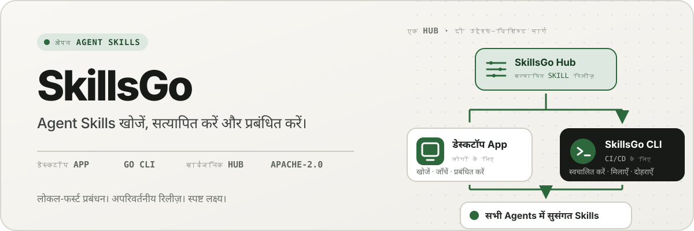
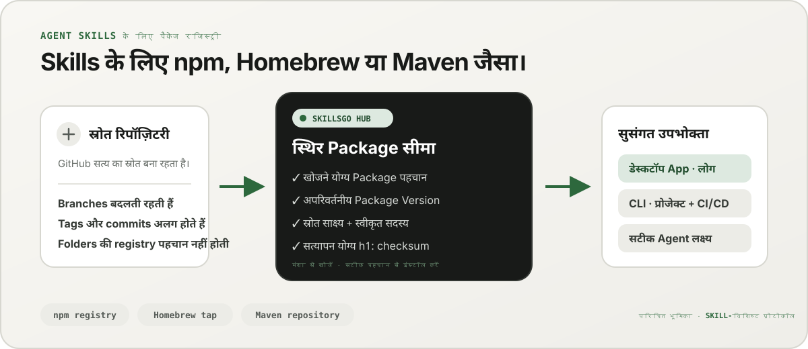
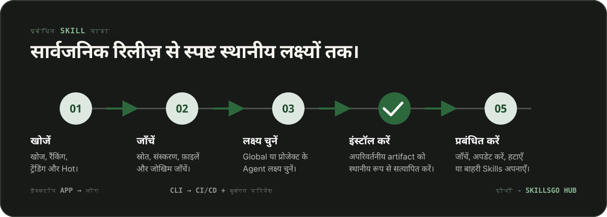

<p align="center">
  
</p>

**Agent Skills के लिए एक वर्कफ़्लो -** स्रोत-सत्यापन योग्य Skills की खोज करें, अपरिवर्तनीय संस्करणों को पिन करें, और डेस्कटॉप App या स्वचालन-अनुकूल CLI के माध्यम से समान इंस्टॉलेशन संचालित करें।

<!-- README-I18N:START -->

  <p>
    <a href="../../README.md">English</a> ·
    <a href="./README.zh-CN.md">简体中文</a> ·
    <a href="./README.zh-TW.md">繁體中文（台灣）</a> ·
    <a href="./README.zh-HK.md">繁體中文（香港）</a> ·
    <a href="./README.ja.md">日本語</a> ·
    <a href="./README.ko.md">한국어</a> ·
    <a href="./README.fr.md">Français</a> ·
    <a href="./README.de.md">Deutsch</a> ·
    <a href="./README.it.md">Italiano</a> ·
    <a href="./README.es.md">Español</a> ·
    <a href="./README.pt-BR.md">Português (Brasil)</a> ·
    <a href="./README.ru.md">Русский</a> ·
    <a href="./README.ar.md">العربية</a> ·
    <strong>हिन्दी</strong> ·
    <a href="./README.id.md">Bahasa Indonesia</a> ·
    <a href="./README.tr.md">Türkçe</a> ·
    <a href="./README.nl.md">Nederlands</a> ·
    <a href="./README.pl.md">Polski</a> ·
    <a href="./README.th.md">ไทย</a> ·
    <a href="./README.vi.md">Tiếng Việt</a> ·
    <a href="./README.ms.md">Bahasa Melayu</a> ·
    <a href="./README.sv.md">Svenska</a> ·
    <a href="./README.uk.md">Українська</a>
  </p>
<!-- README-I18N:END -->

SkillsGo, Agent Skills की खोज, संस्करण और संचालन के लिए एक स्रोत-सत्यापन योग्य पारिस्थितिकी तंत्र है। Skills को खोजने और प्रबंधित करने के लिए डेस्कटॉप App का उपयोग करें, इंस्टॉलेशन को पुनरुत्पादित करने के लिए CLI और अपरिवर्तनीय Package Versions के लिए साझा या स्वयं-होस्ट किए गए वितरण मूल के रूप में Hub का उपयोग करें।

> **npm, Homebrew, या Maven के बारे में सोचें—लेकिन Agent Skills के लिए।** GitHub कोड के लिए सत्य का स्रोत बना हुआ है; SkillsGo Hub समर्थित स्रोतों को खोजने योग्य, अपरिवर्तनीय, चेकसम-सत्यापन योग्य Skill Packages में बदल देता है जिन्हें App और CLI Agents और मशीनों पर लगातार स्थापित कर सकते हैं।

<p align="center">
  
</p>

**स्थानांतरित स्रोत से स्थिर निर्भरता तक -** Hub लोगों को मंशा-आधारित खोज देता है, जबकि मशीनों को सटीक Package पहचान, अपरिवर्तनीय संस्करण, स्वीकृत Skill सदस्यता और चेकसम देता है।

## अपना ऑपरेटिंग मॉडल चुनें

| मोड | के लिए सर्वश्रेष्ठ | SkillsGo क्या प्रदान करता है |
| --- | --- | --- |
| **व्यक्तिगत App** | Skills को अंतःक्रियात्मक रूप से खोजना और प्रबंधित करना | स्रोत साक्ष्य, समर्थित-Agent लक्ष्य, परियोजना और वैश्विक पुस्तकालय, सुरक्षित अद्यतन पूर्वावलोकन, और स्थानीय संदर्भ-पदचिह्न अंतर्दृष्टि |
| **CLI और CI/CD** | दोहराए जाने योग्य डेवलपर वातावरण और स्वचालन | मशीन-पठनीय आदेश, सटीक Skill चयन, `skills.yaml`, `skills-lock.yaml`, चेकसम सत्यापन, ऑफ़लाइन कैश पुनर्प्राप्ति, और स्कोप-जागरूक अपडेट |
| **स्व-होस्टेड Hub** | टीमें जिन्हें नियंत्रित Skill कैटलॉग की आवश्यकता है | समान सार्वजनिक प्रोटोकॉल, अपरिवर्तनीय Package Versions, खोजने योग्य मेटाडेटा, स्थिर Git कलाकृतियों और वैकल्पिक पहुंच नियंत्रण के साथ एक कॉन्फ़िगर करने योग्य Hub उत्पत्ति |

तुलना भूमिका के बारे में है, प्रोटोकॉल अनुकूलता के बारे में नहीं:

| परिचित मॉडल | SkillsGo Hub Agent Skills में क्या लाता है |
| --- | --- |
| **npm रजिस्ट्री** | चलती शाखा से किसी अज्ञात फ़ोल्डर की प्रतिलिपि बनाने के बजाय खोजने योग्य Package पहचान और स्पष्ट अपरिवर्तनीय संस्करण |
| **Homebrew टैप** | एक विश्वसनीय वितरण स्रोत जिसे App या CLI सभी डेवलपर मशीनों में उपयोग कर सकता है |
| **Maven रिपॉजिटरी** | स्थिर निर्देशांक, अपरिवर्तनीय कलाकृतियाँ, चेकसम और लॉक करने योग्य निर्भरता रिज़ॉल्यूशन |
| **Skill-विशिष्ट परत** | स्रोत साक्ष्य, स्वीकृत Skill सदस्यता, सटीक सदस्य चयन, समर्थित-Agent मेटाडेटा, और स्थापना लक्ष्य |

Hub GitHub को प्रतिस्थापित नहीं करता है या npm, Homebrew, या Maven संगत होने का दिखावा नहीं करता है। यह Agent Skills को रजिस्ट्री और वितरण की गारंटी देता है जो उन पारिस्थितिक तंत्रों को अन्य प्रकार के सॉफ़्टवेयर के लिए परिचित बनाता है।

## SkillsGo क्यों

- **इंस्टॉलेशन से पहले स्रोत साक्ष्य** - मशीन बदलने से पहले स्रोत भंडार, अपरिवर्तनीय रिलीज, समर्थित Agents, फ़ाइलों और प्रस्तुत `SKILL.md` का निरीक्षण करें।
- **पुनरुत्पादित वातावरण** - किसी टैग, ब्रांच या कमिट को एक बार रिज़ॉल्व करें, उससे मिले अपरिवर्तनीय संस्करण को सहेजें और सख्त मैनिफ़ेस्ट व लॉक के जरिए उसे पुनर्स्थापित करें।
- **एक Package, स्पष्ट सदस्य** - सटीक Skill नाम या पथ और Agent लक्ष्य का चयन करते हुए एक पूर्ण Package Version वितरित करें जो उन्हें प्राप्त होना चाहिए।
- **स्थानीय-प्रथम सुरक्षा** - स्थानीय संशोधनों की रक्षा करें, व्युत्पन्न स्थिति को पुनर्निर्माण योग्य रखें, और Hub अनुपलब्ध होने पर स्थानीय इन्वेंट्री कार्य जारी रखें।
- **संदर्भ पदचिह्न अंतर्दृष्टि** - मौजूद Skill नामों और विवरणों के वर्ण-पदचिह्न का अनुमान लगाएं, फिर उन Skills की पहचान करें जिनकी पिछले 45 या 90 दिनों में कोई कॉल दर्ज नहीं हुई। यह एक स्थानीय संदर्भ प्रॉक्सी है, मॉडल बिलिंग टेलीमेट्री नहीं।
- **दो उत्पाद इंटरफेस, एक प्रोटोकॉल** - इंटरैक्टिव वर्कफ़्लो के लिए App और स्वचालन के लिए CLI का उपयोग करें; दोनों एक ही Hub अनुबंध पर बात करते हैं।

## App को क्रियाशील देखें

डेस्कटॉप App एक मानव-अनुकूल यात्रा में खोज, स्रोत साक्ष्य, स्थापना लक्ष्य और स्थानीय सूची को जोड़ता है। व्यक्तिगत उपयोग के लिए किसी खाते की आवश्यकता नहीं है।

<p align="center">
  
</p>

**लाइव Hub खोज -** बिना साइन इन किए लगातार अपडेट किए गए कैटलॉग को ब्राउज़ करें, ताकि किसी भी स्थानीय इंस्टॉलेशन या कॉन्फ़िगरेशन परिवर्तन से पहले उपयोगी Skill दिखाई दे सकें।

### खोजें और निरीक्षण करें

Skill या स्रोत भंडार द्वारा खोजें, रैंकिंग और खोज परिणामों का पता लगाएं, और स्थापना से पहले स्रोत भंडार, अपरिवर्तनीय रिलीज, समर्थित Agents, अनुवादित सारांश और प्रस्तुत `SKILL.md` का निरीक्षण करें।

<p align="center">
  
</p>

**स्रोत-जागरूक खोज -** क्षमता या भंडार द्वारा Skill खोजें और उनके Package संदर्भ देखें, जिससे आपको एक अलग स्निपेट पर भरोसा करने के बजाय संबंधित Skills की तुलना करने में मदद मिलेगी।

<p align="center">
  
</p>

**इंस्टॉल करने से पहले निरीक्षण करें -** पहले अपरिवर्तनीय संस्करण, समर्थित Agents, स्रोत फ़ाइलों और प्रदान किए गए निर्देशों की समीक्षा करें, जिससे आपूर्ति-श्रृंखला आश्चर्य और आकस्मिक मशीन परिवर्तन कम हो जाएंगे।

### स्थानीय Skills को स्थापित और नियंत्रित करें

विश्व स्तर पर या चयनित परियोजनाओं में स्थापित करें, Agent लक्ष्य चुनें जिन्हें समान Skill रिलीज़ प्राप्त होना चाहिए, और इसे लागू करने से पहले Package अपडेट के परिणामों की समीक्षा करें।

<p align="center">
  
</p>

**स्पष्ट स्थापना लक्ष्य -** वैश्विक या प्रोजेक्ट स्कोप और सटीक Agent चुनें जो Skill प्राप्त करते हैं, फ़ाइलों को हाथ से कॉपी किए बिना एक रिलीज को सुसंगत रखते हुए।

<p align="center">
  
</p>

**प्रभाव-जागरूक अपडेट -** अपडेट लागू करने से पहले संस्करण परिवर्तन और हटाए जाने वाले Skills देखें, ताकि निर्भरता में बदलाव सोच-समझकर किए जाएँ और जरूरत पड़ने पर वापस लिए जा सकें।

<p align="center">
  
</p>

**ग्लोबल लाइब्रेरी अंतर्दृष्टि -** एक इन्वेंट्री में 45/90-दिवसीय स्थानीय उपयोग, संदर्भ पदचिह्न और Agent दृश्यता की तुलना करें, जिससे अप्रयुक्त Skills और निवासी संदर्भ को नियंत्रित करना आसान हो जाता है।

<p align="center">
  
</p>

**प्रोजेक्ट-स्कोप्ड गवर्नेंस -** एक ही इन्वेंट्री को एक प्रोजेक्ट तक सीमित करें, ताकि इसकी स्थापना, उपयोग साक्ष्य और अप्रबंधित Skills की समीक्षा वैश्विक शोर के बिना की जा सके।

## CLI और Hub के माध्यम से संस्करणित वितरण

CLI और Hub SkillsGo की इंजीनियरिंग सतह बनाते हैं। Hub एक गतिशील स्रोत भंडार को एक स्थिर निर्भरता सीमा में परिवर्तित करता है: एक Package वितरण इकाई है, और प्रत्येक Package Version एक स्रोत संशोधन और इसकी पूर्ण स्वीकृत Skill सदस्यता का एक अपरिवर्तनीय स्नैपशॉट है। इससे लोगों को इरादे से पता चलता है जबकि मशीनें सटीक पहचान से स्थापित होती हैं।

```yaml
dependencies:
  github.com/acme/skills:
    version: v1.2.3
    skills: [review, design]
    agents: [codex, claude-code]
```

`skills.yaml` वांछित Package संस्करण, चयनित सदस्यों और Agent लक्ष्यों को रिकॉर्ड करता है। उत्पन्न `skills-lock.yaml` उस संस्करण को उसके Package `h1:` योग से जोड़ता है। एक नई मशीन या सीआई जॉब एक ही इंस्टाल फ्लो चला सकती है और एक चलती शाखा का अनुसरण करने के बजाय उसी आर्टिफैक्ट को सत्यापित कर सकती है।

```sh
# Discover and inspect
npx skillsgo find typescript
npx skillsgo show github.com/acme/skills@v1.2.3

# Add exact members to a project or the global scope
npx skillsgo add github.com/acme/skills@v1.2.3 \
  --skill review --agent codex

# Restore, preview, and update reproducibly
npx skillsgo install
npx skillsgo update --dry-run
npx skillsgo update --yes
```

वही कमांड किसी अन्य Hub उत्पत्ति को लक्षित कर सकते हैं:

```sh
npx skillsgo add github.com/acme/skills@v1.2.3 \
  --hub https://hub.example.com \
  --skill review --agent codex
```

## टीमों के लिए स्व-होस्टेड Hub

संगठन Hub ओरिजिन चला सकते हैं जो आधिकारिक सेवा के समान SkillsGo प्रोटोकॉल लागू करता है। इससे स्वीकृत कैटलॉग को क्यूरेट करना, Package Version इतिहास को अपरिवर्तनीय रखना, खोज योग्य मेटाडेटा को उजागर करना, सत्यापित कलाकृतियों की सेवा करना और App या CLI को एक नियंत्रित मूल पर इंगित करना संभव हो जाता है।

```text
Source repository
       │
       ▼
Hub Package Version ── immutable metadata, artifact, and h1: sum
       │
       ├── SkillsGo App (interactive discovery and management)
       └── SkillsGo CLI (projects, CI/CD, and repeatable installs)
```

सार्वजनिक Hub अनुबंध वर्तमान में समर्थित सार्वजनिक Skill स्रोतों पर केंद्रित है। एक निजी Hub अनुमोदित Packages का नियंत्रित वितरण प्रदान कर सकता है; निजी-स्रोत अंतर्ग्रहण और उद्यम पहचान एकीकरण अलग-अलग परिनियोजन क्षमताएं हैं, न कि क्लाइंट में छिपी धारणाएं।

## यह कैसे काम करता है

<p align="center">
  
</p>

**एक साझा अपरिवर्तनीय प्रोटोकॉल -** Hub स्रोत साक्ष्य को एक बार हल करता है, जबकि App और CLI समान Package Version और चेकसम का उपभोग करते हैं, जिससे इंटरैक्टिव और स्वचालित इंस्टॉल समान परिणाम देते हैं।

1. एक समर्थित स्रोत को एक अपरिवर्तनीय Package Version में हल किया जाता है।
2. Hub Package मेटाडेटा, स्वीकृत Skill सदस्यता, एक स्थिर Git आर्टिफैक्ट और एक सत्यापन योग्य Package योग प्रकाशित करता है।
3. App या CLI एक ही प्रोटोकॉल को पढ़ता है और उपयोगकर्ता को सटीक सदस्य, दायरे और Agent लक्ष्य चुनने देता है।
4. CLI मेनिफेस्ट और लॉक से संरक्षित स्थानीय Package पेड़ों और Agent अनुमानों को मूर्त रूप देता है।
5. अपडेट एक नए अपरिवर्तनीय संस्करण का समाधान करते हैं और स्थानीय स्थिति बदलने से पहले प्रभाव दिखाते हैं।

## मोनोरेपो का अन्वेषण करें

```text
skillsgo/
├── app/       Flutter desktop client and user experience
├── cli/       Go CLI, local state, and Skill execution engine
├── hub/       Public Hub service and reusable self-host runtime
├── protocol/  Shared executable contracts used by CLI and Hub
├── web/       Public product, Hub, and documentation surface
└── e2e/       Cross-product CLI/Hub and desktop journeys
```

उत्पाद सीमाओं और डोमेन भाषा के लिए [`CONTEXT-MAP.md`](../../CONTEXT-MAP.md) पढ़ें। सार्वजनिक रिलीज़ और आर्टिफैक्ट मॉडल को [`docs/release-design.md`](../release-design.md) में प्रलेखित किया गया है।

## इसे स्थानीय स्तर पर चलाएँ

एकीकृत विकास टोपोलॉजी वर्तमान में macOS को लक्षित करती है और इसके लिए फ़्लटर, गो, डॉकर, [प्रोसेस कंपोज़](https://github.com/F1bonacc1/process-compose), और [एयर](https://github.com/air-verse/air) की आवश्यकता होती है।

```sh
make dev
```

यह एक पर्यवेक्षित सत्र के तहत PostgreSQL, स्थानीय Hub, एक ताज़ा निर्मित CLI, और फ़्लटर डेस्कटॉप App शुरू करता है। सभी कॉन्फ़िगर किए गए कार्यस्थानों को मान्य करने के लिए:

```sh
make test
```

प्रत्येक कार्यक्षेत्र के लिए केंद्रित प्रवेश बिंदु उपलब्ध हैं:

| कार्यक्षेत्र | विकास या सत्यापन |
| --- | --- |
| App | `cd app && flutter run -d macos` |
| CLI | `cd cli && go test ./...` |
| Hub | `cd hub && go test ./...` |
| प्रोटोकॉल | `cd protocol && go test ./...` |
| वेब | `cd web && pnpm install && pnpm dev` |

उत्पाद व्यवहार बदलने से पहले [CONTRIBUTING.md](../../CONTRIBUTING.md) देखें।

## परियोजना की स्थिति

SkillsGo सक्रिय प्रारंभिक रिलीज़ विकास में है। App, CLI, Hub, और प्रोटोकॉल को अलग-अलग रिलीज़ इकाइयों के रूप में विकसित किया गया है, जबकि पैकेज-मैनेजर आउटपुट और मूल अभिलेखागार को एक ही सत्यापित CLI बिल्ड मैट्रिक्स से इकट्ठा किया गया है। समर्थित लक्ष्य, आर्टिफैक्ट अखंडता, अद्यतन व्यवहार और आपूर्ति-श्रृंखला आवश्यकताओं के लिए [रिलीज़ डिज़ाइन](../release-design.md) देखें।

## समुदाय

- प्रश्नों, समस्या निवारण और शुरुआती विचारों के लिए [GitHub चर्चाएँ](https://github.com/skillsgo/skillsgo/discussions) का उपयोग करें।
- प्रतिलिपि प्रस्तुत करने योग्य बग, ठोस सुविधा अनुरोध और दस्तावेज़ीकरण समस्याओं के लिए केंद्रित [इश्यू फॉर्म](https://github.com/skillsgo/skillsgo/issues/new/choose) का उपयोग करें।
- निजी तौर पर कमजोरियों की रिपोर्ट करने के लिए [SECURITY.md](../../SECURITY.md) का पालन करें।
- भागीदारी [आचार संहिता](../../CODE_OF_CONDUCT.md) और [शासन मॉडल](../../GOVERNANCE.md) द्वारा नियंत्रित होती है।

## लाइसेंस

SkillsGo को [अपाचे लाइसेंस 2.0](../../LICENSE) के तहत लाइसेंस प्राप्त है।

Hub में [Athens](https://github.com/gomods/athens) से प्राप्त कोड शामिल है, जो एथेंस एमआईटी लाइसेंस और एट्रिब्यूशन नोटिस के अधीन रहता है। [`NOTICE`](../../NOTICE) और [`THIRD_PARTY_LICENSES/ATHENS-LICENSE`](../../THIRD_PARTY_LICENSES/ATHENS-LICENSE) देखें।
