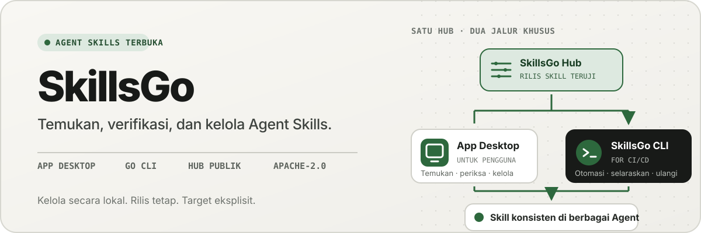
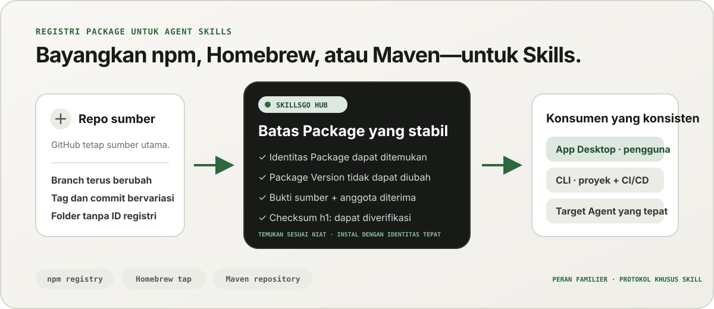
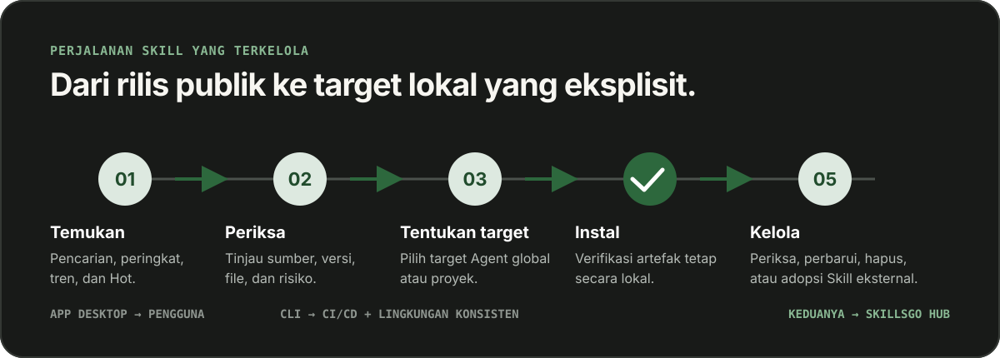

<p align="center">
  
</p>

**Satu alur kerja untuk Agent Skills —** Temukan Skill yang dapat diverifikasi sumber, sematkan versi yang tidak dapat diubah, dan operasikan instalasi yang sama melalui desktop App atau CLI yang ramah otomatisasi.

<!-- README-I18N:START -->

  <p>
    <a href="../../README.md">English</a> ·
    <a href="./README.zh-CN.md">简体中文</a> ·
    <a href="./README.zh-TW.md">繁體中文（台灣）</a> ·
    <a href="./README.zh-HK.md">繁體中文（香港）</a> ·
    <a href="./README.ja.md">日本語</a> ·
    <a href="./README.ko.md">한국어</a> ·
    <a href="./README.fr.md">Français</a> ·
    <a href="./README.de.md">Deutsch</a> ·
    <a href="./README.it.md">Italiano</a> ·
    <a href="./README.es.md">Español</a> ·
    <a href="./README.pt-BR.md">Português (Brasil)</a> ·
    <a href="./README.ru.md">Русский</a> ·
    <a href="./README.ar.md">العربية</a> ·
    <a href="./README.hi.md">हिन्दी</a> ·
    <strong>Bahasa Indonesia</strong> ·
    <a href="./README.tr.md">Türkçe</a> ·
    <a href="./README.nl.md">Nederlands</a> ·
    <a href="./README.pl.md">Polski</a> ·
    <a href="./README.th.md">ไทย</a> ·
    <a href="./README.vi.md">Tiếng Việt</a> ·
    <a href="./README.ms.md">Bahasa Melayu</a> ·
    <a href="./README.sv.md">Svenska</a> ·
    <a href="./README.uk.md">Українська</a>
  </p>
<!-- README-I18N:END -->

SkillsGo adalah ekosistem yang dapat diverifikasi sumber untuk menemukan, membuat versi, dan mengoperasikan Agent Skills. Gunakan desktop App untuk menjelajahi dan mengelola Skill, CLI untuk membuat instalasi dapat direproduksi, dan Hub sebagai asal distribusi bersama atau yang dihosting sendiri untuk Package Version yang tidak dapat diubah.

> **Bayangkan npm, Homebrew, atau Maven—tetapi untuk Agent Skills.** GitHub tetap menjadi sumber kebenaran untuk kode; SkillsGo Hub mengubah sumber yang didukung menjadi Package Skill yang dapat ditemukan, tidak dapat diubah, dan dapat diverifikasi dengan checksum, sehingga App dan CLI dapat memasangnya secara konsisten di berbagai Agent dan mesin.

<p align="center">
  
</p>

**Dari memindahkan sumber ke ketergantungan yang stabil —** Hub memberi orang penemuan berbasis niat sekaligus memberi mesin identitas Package yang tepat, versi yang tidak dapat diubah, keanggotaan Skill yang diterima, dan checksum.

## Pilih model operasi Anda

| Modus | Terbaik untuk | Apa yang SkillsGo sediakan |
| --- | --- | --- |
| **App Pribadi** | Menemukan dan mengelola Skill secara interaktif | Sumber bukti, target Agent yang didukung, perpustakaan proyek dan global, pratinjau pembaruan yang aman, dan wawasan jejak konteks lokal |
| **CLI dan CI/CD** | Lingkungan pengembang dan otomatisasi yang dapat diulang | Perintah yang dapat dibaca mesin, pemilihan Skill yang tepat, `skills.yaml`, `skills-lock.yaml`, verifikasi checksum, pemulihan cache offline, dan pembaruan sadar cakupan |
| **Hub yang dihosting sendiri** | Tim yang memerlukan katalog Skill terkontrol | Asal Hub yang dapat dikonfigurasi dengan protokol publik yang sama, Package Version yang tidak dapat diubah, metadata yang dapat dicari, artefak Git statis, dan kontrol akses opsional |

Perbandingannya adalah tentang peran, bukan kompatibilitas protokol:

| Model yang familier | Apa yang dihadirkan SkillsGo Hub ke Agent Skills |
| --- | --- |
| **Registrasi npm** | Identitas Package yang dapat dicari dan versi eksplisit yang tidak dapat diubah alih-alih menyalin folder yang tidak dikenal dari cabang yang bergerak |
| **Homebrew tap** | Satu asal distribusi tepercaya yang dapat digunakan App atau CLI di berbagai mesin pengembang |
| **Repositori Maven** | Koordinat stabil, artefak yang tidak dapat diubah, checksum, dan resolusi ketergantungan yang dapat dikunci |
| **Lapisan khusus Skill** | Bukti sumber, keanggotaan Skill yang diterima, pemilihan anggota yang tepat, metadata Agent yang didukung, dan target pemasangan |

Hub tidak menggantikan GitHub atau berpura-pura kompatibel dengan npm, Homebrew, atau Maven. Ini memberi Agent Skills registri dan jaminan distribusi yang membuat ekosistem tersebut familiar untuk jenis perangkat lunak lainnya.

## Mengapa SkillsGo

- **Sumber bukti sebelum instalasi** — memeriksa repositori sumber, rilis yang tidak dapat diubah, Agent yang didukung, file, dan `SKILL.md` yang dirender sebelum mengganti mesin.
- **Lingkungan yang dapat direproduksi** — selesaikan tag, cabang, atau commit satu kali, pertahankan versi tidak dapat diubah yang dihasilkan, lalu pulihkan melalui manifes dan lock yang ketat.
- **Satu Package, anggota eksplisit** — mendistribusikan Package Version lengkap sambil memilih nama atau jalur Skill yang tepat dan target Agent yang harus menerimanya.
- **Keamanan yang mengutamakan lokal** — melindungi modifikasi lokal, menjaga status turunan tetap dapat dibangun kembali, dan melanjutkan pekerjaan inventaris lokal saat Hub tidak tersedia.
- **Wawasan jejak konteks** — memperkirakan jejak karakter nama dan deskripsi Skill penduduk, lalu mengidentifikasi Skill tanpa panggilan yang teramati dalam 45 atau 90 hari terakhir. Ini adalah proksi konteks lokal, bukan model telemetri penagihan.
- **Dua antarmuka produk, satu protokol** — gunakan App untuk alur kerja interaktif dan CLI untuk otomatisasi; keduanya berbicara dengan kontrak Hub yang sama.

## Lihat App beraksi

Desktop App menghubungkan penemuan, bukti sumber, target instalasi, dan inventaris lokal dalam satu alur yang mudah digunakan. Penggunaan pribadi tidak memerlukan akun.

<p align="center">
  
</p>

**Penemuan Hub langsung —** Telusuri katalog yang terus diperbarui tanpa masuk, sehingga Skill yang berguna akan terlihat sebelum instalasi lokal atau perubahan konfigurasi apa pun.

### Temukan dan periksa

Cari berdasarkan Skill atau repositori sumber, jelajahi peringkat dan hasil pencarian, dan periksa repositori sumber, rilis yang tidak dapat diubah, Agent yang didukung, ringkasan yang diterjemahkan, dan `SKILL.md` yang dirender sebelum instalasi.

<p align="center">
  
</p>

**Penelusuran berdasarkan sumber —** Temukan Skill berdasarkan kemampuan atau repositori dan lihat konteks Package, membantu Anda membandingkan Skill terkait alih-alih memercayai cuplikan terisolasi.

<p align="center">
  
</p>

**Periksa sebelum menginstal —** Tinjau versi yang tidak dapat diubah, Agent yang didukung, file sumber, dan instruksi yang diberikan terlebih dahulu, sehingga mengurangi kejutan rantai pasokan dan perubahan mesin yang tidak disengaja.

### Instal dan kelola Skill lokal

Instal secara global atau ke dalam proyek yang dipilih, pilih target Agent yang akan menerima rilis Skill yang sama, dan tinjau konsekuensi pembaruan Package sebelum menerapkannya.

<p align="center">
  
</p>

**Target instalasi eksplisit —** Pilih cakupan global atau proyek dan Agent yang menerima Skill, menjaga satu rilis tetap konsisten tanpa menyalin file secara manual.

<p align="center">
  
</p>

**Pembaruan yang peka terhadap dampak —** Lihat transisi versi dan penghapusan Skill sebelum menerapkan pembaruan, sehingga perubahan ketergantungan tetap disengaja dan dapat dipulihkan.

<p align="center">
  
</p>

**Wawasan Perpustakaan Global —** Bandingkan penggunaan lokal selama 45/90 hari, jejak konteks, dan visibilitas Agent dalam satu inventaris, menjadikan Skill yang tidak terpakai dan konteks penduduk lebih mudah diatur.

<p align="center">
  
</p>

**Tata kelola cakupan proyek —** Persempit inventaris yang sama menjadi satu proyek, sehingga instalasi, bukti penggunaan, dan Skill yang tidak dikelola dapat ditinjau tanpa gangguan global.

## Distribusi berversi melalui CLI dan Hub

CLI dan Hub membentuk permukaan teknik SkillsGo. Hub mengubah repositori sumber bergerak menjadi batas ketergantungan yang stabil: Package adalah unit distribusi, dan setiap Package Version merupakan cuplikan abadi dari satu revisi sumber dan keanggotaan Skill yang diterima secara lengkap. Hal ini memungkinkan orang menemukan berdasarkan niat sementara mesin menginstal berdasarkan identitas sebenarnya.

```yaml
dependencies:
  github.com/acme/skills:
    version: v1.2.3
    skills: [review, design]
    agents: [codex, claude-code]
```

`skills.yaml` mencatat versi Package yang diinginkan, anggota yang dipilih, dan target Agent. `skills-lock.yaml` yang dihasilkan mengikat versi tersebut ke jumlah Package `h1:`-nya. Mesin baru atau tugas CI dapat menjalankan alur instalasi yang sama dan memverifikasi artefak yang sama alih-alih mengikuti cabang yang bergerak.

```sh
# Discover and inspect
npx skillsgo find typescript
npx skillsgo show github.com/acme/skills@v1.2.3

# Add exact members to a project or the global scope
npx skillsgo add github.com/acme/skills@v1.2.3 \
  --skill review --agent codex

# Restore, preview, and update reproducibly
npx skillsgo install
npx skillsgo update --dry-run
npx skillsgo update --yes
```

Perintah yang sama dapat menargetkan Asal Hub lainnya:

```sh
npx skillsgo add github.com/acme/skills@v1.2.3 \
  --hub https://hub.example.com \
  --skill review --agent codex
```

## Hub yang dihosting sendiri untuk tim

Organisasi dapat menjalankan Hub Origin yang mengimplementasikan protokol SkillsGo yang sama dengan layanan resmi. Hal ini memungkinkan untuk menyusun katalog yang disetujui, menjaga riwayat Package Version tidak dapat diubah, mengekspos metadata yang dapat dicari, menyajikan artefak terverifikasi, dan mengarahkan App atau CLI ke satu asal yang dikontrol.

```text
Source repository
       │
       ▼
Hub Package Version ── immutable metadata, artifact, and h1: sum
       │
       ├── SkillsGo App (interactive discovery and management)
       └── SkillsGo CLI (projects, CI/CD, and repeatable installs)
```

Kontrak Hub publik saat ini berfokus pada Sumber Skill publik yang didukung. Hub pribadi dapat menyediakan distribusi terkontrol dari Package yang disetujui; penyerapan sumber pribadi dan integrasi identitas perusahaan adalah kemampuan penerapan yang terpisah, bukan asumsi yang tersembunyi di klien.

## Cara kerjanya

<p align="center">
  
</p>

**Protokol bersama yang tidak dapat diubah —** Hub menyelesaikan bukti sumber satu kali, sedangkan App dan CLI menggunakan Package Version dan checksum yang sama, sehingga memberikan hasil yang sama pada penginstalan interaktif dan otomatis.

1. Sumber yang didukung ditetapkan menjadi satu Package Version yang tidak dapat diubah.
2. Hub menerbitkan metadata Package, menerima keanggotaan Skill, artefak Git statis, dan jumlah Package yang dapat diverifikasi.
3. App atau CLI membaca protokol yang sama dan memungkinkan pengguna memilih anggota, cakupan, dan target Agent yang tepat.
4. CLI mewujudkan pohon Package lokal yang dilindungi dan proyeksi Agent dari manifes dan kunci.
5. Pembaruan menyelesaikan versi baru yang tidak dapat diubah dan menunjukkan dampaknya sebelum mengubah keadaan lokal.

## Jelajahi monorepo

```text
skillsgo/
├── app/       Flutter desktop client and user experience
├── cli/       Go CLI, local state, and Skill execution engine
├── hub/       Public Hub service and reusable self-host runtime
├── protocol/  Shared executable contracts used by CLI and Hub
├── web/       Public product, Hub, and documentation surface
└── e2e/       Cross-product CLI/Hub and desktop journeys
```

Baca [`CONTEXT-MAP.md`](../../CONTEXT-MAP.md) untuk batasan produk dan bahasa domain. Rilis publik dan model artefak didokumentasikan di [`docs/release-design.md`](../release-design.md).

## Jalankan secara lokal

Topologi pengembangan terpadu saat ini menargetkan macOS dan memerlukan Flutter, Go, Docker, [Process Compose](https://github.com/F1bonacc1/process-compose), dan [Air](https://github.com/air-verse/air).

```sh
make dev
```

Tindakan ini akan memulai PostgreSQL, Hub lokal, CLI yang baru dibuat, dan desktop Flutter App dalam satu sesi yang diawasi. Untuk memvalidasi semua ruang kerja yang dikonfigurasi:

```sh
make test
```

Titik masuk terfokus tersedia untuk setiap ruang kerja:

| Ruang Kerja | Pengembangan atau validasi |
| --- | --- |
| App | `cd app && flutter run -d macos` |
| CLI | `cd cli && go test ./...` |
| Hub | `cd hub && go test ./...` |
| Protokol | `cd protocol && go test ./...` |
| Web | `cd web && pnpm install && pnpm dev` |

Lihat [CONTRIBUTING.md](../../CONTRIBUTING.md) sebelum mengubah perilaku produk.

## Status proyek

SkillsGo sedang dalam pengembangan rilis awal yang aktif. App, CLI, Hub, dan Protokol dikembangkan sebagai unit rilis terpisah, sedangkan output pengelola paket dan arsip asli dirakit dari matriks build CLI terverifikasi yang sama. Lihat [desain rilis](../release-design.md) untuk mengetahui target yang didukung, integritas artefak, perilaku pembaruan, dan persyaratan rantai pasokan.

## Komunitas

- Gunakan [Diskusi GitHub](https://github.com/skillsgo/skillsgo/discussions) untuk pertanyaan, pemecahan masalah, dan ide awal.
- Gunakan [formulir masalah yang terfokus](https://github.com/skillsgo/skillsgo/issues/new/choose) untuk bug yang dapat direproduksi, permintaan fitur nyata, dan masalah dokumentasi.
- Ikuti [SECURITY.md](../../SECURITY.md) untuk melaporkan kerentanan secara pribadi.
- Partisipasi diatur oleh [Kode Etik](../../CODE_OF_CONDUCT.md) dan [model tata kelola](../../GOVERNANCE.md).

## Lisensi

SkillsGo dilisensikan di bawah [Lisensi Apache 2.0](../../LICENSE).

Hub berisi kode yang berasal dari [Athens](https://github.com/gomods/athens), yang tetap tunduk pada Lisensi MIT Athens dan pemberitahuan atribusi. Lihat [`NOTICE`](../../NOTICE) dan [`THIRD_PARTY_LICENSES/ATHENS-LICENSE`](../../THIRD_PARTY_LICENSES/ATHENS-LICENSE).
