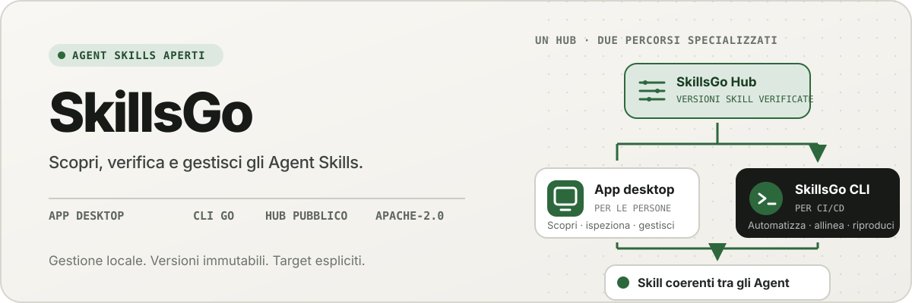
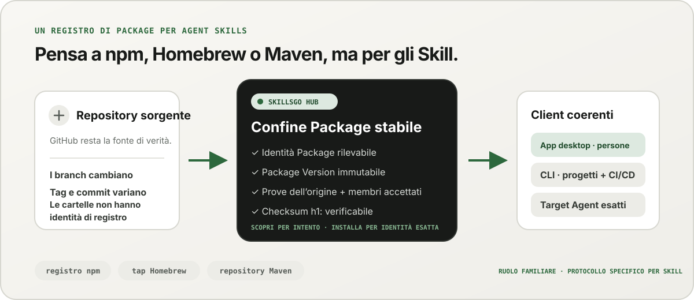
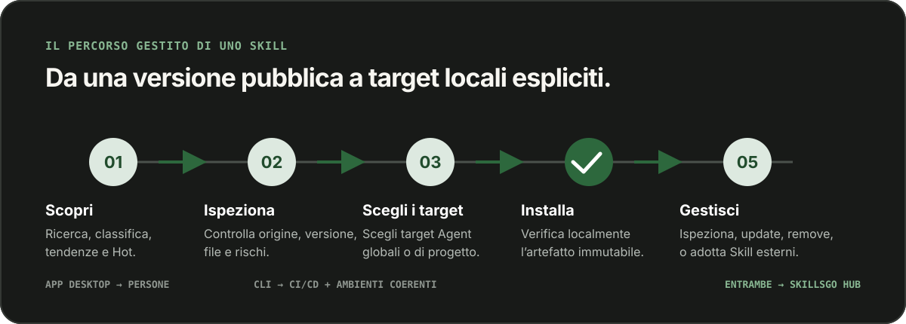

<p align="center">
  
</p>

**Un flusso di lavoro per Agent Skills —** Scopri Skill verificabili all'origine, aggiungi versioni immutabili e gestisci le stesse installazioni tramite uno App desktop o uno CLI di facile automazione.

<!-- README-I18N:START -->

  <p>
    <a href="../../README.md">English</a> ·
    <a href="./README.zh-CN.md">简体中文</a> ·
    <a href="./README.zh-TW.md">繁體中文（台灣）</a> ·
    <a href="./README.zh-HK.md">繁體中文（香港）</a> ·
    <a href="./README.ja.md">日本語</a> ·
    <a href="./README.ko.md">한국어</a> ·
    <a href="./README.fr.md">Français</a> ·
    <a href="./README.de.md">Deutsch</a> ·
    <strong>Italiano</strong> ·
    <a href="./README.es.md">Español</a> ·
    <a href="./README.pt-BR.md">Português (Brasil)</a> ·
    <a href="./README.ru.md">Русский</a> ·
    <a href="./README.ar.md">العربية</a> ·
    <a href="./README.hi.md">हिन्दी</a> ·
    <a href="./README.id.md">Bahasa Indonesia</a> ·
    <a href="./README.tr.md">Türkçe</a> ·
    <a href="./README.nl.md">Nederlands</a> ·
    <a href="./README.pl.md">Polski</a> ·
    <a href="./README.th.md">ไทย</a> ·
    <a href="./README.vi.md">Tiếng Việt</a> ·
    <a href="./README.ms.md">Bahasa Melayu</a> ·
    <a href="./README.sv.md">Svenska</a> ·
    <a href="./README.uk.md">Українська</a>
  </p>
<!-- README-I18N:END -->

SkillsGo è un ecosistema dall’origine verificabile per scoprire, versionare e utilizzare Agent Skills. Usa l’App desktop per esplorare e gestire gli Skill, la CLI per rendere riproducibili le installazioni e l’Hub come origine di distribuzione condivisa o self-hosted per le Package Version immutabili.

> **Pensa a npm, Homebrew o Maven, ma per Agent Skills.** GitHub rimane la fonte della verità per il codice; SkillsGo Hub trasforma le fonti supportate in Skill Package rilevabili, immutabili e verificabili con checksum che App e CLI possono installare in modo coerente su Agent e macchine.

<p align="center">
  
</p>

**Da una fonte in evoluzione a una dipendenza stabile —** L’Hub consente alle persone di cercare per intento e fornisce alle macchine l’identità Package esatta, versioni immutabili, l’elenco preciso degli Skill inclusi e i checksum.

## Scegli il tuo modello operativo

| Modalità | Ideale per | Cosa offre SkillsGo |
| --- | --- | --- |
| **App personale** | Scoprire e gestire in modo interattivo gli Skill | Prove sulle fonti, obiettivi Agent supportati, biblioteche globali e di progetto, anteprime di aggiornamenti sicuri e approfondimenti sull'impronta del contesto locale |
| **CLI e CI/CD** | Ambienti di sviluppo ripetibili e automazione | Comandi leggibili dalla macchina, selezione esatta di Skill, `skills.yaml`, `skills-lock.yaml`, verifica del checksum, ripristino della cache offline e aggiornamenti compatibili con l'ambito |
| **Hub ospitato autonomamente** | Squadre che necessitano di un catalogo Skill controllato | Un'origine Hub configurabile con lo stesso protocollo pubblico, Package Version immutabili, metadati ricercabili, artefatti Git statici e controllo degli accessi opzionale |

Il confronto riguarda il ruolo, non la compatibilità del protocollo:

| Modello familiare | Cosa offre SkillsGo Hub a Agent Skills |
| --- | --- |
| **Registro npm** | Identità Package ricercabile e versioni immutabili esplicite invece di copiare una cartella sconosciuta da un ramo in movimento |
| **Tap Homebrew** | Un’origine di distribuzione affidabile che l’App o la CLI può utilizzare su tutti i computer degli sviluppatori |
| **Archivio Maven** | Coordinate stabili, artefatti immutabili, checksum e risoluzione delle dipendenze bloccabili |
| **Strato specifico Skill** | Prove dell'origine, appartenenza Skill accettata, selezione esatta dei membri, metadati Agent supportati e destinazioni di installazione |

L’Hub non sostituisce GitHub né pretende di essere compatibile con npm, Homebrew o Maven. Offre agli Agent Skills le garanzie di registro e distribuzione rese familiari da questi ecosistemi.

## Perché SkillsGo

- **Prova del codice sorgente prima dell'installazione**: ispeziona il repository del codice sorgente, la versione immutabile, gli Agent supportati, i file e il `SKILL.md` renderizzato prima di cambiare macchina.
- **Ambienti riproducibili**: risolvi una volta un tag, un branch o un commit, conserva la versione immutabile risultante e ripristinala tramite un manifest e un file di lock rigorosi.
- **Un Package, membri espliciti**: distribuisci una Package Version completa selezionando i nomi o i percorsi Skill esatti e i target Agent che dovrebbero riceverli.
- **Sicurezza locale prima di tutto**: proteggi le modifiche locali, mantieni ricostruibile lo stato derivato e continua il lavoro di inventario locale quando l’Hub non è disponibile.
- **Approfondimenti sull'impronta del contesto**: stima l'impronta dei caratteri dei nomi e delle descrizioni dei Skill residenti, quindi identifica gli Skill senza chiamate osservate negli ultimi 45 o 90 giorni. Si tratta di un proxy del contesto locale, non di telemetria di fatturazione del modello.
- **Due interfacce di prodotto, un protocollo**: utilizza App per flussi di lavoro interattivi e CLI per l'automazione; entrambi fanno riferimento allo stesso contratto Hub.

## Guarda l’App in azione

L’App desktop riunisce scoperta, prove dell’origine, destinazioni di installazione e inventario locale in un percorso intuitivo. L’uso personale non richiede un account.

<p align="center">
  
</p>

**Scoperta Hub in tempo reale —** Sfoglia un catalogo continuamente aggiornato senza effettuare l'accesso, in modo che gli Skill utili siano visibili prima di qualsiasi installazione locale o modifica della configurazione.

### Scopri e ispeziona

Cerca per Skill o repository di origine, esplora la classifica e i risultati della ricerca e controlla il repository di origine, la versione immutabile, gli Agent supportati, il riepilogo tradotto e il rendering di `SKILL.md` prima dell'installazione.

<p align="center">
  
</p>

**Ricerca basata sulla fonte:** Trova gli Skill per capacità o repository e visualizza il loro contesto Package, aiutandoti a confrontare gli Skill correlati invece di fidarti di uno snippet isolato.

<p align="center">
  
</p>

**Ispeziona prima dell’installazione —** Esamina prima la versione immutabile, gli Agent supportati, i file sorgente e le istruzioni renderizzate, riducendo le sorprese nella catena di fornitura e le modifiche accidentali alla macchina.

### Installa e governa gli Skill locali

Installa a livello globale o in progetti selezionati, scegli i target Agent che dovrebbero ricevere la stessa versione Skill ed esamina le conseguenze di un aggiornamento Package prima di applicarlo.

<p align="center">
  
</p>

**Obiettivi di installazione espliciti:** Scegli l'ambito globale o di progetto e gli esatti Agent che ricevono uno Skill, mantenendo coerente una versione senza copiare i file manualmente.

<p align="center">
  
</p>

**Aggiornamenti sensibili all'impatto:** Visualizza le transizioni di versione e gli Skill rimossi prima di applicare un aggiornamento, in modo che le modifiche alle dipendenze rimangano intenzionali e recuperabili.

<p align="center">
  
</p>

**Approfondimenti sulla Biblioteca globale —** Confronta l'utilizzo locale di 45/90 giorni, l'impronta del contesto e la visibilità di Agent in un unico inventario, semplificando la gestione degli Skill inutilizzati e del contesto residente.

<p align="center">
  
</p>

**Governance a livello di progetto:** Restringi lo stesso inventario a un solo progetto, in modo che le sue installazioni, prove di utilizzo e Skill non gestiti possano essere esaminati senza rumore globale.

## Distribuzione con versione tramite CLI e Hub

La CLI e l’Hub costituiscono la superficie ingegneristica di SkillsGo. L’Hub trasforma un repository di origine in evoluzione in un confine di dipendenza stabile: un Package è l’unità di distribuzione e ogni Package Version è un’istantanea immutabile di una revisione dell’origine e dell’elenco completo degli Skill inclusi. Le persone possono così cercare per intento mentre le macchine installano in base all’identità esatta.

```yaml
dependencies:
  github.com/acme/skills:
    version: v1.2.3
    skills: [review, design]
    agents: [codex, claude-code]
```

`skills.yaml` registra la versione Package desiderata, i membri selezionati e i target Agent. Lo `skills-lock.yaml` generato associa quella versione alla sua somma Package `h1:`. Una nuova macchina o un lavoro CI può eseguire lo stesso flusso di installazione e verificare lo stesso artefatto invece di seguire un ramo in movimento.

```sh
# Discover and inspect
npx skillsgo find typescript
npx skillsgo show github.com/acme/skills@v1.2.3

# Add exact members to a project or the global scope
npx skillsgo add github.com/acme/skills@v1.2.3 \
  --skill review --agent codex

# Restore, preview, and update reproducibly
npx skillsgo install
npx skillsgo update --dry-run
npx skillsgo update --yes
```

Gli stessi comandi possono prendere di mira un'altra origine Hub:

```sh
npx skillsgo add github.com/acme/skills@v1.2.3 \
  --hub https://hub.example.com \
  --skill review --agent codex
```

## Hub self-hosted per team

Le organizzazioni possono eseguire un Hub Origin che implementa lo stesso protocollo SkillsGo del servizio ufficiale. Ciò consente di curare un catalogo approvato, mantenere immutabile la cronologia delle Package Version, esporre metadati ricercabili, fornire artefatti verificati e configurare l’App o la CLI per usare un’origine controllata.

```text
Source repository
       │
       ▼
Hub Package Version ── immutable metadata, artifact, and h1: sum
       │
       ├── SkillsGo App (interactive discovery and management)
       └── SkillsGo CLI (projects, CI/CD, and repeatable installs)
```

Il contratto pubblico Hub attualmente si concentra sulle fonti pubbliche Skill supportate. Uno Hub privato può fornire la distribuzione controllata di Package approvati; l'acquisizione di origini private e le integrazioni delle identità aziendali sono funzionalità di distribuzione separate, non presupposti nascosti nel client.

## Come funziona

<p align="center">
  
</p>

**Un protocollo immutabile condiviso —** Hub risolve le prove di origine una volta, mentre App e CLI utilizzano lo stesso Package Version e lo stesso checksum, fornendo lo stesso risultato alle installazioni interattive e automatizzate.

1. Una fonte supportata viene risolta in una Package Version immutabile.
2. Hub pubblica metadati Package, ha accettato l'appartenenza a Skill, un artefatto Git statico e una somma Package verificabile.
3. L’App o la CLI legge lo stesso protocollo e consente all’utente di scegliere membri, ambiti e target Agent esatti.
4. La CLI materializza gli alberi Package locali protetti e le proiezioni Agent dal manifest e dal file di lock.
5. Gli aggiornamenti risolvono una nuova versione immutabile e mostrano l'impatto prima della modifica dello stato locale.

## Esplora il monorepo

```text
skillsgo/
├── app/       Flutter desktop client and user experience
├── cli/       Go CLI, local state, and Skill execution engine
├── hub/       Public Hub service and reusable self-host runtime
├── protocol/  Shared executable contracts used by CLI and Hub
├── web/       Public product, Hub, and documentation surface
└── e2e/       Cross-product CLI/Hub and desktop journeys
```

Leggere [`CONTEXT-MAP.md`](../../CONTEXT-MAP.md) per i limiti del prodotto e la lingua del dominio. La versione pubblica e il modello dell'artefatto sono documentati in [`docs/release-design.md`](../release-design.md).

## Eseguilo localmente

La topologia di sviluppo unificata attualmente è destinata a macOS e richiede Flutter, Go, Docker, [Process Compose](https://github.com/F1bonacc1/process-compose) e [Air](https://github.com/air-verse/air).

```sh
make dev
```

Questo avvia PostgreSQL, il Hub locale, un CLI appena creato e il desktop Flutter App in un'unica sessione supervisionata. Per convalidare tutte le aree di lavoro configurate:

```sh
make test
```

Per ogni area di lavoro sono disponibili punti di ingresso mirati:

| Spazio di lavoro | Sviluppo o convalida |
| --- | --- |
| App | `cd app && flutter run -d macos` |
| CLI | `cd cli && go test ./...` |
| Hub | `cd hub && go test ./...` |
| Protocollo | `cd protocol && go test ./...` |
| Web | `cd web && pnpm install && pnpm dev` |

Consulta [CONTRIBUTING.md](../../CONTRIBUTING.md) prima di modificare il comportamento del prodotto.

## Stato del progetto

SkillsGo è in fase di sviluppo attivo della versione anticipata. App, CLI, Hub e Protocol sono sviluppati come unità di rilascio separate, mentre gli output del gestore pacchetti e gli archivi nativi sono assemblati dalla stessa matrice di build CLI verificata. Consulta la [progettazione della versione](../release-design.md) per obiettivi supportati, integrità degli artefatti, comportamento degli aggiornamenti e requisiti della catena di fornitura.

## Comunità

- Utilizzare le [Discussioni GitHub](https://github.com/skillsgo/skillsgo/discussions) per domande, risoluzione dei problemi e prime idee.
- Utilizzare i [moduli di problema](https://github.com/skillsgo/skillsgo/issues/new/choose) mirati per bug riproducibili, richieste di funzionalità concrete e problemi di documentazione.
- Segui [SECURITY.md](../../SECURITY.md) per segnalare le vulnerabilità in privato.
- La partecipazione è disciplinata dal [Codice Etico](../../CODE_OF_CONDUCT.md) e dal [modello di governance](../../GOVERNANCE.md).

## Licenza

SkillsGo è concesso in licenza sotto la [licenza Apache 2.0](../../LICENSE).

L’Hub contiene codice derivato da [Athens](https://github.com/gomods/athens), che rimane soggetto alla licenza MIT di Athens e agli avvisi di attribuzione. Vedere [`NOTICE`](../../NOTICE) e [`THIRD_PARTY_LICENSES/ATHENS-LICENSE`](../../THIRD_PARTY_LICENSES/ATHENS-LICENSE).
