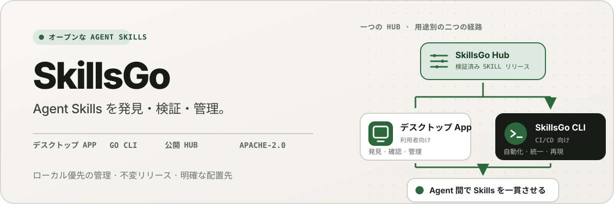
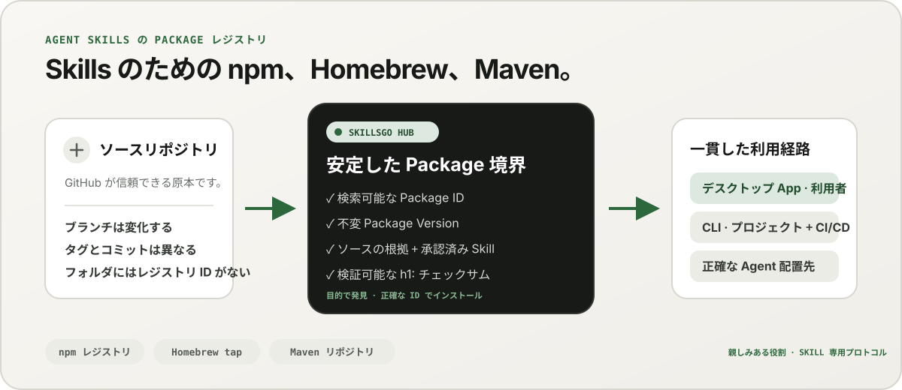
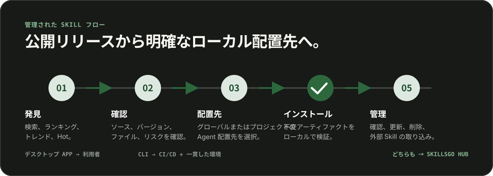

<p align="center">
  
</p>

**Agent Skills の 1 つのワークフロー —** ソース検証可能な Skill を検出し、不変バージョンを固定し、デスクトップ App または自動化に適した CLI を通じて同じインストールを操作します。

<!-- README-I18N:START -->

  <p>
    <a href="../../README.md">English</a> ·
    <a href="./README.zh-CN.md">简体中文</a> ·
    <a href="./README.zh-TW.md">繁體中文（台灣）</a> ·
    <a href="./README.zh-HK.md">繁體中文（香港）</a> ·
    <strong>日本語</strong> ·
    <a href="./README.ko.md">한국어</a> ·
    <a href="./README.fr.md">Français</a> ·
    <a href="./README.de.md">Deutsch</a> ·
    <a href="./README.it.md">Italiano</a> ·
    <a href="./README.es.md">Español</a> ·
    <a href="./README.pt-BR.md">Português (Brasil)</a> ·
    <a href="./README.ru.md">Русский</a> ·
    <a href="./README.ar.md">العربية</a> ·
    <a href="./README.hi.md">हिन्दी</a> ·
    <a href="./README.id.md">Bahasa Indonesia</a> ·
    <a href="./README.tr.md">Türkçe</a> ·
    <a href="./README.nl.md">Nederlands</a> ·
    <a href="./README.pl.md">Polski</a> ·
    <a href="./README.th.md">ไทย</a> ·
    <a href="./README.vi.md">Tiếng Việt</a> ·
    <a href="./README.ms.md">Bahasa Melayu</a> ·
    <a href="./README.sv.md">Svenska</a> ·
    <a href="./README.uk.md">Українська</a>
  </p>
<!-- README-I18N:END -->

SkillsGo は、Agent Skills を検出、バージョン管理、操作するためのソース検証可能なエコシステムです。デスクトップ App を使用して Skill を探索および管理し、CLI を使用してインストールを再現可能にし、Hub を不変 Package Version の共有またはセルフホストのディストリビューション オリジンとして使用します。

> **Agent Skills のための npm、Homebrew、Maven のような存在です。** GitHub は引き続きコードの信頼できる情報源です。SkillsGo Hub は、対応するソースを検索可能で不変、かつチェックサムで検証できる Skill Package に変換し、App と CLI が Agent やマシンをまたいで一貫した状態でインストールできるようにします。

<p align="center">
  
</p>

**変化し続けるソースから安定した依存関係へ —** Hub は、目的に合った Skill を見つけやすくすると同時に、システムには正確な Package ID、不変バージョン、収録 Skill の一覧、チェックサムを提供します。

## オペレーティング モデルを選択してください

|モード |こんな方に最適 | SkillsGo が提供するもの |
| --- | --- | --- |
| **個人 App** | Skill を対話的に検出および管理する |ソース証拠、サポートされている Agent ターゲット、プロジェクトおよびグローバル ライブラリ、安全な更新プレビュー、ローカル コンテキスト フットプリントの洞察 |
| **CLI および CI/CD** |再現可能な開発環境と自動化 |機械可読コマンド、正確な Skill 選択、`skills.yaml`、`skills-lock.yaml`、チェックサム検証、オフライン キャッシュ リカバリ、スコープ対応アップデート |
| **セルフホスト型 Hub** |管理された Skill カタログが必要なチーム |同じパブリック プロトコル、不変の Package Version、検索可能なメタデータ、静的な Git アーティファクト、およびオプションのアクセス制御を備えた構成可能な Hub Origin |

比較はプロトコルの互換性ではなく、役割に関するものです。

|おなじみのモデル | SkillsGo Hub が Agent Skills にもたらすもの |
| --- | --- |
| **npm レジストリ** |移動ブランチから不明なフォルダーをコピーする代わりに、検索可能な Package ID と明示的な不変バージョン |
| **Homebrew タップ** | App または CLI が開発者のマシン間で使用できる 1 つの信頼できるディストリビューション オリジン |
| **Maven リポジトリ** |安定した座標、不変のアーティファクト、チェックサム、およびロック可能な依存関係の解決 |
| **Skill 固有のレイヤー** |ソース証拠、承認された Skill メンバーシップ、正確なメンバー選択、サポートされる Agent メタデータ、およびインストール ターゲット |

Hub は GitHub に取って代わるものでも、npm、Homebrew、Maven との互換性をうたうものでもありません。これらのエコシステムで一般的なレジストリと配布の信頼性を Agent Skills にもたらします。

## なぜ SkillsGo

- **インストール前のソースの証拠** - マシンを変更する前に、ソース リポジトリ、不変リリース、サポートされている Agent、ファイル、およびレンダリングされた `SKILL.md` を検査します。
- **再現可能な環境** - タグ、ブランチ、またはコミットを一度解決し、結果として得られる不変バージョンを永続化し、厳密なマニフェストとロックを通じて復元します。
- **1 つの Package、明示的なメンバー** - 正確な Skill 名またはパス、およびそれらを受け取る必要がある Agent ターゲットを選択しながら、完全な Package Version を配布します。
- **ローカルファーストの安全性** - ローカルの変更を保護し、派生状態を再構築可能に保ち、Hub が使用できない場合でもローカルのインベントリ作業を継続します。
- **コンテキスト フットプリントの洞察** — 常駐する Skill の名前と説明の文字フットプリントを推定し、過去 45 日または 90 日間に呼び出しが観察されなかった Skill を特定します。これはローカル コンテキスト プロキシであり、モデル請求テレメトリではありません。
- **2 つの製品インターフェイス、1 つのプロトコル** — インタラクティブなワークフローには App を、自動化には CLI を使用します。どちらも同じ Hub コントラクトを対象としています。

## App の動作をご覧ください

デスクトップ App は、発見、ソースの根拠、インストール先、ローカルインベントリをひとつの分かりやすい流れにまとめます。個人利用にアカウントは不要です。

<p align="center">
  
</p>

**ライブ Hub 検出 —** サインインせずに継続的に更新されるカタログを参照できるため、ローカルのインストールや構成の変更前に有用な Skill が表示されます。

### 発見と検査

Skill またはソース リポジトリで検索し、ランキングと検索結果を調べ、インストール前にソース リポジトリ、不変リリース、サポートされている Agent、翻訳された概要、レンダリングされた `SKILL.md` を検査します。

<p align="center">
  
</p>

**ソース認識検索 —** 機能またはリポジトリで Skill を検索し、その Package コンテキストを確認して、分離されたスニペットを信頼するのではなく、関連する Skill を比較するのに役立ちます。

<p align="center">
  
</p>

**インストール前に確認 —** 不変バージョン、対応 Agent、ソースファイル、レンダリングされた手順を先に確認し、サプライチェーン上のリスクや意図しないローカル環境の変更を減らします。

### ローカルの Skill をインストールして管理する

グローバルまたは選択したプロジェクトにインストールし、同じ Skill リリースを受け取る必要がある Agent ターゲットを選択し、適用する前に Package アップデートの結果を確認します。

<p align="center">
  
</p>

**明示的なインストール ターゲット —** グローバルまたはプロジェクト スコープと、Skill を受け取る正確な Agent を選択し、ファイルを手動でコピーすることなく 1 つのリリースの一貫性を保ちます。

<p align="center">
  
</p>

**影響を考慮した更新 —** 更新を適用する前にバージョンの移行と削除された Skill を確認できるため、依存関係の変更は計画的かつ回復可能です。

<p align="center">
  
</p>

**グローバル ライブラリの洞察 —** 45/90 日間のローカル使用量、コンテキスト フットプリント、Agent の可視性を 1 つのインベントリで比較し、未使用の Skill と常駐コンテキストの管理を容易にします。

<p align="center">
  
</p>

**プロジェクト スコープのガバナンス —** 同じインベントリを 1 つのプロジェクトに絞り込むことで、そのインストール、使用状況の証拠、および管理されていない Skill をグローバルなノイズなしでレビューできます。

## CLI および Hub によるバージョン付き配布

CLI と Hub は SkillsGo のエンジニアリング向けインターフェースです。Hub は、変化し続けるソースリポジトリを安定した依存関係の境界に変換します。Package は配布単位であり、各 Package Version は、ひとつのソースリビジョンと収録が承認された全 Skill の不変スナップショットです。これにより、人は目的に応じて Skill を発見し、システムは正確な ID でインストールできます。

```yaml
dependencies:
  github.com/acme/skills:
    version: v1.2.3
    skills: [review, design]
    agents: [codex, claude-code]
```

`skills.yaml` は、必要な Package バージョン、選択されたメンバー、および Agent ターゲットを記録します。生成された `skills-lock.yaml` は、そのバージョンを Package の `h1:` チェックサムに結び付けます。新しいマシンや CI ジョブでも、変化し続けるブランチを追うことなく、同じインストールフローを実行して同じアーティファクトを検証できます。

```sh
# Discover and inspect
npx skillsgo find typescript
npx skillsgo show github.com/acme/skills@v1.2.3

# Add exact members to a project or the global scope
npx skillsgo add github.com/acme/skills@v1.2.3 \
  --skill review --agent codex

# Restore, preview, and update reproducibly
npx skillsgo install
npx skillsgo update --dry-run
npx skillsgo update --yes
```

同じコマンドで別の Hub オリジンをターゲットにすることができます。

```sh
npx skillsgo add github.com/acme/skills@v1.2.3 \
  --hub https://hub.example.com \
  --skill review --agent codex
```

## チーム向けのセルフホスト型 Hub

組織は、公式サービスと同じ SkillsGo プロトコルを実装する Hub Origin を実行できます。これにより、承認されたカタログをキュレートし、Package Version 履歴を不変に保ち、検索可能なメタデータを公開し、検証済みのアーティファクトを提供し、App または CLI を 1 つの制御されたオリジンにポイントすることが可能になります。

```text
Source repository
       │
       ▼
Hub Package Version ── immutable metadata, artifact, and h1: sum
       │
       ├── SkillsGo App (interactive discovery and management)
       └── SkillsGo CLI (projects, CI/CD, and repeatable installs)
```

パブリック Hub 契約は現在、サポートされているパブリック Skill ソースに焦点を当てています。プライベート Hub は、承認された Package の制御された配布を提供できます。プライベート ソースの取り込みとエンタープライズ ID の統合は別個の展開機能であり、クライアントに隠された前提ではありません。

## 仕組み

<p align="center">
  
</p>

**不変の共有プロトコル —** Hub はソース証拠を 1 回解決しますが、App と CLI は同じ Package Version とチェックサムを消費するため、対話型インストールと自動インストールで同じ結果が得られます。

1. サポートされているソースは、1 つの不変 Package Version に解決されます。
2. Hub は、Package メタデータ、承認された Skill の一覧、静的 Git アーティファクト、および検証可能な Package チェックサムを公開します。
3. App または CLI は同じプロトコルを読み取り、ユーザーが正確なメンバー、スコープ、および Agent ターゲットを選択できるようにします。
4. CLI は、マニフェストとロックから、保護されたローカル Package ツリーと Agent ごとの配置を生成します。
5. 更新により、新しい不変バージョンが解決され、ローカル状態が変更される前にその影響が表示されます。

## モノリポジトリを探索する

```text
skillsgo/
├── app/       Flutter desktop client and user experience
├── cli/       Go CLI, local state, and Skill execution engine
├── hub/       Public Hub service and reusable self-host runtime
├── protocol/  Shared executable contracts used by CLI and Hub
├── web/       Public product, Hub, and documentation surface
└── e2e/       Cross-product CLI/Hub and desktop journeys
```

製品の境界とドメイン言語については、[`CONTEXT-MAP.md`](../../CONTEXT-MAP.md) を参照してください。公開リリースとアーティファクト モデルは [`docs/release-design.md`](../release-design.md) に文書化されています。

## ローカルで実行する

現在、統合開発トポロジは macOS をターゲットにしており、Flutter、Go、Docker、[Process Compose](https://github.com/F1bonacc1/process-compose)、[Air](https://github.com/air-verse/air) が必要です。

```sh
make dev
```

これにより、PostgreSQL、ローカル Hub、新しく構築された CLI、および Flutter デスクトップ App が 1 つの監視付きセッションの下で起動されます。構成されているすべてのワークスペースを検証するには:

```sh
make test
```

集中的なエントリ ポイントが各ワークスペースで利用可能です。

|ワークスペース |開発または検証 |
| --- | --- |
| App | `cd app && flutter run -d macos` |
| CLI | `cd cli && go test ./...` |
| Hub | `cd hub && go test ./...` |
|プロトコル | `cd protocol && go test ./...` |
|ウェブ | `cd web && pnpm install && pnpm dev` |

製品の動作を変更する前に、[CONTRIBUTING.md](../../CONTRIBUTING.md) を参照してください。

## プロジェクトのステータス

SkillsGo は、初期リリースの開発が活発に行われています。 App、CLI、Hub、およびプロトコルは別個のリリース単位として開発されますが、パッケージ マネージャーの出力とネイティブ アーカイブは同じ検証済みの CLI ビルド マトリックスから組み立てられます。サポートされるターゲット、アーティファクトの整合性、更新動作、およびサプライ チェーンの要件については、[リリース デザイン](../release-design.md) を参照してください。

## コミュニティ

- 質問、トラブルシューティング、初期のアイデアについては、[GitHub ディスカッション](https://github.com/skillsgo/skillsgo/discussions) を使用してください。
- 再現可能なバグ、具体的な機能リクエスト、ドキュメントの問題については、集中的な [問題フォーム](https://github.com/skillsgo/skillsgo/issues/new/choose) を使用してください。
- 脆弱性を非公開で報告するには、[SECURITY.md](../../SECURITY.md) に従ってください。
- 参加は[行動規範](../../CODE_OF_CONDUCT.md)および[ガバナンスモデル](../../GOVERNANCE.md)によって管理されます。

## ライセンス

SkillsGo は、[Apache License 2.0](../../LICENSE) に基づいてライセンスされています。

Hub には [Athens](https://github.com/gomods/athens) から派生したコードが含まれており、引き続き Athens MIT ライセンスと帰属表示が適用されます。[`NOTICE`](../../NOTICE) および [`THIRD_PARTY_LICENSES/ATHENS-LICENSE`](../../THIRD_PARTY_LICENSES/ATHENS-LICENSE) を参照してください。
