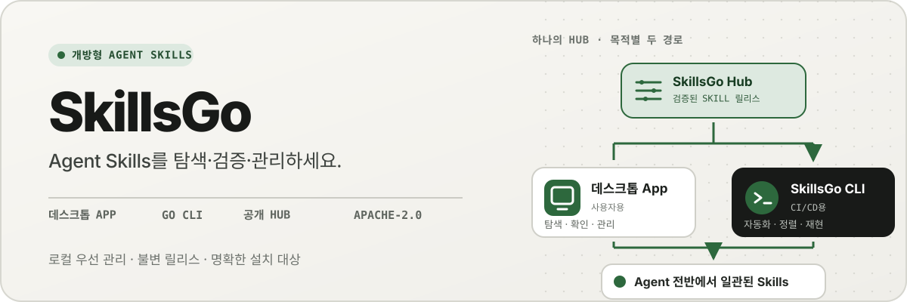
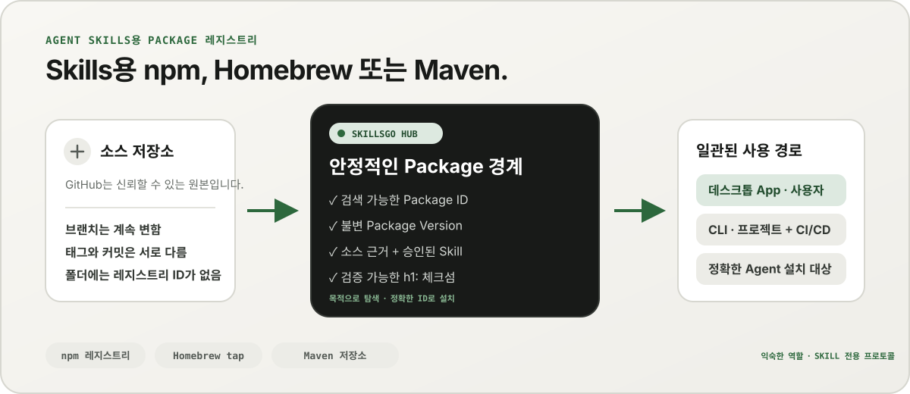
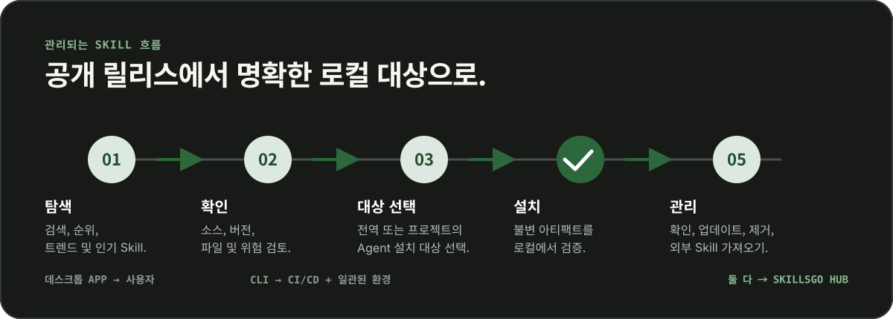

<p align="center">
  
</p>

**Agent Skills를 위한 하나의 워크플로 —** 소스를 검증할 수 있는 Skill을 찾고, 변경 불가능한 버전을 고정한 뒤, 데스크톱 App이나 자동화에 적합한 CLI로 동일한 설치를 관리합니다.

<!-- README-I18N:START -->

  <p>
    <a href="../../README.md">English</a> ·
    <a href="./README.zh-CN.md">简体中文</a> ·
    <a href="./README.zh-TW.md">繁體中文（台灣）</a> ·
    <a href="./README.zh-HK.md">繁體中文（香港）</a> ·
    <a href="./README.ja.md">日本語</a> ·
    <strong>한국어</strong> ·
    <a href="./README.fr.md">Français</a> ·
    <a href="./README.de.md">Deutsch</a> ·
    <a href="./README.it.md">Italiano</a> ·
    <a href="./README.es.md">Español</a> ·
    <a href="./README.pt-BR.md">Português (Brasil)</a> ·
    <a href="./README.ru.md">Русский</a> ·
    <a href="./README.ar.md">العربية</a> ·
    <a href="./README.hi.md">हिन्दी</a> ·
    <a href="./README.id.md">Bahasa Indonesia</a> ·
    <a href="./README.tr.md">Türkçe</a> ·
    <a href="./README.nl.md">Nederlands</a> ·
    <a href="./README.pl.md">Polski</a> ·
    <a href="./README.th.md">ไทย</a> ·
    <a href="./README.vi.md">Tiếng Việt</a> ·
    <a href="./README.ms.md">Bahasa Melayu</a> ·
    <a href="./README.sv.md">Svenska</a> ·
    <a href="./README.uk.md">Українська</a>
  </p>
<!-- README-I18N:END -->

SkillsGo는 소스를 검증할 수 있는 Agent Skills 생태계로, 검색과 버전 관리부터 실제 운영까지 지원합니다. 데스크톱 App으로 Skill을 탐색하고 관리하고, CLI로 설치를 재현 가능하게 만들며, Hub를 변경 불가능한 Package Version의 공유 또는 자체 호스팅 배포 원본으로 사용할 수 있습니다.

> **Agent Skills용 npm, Homebrew 또는 Maven이라고 생각하면 됩니다.** GitHub는 계속해서 코드의 신뢰할 수 있는 원본입니다. SkillsGo Hub는 지원되는 소스를 검색 가능하고 변경 불가능하며 체크섬으로 검증할 수 있는 Skill Package로 변환해, App과 CLI가 여러 Agent와 시스템에 일관되게 설치할 수 있도록 합니다.

<p align="center">
  
</p>

**계속 변하는 소스에서 안정적인 종속성으로 —** Hub는 사용자가 목적에 맞는 Skill을 찾게 해 주는 동시에, 시스템에는 정확한 Package ID, 변경 불가능한 버전, 승인된 Skill 목록 및 체크섬을 제공합니다.

## 운영 모델을 선택하세요

| 방식 | 적합한 용도 | SkillsGo가 제공하는 기능 |
| --- | --- | --- |
| **개인용 App** | 대화식으로 Skill 검색 및 관리 | 소스 증거, 지원되는 Agent 대상, 프로젝트 및 글로벌 라이브러리, 안전한 업데이트 미리 보기 및 로컬 컨텍스트 공간 통찰력 |
| **CLI 및 CI/CD** | 반복 가능한 개발자 환경 및 자동화 | 기계 판독 가능 명령, 정확한 Skill 선택, `skills.yaml`, `skills-lock.yaml`, 체크섬 확인, 오프라인 캐시 복구 및 범위 인식 업데이트 |
| **자체 호스팅 Hub** | 제어된 Skill 카탈로그가 필요한 팀 | 동일한 공용 프로토콜, 변경 불가능한 Package Version, 검색 가능한 메타데이터, 정적 Git 아티팩트 및 선택적 액세스 제어를 갖춘 구성 가능한 Hub Origin |

비교는 프로토콜 호환성이 아닌 역할에 관한 것입니다.

| 친숙한 모델 | SkillsGo Hub가 Agent Skills에 제공하는 기능 |
| --- | --- |
| **npm 레지스트리** | 변경되는 브랜치에서 알 수 없는 폴더를 복사하는 대신 검색 가능한 Package ID와 명시적인 불변 버전 제공 |
| **Homebrew 탭** | App 또는 CLI가 개발자 시스템 전체에서 사용할 수 있는 신뢰할 수 있는 단일 배포 원본 |
| **Maven 저장소** | 안정적인 좌표, 불변 아티팩트, 체크섬 및 잠금 가능한 종속성 해결 |
| **Skill 특정 레이어** | 소스 증거, 허용된 Skill 멤버십, 정확한 구성원 선택, 지원되는 Agent 메타데이터 및 설치 대상 |

Hub는 GitHub를 대체하거나 npm, Homebrew, Maven과의 호환성을 표방하지 않습니다. 다른 소프트웨어 생태계에서 익숙한 레지스트리와 배포의 신뢰성을 Agent Skills에도 제공합니다.

## 왜 SkillsGo인가?

- **설치 전 소스 증거** — 시스템을 변경하기 전에 소스 저장소, 불변 릴리스, 지원되는 Agent, 파일 및 렌더링된 `SKILL.md`를 검사합니다.
- **재현 가능한 환경** — 태그, 분기 또는 커밋을 한 번 해결하고 결과 불변 버전을 유지하며 엄격한 매니페스트 및 잠금을 통해 복원합니다.
- **하나의 Package, 명시적 구성원** — 정확한 Skill 이름 또는 경로와 이를 받을 Agent 대상을 선택하면서 완전한 Package Version을 배포합니다.
- **로컬 우선 안전** — 로컬 수정 사항을 보호하고 파생 상태를 재구성 가능하게 유지하며 Hub를 사용할 수 없을 때 로컬 인벤토리 작업을 계속합니다.
- **컨텍스트 사용량 분석** — 상주 Skill 이름과 설명의 문자 수를 추정하고 지난 45일 또는 90일 동안 호출이 감지되지 않은 Skill을 식별합니다. 이는 로컬 컨텍스트의 근사치이며 모델 과금 텔레메트리가 아닙니다.
- **두 개의 제품 인터페이스, 하나의 프로토콜** — 대화형 워크플로에는 App을 사용하고 자동화에는 CLI를 사용합니다. 둘 다 동일한 Hub 프로토콜을 따릅니다.

## App의 실제 작동 모습을 확인하세요

데스크톱 App은 검색, 소스 근거, 설치 대상 및 로컬 인벤토리를 하나의 직관적인 흐름으로 연결합니다. 개인 사용에는 계정이 필요하지 않습니다.

<p align="center">
  
</p>

**실시간 Hub 검색 —** 로그인하지 않고도 지속적으로 업데이트되는 카탈로그를 탐색할 수 있으므로 로컬 설치나 구성 변경 전에 유용한 Skill을 확인할 수 있습니다.

### 발견 및 검사

Skill 또는 소스 저장소로 검색하고, 순위 및 검색 결과를 탐색하고, 소스 저장소, 불변 릴리스, 지원되는 Agent, 번역된 요약 및 설치 전에 렌더링된 `SKILL.md`를 검사합니다.

<p align="center">
  
</p>

**소스 인식 검색 —** 기능이나 저장소별로 Skill을 찾고 해당 Package 맥락을 확인해, 고립된 코드 조각을 그대로 신뢰하는 대신 관련 Skill을 비교할 수 있습니다.

<p align="center">
  
</p>

**설치 전 확인 —** 변경 불가능한 버전, 지원되는 Agent, 소스 파일 및 렌더링된 지침을 먼저 검토해 공급망 위험과 의도하지 않은 로컬 환경 변경을 줄입니다.

### 로컬 Skill 설치 및 관리

전역 또는 선택한 프로젝트에 설치하고, 동일한 Skill 릴리스를 받을 Agent 대상을 선택한 뒤, Package 업데이트를 적용하기 전에 영향을 검토합니다.

<p align="center">
  
</p>

**명시적인 설치 대상 —** 전역 또는 프로젝트 범위와 Skill을 받을 정확한 Agent를 선택해, 파일을 직접 복사하지 않고도 하나의 릴리스를 일관되게 유지합니다.

<p align="center">
  
</p>

**영향을 확인하는 업데이트 —** 업데이트를 적용하기 전에 버전 변경과 제거될 Skill을 확인해 종속성 변경을 의도적이고 복구 가능한 상태로 유지합니다.

<p align="center">
  
</p>

**글로벌 라이브러리 통찰력 —** 하나의 인벤토리에서 45/90일 로컬 사용량, 컨텍스트 공간 및 Agent 가시성을 비교하여 사용되지 않은 Skill 및 상주 컨텍스트를 더 쉽게 관리할 수 있습니다.

<p align="center">
  
</p>

**프로젝트 범위 관리 —** 동일한 인벤토리를 하나의 프로젝트로 좁혀 설치 항목, 사용 근거 및 관리되지 않는 Skill을 전역 정보의 방해 없이 검토할 수 있습니다.

## CLI 및 Hub를 통한 버전 배포

CLI와 Hub는 SkillsGo의 엔지니어링 인터페이스입니다. Hub는 계속 변하는 소스 저장소를 안정적인 종속성 경계로 변환합니다. Package는 배포 단위이며, 각 Package Version은 하나의 소스 리비전과 승인된 전체 Skill 목록의 변경 불가능한 스냅샷입니다. 사용자는 목적에 맞는 Skill을 찾고, 시스템은 정확한 식별자로 설치할 수 있습니다.

```yaml
dependencies:
  github.com/acme/skills:
    version: v1.2.3
    skills: [review, design]
    agents: [codex, claude-code]
```

`skills.yaml`은 원하는 Package 버전, 선택한 멤버 및 Agent 대상을 기록합니다. 생성된 `skills-lock.yaml`은 해당 버전을 Package `h1:` 체크섬에 연결합니다. 새로운 시스템이나 CI 작업은 변경되는 브랜치를 따라가는 대신 동일한 설치 흐름을 실행하고 같은 아티팩트를 검증할 수 있습니다.

```sh
# Discover and inspect
npx skillsgo find typescript
npx skillsgo show github.com/acme/skills@v1.2.3

# Add exact members to a project or the global scope
npx skillsgo add github.com/acme/skills@v1.2.3 \
  --skill review --agent codex

# Restore, preview, and update reproducibly
npx skillsgo install
npx skillsgo update --dry-run
npx skillsgo update --yes
```

동일한 명령이 다른 Hub Origin을 대상으로 할 수 있습니다.

```sh
npx skillsgo add github.com/acme/skills@v1.2.3 \
  --hub https://hub.example.com \
  --skill review --agent codex
```

## 팀을 위한 자체 호스팅 Hub

조직은 공식 서비스와 동일한 SkillsGo 프로토콜을 구현하는 Hub Origin을 실행할 수 있습니다. 이를 통해 승인된 카탈로그를 관리하고, Package Version 기록을 변경할 수 없도록 유지하고, 검색 가능한 메타데이터를 노출하고, 검증된 아티팩트를 제공하고, App 또는 CLI를 하나의 제어된 원본으로 지정할 수 있습니다.

```text
Source repository
       │
       ▼
Hub Package Version ── immutable metadata, artifact, and h1: sum
       │
       ├── SkillsGo App (interactive discovery and management)
       └── SkillsGo CLI (projects, CI/CD, and repeatable installs)
```

공개 Hub 계약은 현재 지원되는 공개 Skill 소스에 중점을 두고 있습니다. 개인용 Hub는 승인된 Package의 제어된 배포를 제공할 수 있습니다. 개인 소스 수집 및 기업 ID 통합은 클라이언트에 숨겨진 가정이 아닌 별도의 배포 기능입니다.

## 작동 방식

<p align="center">
  
</p>

**변경 불가능한 공유 프로토콜 —** Hub는 소스 증거를 한 번 확인하는 반면, App 및 CLI는 동일한 Package Version 및 체크섬을 사용하여 대화형 및 자동 설치에 동일한 결과를 제공합니다.

1. 지원되는 소스는 변경 불가능한 하나의 Package Version로 확인됩니다.
2. Hub는 Package 메타데이터, 승인된 Skill 목록, 정적 Git 아티팩트 및 검증 가능한 Package 체크섬을 게시합니다.
3. App 또는 CLI는 동일한 프로토콜을 읽고 사용자가 정확한 구성원, 범위 및 Agent 대상을 선택할 수 있도록 합니다.
4. CLI는 매니페스트와 잠금 파일에서 보호된 로컬 Package 트리와 Agent별 설치 구조를 생성합니다.
5. 업데이트는 변경할 수 없는 새로운 버전을 해결하고 로컬 상태를 변경하기 전에 영향을 보여줍니다.

## 모노레포 탐색

```text
skillsgo/
├── app/       Flutter desktop client and user experience
├── cli/       Go CLI, local state, and Skill execution engine
├── hub/       Public Hub service and reusable self-host runtime
├── protocol/  Shared executable contracts used by CLI and Hub
├── web/       Public product, Hub, and documentation surface
└── e2e/       Cross-product CLI/Hub and desktop journeys
```

제품 경계 및 도메인 언어는 [`CONTEXT-MAP.md`](../../CONTEXT-MAP.md)를 읽어보세요. 공개 릴리스 및 아티팩트 모델은 [`docs/release-design.md`](../release-design.md)에 문서화되어 있습니다.

## 로컬에서 실행

통합 개발 토폴로지는 현재 macOS를 대상으로 하며 Flutter, Go, Docker, [Process Compose](https://github.com/F1bonacc1/process-compose) 및 [Air](https://github.com/air-verse/air)가 필요합니다.

```sh
make dev
```

그러면 하나의 감독 세션에서 PostgreSQL, 로컬 Hub, 새로 빌드된 CLI 및 Flutter 데스크톱 App가 시작됩니다. 구성된 모든 작업공간을 검증하려면 다음을 수행하십시오.

```sh
make test
```

각 작업공간에 대해 집중된 진입점을 사용할 수 있습니다.

| 작업공간 | 개발 또는 검증 |
| --- | --- |
| App | `cd app && flutter run -d macos` |
| CLI | `cd cli && go test ./...` |
| Hub | `cd hub && go test ./...` |
| 프로토콜 | `cd protocol && go test ./...` |
| 웹 | `cd web && pnpm install && pnpm dev` |

제품 동작을 변경하기 전에 [CONTRIBUTING.md](../../CONTRIBUTING.md)를 참조하세요.

## 프로젝트 현황

SkillsGo는 초기 릴리스 개발이 활발히 진행 중입니다. App, CLI, Hub 및 프로토콜은 별도의 릴리스 단위로 개발되는 반면, 패키지 관리자 출력 및 기본 아카이브는 동일한 검증된 CLI 빌드 매트릭스에서 조립됩니다. 지원되는 대상, 아티팩트 무결성, 업데이트 동작 및 공급망 요구 사항은 [릴리스 디자인](../release-design.md)을 참조하세요.

## 커뮤니티

- 질문, 문제 해결 및 초기 아이디어가 필요하면 [GitHub 토론](https://github.com/skillsgo/skillsgo/discussions)을 사용하세요.
- 재현 가능한 버그, 구체적인 기능 요청 및 문서 문제에 대해서는 집중된 [문제 양식](https://github.com/skillsgo/skillsgo/issues/new/choose)을 사용하십시오.
- 취약점을 비공개로 보고하려면 [SECURITY.md](../../SECURITY.md)를 따르세요.
- 참여에는 [행동강령](../../CODE_OF_CONDUCT.md) 및 [거버넌스 모델](../../GOVERNANCE.md)이 적용됩니다.

## 라이선스

SkillsGo는 [Apache 라이선스 2.0](../../LICENSE)에 따라 라이선스가 부여됩니다.

Hub에는 [Athens](https://github.com/gomods/athens)에서 파생된 코드가 포함되어 있으며, 이는 Athens MIT 라이센스 및 귀속 고지 사항의 적용을 받습니다. [`NOTICE`](../../NOTICE) 및 [`THIRD_PARTY_LICENSES/ATHENS-LICENSE`](../../THIRD_PARTY_LICENSES/ATHENS-LICENSE)를 참조하세요.
