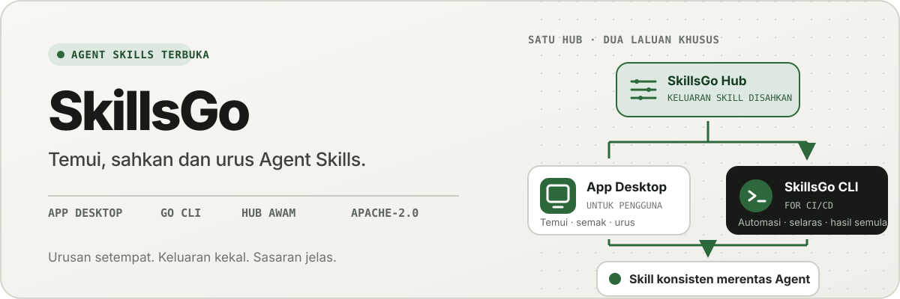
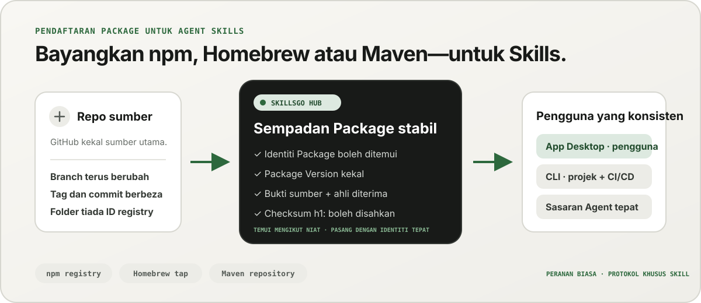
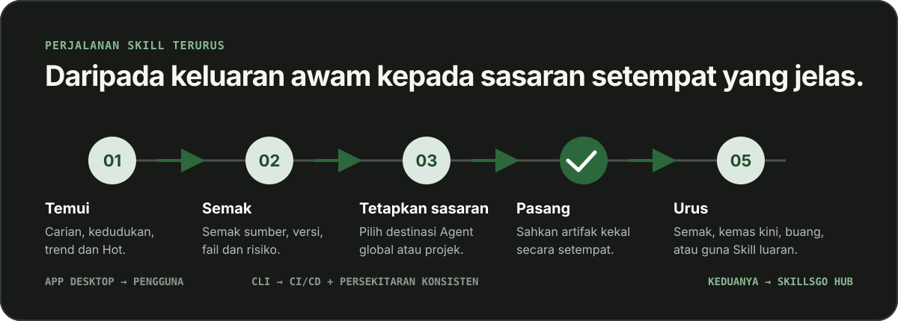

<p align="center">
  
</p>

**Satu aliran kerja untuk Agent Skills —** Temui Skill yang boleh disahkan sumber, pin versi tidak boleh ubah dan kendalikan pemasangan yang sama melalui desktop App atau CLI yang mesra automasi.

<!-- README-I18N:START -->

  <p>
    <a href="../../README.md">English</a> ·
    <a href="./README.zh-CN.md">简体中文</a> ·
    <a href="./README.zh-TW.md">繁體中文（台灣）</a> ·
    <a href="./README.zh-HK.md">繁體中文（香港）</a> ·
    <a href="./README.ja.md">日本語</a> ·
    <a href="./README.ko.md">한국어</a> ·
    <a href="./README.fr.md">Français</a> ·
    <a href="./README.de.md">Deutsch</a> ·
    <a href="./README.it.md">Italiano</a> ·
    <a href="./README.es.md">Español</a> ·
    <a href="./README.pt-BR.md">Português (Brasil)</a> ·
    <a href="./README.ru.md">Русский</a> ·
    <a href="./README.ar.md">العربية</a> ·
    <a href="./README.hi.md">हिन्दी</a> ·
    <a href="./README.id.md">Bahasa Indonesia</a> ·
    <a href="./README.tr.md">Türkçe</a> ·
    <a href="./README.nl.md">Nederlands</a> ·
    <a href="./README.pl.md">Polski</a> ·
    <a href="./README.th.md">ไทย</a> ·
    <a href="./README.vi.md">Tiếng Việt</a> ·
    <strong>Bahasa Melayu</strong> ·
    <a href="./README.sv.md">Svenska</a> ·
    <a href="./README.uk.md">Українська</a>
  </p>
<!-- README-I18N:END -->

SkillsGo ialah ekosistem yang boleh disahkan sumber untuk menemui, membuat versi dan mengendalikan Agent Skills. Gunakan App desktop untuk meneroka dan mengurus Skills, CLI untuk membuat pemasangan boleh dibuat semula dan Hub sebagai asal pengedaran dikongsi atau dihoskan sendiri untuk Package Version yang tidak berubah.

> **Bayangkan npm, Homebrew atau Maven—tetapi untuk Agent Skills.** GitHub kekal sebagai sumber kebenaran untuk kod; SkillsGo Hub menukar sumber yang disokong menjadi Package Skill yang boleh ditemui, tidak berubah dan boleh disahkan melalui checksum, supaya App dan CLI boleh memasangnya secara konsisten merentas Agent dan mesin.

<p align="center">
  
</p>

**Daripada mengalihkan sumber kepada kebergantungan yang stabil —** Hub memberikan orang penemuan berasaskan niat sambil memberikan mesin identiti Package yang tepat, versi tidak berubah, keahlian Skill yang diterima dan jumlah semak.

## Pilih model pengendalian anda

| Mod | Terbaik untuk | Apa yang SkillsGo sediakan |
| --- | --- | --- |
| **App Peribadi** | Menemui dan mengurus Skill secara interaktif | Bukti sumber, sasaran Agent yang disokong, projek dan Perpustakaan global, pratonton kemas kini selamat dan cerapan jejak konteks setempat |
| **CLI dan CI/CD** | Persekitaran pembangun boleh berulang dan automasi | Arahan yang boleh dibaca mesin, pemilihan Skill yang tepat, `skills.yaml`, `skills-lock.yaml`, pengesahan semak, pemulihan cache luar talian dan kemas kini yang sedar skop |
| **Hub yang dihoskan sendiri** | Pasukan yang memerlukan katalog Skill terkawal | Asal Hub yang boleh dikonfigurasikan dengan protokol awam yang sama, Package Version yang tidak berubah, metadata yang boleh dicari, artifak Git statik dan kawalan akses pilihan |

Perbandingan adalah mengenai peranan, bukan keserasian protokol:

| Model biasa | Perkara yang dibawa oleh SkillsGo Hub kepada Agent Skills |
| --- | --- |
| **Pendaftaran npm** | Identiti Package yang boleh dicari dan versi tidak berubah yang jelas dan bukannya menyalin folder yang tidak diketahui daripada cawangan yang bergerak |
| **Homebrew tap** | Satu asal pengedaran yang dipercayai yang boleh digunakan oleh App atau CLI merentas mesin pembangun |
| **Repositori Maven** | Koordinat stabil, artifak tidak berubah, jumlah semak dan resolusi kebergantungan boleh dikunci |
| **Lapisan khusus Skill** | Bukti sumber, keahlian Skill yang diterima, pemilihan ahli yang tepat, metadata Agent yang disokong dan sasaran pemasangan |

Hub tidak menggantikan GitHub atau berpura-pura serasi dengan npm, Homebrew atau Maven. Ia memberikan Agent Skills jaminan pendaftaran dan pengedaran ekosistem tersebut yang biasa digunakan untuk jenis perisian lain.

## Mengapa SkillsGo

- **Bukti sumber sebelum pemasangan** — periksa repositori sumber, keluaran tidak berubah, Agent yang disokong, fail dan `SKILL.md` yang dipaparkan sebelum mengubah mesin.
- **Persekitaran boleh dihasilkan semula** — selesaikan teg, cawangan atau komit sekali, kekalkan versi tidak berubah yang terhasil dan pulihkannya melalui manifes dan kunci yang ketat.
- **Satu Package, ahli eksplisit** — mengedarkan Package Version yang lengkap sambil memilih nama atau laluan Skill yang tepat dan sasaran Agent yang sepatutnya menerimanya.
- **Keselamatan diutamakan tempatan** — lindungi pengubahsuaian tempatan, pastikan keadaan terbitan boleh dibina semula dan teruskan kerja inventori tempatan apabila Hub tidak tersedia.
- **Cerapan jejak konteks** — anggarkan jejak watak nama dan perihalan Skill pemastautin, kemudian kenal pasti Skill tanpa panggilan yang diperhatikan dalam tempoh 45 atau 90 hari yang lalu. Ini ialah proksi konteks tempatan, bukan telemetri pengebilan model.
- **Dua antara muka produk, satu protokol** — gunakan App untuk aliran kerja interaktif dan CLI untuk automasi; kedua-duanya bercakap dengan kontrak Hub yang sama.

## Lihat App beraksi

Desktop App menghubungkan penemuan, bukti sumber, sasaran pemasangan dan inventori tempatan dalam satu perjalanan mesra manusia. Penggunaan peribadi adalah tanpa akaun.

<p align="center">
  
</p>

**Penemuan Hub langsung —** Semak imbas katalog yang dikemas kini secara berterusan tanpa log masuk, jadi Skill yang berguna kelihatan sebelum sebarang pemasangan atau perubahan konfigurasi setempat.

### Temui dan semak

Cari mengikut Skill atau repositori sumber, terokai kedudukan dan hasil carian, dan periksa repositori sumber, keluaran tidak boleh ubah, Agent yang disokong, ringkasan diterjemahkan dan menghasilkan `SKILL.md` sebelum pemasangan.

<p align="center">
  
</p>

**Carian sedar sumber —** Cari Skill mengikut keupayaan atau repositori dan lihat konteks Package mereka, membantu anda membandingkan Skill yang berkaitan dan bukannya mempercayai coretan terpencil.

<p align="center">
  
</p>

**Periksa sebelum memasang —** Semak versi tidak berubah, Agent yang disokong, fail sumber dan arahan yang diberikan terlebih dahulu, mengurangkan kejutan rantaian bekalan dan perubahan mesin yang tidak disengajakan.

### Pasang dan tadbir Skill tempatan

Pasang secara global atau ke dalam projek terpilih, pilih sasaran Agent yang sepatutnya menerima keluaran Skill yang sama dan semak akibat kemas kini Package sebelum menggunakannya.

<p align="center">
  
</p>

**Sasaran pemasangan eksplisit —** Pilih skop global atau projek dan Agent yang tepat yang menerima Skill, memastikan satu keluaran konsisten tanpa menyalin fail dengan tangan.

<p align="center">
  
</p>

**Kemas kini menyedari kesan —** Lihat peralihan versi dan mengalih keluar Skill sebelum menggunakan kemas kini, jadi perubahan pergantungan kekal disengajakan dan boleh dipulihkan.

<p align="center">
  
</p>

**Cerapan Perpustakaan Global —** Bandingkan penggunaan tempatan 45/90 hari, jejak konteks dan keterlihatan Agent dalam satu inventori, menjadikan Skill dan konteks pemastautin yang tidak digunakan lebih mudah untuk ditadbir.

<p align="center">
  
</p>

**Tadbir urus berskop projek —** Sempitkan inventori yang sama kepada satu projek, jadi pemasangan, bukti penggunaan dan Skill yang tidak terurus boleh disemak tanpa bunyi global.

## Pengedaran versi melalui CLI dan Hub

CLI dan Hub membentuk permukaan kejuruteraan SkillsGo. Hub menukar repositori sumber bergerak menjadi sempadan pergantungan yang stabil: Package ialah unit pengedaran, dan setiap Package Version ialah petikan tidak berubah bagi satu semakan sumber dan keahlian Skill yang diterima sepenuhnya. Ini membolehkan orang ramai menemui dengan niat sementara mesin memasang mengikut identiti yang tepat.

```yaml
dependencies:
  github.com/acme/skills:
    version: v1.2.3
    skills: [review, design]
    agents: [codex, claude-code]
```

`skills.yaml` merekodkan versi Package, ahli terpilih dan sasaran Agent yang dikehendaki. `skills-lock.yaml` yang dijana mengikat versi itu kepada jumlah Package `h1:`nya. Mesin baharu atau kerja CI boleh menjalankan aliran pemasangan yang sama dan mengesahkan artifak yang sama dan bukannya mengikuti cawangan yang bergerak.

```sh
# Discover and inspect
npx skillsgo find typescript
npx skillsgo show github.com/acme/skills@v1.2.3

# Add exact members to a project or the global scope
npx skillsgo add github.com/acme/skills@v1.2.3 \
  --skill review --agent codex

# Restore, preview, and update reproducibly
npx skillsgo install
npx skillsgo update --dry-run
npx skillsgo update --yes
```

Perintah yang sama boleh menyasarkan Asal Hub yang lain:

```sh
npx skillsgo add github.com/acme/skills@v1.2.3 \
  --hub https://hub.example.com \
  --skill review --agent codex
```

## Hub yang dihoskan sendiri untuk pasukan

Organisasi boleh menjalankan Hub Origin yang melaksanakan protokol SkillsGo yang sama seperti perkhidmatan rasmi. Ini memungkinkan untuk menyusun katalog yang diluluskan, mengekalkan sejarah Package Version tidak berubah, mendedahkan metadata yang boleh dicari, menyajikan artifak yang disahkan dan menghalakan App atau CLI pada satu asal terkawal.

```text
Source repository
       │
       ▼
Hub Package Version ── immutable metadata, artifact, and h1: sum
       │
       ├── SkillsGo App (interactive discovery and management)
       └── SkillsGo CLI (projects, CI/CD, and repeatable installs)
```

Kontrak Hub awam pada masa ini menumpukan pada Sumber Skill awam yang disokong. Hub persendirian boleh menyediakan pengedaran terkawal bagi Package yang diluluskan; pengambilan sumber persendirian dan integrasi identiti perusahaan ialah keupayaan penggunaan yang berasingan, bukan andaian tersembunyi dalam klien.

## Bagaimana ia berfungsi

<p align="center">
  
</p>

**Protokol tidak berubah yang dikongsi —** Hub menyelesaikan bukti sumber sekali, manakala App dan CLI menggunakan Package Version dan checksum yang sama, memberikan pemasangan interaktif dan automatik hasil yang sama.

1. Sumber yang disokong diselesaikan kepada satu Package Version yang tidak boleh diubah.
2. Hub menerbitkan metadata Package, menerima keahlian Skill, artifak Git statik dan jumlah Package yang boleh disahkan.
3. App atau CLI membaca protokol yang sama dan membenarkan pengguna memilih ahli, skop dan sasaran Agent yang tepat.
4. CLI mewujudkan pokok Package tempatan yang dilindungi dan unjuran Agent daripada manifes dan kunci.
5. Kemas kini menyelesaikan versi tidak berubah baharu dan menunjukkan kesan sebelum menukar keadaan setempat.

## Terokai monorepo

```text
skillsgo/
├── app/       Flutter desktop client and user experience
├── cli/       Go CLI, local state, and Skill execution engine
├── hub/       Public Hub service and reusable self-host runtime
├── protocol/  Shared executable contracts used by CLI and Hub
├── web/       Public product, Hub, and documentation surface
└── e2e/       Cross-product CLI/Hub and desktop journeys
```

Baca [`CONTEXT-MAP.md`](../../CONTEXT-MAP.md) untuk mengetahui sempadan produk dan bahasa domain. Keluaran awam dan model artifak didokumenkan dalam [`docs/release-design.md`](../release-design.md).

## Jalankan secara tempatan

Topologi pembangunan bersatu pada masa ini menyasarkan macOS dan memerlukan Flutter, Go, Docker, [Process Compose](https://github.com/F1bonacc1/process-compose) dan [Air](https://github.com/air-verse/air).

```sh
make dev
```

Ini memulakan PostgreSQL, Hub tempatan, CLI yang baru dibina dan desktop Flutter App di bawah satu sesi yang diselia. Untuk mengesahkan semua ruang kerja yang dikonfigurasikan:

```sh
make test
```

Titik masuk terfokus tersedia untuk setiap ruang kerja:

| Ruang kerja | Pembangunan atau pengesahan |
| --- | --- |
| App | `cd app && flutter run -d macos` |
| CLI | `cd cli && go test ./...` |
| Hub | `cd hub && go test ./...` |
| Protokol | `cd protocol && go test ./...` |
| Web | `cd web && pnpm install && pnpm dev` |

Lihat [CONTRIBUTING.md](../../CONTRIBUTING.md) sebelum menukar tingkah laku produk.

## Status projek

SkillsGo sedang dalam pembangunan keluaran awal yang aktif. App, CLI, Hub dan Protokol dibangunkan sebagai unit keluaran berasingan, manakala output pengurus pakej dan arkib asli dipasang daripada matriks binaan CLI yang disahkan sama. Lihat [reka bentuk keluaran](../release-design.md) untuk sasaran yang disokong, integriti artifak, gelagat kemas kini dan keperluan rantaian bekalan.

## Komuniti

- Gunakan [GitHub Discussions](https://github.com/skillsgo/skillsgo/discussions) untuk soalan, penyelesaian masalah dan idea awal.
- Gunakan [borang isu](https://github.com/skillsgo/skillsgo/issues/new/choose) terfokus untuk pepijat yang boleh dihasilkan semula, permintaan ciri konkrit dan masalah dokumentasi.
- Ikuti [SECURITY.md](../../SECURITY.md) untuk melaporkan kelemahan secara tertutup.
- Penyertaan dikawal oleh [Kod Tatalaku](../../CODE_OF_CONDUCT.md) dan [model tadbir urus](../../GOVERNANCE.md).

## Lesen

SkillsGo dilesenkan di bawah [Lesen Apache 2.0](../../LICENSE).

Hub mengandungi kod yang diperoleh daripada [Athens](https://github.com/gomods/athens), yang masih tertakluk pada Lesen MIT Athens dan notis atribusi. Lihat [`NOTICE`](../../NOTICE) dan [`THIRD_PARTY_LICENSES/ATHENS-LICENSE`](../../THIRD_PARTY_LICENSES/ATHENS-LICENSE).
