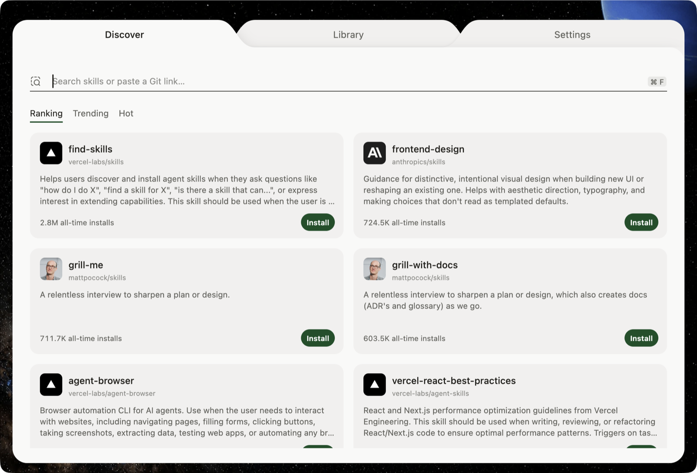
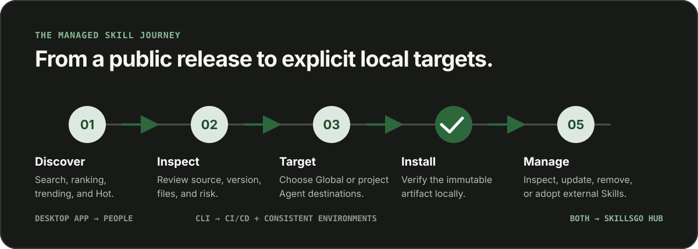

<p align="center">
  
</p>

<!-- README-I18N:START -->

  <p>
    <a href="../../README.md">English</a> ·
    <a href="./README.zh-CN.md">简体中文</a> ·
    <a href="./README.zh-TW.md">繁體中文（台灣）</a> ·
    <a href="./README.zh-HK.md">繁體中文（香港）</a> ·
    <a href="./README.ja.md">日本語</a> ·
    <a href="./README.ko.md">한국어</a> ·
    <a href="./README.fr.md">Français</a> ·
    <a href="./README.de.md">Deutsch</a> ·
    <a href="./README.it.md">Italiano</a> ·
    <a href="./README.es.md">Español</a> ·
    <a href="./README.pt-BR.md">Português (Brasil)</a> ·
    <a href="./README.ru.md">Русский</a> ·
    <a href="./README.ar.md">العربية</a> ·
    <a href="./README.hi.md">हिन्दी</a> ·
    <a href="./README.id.md">Bahasa Indonesia</a> ·
    <a href="./README.tr.md">Türkçe</a> ·
    <a href="./README.nl.md">Nederlands</a> ·
    <a href="./README.pl.md">Polski</a> ·
    <a href="./README.th.md">ไทย</a> ·
    <a href="./README.vi.md">Tiếng Việt</a> ·
    <strong>Bahasa Melayu</strong> ·
    <a href="./README.sv.md">Svenska</a> ·
    <a href="./README.uk.md">Українська</a>
  </p>
<!-- README-I18N:END -->

SkillsGo ialah ekosistem terbuka untuk menemui dan mengurus Agent Skills. App desktop memberikan pengguna cara visual untuk menemui dan mengurus Skills, manakala CLI membawa katalog Hub yang sama ke CI/CD dan aliran kerja persekitaran yang boleh dihasilkan semula.

## Lihat SkillsGo berfungsi

<p align="center">
  
</p>

App desktop menggabungkan penemuan, bukti sumber, sasaran pemasangan dan inventori setempat dalam satu perjalanan yang mudah difahami. Penggunaan peribadi tidak memerlukan akaun.

### Temui melalui Hub

Cari mengikut Skill atau repositori sumber, terokai kedudukan langsung dan pasang satu Skill atau keseluruhan koleksi.

<p align="center">
  
</p>

### Semak sebelum memasang

Sebelum membuat perubahan setempat, semak repositori sumber, keluaran yang tidak boleh diubah, Agents yang disokong, ringkasan terjemahan dan `SKILL.md` yang telah dipaparkan.

<p align="center">
  
</p>

### Pilih dengan tepat lokasi pemasangan Skills

Pasang secara global atau ke projek yang dipilih, kemudian tentukan Agents yang perlu menerima keluaran Skill yang sama.

<p align="center">
  
</p>

### Urus satu Library setempat

Semak imbas Skills yang dipasang mengikut skop global atau projek, cari dalam inventori dan tapis mengikut Agent.

<p align="center">
  
</p>

### Lihat kesan sebelum mengemas kini

Lihat peralihan versi dan Skills yang akan dibuang sebelum menggunakan kemas kini repositori.

<p align="center">
  
</p>

<details>
  <summary><strong>Lihat Library dalam skop projek</strong></summary>
  <br>
  <p align="center">
    
  </p>
</details>

## Mengapa SkillsGo

- **Bukti sumber sebenar** — semak identiti repositori, versi, `SKILL.md`, fail dan risiko sebelum pemasangan.
- **Sasaran Agent yang jelas** — pasang Skills secara global atau dalam skop projek untuk Agents terpilih tanpa menyalin fail secara manual.
- **Pengedaran yang boleh disahkan** — anggap keluaran repositori sumber sebagai unit pengedaran yang tidak boleh diubah.
- **Pengurusan setempat diutamakan** — semak dan urus inventori setempat dengan selamat walaupun Hub tidak tersedia.
- **Dua antara muka khusus** — gunakan App untuk aliran peribadi interaktif dan CLI untuk CI/CD, automasi serta persekitaran Skill yang konsisten.

## Cara ia berfungsi

<p align="center">
  
</p>

Hub awam ialah sumber bersama untuk identiti Skills, keluaran yang tidak boleh diubah, metadata, carian dan penemuan. App menghubungkan pengguna kepada Hub melalui aliran visual; CLI menghubungkan automasi dan CI/CD kepada Hub yang sama supaya pilihan Skills kekal konsisten antara persekitaran.

## Terokai monorepo

```text
skillsgo/
├── app/       Flutter desktop client and user experience
├── cli/       Go CLI and local Skill execution engine
├── hub/       Public Skill Hub service and reusable runtime
├── protocol/  Shared executable contracts used by CLI and Hub
├── web/       Public product, Hub, and documentation surface
└── e2e/       Cross-product CLI/Hub and desktop journeys
```

Baca [`CONTEXT-MAP.md`](../../CONTEXT-MAP.md) untuk sempadan produk dan bahasa domain.

## Jalankan secara setempat

Topologi pembangunan bersepadu kini menyasarkan macOS dan memerlukan Flutter, Go, Docker, [Process Compose](https://github.com/F1bonacc1/process-compose) dan [Air](https://github.com/air-verse/air).

```bash
make dev
```

Perintah ini memulakan PostgreSQL, Hub setempat, CLI yang baru dibina dan App desktop Flutter dalam satu sesi terselia. Untuk mengesahkan semua ruang kerja yang dikonfigurasi:

```bash
make test
```

Setiap ruang kerja juga mempunyai titik masuk tersendiri:

| Ruang kerja | Pembangunan atau pengesahan |
| --- | --- |
| App | `cd app && flutter run -d macos` |
| CLI | `cd cli && go test ./...` |
| Hub | `cd hub && go test ./...` |
| Protocol | `cd protocol && go test ./...` |
| Web | `cd web && pnpm install && pnpm dev` |

Baca [CONTRIBUTING.md](../../CONTRIBUTING.md) sebelum mengubah tingkah laku produk.

## Status projek

SkillsGo sedang menyediakan keluaran pertamanya. Saluran keluaran Hub ditentukan terlebih dahulu; keluaran App yang ditandatangani dan dinotari serta pengedaran CLI kendiri mengikut syarat kesediaan masing-masing. Lihat [reka bentuk keluaran](../release-design.md) untuk unit keluaran yang disokong, integriti artifak dan keperluan rantaian bekalan.

## Komuniti

- Gunakan [GitHub Discussions](https://github.com/skillsgo/skillsgo/discussions) untuk soalan, penyelesaian masalah dan idea awal.
- Gunakan [borang issue](https://github.com/skillsgo/skillsgo/issues/new/choose) khusus untuk pepijat yang boleh dihasilkan semula, permintaan ciri yang jelas dan masalah dokumentasi.
- Ikuti [SECURITY.md](../../SECURITY.md) untuk melaporkan kerentanan secara peribadi.
- Penyertaan tertakluk pada [Tatakelakuan](../../CODE_OF_CONDUCT.md) dan [model tadbir urus](../../GOVERNANCE.md).

## Lesen

SkillsGo dilesenkan di bawah [Apache License 2.0](../../LICENSE).

Hub mengandungi kod yang berasal daripada [Athens](https://github.com/gomods/athens), yang kekal tertakluk pada Athens MIT License dan notis atribusinya. Lihat [`NOTICE`](../../NOTICE) dan [`THIRD_PARTY_LICENSES/ATHENS-LICENSE`](../../THIRD_PARTY_LICENSES/ATHENS-LICENSE).
