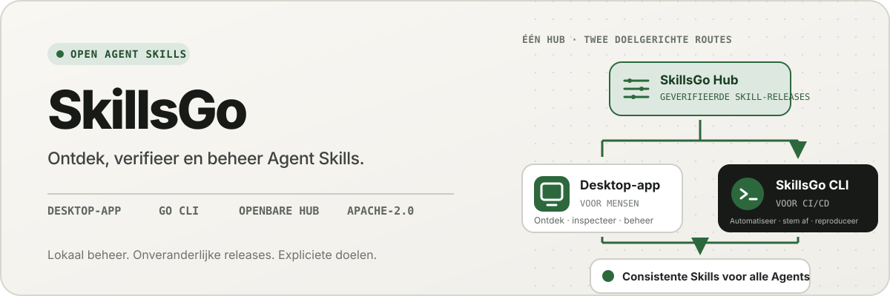
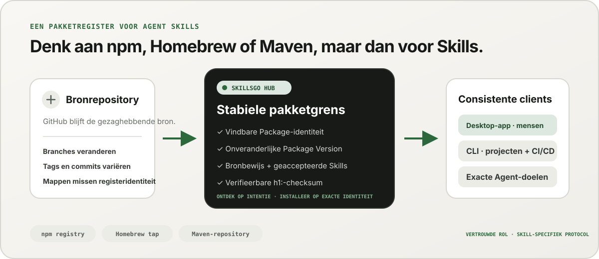
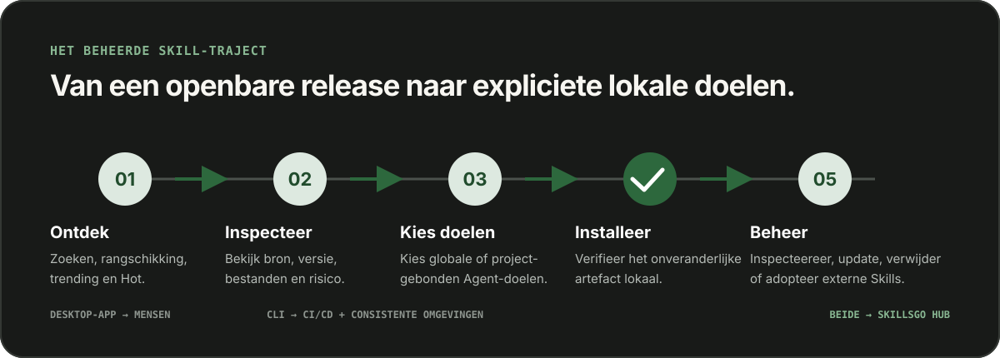

<p align="center">
  
</p>

**Eén workflow voor Agent Skills —** Ontdek bronverifieerbare Skills, pin onveranderlijke versies en beheer dezelfde installaties via een desktop-app of een automatiseringsvriendelijke CLI.

<!-- README-I18N:START -->

  <p>
    <a href="../../README.md">English</a> ·
    <a href="./README.zh-CN.md">简体中文</a> ·
    <a href="./README.zh-TW.md">繁體中文（台灣）</a> ·
    <a href="./README.zh-HK.md">繁體中文（香港）</a> ·
    <a href="./README.ja.md">日本語</a> ·
    <a href="./README.ko.md">한국어</a> ·
    <a href="./README.fr.md">Français</a> ·
    <a href="./README.de.md">Deutsch</a> ·
    <a href="./README.it.md">Italiano</a> ·
    <a href="./README.es.md">Español</a> ·
    <a href="./README.pt-BR.md">Português (Brasil)</a> ·
    <a href="./README.ru.md">Русский</a> ·
    <a href="./README.ar.md">العربية</a> ·
    <a href="./README.hi.md">हिन्दी</a> ·
    <a href="./README.id.md">Bahasa Indonesia</a> ·
    <a href="./README.tr.md">Türkçe</a> ·
    <strong>Nederlands</strong> ·
    <a href="./README.pl.md">Polski</a> ·
    <a href="./README.th.md">ไทย</a> ·
    <a href="./README.vi.md">Tiếng Việt</a> ·
    <a href="./README.ms.md">Bahasa Melayu</a> ·
    <a href="./README.sv.md">Svenska</a> ·
    <a href="./README.uk.md">Українська</a>
  </p>
<!-- README-I18N:END -->

SkillsGo is een bronverifieerbaar ecosysteem voor het ontdekken, versioneren en beheren van Agent Skills. Gebruik de desktop-app om Skills te verkennen en te beheren, de CLI om installaties reproduceerbaar te maken en de Hub als gedeelde of zelfgehoste distributiebron voor onveranderlijke Package Versions.

> **Denk aan npm, Homebrew of Maven, maar dan voor Agent Skills.** GitHub blijft de gezaghebbende bron voor de code; de SkillsGo Hub verandert ondersteunde bronnen in vindbare, onveranderlijke en met checksums verifieerbare Skill Packages die de App en CLI consistent voor verschillende Agents en machines kunnen installeren.

<p align="center">
  
</p>

**Van bewegende bron naar stabiele afhankelijkheid —** De Hub biedt mensen op intentie gebaseerde ontdekkingen, terwijl machines de exacte Package-identiteit, onveranderlijke versies, geaccepteerd Skill-lidmaatschap en checksums krijgen.

## Kies uw werkwijze

| Modus | Beste voor | Wat SkillsGo biedt |
| --- | --- | --- |
| **Persoonlijke App** | Skills interactief ontdekken en beheren | Bronbewijs, ondersteunde Agent-doelen, project- en globale bibliotheken, veilige updatevoorbeelden en inzicht in de lokale context-footprint |
| **CLI en CI/CD** | Herhaalbare ontwikkelaarsomgevingen en automatisering | Machineleesbare opdrachten, exacte Skill-selectie, `skills.yaml`, `skills-lock.yaml`, checksum-verificatie, offline cacheherstel en scope-bewuste updates |
| **Zelfgehoste Hub** | Teams die een gecontroleerde Skill-catalogus nodig hebben | Een configureerbare Hub Origin met hetzelfde openbare protocol, onveranderlijke Package Versions, doorzoekbare metadata, statische Git-artefacten en optionele toegangscontrole |

De vergelijking gaat over de rol, niet over protocolcompatibiliteit:

| Bekend model | Wat de SkillsGo Hub de Agent Skills biedt |
| --- | --- |
| **npm-register** | Doorzoekbare Package-identiteit en expliciete onveranderlijke versies in plaats van het kopiëren van een onbekende map uit een bewegende vertakking |
| **Homebrew tap** | Eén vertrouwde distributiebron die de App of CLI op verschillende ontwikkelaarsmachines kan gebruiken |
| **Maven-opslagplaats** | Stabiele coördinaten, onveranderlijke artefacten, controlesommen en vergrendelbare afhankelijkheidsresolutie |
| **Skill-specifieke laag** | Bronbewijs, geaccepteerd Skill-lidmaatschap, exacte ledenselectie, ondersteunde Agent-metagegevens en installatiedoelen |

De Hub vervangt de GitHub niet en pretendeert ook niet compatibel te zijn met npm, Homebrew of Maven. Het geeft Agent Skills de register- en distributiegaranties die bekend zijn gemaakt voor andere soorten software.

## Waarom SkillsGo

- **Bronbewijs vóór installatie** — inspecteer de bronrepository, de onveranderlijke release, ondersteunde Agents, bestanden en weergegeven `SKILL.md` voordat u een machine wijzigt.
- **Reproduceerbare omgevingen**: los een tag, branch of commit één keer op, bewaar de resulterende onveranderlijke versie en herstel deze via een strikt manifest en vergrendeling.
- **Eén Package, expliciete leden** — distribueer een volledige Package Version terwijl u de exacte Skill-namen of -paden selecteert, en de Agent-doelen die deze moeten ontvangen.
- **Lokale veiligheid**: bescherm lokale wijzigingen, zorg ervoor dat de afgeleide status opnieuw kan worden opgebouwd en ga door met lokaal inventarisatiewerk wanneer een Hub niet beschikbaar is.
- **Inzicht in de contextvoetafdruk** — schat de tekenvoetafdruk van geïnstalleerde Skill-namen en -beschrijvingen en identificeer vervolgens Skills zonder waargenomen aanroepen in de afgelopen 45 of 90 dagen. Dit is een lokale contextproxy, geen telemetrie voor modelfacturering.
- **Twee productinterfaces, één protocol** — gebruik de App voor interactieve workflows en de CLI voor automatisering; beide hebben hetzelfde Hub-contract.

## Zie de App in actie

De desktop-app verbindt ontdekking, bronbewijs, installatiedoelen en lokale inventaris in één gebruiksvriendelijk traject. Voor persoonlijk gebruik is geen account nodig.

<p align="center">
  
</p>

**Live ontdekken via de Hub —** Blader door een voortdurend bijgewerkte catalogus zonder in te loggen, zodat nuttige Skills zichtbaar zijn voordat er een lokale installatie of configuratiewijziging plaatsvindt.

### Ontdek en inspecteer

Zoek op Skill of bronrepository, verken rangschikking en zoekresultaten, en inspecteer de bronrepository, onveranderlijke release, ondersteunde Agents, vertaalde samenvatting en weergegeven `SKILL.md` vóór installatie.

<p align="center">
  
</p>

**Bronbewust zoeken —** Zoek Skills op functie of repository en bekijk hun Package-context, zodat u gerelateerde Skills kunt vergelijken in plaats van op een geïsoleerd fragment te vertrouwen.

<p align="center">
  
</p>

**Inspecteren voordat u installeert —** Controleer eerst de onveranderlijke versie, de ondersteunde Agents, de bronbestanden en de weergegeven instructies. Zo vermindert u verrassingen in de toeleveringsketen en onbedoelde wijzigingen aan de machine.

### Lokale Skills installeren en beheren

Installeer wereldwijd of in geselecteerde projecten, kies de Agent-doelen die dezelfde Skill-release zouden moeten krijgen en bekijk de gevolgen van een Package-update voordat u deze toepast.

<p align="center">
  
</p>

**Expliciete installatiedoelen —** Kies het globale bereik of projectbereik en de exacte Agents die een Skill ontvangen, zodat één release consistent blijft zonder bestanden handmatig te kopiëren.

<p align="center">
  
</p>

**Impactbewuste updates —** Bekijk versieovergangen en verwijderde Skills voordat u een update toepast, zodat wijzigingen in afhankelijkheden bewust en herstelbaar blijven.

<p align="center">
  
</p>

**Inzicht in de globale Library —** Vergelijk lokaal gebruik over 45/90 dagen, de contextvoetafdruk en Agent-zichtbaarheid in één inventaris, zodat ongebruikte Skills en lokale context eenvoudiger te beheren zijn.

<p align="center">
  
</p>

**Projectgericht beheer —** Beperk dezelfde inventaris tot één project, zodat de installaties, het gebruiksbewijs en de onbeheerde Skills zonder globale ruis kunnen worden beoordeeld.

## Versie-distributie via CLI en Hub

De CLI en Hub vormen het technische oppervlak van de SkillsGo. De Hub converteert een bewegende bronrepository naar een stabiele afhankelijkheidsgrens: een Package is de distributie-eenheid en elke Package Version is een onveranderlijke momentopname van één bronrevisie en het volledig geaccepteerde Skill-lidmaatschap. Hierdoor kunnen mensen opzettelijk ontdekken, terwijl machines op exacte identiteit worden geïnstalleerd.

```yaml
dependencies:
  github.com/acme/skills:
    version: v1.2.3
    skills: [review, design]
    agents: [codex, claude-code]
```

`skills.yaml` registreert de gewenste Package-versie, geselecteerde leden en Agent-doelen. De gegenereerde `skills-lock.yaml` bindt die versie aan de som Package `h1:`. Een nieuwe machine of CI-taak kan dezelfde installatiestroom uitvoeren en hetzelfde artefact verifiëren in plaats van een bewegende vertakking te volgen.

```sh
# Discover and inspect
npx skillsgo find typescript
npx skillsgo show github.com/acme/skills@v1.2.3

# Add exact members to a project or the global scope
npx skillsgo add github.com/acme/skills@v1.2.3 \
  --skill review --agent codex

# Restore, preview, and update reproducibly
npx skillsgo install
npx skillsgo update --dry-run
npx skillsgo update --yes
```

Dezelfde opdrachten kunnen zich richten op een andere Hub Origin:

```sh
npx skillsgo add github.com/acme/skills@v1.2.3 \
  --hub https://hub.example.com \
  --skill review --agent codex
```

## Zelf-gehoste Hub voor teams

Organisaties kunnen een Hub Origin gebruiken die hetzelfde SkillsGo-protocol implementeert als de officiële service. Dit maakt het mogelijk om een goedgekeurde catalogus samen te stellen, de Package Version-geschiedenis onveranderlijk te houden, doorzoekbare metadata bloot te leggen, geverifieerde artefacten weer te geven en de App of CLI op één gecontroleerde oorsprong te richten.

```text
Source repository
       │
       ▼
Hub Package Version ── immutable metadata, artifact, and h1: sum
       │
       ├── SkillsGo App (interactive discovery and management)
       └── SkillsGo CLI (projects, CI/CD, and repeatable installs)
```

Het openbare Hub-contract richt zich momenteel op ondersteunde openbare Skill-bronnen. Een private Hub kan een gecontroleerde distributie van goedgekeurde Packages verzorgen; opname van privébronnen en integraties van bedrijfsidentiteiten zijn afzonderlijke implementatiemogelijkheden en geen aannames die in de client verborgen zijn.

## Hoe het werkt

<p align="center">
  
</p>

**Een gedeeld onveranderlijk protocol —** De Hub lost bronbewijs één keer op, terwijl de App en CLI dezelfde Package Version en checksum gebruiken, waardoor interactieve en geautomatiseerde installaties hetzelfde resultaat opleveren.

1. Een ondersteunde bron wordt omgezet in één onveranderlijke Package Version.
2. De Hub publiceert Package-metadata, geaccepteerd Skill-lidmaatschap, een statisch Git-artefact en een verifieerbare Package-som.
3. De App of CLI leest hetzelfde protocol en laat de gebruiker exacte leden, bereiken en Agent-doelen kiezen.
4. De CLI materialiseert beschermde lokale Package-bomen en Agent-projecties vanuit het manifest en het lockbestand.
5. Updates lossen een nieuwe onveranderlijke versie op en tonen de impact voordat de lokale status wordt gewijzigd.

## Verken de monorepo

```text
skillsgo/
├── app/       Flutter desktop client and user experience
├── cli/       Go CLI, local state, and Skill execution engine
├── hub/       Public Hub service and reusable self-host runtime
├── protocol/  Shared executable contracts used by CLI and Hub
├── web/       Public product, Hub, and documentation surface
└── e2e/       Cross-product CLI/Hub and desktop journeys
```

Lees [`CONTEXT-MAP.md`](../../CONTEXT-MAP.md) voor productgrenzen en domeintaal. Het publieke release- en artefactmodel is gedocumenteerd in [`docs/release-design.md`](../release-design.md).

## Voer het lokaal uit

De uniforme ontwikkelingstopologie is momenteel gericht op macOS en vereist Flutter, Go, Docker, [Process Compose](https://github.com/F1bonacc1/process-compose) en [Air](https://github.com/air-verse/air).

```sh
make dev
```

Hiermee worden PostgreSQL, de lokale Hub, een nieuw gebouwde CLI en de Flutter-desktop-app in één bewaakte sessie gestart. Om alle geconfigureerde werkruimten te valideren:

```sh
make test
```

Voor elke werkplek zijn gerichte toegangspunten beschikbaar:

| Werkruimte | Ontwikkeling of validatie |
| --- | --- |
| App | `cd app && flutter run -d macos` |
| CLI | `cd cli && go test ./...` |
| Hub | `cd hub && go test ./...` |
| Protocol | `cd protocol && go test ./...` |
| Web | `cd web && pnpm install && pnpm dev` |

Zie [CONTRIBUTING.md](../../CONTRIBUTING.md) voordat u het productgedrag wijzigt.

## Projectstatus

SkillsGo bevindt zich in actieve ontwikkeling als vroege release. App, CLI, Hub en Protocol worden als afzonderlijke release-eenheden ontwikkeld, terwijl pakketbeheeruitvoer en native archieven uit dezelfde geverifieerde CLI-buildmatrix worden samengesteld. Zie het [releaseontwerp](../release-design.md) voor ondersteunde doelen, artefactintegriteit, updategedrag en vereisten voor de toeleveringsketen.

## Gemeenschap

- Gebruik [GitHub Discussies](https://github.com/skillsgo/skillsgo/discussions) voor vragen, probleemoplossing en eerste ideeën.
- Gebruik de gerichte [probleemformulieren](https://github.com/skillsgo/skillsgo/issues/new/choose) voor reproduceerbare bugs, concrete functieverzoeken en documentatieproblemen.
- Volg [SECURITY.md](../../SECURITY.md) om kwetsbaarheden privé te melden.
- Op deelname zijn de [Gedragscode](../../CODE_OF_CONDUCT.md) en het [bestuursmodel](../../GOVERNANCE.md) van toepassing.

## Licentie

SkillsGo valt onder de [Apache-licentie 2.0](../../LICENSE).

De Hub bevat code afgeleid van [Athens](https://github.com/gomods/athens), die onderworpen blijft aan de Athens MIT-licentie en toeschrijvingskennisgevingen. Zie [`NOTICE`](../../NOTICE) en [`THIRD_PARTY_LICENSES/ATHENS-LICENSE`](../../THIRD_PARTY_LICENSES/ATHENS-LICENSE).
