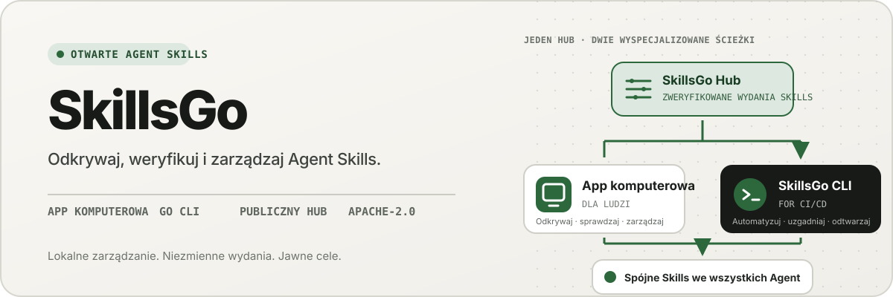
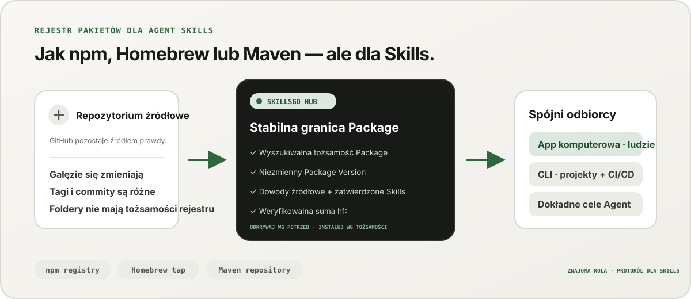
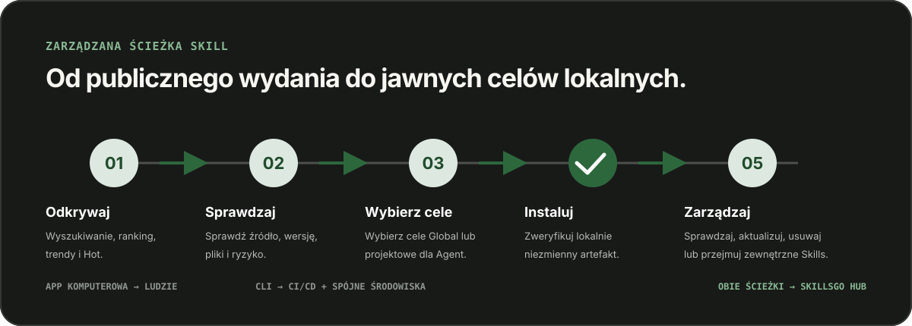

<p align="center">
  
</p>

**Jeden przepływ pracy dla Agent Skills —** Odkryj Skill z możliwością weryfikacji źródła, przypnij niezmienne wersje i obsługuj te same instalacje za pomocą komputera stacjonarnego App lub przyjaznego automatyzacji CLI.

<!-- README-I18N:START -->

  <p>
    <a href="../../README.md">English</a> ·
    <a href="./README.zh-CN.md">简体中文</a> ·
    <a href="./README.zh-TW.md">繁體中文（台灣）</a> ·
    <a href="./README.zh-HK.md">繁體中文（香港）</a> ·
    <a href="./README.ja.md">日本語</a> ·
    <a href="./README.ko.md">한국어</a> ·
    <a href="./README.fr.md">Français</a> ·
    <a href="./README.de.md">Deutsch</a> ·
    <a href="./README.it.md">Italiano</a> ·
    <a href="./README.es.md">Español</a> ·
    <a href="./README.pt-BR.md">Português (Brasil)</a> ·
    <a href="./README.ru.md">Русский</a> ·
    <a href="./README.ar.md">العربية</a> ·
    <a href="./README.hi.md">हिन्दी</a> ·
    <a href="./README.id.md">Bahasa Indonesia</a> ·
    <a href="./README.tr.md">Türkçe</a> ·
    <a href="./README.nl.md">Nederlands</a> ·
    <strong>Polski</strong> ·
    <a href="./README.th.md">ไทย</a> ·
    <a href="./README.vi.md">Tiếng Việt</a> ·
    <a href="./README.ms.md">Bahasa Melayu</a> ·
    <a href="./README.sv.md">Svenska</a> ·
    <a href="./README.uk.md">Українська</a>
  </p>
<!-- README-I18N:END -->

SkillsGo to ekosystem weryfikowalny pod względem źródła, służący do odkrywania, wersjonowania i obsługi Agent Skills. Użyj pulpitu App do przeglądania i zarządzania Skill, CLI do powtarzalności instalacji, a Hub jako współdzielonego lub samodzielnego źródła dystrybucji dla niezmiennych Package Version.

> **Pomyśl o npm, Homebrew lub Maven — ale dla Agent Skills.** GitHub pozostaje źródłem prawdy dla kodu; SkillsGo Hub zamienia obsługiwane źródła w wykrywalne, niezmienne i weryfikowalne sumą kontrolną Skill Package, które App i CLI mogą spójnie instalować dla różnych Agent i na różnych maszynach.

<p align="center">
  
</p>

**Od zmiennego źródła do stabilnej zależności —** Hub umożliwia ludziom odkrywanie według potrzeb, jednocześnie zapewniając maszynom dokładną tożsamość Package, niezmienne wersje, zatwierdzony skład Skills i sumy kontrolne.

## Wybierz swój model operacyjny

| Tryb | Najlepsze dla | Co zapewnia SkillsGo |
| --- | --- | --- |
| **Osobisty App** | Interaktywne odkrywanie i zarządzanie Skill | Dowody źródłowe, obsługiwane cele Agent, biblioteki projektowe i globalne, podglądy bezpiecznych aktualizacji oraz informacje o kontekście lokalnym |
| **CLI i CI/CD** | Powtarzalne środowiska programistyczne i automatyzacja | Polecenia do odczytu maszynowego, dokładny wybór Skill, `skills.yaml`, `skills-lock.yaml`, weryfikacja sumy kontrolnej, odzyskiwanie pamięci podręcznej offline i aktualizacje uwzględniające zakres |
| **Hub na własnym serwerze** | Zespoły, które potrzebują kontrolowanego katalogu Skill | Konfigurowalny Hub Origin z tym samym protokołem publicznym, niezmiennymi Package Version, metadanymi z możliwością przeszukiwania, statycznymi artefaktami Git i opcjonalną kontrolą dostępu |

Porównanie dotyczy roli, a nie zgodności protokołów:

| Znany model | Co SkillsGo Hub wnosi do Agent Skills |
| --- | --- |
| **Rejestr npm** | Możliwość przeszukiwania tożsamości Package i jawne, niezmienne wersje zamiast kopiowania nieznanego folderu z ruchomej gałęzi |
| **Homebrew tap** | Jedno zaufane źródło dystrybucji, z którego App lub CLI mogą korzystać na różnych maszynach programistycznych |
| **Repozytorium Maven** | Stabilne współrzędne, niezmienne artefakty, sumy kontrolne i rozpoznawanie zależności z możliwością blokowania |
| **Warstwa przeznaczona dla Skills** | Dowody źródłowe, zatwierdzony skład Skills, dokładny wybór elementów, obsługiwane metadane Agent i cele instalacji |

Hub nie zastępuje GitHub ani nie udaje, że jest kompatybilny z npm, Homebrew lub Maven. Daje Agent Skills gwarancję rejestracji i dystrybucji dla ekosystemów znanych z innych rodzajów oprogramowania.

## Dlaczego SkillsGo

- **Dowody źródłowe przed instalacją** — sprawdź repozytorium źródłowe, niezmienną wersję, obsługiwane Agent, pliki i wyrenderowany `SKILL.md` przed zmianą maszyny.
- **Środowiska powtarzalne** — raz rozpoznaj tag, gałąź lub commit, zapisz wynikową niezmienną wersję i odtwórz ją za pomocą ścisłego manifestu i pliku blokady.
- **Jeden Package, jawni członkowie** — rozprowadź kompletny Package Version, wybierając dokładne nazwy lub ścieżki Skill i cele Agent, które powinny je otrzymać.
- **Bezpieczeństwo na pierwszym miejscu** — chroń lokalne modyfikacje, zachowaj możliwość odbudowania stanu pochodnego i kontynuuj lokalne prace inwentaryzacyjne, gdy Hub jest niedostępny.
- **Analiza śladu kontekstu** — oszacuj liczbę znaków zajmowaną przez stale obecne nazwy i opisy Skills, a następnie wskaż Skills bez zaobserwowanych wywołań w ciągu ostatnich 45 lub 90 dni. To lokalny wskaźnik zastępczy wykorzystania kontekstu, a nie telemetria rozliczeniowa modelu.
- **Dwa interfejsy produktu, jeden protokół** — użyj App do interaktywnych przepływów pracy i CLI do automatyzacji; oba dotyczą tej samej umowy Hub.

## Zobacz App w akcji

Komputer stacjonarny App łączy odkrycie, dowody źródłowe, cele instalacji i lokalną inwentaryzację w jednej przyjaznej dla człowieka podróży. Użytek osobisty nie podlega rozliczeniu.

<p align="center">
  
</p>

**Wykrywanie Hub na żywo —** Przeglądaj stale aktualizowany katalog bez logowania, dzięki czemu przydatne Skill są widoczne przed jakąkolwiek lokalną instalacją lub zmianą konfiguracji.

### Odkrywaj i sprawdzaj

Szukaj według Skill lub repozytorium źródłowego, przeglądaj rankingi i wyniki wyszukiwania oraz sprawdzaj repozytorium źródłowe, niezmienną wersję, obsługiwane Agent, przetłumaczone podsumowanie i wyrenderowane `SKILL.md` przed instalacją.

<p align="center">
  
</p>

**Wyszukiwanie z uwzględnieniem źródła —** Znajdź Skill według możliwości lub repozytorium i zobacz ich kontekst Package, co pomoże Ci porównać powiązane Skill zamiast ufać izolowanemu fragmentowi.

<p align="center">
  
</p>

**Sprawdź przed instalacją —** Najpierw przejrzyj wersję niezmienną, obsługiwane Agent, pliki źródłowe i wyrenderowane instrukcje, co pozwoli ograniczyć niespodzianki w łańcuchu dostaw i przypadkowe zmiany maszyn.

### Instaluj i zarządzaj lokalnymi Skills

Zainstaluj globalnie lub w wybranych projektach, wybierz cele Agent, które powinny otrzymać tę samą wersję Skill i przejrzyj konsekwencje aktualizacji Package przed jej zastosowaniem.

<p align="center">
  
</p>

**Jasne cele instalacji —** Wybierz zakres globalny lub projektowy i dokładne Agent, które otrzymają Skill, zachowując spójność jednej wersji bez ręcznego kopiowania plików.

<p align="center">
  
</p>

**Aktualizacje uwzględniające wpływ —** Zobacz przejścia wersji i usunięte Skill przed zastosowaniem aktualizacji, aby zmiany zależności pozostały celowe i możliwe do odzyskania.

<p align="center">
  
</p>

**Wgląd w globalną Library —** Porównaj lokalne użycie z 45/90 dni, ślad kontekstu i widoczność Agent w jednym widoku inwentarza, aby łatwiej zarządzać nieużywanymi Skills i stale zajmowanym kontekstem.

<p align="center">
  
</p>

**Zarządzanie na poziomie projektu —** Zawęź te same zasoby do jednego projektu, aby można było przeglądać jego instalacje, dowody użytkowania i niezarządzane Skill bez globalnego szumu.

## Wersjonowana dystrybucja poprzez CLI i Hub

CLI i Hub tworzą powierzchnię inżynieryjną SkillsGo. Hub przekształca zmienne repozytorium źródłowe w stabilną granicę zależności: Package jest jednostką dystrybucji, a każdy Package Version jest niezmienną migawką jednej wersji źródła i pełnego zatwierdzonego składu Skills. Dzięki temu ludzie mogą odkrywać według potrzeb, a maszyny instalować na podstawie dokładnej tożsamości.

```yaml
dependencies:
  github.com/acme/skills:
    version: v1.2.3
    skills: [review, design]
    agents: [codex, claude-code]
```

`skills.yaml` rejestruje żądaną wersję Package, wybrane elementy i elementy docelowe Agent. Wygenerowany `skills-lock.yaml` wiąże tę wersję z sumą Package `h1:`. Świeża maszyna lub zadanie CI może uruchomić ten sam proces instalacji i zweryfikować ten sam artefakt, zamiast podążać za ruchomą gałęzią.

```sh
# Discover and inspect
npx skillsgo find typescript
npx skillsgo show github.com/acme/skills@v1.2.3

# Add exact members to a project or the global scope
npx skillsgo add github.com/acme/skills@v1.2.3 \
  --skill review --agent codex

# Restore, preview, and update reproducibly
npx skillsgo install
npx skillsgo update --dry-run
npx skillsgo update --yes
```

Te same polecenia mogą być kierowane do innego źródła Hub:

```sh
npx skillsgo add github.com/acme/skills@v1.2.3 \
  --hub https://hub.example.com \
  --skill review --agent codex
```

## Hostowany Hub dla zespołów

Organizacje mogą uruchomić Hub Origin, który implementuje ten sam protokół SkillsGo, co oficjalna usługa. Umożliwia to zarządzanie zatwierdzonym katalogiem, zachowanie niezmienności historii Package Version, udostępnianie metadanych z możliwością wyszukiwania, udostępnianie zweryfikowanych artefaktów i kierowanie App lub CLI na jedno kontrolowane źródło.

```text
Source repository
       │
       ▼
Hub Package Version ── immutable metadata, artifact, and h1: sum
       │
       ├── SkillsGo App (interactive discovery and management)
       └── SkillsGo CLI (projects, CI/CD, and repeatable installs)
```

Publiczny kontrakt Hub koncentruje się obecnie na obsługiwanych publicznych źródłach Skill. Prywatny Hub może zapewnić kontrolowaną dystrybucję zatwierdzonych Package; Pozyskiwanie ze źródeł prywatnych i integracje tożsamości korporacyjnej to oddzielne możliwości wdrażania, a nie założenia ukryte w kliencie.

## Jak to działa

<p align="center">
  
</p>

**Współdzielony, niezmienny protokół —** Hub rozpoznaje dowody źródłowe raz, podczas gdy App i CLI korzystają z tego samego Package Version i sumy kontrolnej, dając ten sam wynik interaktywnym i automatycznym instalacjom.

1. Obsługiwane źródło jest przekształcane w jedno niezmienne Package Version.
2. Hub publikuje metadane Package, zatwierdzony skład Skills, statyczny artefakt Git i weryfikowalną sumę Package.
3. App lub CLI odczytuje ten sam protokół i pozwala użytkownikowi wybrać dokładne elementy, zakresy i cele Agent.
4. CLI materializuje chronione lokalne drzewa Package i projekcje Agent z manifestu i zamka.
5. Aktualizacje rozwiązują nową, niezmienną wersję i pokazują wpływ przed zmianą stanu lokalnego.

## Poznaj monorepo

```text
skillsgo/
├── app/       Flutter desktop client and user experience
├── cli/       Go CLI, local state, and Skill execution engine
├── hub/       Public Hub service and reusable self-host runtime
├── protocol/  Shared executable contracts used by CLI and Hub
├── web/       Public product, Hub, and documentation surface
└── e2e/       Cross-product CLI/Hub and desktop journeys
```

Przeczytaj [`CONTEXT-MAP.md`](../../CONTEXT-MAP.md), aby poznać granice produktów i język domeny. Publiczne wydanie i model artefaktu udokumentowano w [`docs/release-design.md`](../release-design.md).

## Uruchom go lokalnie

Ujednolicona topologia programistyczna jest obecnie przeznaczona dla systemu macOS i wymaga Flutter, Go, Docker, [Process Compose](https://github.com/F1bonacc1/process-compose) i [Air](https://github.com/air-verse/air).

```sh
make dev
```

Spowoduje to uruchomienie PostgreSQL, lokalnego Hub, świeżo zbudowanego CLI i pulpitu Flutter App w ramach jednej nadzorowanej sesji. Aby sprawdzić wszystkie skonfigurowane obszary robocze:

```sh
make test
```

Skoncentrowane punkty wejścia są dostępne dla każdego obszaru roboczego:

| Obszar roboczy | Rozwój lub walidacja |
| --- | --- |
| App | `cd app && flutter run -d macos` |
| CLI | `cd cli && go test ./...` |
| Hub | `cd hub && go test ./...` |
| Protokół | `cd protocol && go test ./...` |
| Sieć | `cd web && pnpm install && pnpm dev` |

Przed zmianą zachowania produktu zobacz [CONTRIBUTING.md](../../CONTRIBUTING.md).

## Stan projektu

SkillsGo jest w fazie aktywnego rozwoju wczesnej wersji. App, CLI, Hub i Protocol są opracowywane jako oddzielne jednostki wydawnicze, a pakiety dla menedżerów pakietów i natywne archiwa są składane z tej samej zweryfikowanej macierzy kompilacji CLI. Zobacz [projekt wydania](../release-design.md), aby poznać obsługiwane cele, integralność artefaktów, zachowanie aktualizacji i wymagania dotyczące łańcucha dostaw.

## Wspólnota

- Użyj [GitHub Dyskusje](https://github.com/skillsgo/skillsgo/discussions) do zadawania pytań, rozwiązywania problemów i wczesnych pomysłów.
- Użyj skoncentrowanych [formularzy problemów](https://github.com/skillsgo/skillsgo/issues/new/choose) w przypadku powtarzalnych błędów, konkretnych żądań funkcji i problemów z dokumentacją.
- Śledź [SECURITY.md](../../SECURITY.md), aby prywatnie zgłosić luki.
- Uczestnictwo podlega [Kodeksowi postępowania](../../CODE_OF_CONDUCT.md) i [modelowi zarządzania](../../GOVERNANCE.md).

## Licencja

SkillsGo jest objęty licencją [Apache License 2.0](../../LICENSE).

Hub zawiera kod pochodzący z [Athens](https://github.com/gomods/athens), który podlega licencji Athens MIT i uwagom o przypisaniu. Zobacz [`NOTICE`](../../NOTICE) i [`THIRD_PARTY_LICENSES/ATHENS-LICENSE`](../../THIRD_PARTY_LICENSES/ATHENS-LICENSE).
