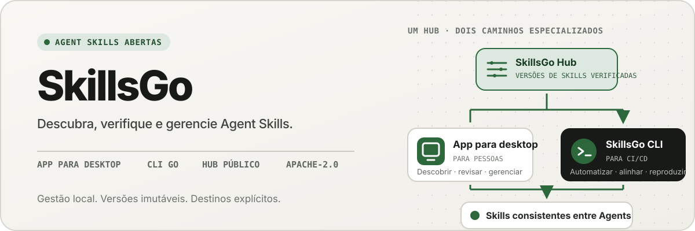
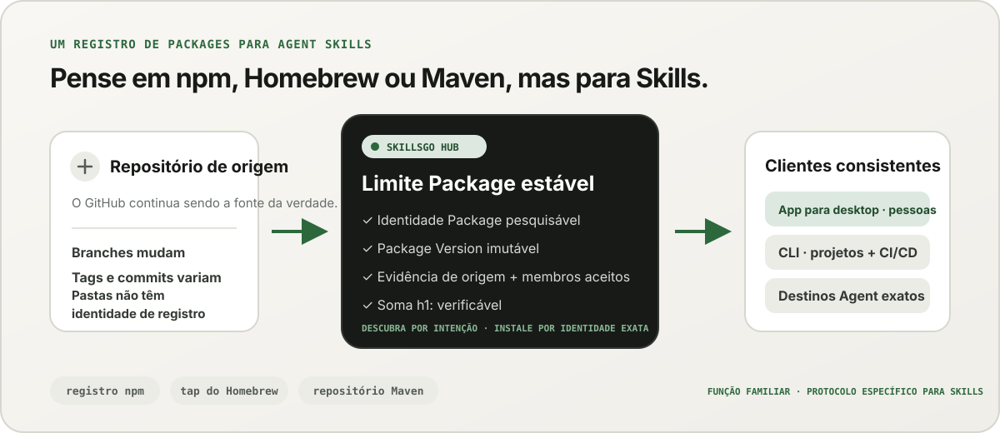
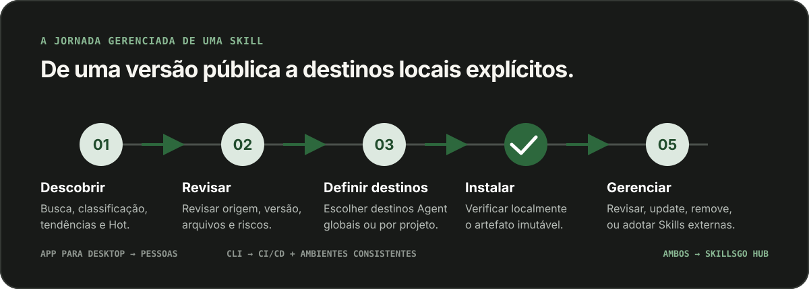

<p align="center">
  
</p>

**Um fluxo de trabalho para Agent Skills —** Descubra Skills verificáveis na origem, fixe versões imutáveis e opere as mesmas instalações por meio de um App de desktop ou CLI de fácil automação.

<!-- README-I18N:START -->

  <p>
    <a href="../../README.md">English</a> ·
    <a href="./README.zh-CN.md">简体中文</a> ·
    <a href="./README.zh-TW.md">繁體中文（台灣）</a> ·
    <a href="./README.zh-HK.md">繁體中文（香港）</a> ·
    <a href="./README.ja.md">日本語</a> ·
    <a href="./README.ko.md">한국어</a> ·
    <a href="./README.fr.md">Français</a> ·
    <a href="./README.de.md">Deutsch</a> ·
    <a href="./README.it.md">Italiano</a> ·
    <a href="./README.es.md">Español</a> ·
    <strong>Português (Brasil)</strong> ·
    <a href="./README.ru.md">Русский</a> ·
    <a href="./README.ar.md">العربية</a> ·
    <a href="./README.hi.md">हिन्दी</a> ·
    <a href="./README.id.md">Bahasa Indonesia</a> ·
    <a href="./README.tr.md">Türkçe</a> ·
    <a href="./README.nl.md">Nederlands</a> ·
    <a href="./README.pl.md">Polski</a> ·
    <a href="./README.th.md">ไทย</a> ·
    <a href="./README.vi.md">Tiếng Việt</a> ·
    <a href="./README.ms.md">Bahasa Melayu</a> ·
    <a href="./README.sv.md">Svenska</a> ·
    <a href="./README.uk.md">Українська</a>
  </p>
<!-- README-I18N:END -->

SkillsGo é um ecossistema de origem verificável para descobrir, versionar e utilizar Agent Skills. Use o App para desktop para explorar e gerenciar Skills, a CLI para tornar as instalações reproduzíveis e o Hub como origem de distribuição compartilhada ou auto-hospedada para Package Versions imutáveis.

> **Pense em npm, Homebrew ou Maven — mas para Agent Skills.** GitHub continua sendo a fonte da verdade para o código; o SkillsGo Hub transforma fontes suportadas em Skill Packages detectáveis, imutáveis e verificáveis por soma de verificação que o App e CLI podem instalar consistentemente em Agents e máquinas.

<p align="center">
  
</p>

**De uma fonte em constante mudança a uma dependência estável —** O Hub permite descobrir por intenção e fornece às máquinas a identidade Package exata, versões imutáveis, a lista precisa de Skills incluídas e somas de verificação.

## Escolha seu modelo operacional

| Modo | Melhor para | O que SkillsGo fornece |
| --- | --- | --- |
| **Pessoal App** | Descobrindo e gerenciando Skills interativamente | Evidência de origem, alvos Agent suportados, bibliotecas globais e de projeto, visualizações de atualizações seguras e insights de pegada de contexto local |
| **CLI e CI/CD** | Ambientes de desenvolvedor repetíveis e automação | Comandos legíveis por máquina, seleção exata de Skill, `skills.yaml`, `skills-lock.yaml`, verificação de soma de verificação, recuperação de cache offline e atualizações com reconhecimento de escopo |
| **Hub auto-hospedado** | Equipes que precisam de um catálogo Skill controlado | Uma origem Hub configurável com o mesmo protocolo público, Package Versions imutáveis, metadados pesquisáveis, artefatos Git estáticos e controle de acesso opcional |

A comparação é sobre a função, não sobre a compatibilidade do protocolo:

| Modelo familiar | O que o SkillsGo Hub traz para o Agent Skills |
| --- | --- |
| **Registro npm** | Identidade Package pesquisável e versões imutáveis explícitas em vez de copiar uma pasta desconhecida de uma ramificação móvel |
| **Tap do Homebrew** | Uma origem de distribuição confiável que o App ou a CLI pode usar nas máquinas dos desenvolvedores |
| **Repositório Maven** | Coordenadas estáveis, artefatos imutáveis, somas de verificação e resolução de dependências bloqueáveis |
| **Camada específica de Skill** | Evidência de origem, associação Skill aceita, seleção exata de membros, metadados Agent suportados e destinos de instalação |

O Hub não substitui o GitHub nem afirma ser compatível com npm, Homebrew ou Maven. Ele oferece aos Agent Skills as garantias de registro e distribuição que esses ecossistemas tornaram familiares para outros tipos de software.

## Por que SkillsGo

- **Evidência de origem antes da instalação** — inspecione o repositório de origem, a versão imutável, os Agents suportados, os arquivos e o `SKILL.md` renderizado antes de alterar uma máquina.
- **Ambientes reproduzíveis** — resolva uma tag, branch ou commit uma vez, mantenha a versão imutável resultante e restaure-a por meio de um manifesto e de um arquivo de lock rigorosos.
- **Um Package, membros explícitos** — distribua um Package Version completo enquanto seleciona nomes ou caminhos Skill exatos e os destinos Agent que devem recebê-los.
- **Segurança local em primeiro lugar** — proteja modificações locais, mantenha o estado derivado reconstruível e continue o trabalho de inventário local quando um Hub não estiver disponível.
- **Insights sobre a pegada de contexto** — estime a quantidade de caracteres dos nomes e descrições das Skills instaladas e identifique aquelas sem chamadas observadas nos últimos 45 ou 90 dias. Esse é um indicador local de contexto, não telemetria de cobrança do modelo.
- **Duas interfaces de produto, um protocolo** — use o App para fluxos de trabalho interativos e a CLI para automação; ambos usam o mesmo contrato Hub.

## Veja o App em ação

O App para desktop reúne descoberta, evidência de origem, destinos de instalação e inventário local em uma jornada intuitiva. O uso pessoal não exige uma conta.

<p align="center">
  
</p>

**Descoberta Hub ao vivo —** Navegue em um catálogo continuamente atualizado sem fazer login, para que Skills úteis fiquem visíveis antes de qualquer instalação local ou alteração de configuração.

### Descubra e inspecione

Pesquise por Skill ou repositório de origem, explore a classificação e os resultados da pesquisa e inspecione o repositório de origem, a versão imutável, os Agents suportados, o resumo traduzido e o `SKILL.md` renderizado antes da instalação.

<p align="center">
  
</p>

**Pesquisa com reconhecimento de origem —** Encontre Skills por recurso ou repositório e veja seu contexto Package, ajudando você a comparar Skills relacionados em vez de confiar em um snippet isolado.

<p align="center">
  
</p>

**Inspecione antes de instalar —** Revise primeiro a versão imutável, os Agents compatíveis, os arquivos de origem e as instruções renderizadas, reduzindo surpresas na cadeia de suprimentos e alterações acidentais na máquina.

### Instalar e controlar Skills locais

Instale globalmente ou em projetos selecionados, escolha os destinos Agent que devem receber a mesma versão Skill e revise as consequências de uma atualização Package antes de aplicá-la.

<p align="center">
  
</p>

**Alvos de instalação explícitos —** Escolha o escopo global ou do projeto e os Agents exatos que recebem um Skill, mantendo uma versão consistente sem copiar arquivos manualmente.

<p align="center">
  
</p>

**Atualizações com reconhecimento de impacto —** Veja as transições de versão e Skills removidos antes de aplicar uma atualização, para que as alterações de dependência permaneçam deliberadas e recuperáveis.

<p align="center">
  
</p>

**Insights da biblioteca global —** Compare o uso local de 45/90 dias, a pegada de contexto e a visibilidade do Agent em um inventário, facilitando o controle dos Skills não utilizados e do contexto residente.

<p align="center">
  
</p>

**Governança no escopo do projeto —** Limite o mesmo inventário a um projeto, para que suas instalações, evidências de uso e Skills não gerenciados possam ser revisados sem ruído global.

## Distribuição versionada através de CLI e Hub

A CLI e o Hub formam a superfície de engenharia do SkillsGo. O Hub transforma um repositório de origem em evolução em um limite de dependência estável: um Package é a unidade de distribuição e cada Package Version é um instantâneo imutável de uma revisão de origem e da lista completa de Skills incluídas. Assim, as pessoas podem descobrir por intenção enquanto as máquinas instalam por identidade exata.

```yaml
dependencies:
  github.com/acme/skills:
    version: v1.2.3
    skills: [review, design]
    agents: [codex, claude-code]
```

`skills.yaml` registra a versão Package desejada, membros selecionados e destinos Agent. O `skills-lock.yaml` gerado vincula essa versão à sua soma Package `h1:`. Uma nova máquina ou trabalho de CI pode executar o mesmo fluxo de instalação e verificar o mesmo artefato em vez de seguir uma ramificação móvel.

```sh
# Discover and inspect
npx skillsgo find typescript
npx skillsgo show github.com/acme/skills@v1.2.3

# Add exact members to a project or the global scope
npx skillsgo add github.com/acme/skills@v1.2.3 \
  --skill review --agent codex

# Restore, preview, and update reproducibly
npx skillsgo install
npx skillsgo update --dry-run
npx skillsgo update --yes
```

Os mesmos comandos podem ter como alvo outra origem Hub:

```sh
npx skillsgo add github.com/acme/skills@v1.2.3 \
  --hub https://hub.example.com \
  --skill review --agent codex
```

## Hub auto-hospedado para equipes

As organizações podem executar um Hub Origin que implementa o mesmo protocolo SkillsGo do serviço oficial. Isso torna possível selecionar um catálogo aprovado, manter o histórico do Package Version imutável, expor metadados pesquisáveis, servir artefatos verificados e apontar o App ou CLI para uma origem controlada.

```text
Source repository
       │
       ▼
Hub Package Version ── immutable metadata, artifact, and h1: sum
       │
       ├── SkillsGo App (interactive discovery and management)
       └── SkillsGo CLI (projects, CI/CD, and repeatable installs)
```

O contrato público Hub atualmente se concentra em fontes Skill públicas suportadas. Um Hub privado pode fornecer distribuição controlada de Packages aprovados; A ingestão de fontes privadas e as integrações de identidade corporativa são recursos de implantação separados, e não suposições ocultas no cliente.

## Como funciona

<p align="center">
  
</p>

**Um protocolo imutável compartilhado —** O Hub resolve a evidência de origem uma vez, enquanto o App e a CLI consomem a mesma Package Version e soma de verificação, proporcionando o mesmo resultado às instalações interativas e automatizadas.

1. Uma fonte suportada é resolvida para um Package Version imutável.
2. O Hub publica metadados Package, associação Skill aceita, um artefato Git estático e uma soma Package verificável.
3. O App ou CLI lê o mesmo protocolo e permite que o usuário escolha membros, escopos e alvos Agent exatos.
4. A CLI materializa árvores Package locais protegidas e projeções Agent a partir do manifesto e do arquivo de lock.
5. As atualizações resolvem uma nova versão imutável e mostram o impacto antes de alterar o estado local.

## Explore o monorepo

```text
skillsgo/
├── app/       Flutter desktop client and user experience
├── cli/       Go CLI, local state, and Skill execution engine
├── hub/       Public Hub service and reusable self-host runtime
├── protocol/  Shared executable contracts used by CLI and Hub
├── web/       Public product, Hub, and documentation surface
└── e2e/       Cross-product CLI/Hub and desktop journeys
```

Leia [`CONTEXT-MAP.md`](../../CONTEXT-MAP.md) para conhecer os limites do produto e o idioma do domínio. A versão pública e o modelo de artefato estão documentados em [`docs/release-design.md`](../release-design.md).

## Execute-o localmente

A topologia de desenvolvimento unificada atualmente é direcionada ao macOS e requer Flutter, Go, Docker, [Process Compose](https://github.com/F1bonacc1/process-compose) e [Air](https://github.com/air-verse/air).

```sh
make dev
```

Isso inicia o PostgreSQL, o Hub local, um CLI recém-construído e o desktop Flutter App em uma sessão supervisionada. Para validar todos os espaços de trabalho configurados:

```sh
make test
```

Pontos de entrada focados estão disponíveis para cada espaço de trabalho:

| Espaço de trabalho | Desenvolvimento ou validação |
| --- | --- |
| App | `cd app && flutter run -d macos` |
| CLI | `cd cli && go test ./...` |
| Hub | `cd hub && go test ./...` |
| Protocolo | `cd protocol && go test ./...` |
| Web | `cd web && pnpm install && pnpm dev` |

Consulte [CONTRIBUTING.md](../../CONTRIBUTING.md) antes de alterar o comportamento do produto.

## Status do projeto

SkillsGo está em desenvolvimento ativo de lançamento inicial. App, CLI, Hub e Protocolo são desenvolvidos como unidades de lançamento separadas, enquanto as saídas do gerenciador de pacotes e os arquivos nativos são montados a partir da mesma matriz de construção CLI verificada. Consulte o [design da versão](../release-design.md) para destinos suportados, integridade do artefato, comportamento de atualização e requisitos da cadeia de suprimentos.

## Comunidade

- Use [Discussões GitHub](https://github.com/skillsgo/skillsgo/discussions) para perguntas, solução de problemas e ideias iniciais.
- Use os [formulários de problemas](https://github.com/skillsgo/skillsgo/issues/new/choose) focados para bugs reproduzíveis, solicitações de recursos concretos e problemas de documentação.
- Siga [SECURITY.md](../../SECURITY.md) para relatar vulnerabilidades de forma privada.
- A participação é regida pelo [Código de Conduta](../../CODE_OF_CONDUCT.md) e pelo [modelo de governança](../../GOVERNANCE.md).

## Licença

SkillsGo é licenciado sob a [Licença Apache 2.0](../../LICENSE).

O Hub contém código derivado de [Athens](https://github.com/gomods/athens), que permanece sujeito à licença MIT de Athens e aos avisos de atribuição. Consulte [`NOTICE`](../../NOTICE) e [`THIRD_PARTY_LICENSES/ATHENS-LICENSE`](../../THIRD_PARTY_LICENSES/ATHENS-LICENSE).
