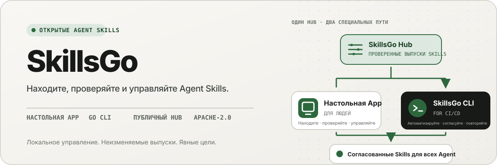
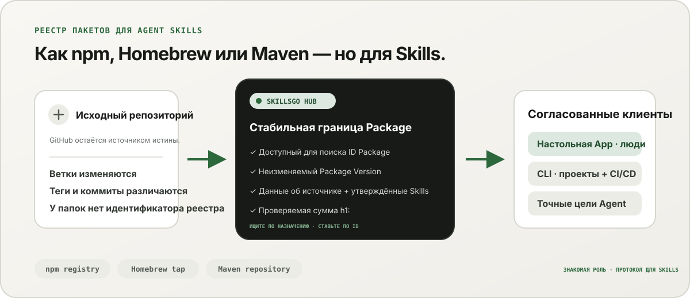
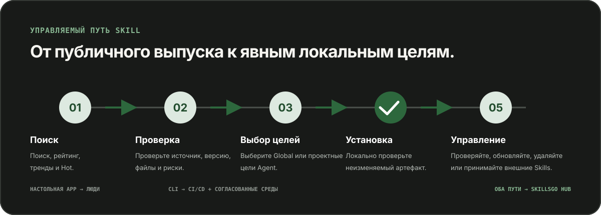

<p align="center">
  
</p>

**Единый рабочий процесс для Agent Skills —** Находите Skill с проверяемым исходным кодом, закрепляйте неизменяемые версии и управляйте теми же установками через настольный App или удобный для автоматизации CLI.

<!-- README-I18N:START -->

  <p>
    <a href="../../README.md">English</a> ·
    <a href="./README.zh-CN.md">简体中文</a> ·
    <a href="./README.zh-TW.md">繁體中文（台灣）</a> ·
    <a href="./README.zh-HK.md">繁體中文（香港）</a> ·
    <a href="./README.ja.md">日本語</a> ·
    <a href="./README.ko.md">한국어</a> ·
    <a href="./README.fr.md">Français</a> ·
    <a href="./README.de.md">Deutsch</a> ·
    <a href="./README.it.md">Italiano</a> ·
    <a href="./README.es.md">Español</a> ·
    <a href="./README.pt-BR.md">Português (Brasil)</a> ·
    <strong>Русский</strong> ·
    <a href="./README.ar.md">العربية</a> ·
    <a href="./README.hi.md">हिन्दी</a> ·
    <a href="./README.id.md">Bahasa Indonesia</a> ·
    <a href="./README.tr.md">Türkçe</a> ·
    <a href="./README.nl.md">Nederlands</a> ·
    <a href="./README.pl.md">Polski</a> ·
    <a href="./README.th.md">ไทย</a> ·
    <a href="./README.vi.md">Tiếng Việt</a> ·
    <a href="./README.ms.md">Bahasa Melayu</a> ·
    <a href="./README.sv.md">Svenska</a> ·
    <a href="./README.uk.md">Українська</a>
  </p>
<!-- README-I18N:END -->

SkillsGo — это экосистема с возможностью проверки исходного кода для обнаружения, управления версиями и эксплуатации Agent Skills. Используйте настольную версию App для изучения и управления Skill, CLI для обеспечения воспроизводимости установки и Hub в качестве общего или локального источника распространения для неизменяемых Package Version.

> **Подумайте о npm, Homebrew или Maven — но для Agent Skills.** GitHub остается источником истины для кода; SkillsGo Hub превращает поддерживаемые источники в обнаруживаемые, неизменяемые, проверяемые контрольной суммой Skill Package, которые App и CLI могут последовательно устанавливать на Agent и машинах.

<p align="center">
  
</p>

**От изменяемого исходного кода к стабильной зависимости —** Hub помогает людям искать по назначению, а машинам предоставляет точный идентификатор Package, неизменяемые версии, утверждённый состав Skills и контрольные суммы.

## Выберите свою операционную модель

| Режим | Лучшее для | Что предоставляет SkillsGo |
| --- | --- | --- |
| **Личный App** | Интерактивное обнаружение и управление Skill | Исходные данные, поддерживаемые цели Agent, проектные и глобальные библиотеки, безопасный предварительный просмотр обновлений и информация о локальном контексте |
| **CLI и CI/CD** | Повторяемые среды разработки и автоматизация | Машиночитаемые команды, точный выбор Skill, `skills.yaml`, `skills-lock.yaml`, проверка контрольной суммы, восстановление автономного кэша и обновления с учетом области |
| **Автономное размещение Hub** | Команды, которым нужен контролируемый каталог Skill | Настраиваемый Hub Origin с тем же общедоступным протоколом, неизменяемыми Package Version, метаданными с возможностью поиска, статическими артефактами Git и дополнительным контролем доступа |

Сравнение касается роли, а не совместимости протоколов:

| Знакомая модель | Что SkillsGo Hub привносит в Agent Skills |
| --- | --- |
| **Реестр npm** | Идентификатор Package с возможностью поиска и явные неизменяемые версии вместо копирования неизвестной папки из движущейся ветки |
| **Homebrew tap** | Один надежный источник распространения, который App или CLI может использовать на компьютерах разработчиков |
| **Репозиторий Maven** | Стабильные координаты, неизменяемые артефакты, контрольные суммы и блокируемое разрешение зависимостей |
| **Слой для Skills** | Данные об источнике, утверждённый состав Skills, точный выбор элементов, поддерживаемые метаданные Agent и цели установки |

Hub не заменяет GitHub и не претендует на совместимость с npm, Homebrew или Maven. Это дает Agent Skills реестр и гарантии распространения в тех экосистемах, которые используются для других видов программного обеспечения.

## Почему SkillsGo

- **Исходное свидетельство перед установкой** — перед сменой компьютера проверьте репозиторий исходного кода, неизменяемый выпуск, поддерживаемые Agent, файлы и обработанный `SKILL.md`.
- **Воспроизводимые среды** — разрешайте тег, ветку или фиксацию один раз, сохраняйте полученную неизменяемую версию и восстанавливайте ее с помощью строгого манифеста и блокировки.
- **Один Package, явные члены** — распространяйте полный Package Version, выбирая точные имена или пути Skill и целевые объекты Agent, которые должны их получить.
- **Локальная безопасность** — защита локальных модификаций, возможность восстановления производного состояния и продолжение локальной инвентаризации, когда Hub недоступен.
- **Аналитика контекста** — оцените количество символов, занимаемых постоянно загруженными именами и описаниями Skills, а затем определите Skills, вызовы которых не наблюдались за последние 45 или 90 дней. Это локальный косвенный показатель расхода контекста, а не телеметрия биллинга модели.
- **Два интерфейса продукта, один протокол** — используйте App для интерактивных рабочих процессов и CLI для автоматизации; оба используют один и тот же контракт Hub.

## Посмотрите App в действии

Настольный компьютер App объединяет обнаружение, исходные доказательства, цели установки и локальный инвентарь в одном удобном для человека процессе. Личное использование не подлежит учету.

<p align="center">
  
</p>

**Живое обнаружение Hub —** Просматривайте постоянно обновляемый каталог без входа в систему, поэтому полезные файлы Skill будут видны до любой локальной установки или изменения конфигурации.

### Обнаружение и проверка

Выполните поиск по Skill или исходному репозиторию, изучите рейтинг и результаты поиска, а также проверьте исходный репозиторий, неизменяемый выпуск, поддерживаемые Agent, переведенное резюме и визуализированный `SKILL.md` перед установкой.

<p align="center">
  
</p>

**Поиск с учетом источника —** Находите Skill по возможностям или репозиторию и просматривайте их контекст Package, помогая сравнивать связанные Skill вместо того, чтобы доверять изолированному фрагменту.

<p align="center">
  
</p>

**Проверка перед установкой —** Сначала просмотрите неизменяемую версию, поддерживаемые Agent, исходные файлы и визуализированные инструкции, что позволит избежать неожиданностей в цепочке поставок и случайных изменений оборудования.

### Установка и управление локальными Skill

Установите глобально или в выбранные проекты, выберите целевые объекты Agent, которые должны получить ту же версию Skill, и просмотрите последствия обновления Package перед его применением.

<p align="center">
  
</p>

**Явные цели установки —** Выберите глобальную область или масштаб проекта и точные Agent, которые получают Skill, обеспечивая согласованность одного выпуска без копирования файлов вручную.

<p align="center">
  
</p>

**Обновления с учетом последствий.** Перед применением обновления просматривайте смену версий и удаляйте Skill, чтобы изменения зависимостей оставались преднамеренными и восстанавливаемыми.

<p align="center">
  
</p>

**Анализ глобальной библиотеки —** Сравните локальное использование за 45/90 дней, контекстное пространство и видимость Agent в одном инвентаре, что упрощает управление неиспользуемыми Skill и резидентным контекстом.

<p align="center">
  
</p>

**Управление на уровне проекта.** Ограничьте одни и те же ресурсы одним проектом, чтобы его установки, данные об использовании и неуправляемые Skill можно было просмотреть без глобального шума.

## Распространение версий через CLI и Hub

CLI и Hub образуют инженерный интерфейс SkillsGo. Hub преобразует изменяемый репозиторий исходного кода в стабильную границу зависимостей: Package — это единица распространения, а каждый Package Version — неизменяемый снимок одной исходной версии и полного утверждённого состава Skills. Это позволяет людям искать по назначению, а машинам — устанавливать по точному идентификатору.

```yaml
dependencies:
  github.com/acme/skills:
    version: v1.2.3
    skills: [review, design]
    agents: [codex, claude-code]
```

`skills.yaml` записывает желаемую версию Package, выбранные элементы и целевые объекты Agent. Сгенерированный `skills-lock.yaml` связывает эту версию с суммой Package `h1:`. Новый компьютер или задание CI могут запустить тот же процесс установки и проверить тот же артефакт вместо следования по движущейся ветке.

```sh
# Discover and inspect
npx skillsgo find typescript
npx skillsgo show github.com/acme/skills@v1.2.3

# Add exact members to a project or the global scope
npx skillsgo add github.com/acme/skills@v1.2.3 \
  --skill review --agent codex

# Restore, preview, and update reproducibly
npx skillsgo install
npx skillsgo update --dry-run
npx skillsgo update --yes
```

Те же команды могут быть нацелены на другой Hub Origin:

```sh
npx skillsgo add github.com/acme/skills@v1.2.3 \
  --hub https://hub.example.com \
  --skill review --agent codex
```

## Самостоятельное размещение Hub для команд

Организации могут использовать Hub Origin, который реализует тот же протокол SkillsGo, что и официальный сервис. Это позволяет создавать утвержденный каталог, сохранять неизменяемую историю Package Version, предоставлять доступные для поиска метаданные, предоставлять проверенные артефакты и указывать App или CLI на один контролируемый источник.

```text
Source repository
       │
       ▼
Hub Package Version ── immutable metadata, artifact, and h1: sum
       │
       ├── SkillsGo App (interactive discovery and management)
       └── SkillsGo CLI (projects, CI/CD, and repeatable installs)
```

Публичный контракт Hub в настоящее время ориентирован на поддерживаемые общедоступные источники Skill. Частный Hub может обеспечить контролируемое распространение утвержденных Package; Прием данных из частного источника и интеграция корпоративных удостоверений — это отдельные возможности развертывания, а не предположения, скрытые в клиенте.

## Как это работает

<p align="center">
  
</p>

**Общий неизменяемый протокол —** Hub разрешает свидетельство источника один раз, тогда как App и CLI используют один и тот же Package Version и контрольную сумму, что дает одинаковый результат при интерактивной и автоматической установке.

1. Поддерживаемый источник разрешается в один неизменяемый Package Version.
2. Hub публикует метаданные Package, утверждённый состав Skills, статический артефакт Git и проверяемую сумму Package.
3. App или CLI считывает один и тот же протокол и позволяет пользователю выбирать точные элементы, области и цели Agent.
4. CLI материализует защищенные локальные деревья Package и проекции Agent из манифеста и блокировки.
5. Обновления разрешают новую неизменяемую версию и показывают влияние перед изменением локального состояния.

## Исследуйте монорепозиторий

```text
skillsgo/
├── app/       Flutter desktop client and user experience
├── cli/       Go CLI, local state, and Skill execution engine
├── hub/       Public Hub service and reusable self-host runtime
├── protocol/  Shared executable contracts used by CLI and Hub
├── web/       Public product, Hub, and documentation surface
└── e2e/       Cross-product CLI/Hub and desktop journeys
```

Прочтите [`CONTEXT-MAP.md`](../../CONTEXT-MAP.md), чтобы узнать о границах продукта и языке предметной области. Модель общедоступного выпуска и артефакта описана в [`docs/release-design.md`](../release-design.md).

## Запускаем локально

Единая топология разработки в настоящее время ориентирована на macOS и требует Flutter, Go, Docker, [Process Compose](https://github.com/F1bonacc1/process-compose) и [Air](https://github.com/air-verse/air).

```sh
make dev
```

При этом PostgreSQL, локальный Hub, свежесозданный CLI и рабочий стол Flutter App запускаются в рамках одного контролируемого сеанса. Чтобы проверить все настроенные рабочие области:

```sh
make test
```

Для каждого рабочего пространства доступны целевые точки входа:

| Рабочая область | Разработка или проверка |
| --- | --- |
| App | `cd app && flutter run -d macos` |
| CLI | `cd cli && go test ./...` |
| Hub | `cd hub && go test ./...` |
| Протокол | `cd protocol && go test ./...` |
| Интернет | `cd web && pnpm install && pnpm dev` |

Прежде чем менять поведение продукта, просмотрите [CONTRIBUTING.md](../../CONTRIBUTING.md).

## Статус проекта

SkillsGo находится на ранней стадии активной разработки. App, CLI, Hub и Protocol выпускаются отдельно, а пакеты для пакетных менеджеров и нативные архивы собираются по одной проверенной матрице сборки CLI. Сведения о поддерживаемых целях, целостности артефактов, обновлениях и требованиях к цепочке поставок см. в [описании выпуска](../release-design.md).

## Сообщество

- Используйте [GitHub Обсуждения](https://github.com/skillsgo/skillsgo/discussions) для вопросов, устранения неполадок и ранних идей.
- Используйте целевые [формы проблем](https://github.com/skillsgo/skillsgo/issues/new/choose) для воспроизводимых ошибок, конкретных запросов функций и проблем с документацией.
- Следуйте [SECURITY.md](../../SECURITY.md), чтобы сообщать об уязвимостях конфиденциально.
- Участие регулируется [Кодексом поведения](../../CODE_OF_CONDUCT.md) и [моделью управления](../../GOVERNANCE.md).

## Лицензия

SkillsGo распространяется по лицензии [Apache License 2.0](../../LICENSE).

Hub содержит код, полученный из [Athens](https://github.com/gomods/athens), на который распространяется действие лицензии Athens MIT и уведомлений об авторстве. См. [`NOTICE`](../../NOTICE) и [`THIRD_PARTY_LICENSES/ATHENS-LICENSE`](../../THIRD_PARTY_LICENSES/ATHENS-LICENSE).
