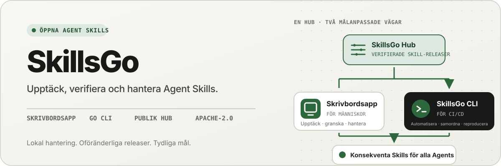
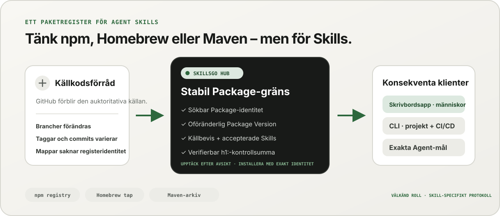
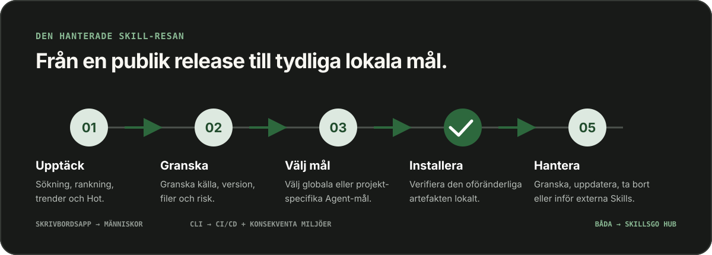

<p align="center">
  
</p>

**Ett arbetsflöde för Agent Skills —** Upptäck källverifierbara Skills, lås oföränderliga versioner och hantera samma installationer via en skrivbordsapp eller en automationsvänlig CLI.

<!-- README-I18N:START -->

  <p>
    <a href="../../README.md">English</a> ·
    <a href="./README.zh-CN.md">简体中文</a> ·
    <a href="./README.zh-TW.md">繁體中文（台灣）</a> ·
    <a href="./README.zh-HK.md">繁體中文（香港）</a> ·
    <a href="./README.ja.md">日本語</a> ·
    <a href="./README.ko.md">한국어</a> ·
    <a href="./README.fr.md">Français</a> ·
    <a href="./README.de.md">Deutsch</a> ·
    <a href="./README.it.md">Italiano</a> ·
    <a href="./README.es.md">Español</a> ·
    <a href="./README.pt-BR.md">Português (Brasil)</a> ·
    <a href="./README.ru.md">Русский</a> ·
    <a href="./README.ar.md">العربية</a> ·
    <a href="./README.hi.md">हिन्दी</a> ·
    <a href="./README.id.md">Bahasa Indonesia</a> ·
    <a href="./README.tr.md">Türkçe</a> ·
    <a href="./README.nl.md">Nederlands</a> ·
    <a href="./README.pl.md">Polski</a> ·
    <a href="./README.th.md">ไทย</a> ·
    <a href="./README.vi.md">Tiếng Việt</a> ·
    <a href="./README.ms.md">Bahasa Melayu</a> ·
    <strong>Svenska</strong> ·
    <a href="./README.uk.md">Українська</a>
  </p>
<!-- README-I18N:END -->

SkillsGo är ett källverifierbart ekosystem för att upptäcka, versionshantera och använda Agent Skills. Använd skrivbordsappen för att utforska och hantera Skills, CLI för reproducerbara installationer och Hub som delad eller självhostad distributionskälla för oföränderliga Package Versions.

> **Tänk npm, Homebrew eller Maven—men för Agent Skills.** GitHub förblir källan till sanning för kod; SkillsGo Hub förvandlar källor som stöds till upptäckbara, oföränderliga, kontrollsumma-verifierbara Skill Package som App och CLI kan installera konsekvent på Agent-maskiner.

<p align="center">
  
</p>

**Från rörlig källa till stabilt beroende —** Hub ger människor avsiktsbaserad upptäckt samtidigt som det ger maskinerna exakt Package-identitet, oföränderliga versioner, accepterat Skill-medlemskap och kontrollsummor.

## Välj din driftsmodell

| Läge | Bäst för | Vad SkillsGo tillhandahåller |
| --- | --- | --- |
| **Personlig app** | Upptäcka och hantera Skills interaktivt | Källbevis, Agent-mål som stöds, projektbibliotek och globala bibliotek, säkra uppdateringsförhandsvisningar och insikter om det lokala kontextavtrycket |
| **CLI och CI/CD** | Upprepningsbara utvecklarmiljöer och automatisering | Maskinläsbara kommandon, exakt Skill-val, `skills.yaml`, `skills-lock.yaml`, verifiering av kontrollsumma, offlinecacheåterställning och omfattningsmedvetna uppdateringar |
| **Självhostad Hub** | Team som behöver en kontrollerad Skill-katalog | En konfigurerbar Hub Origin med samma publika protokoll, oföränderliga Package Versions, sökbar metadata, statiska Git-artefakter och valfri åtkomstkontroll |

Jämförelsen handlar om rollen, inte protokollkompatibilitet:

| Bekant modell | Vad SkillsGo Hub tillför Agent Skills |
| --- | --- |
| **npm register** | Sökbar Package identitet och explicita oföränderliga versioner istället för att kopiera en okänd mapp från en rörlig gren |
| **Homebrew tap** | En betrodd distributionskälla som App eller CLI kan använda på olika utvecklarmaskiner |
| **Maven arkiv** | Stabila koordinater, oföränderliga artefakter, kontrollsummor och låsbar beroendeupplösning |
| **Skill-specifikt lager** | Källbevis, accepterat Skill-medlemskap, exakt medlemsval, Agent-metadata som stöds och installationsmål |

Hub ersätter inte GitHub eller låtsas vara npm, Homebrew eller Maven kompatibel. Det ger Agent Skills registret och distributionsgarantierna för de ekosystem som gjorts bekanta för andra typer av programvara.

## Varför SkillsGo

- **Källbevis före installation** — inspektera källförrådet, oföränderlig utgåva, stödda Agents, filer och renderade `SKILL.md` innan du ändrar en maskin.
- **Reproducerbara miljöer** — lös en tagg, gren eller commit en gång, behåll den resulterande oföränderliga versionen och återställ den genom ett strikt manifest och lås.
- **En Package, explicita medlemmar** — distribuera en komplett Package Version samtidigt som du väljer exakta Skill-namn eller sökvägar och Agent-målen som ska ta emot dem.
- **Local-first safety** — skydda lokala modifieringar, håll det härledda tillståndet återuppbyggbart och fortsätt lokalt inventeringsarbete när en Hub inte är tillgänglig.
- **Insikter om kontextfotavtryck** — uppskatta teckenavtrycket för installerade Skill-namn och beskrivningar, och identifiera sedan Skills utan observerade anrop under de senaste 45 eller 90 dagarna. Detta är en lokal kontextproxy, inte telemetri för modellfakturering.
- **Två produktgränssnitt, ett protokoll** — använd App för interaktiva arbetsflöden och CLI för automatisering; båda talar med samma Hub-kontrakt.

## Se App i aktion

Skrivbordsappen förenar upptäckt, källbevis, installationsmål och lokal inventering i ett lättanvänt flöde. Personlig användning kräver inget konto.

<p align="center">
  
</p>

**Live Hub upptäckt —** Bläddra i en kontinuerligt uppdaterad katalog utan att logga in, så användbara Skills är synliga innan någon lokal installation eller konfigurationsändring.

### Upptäck och inspektera

Sök efter Skill eller källförråd, utforska rankning och sökresultat, och inspektera källförvaret, oföränderlig utgåva, stödda Agents, översatt sammanfattning och renderad `SKILL.md` före installation.

<p align="center">
  
</p>

**Källmedveten sökning —** Hitta Skills efter kapacitet eller arkiv och se deras Package-kontext, vilket hjälper dig att jämföra relaterade Skills istället för att lita på ett isolerat utdrag.

<p align="center">
  
</p>

**Inspektera före installation —** Granska den oföränderliga versionen, stödda Agents, källfiler och renderade instruktioner först, vilket minskar överraskningar i leveranskedjan och oavsiktliga ändringar på datorn.

### Installera och styr lokala Skill

Installera globalt eller i utvalda projekt, välj Agent-målen som ska få samma Skill-release och granska konsekvenserna av en Package-uppdatering innan du tillämpar den.

<p align="center">
  
</p>

**Explicita installationsmål —** Välj globalt eller projektomfång och de exakta Agents som får en Skill, så att en version är konsekvent utan att kopiera filer för hand.

<p align="center">
  
</p>

**Konsekvensmedvetna uppdateringar —** Se versionsövergångar och borttagna Skill innan du tillämpar en uppdatering, så beroendeändringar förblir avsiktliga och kan återställas.

<p align="center">
  
</p>

**Insikter i det globala Library —** Jämför lokal användning under 45/90 dagar, kontextavtryck och Agent-synlighet i en och samma inventering, så blir oanvända Skills och lokalt tillgänglig kontext lättare att styra.

<p align="center">
  
</p>

**Projektomfattad styrning —** Begränsa samma inventering till ett projekt, så att dess installationer, användningsbevis och ohanterade Skills kan granskas utan globalt brus.

## Versionerad distribution genom CLI och Hub

CLI och Hub utgör den tekniska ytan av SkillsGo. Hub konverterar ett rörligt källlager till en stabil beroendegräns: en Package är distributionsenheten, och varje Package Version är en oföränderlig ögonblicksbild av en källrevision och dess fullständiga accepterade Skill-medlemskap. Detta låter människor upptäcka med avsikt medan maskiner installeras med exakt identitet.

```yaml
dependencies:
  github.com/acme/skills:
    version: v1.2.3
    skills: [review, design]
    agents: [codex, claude-code]
```

`skills.yaml` registrerar önskad Package-version, valda medlemmar och Agent-mål. Den genererade `skills-lock.yaml` binder den versionen till sin Package `h1:` summa. En ny maskin eller CI-jobb kan köra samma installationsflöde och verifiera samma artefakt istället för att följa en rörlig gren.

```sh
# Discover and inspect
npx skillsgo find typescript
npx skillsgo show github.com/acme/skills@v1.2.3

# Add exact members to a project or the global scope
npx skillsgo add github.com/acme/skills@v1.2.3 \
  --skill review --agent codex

# Restore, preview, and update reproducibly
npx skillsgo install
npx skillsgo update --dry-run
npx skillsgo update --yes
```

Samma kommandon kan riktas mot ett annat Hub ursprung:

```sh
npx skillsgo add github.com/acme/skills@v1.2.3 \
  --hub https://hub.example.com \
  --skill review --agent codex
```

## Självhostad Hub för team

Organisationer kan köra ett Hub Origin som implementerar samma SkillsGo-protokoll som den officiella tjänsten. Detta gör det möjligt att sammanställa en godkänd katalog, hålla Package Version-historiken oföränderlig, exponera sökbar metadata, servera verifierade artefakter och rikta App eller CLI mot ett kontrollerat ursprung.

```text
Source repository
       │
       ▼
Hub Package Version ── immutable metadata, artifact, and h1: sum
       │
       ├── SkillsGo App (interactive discovery and management)
       └── SkillsGo CLI (projects, CI/CD, and repeatable installs)
```

Det offentliga Hub-kontraktet fokuserar för närvarande på offentliga Skill-källor som stöds. En privat Hub kan tillhandahålla kontrollerad distribution av godkända Package; Intag av privat källa och integrering av företagsidentitet är separata distributionsmöjligheter, inte antaganden som är dolda i klienten.

## Hur det fungerar

<p align="center">
  
</p>

**Ett delat oföränderligt protokoll —** Hub löser källbevis en gång, medan App och CLI använder samma Package Version och kontrollsumma, vilket ger interaktiva och automatiserade installationer samma resultat.

1. En källa som stöds löses till en oföränderlig Package Version.
2. Hub publicerar Package-metadata, accepterade Skills, en statisk Git-artefakt och en verifierbar Package-summa.
3. App eller CLI läser samma protokoll och låter användaren välja exakta medlemmar, scopes och Agent-mål.
4. CLI materialiserar skyddade lokala Package-träd och Agent-projektioner från manifestet och låsfilen.
5. Uppdateringar löser upp en ny oföränderlig version och visar konsekvenserna innan den lokala statusen ändras.

## Utforska monorepo

```text
skillsgo/
├── app/       Flutter desktop client and user experience
├── cli/       Go CLI, local state, and Skill execution engine
├── hub/       Public Hub service and reusable self-host runtime
├── protocol/  Shared executable contracts used by CLI and Hub
├── web/       Public product, Hub, and documentation surface
└── e2e/       Cross-product CLI/Hub and desktop journeys
```

Läs [`CONTEXT-MAP.md`](../../CONTEXT-MAP.md) för produktgränser och domänspråk. Den offentliga versionen och artefaktmodellen är dokumenterad i [`docs/release-design.md`](../release-design.md).

## Kör det lokalt

Den enhetliga utvecklingstopologin riktar sig för närvarande till macOS och kräver Flutter, Go, Docker, [Process Compose](https://github.com/F1bonacc1/process-compose) och [Air](https://github.com/air-verse/air).

```sh
make dev
```

Detta startar PostgreSQL, den lokala Hub, en nybyggd CLI och Flutter-skrivbordet App under en övervakad session. Så här validerar du alla konfigurerade arbetsytor:

```sh
make test
```

Fokuserade ingångspunkter är tillgängliga för varje arbetsyta:

| Arbetsyta | Utveckling eller validering |
| --- | --- |
| App | `cd app && flutter run -d macos` |
| CLI | `cd cli && go test ./...` |
| Hub | `cd hub && go test ./...` |
| Protokoll | `cd protocol && go test ./...` |
| Webb | `cd web && pnpm install && pnpm dev` |

Se [CONTRIBUTING.md](../../CONTRIBUTING.md) innan du ändrar produktens beteende.

## Projektstatus

SkillsGo är i aktiv tidig utgivningsutveckling. App, CLI, Hub och Protocol är utvecklade som separata utgivningsenheter, medan pakethanterare-utgångar och inbyggda arkiv är sammansatta från samma verifierade CLI-byggmatris. Se [release design](../release-design.md) för mål som stöds, artefaktintegritet, uppdateringsbeteende och krav på leveranskedjan.

## Community

- Använd [GitHub Discussions](https://github.com/skillsgo/skillsgo/discussions) för frågor, felsökning och tidiga idéer.
- Använd de fokuserade [problemformulären](https://github.com/skillsgo/skillsgo/issues/new/choose) för reproducerbara buggar, konkreta funktionsförfrågningar och dokumentationsproblem.
- Följ [SECURITY.md](../../SECURITY.md) för att rapportera sårbarheter privat.
- Deltagande styrs av [uppförandekoden](../../CODE_OF_CONDUCT.md) och [styrmodellen](../../GOVERNANCE.md).

## Licens

SkillsGo är licensierad under [Apache License 2.0](../../LICENSE).

Hub innehåller kod härledd från [Athens](https://github.com/gomods/athens), som förblir föremål för Athens MIT License och attributionsmeddelanden. Se [`NOTICE`](../../NOTICE) och [`THIRD_PARTY_LICENSES/ATHENS-LICENSE`](../../THIRD_PARTY_LICENSES/ATHENS-LICENSE).
