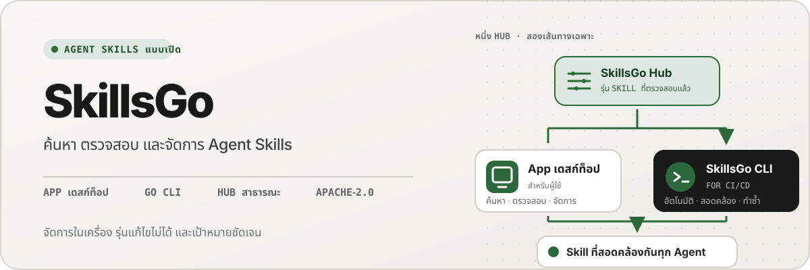
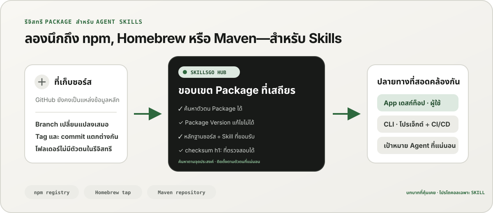
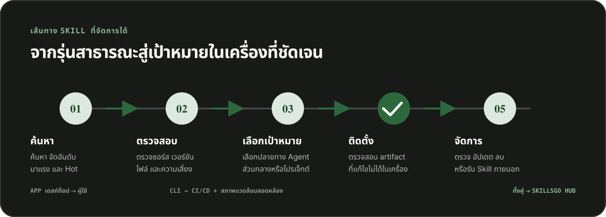

<p align="center">
  
</p>

**เวิร์กโฟลว์เดียวสำหรับ Agent Skills —** ค้นหา Skill ที่ตรวจสอบแหล่งที่มาได้ ตรึงเวอร์ชันที่แก้ไขเปลี่ยนแปลงไม่ได้ และจัดการการติดตั้งชุดเดียวกันผ่าน App เดสก์ท็อปหรือ CLI ที่เหมาะกับระบบอัตโนมัติ

<!-- README-I18N:START -->

  <p>
    <a href="../../README.md">English</a> ·
    <a href="./README.zh-CN.md">简体中文</a> ·
    <a href="./README.zh-TW.md">繁體中文（台灣）</a> ·
    <a href="./README.zh-HK.md">繁體中文（香港）</a> ·
    <a href="./README.ja.md">日本語</a> ·
    <a href="./README.ko.md">한국어</a> ·
    <a href="./README.fr.md">Français</a> ·
    <a href="./README.de.md">Deutsch</a> ·
    <a href="./README.it.md">Italiano</a> ·
    <a href="./README.es.md">Español</a> ·
    <a href="./README.pt-BR.md">Português (Brasil)</a> ·
    <a href="./README.ru.md">Русский</a> ·
    <a href="./README.ar.md">العربية</a> ·
    <a href="./README.hi.md">हिन्दी</a> ·
    <a href="./README.id.md">Bahasa Indonesia</a> ·
    <a href="./README.tr.md">Türkçe</a> ·
    <a href="./README.nl.md">Nederlands</a> ·
    <a href="./README.pl.md">Polski</a> ·
    <strong>ไทย</strong> ·
    <a href="./README.vi.md">Tiếng Việt</a> ·
    <a href="./README.ms.md">Bahasa Melayu</a> ·
    <a href="./README.sv.md">Svenska</a> ·
    <a href="./README.uk.md">Українська</a>
  </p>
<!-- README-I18N:END -->

SkillsGo เป็นระบบนิเวศที่ตรวจสอบแหล่งที่มาได้สำหรับการค้นหา การกำหนดเวอร์ชัน และการใช้งาน Agent Skills ใช้ App เดสก์ท็อปเพื่อสำรวจและจัดการ Skill ใช้ CLI เพื่อให้การติดตั้งทำซ้ำได้ และใช้ Hub เป็นแหล่งเผยแพร่ร่วมกันหรือโฮสต์เองสำหรับ Package Version ที่แก้ไขเปลี่ยนแปลงไม่ได้

> **ลองนึกถึง npm, Homebrew หรือ Maven—แต่สำหรับ Agent Skills** GitHub ยังคงเป็นแหล่งข้อมูลหลักของโค้ด ส่วน SkillsGo Hub เปลี่ยนแหล่งที่มาที่รองรับให้เป็น Package Skill ที่ค้นหาได้ แก้ไขเปลี่ยนแปลงไม่ได้ และตรวจสอบ checksum ได้ เพื่อให้ App และ CLI ติดตั้งได้อย่างสอดคล้องกันในทุก Agent และเครื่อง

<p align="center">
  
</p>

**จากซอร์สที่เปลี่ยนแปลงไปสู่การพึ่งพาที่เสถียร —** Hub ช่วยให้ผู้ใช้ค้นพบตามจุดประสงค์ พร้อมมอบข้อมูลระบุตัวตน Package ที่แม่นยำ เวอร์ชันที่แก้ไขเปลี่ยนแปลงไม่ได้ รายการ Skill ที่ยอมรับ และ checksum ให้กับระบบ

## เลือกรูปแบบการใช้งานของคุณ

| โหมด | ดีที่สุดสำหรับ | สิ่งที่ SkillsGo ให้ |
| --- | --- | --- |
| **App ส่วนบุคคล** | การค้นหาและจัดการ Skill แบบโต้ตอบ | หลักฐานแหล่งที่มา เป้าหมาย Agent ที่รองรับ Library ระดับโปรเจ็กต์และส่วนกลาง ตัวอย่างการอัปเดตที่ปลอดภัย และข้อมูลเชิงลึกเกี่ยวกับขนาดบริบทในเครื่อง |
| **CLI และ CI/CD** | สภาพแวดล้อมนักพัฒนาและระบบอัตโนมัติที่ทำซ้ำได้ | คำสั่งที่ระบบอ่านได้ การเลือก Skill ที่แม่นยำ `skills.yaml`, `skills-lock.yaml` การตรวจสอบ checksum การกู้คืนแคชออฟไลน์ และการอัปเดตตามขอบเขต |
| **Hub โฮสต์เอง** | ทีมที่ต้องการแคตตาล็อก Skill ที่ควบคุมได้ | Hub Origin ที่กำหนดค่าได้โดยใช้โปรโตคอลสาธารณะเดียวกัน Package Version ที่แก้ไขเปลี่ยนแปลงไม่ได้ metadata ที่ค้นหาได้ artifact Git แบบคงที่ และการควบคุมการเข้าถึงเพิ่มเติม |

การเปรียบเทียบเป็นเรื่องเกี่ยวกับบทบาท ไม่ใช่ความเข้ากันได้ของโปรโตคอล:

| รูปแบบที่คุ้นเคย | สิ่งที่ SkillsGo Hub นำมาสู่ Agent Skills |
| --- | --- |
| **รีจิสทรี npm** | ข้อมูลระบุตัวตน Package ที่ค้นหาได้และเวอร์ชันที่แก้ไขเปลี่ยนแปลงไม่ได้อย่างชัดเจน แทนการคัดลอกโฟลเดอร์ที่ไม่รู้จักจาก branch ที่ยังเปลี่ยนแปลงอยู่ |
| **Homebrew tap** | แหล่งเผยแพร่ที่เชื่อถือได้หนึ่งแห่ง ซึ่ง App หรือ CLI ใช้ร่วมกันได้ในเครื่องของนักพัฒนาหลายเครื่อง |
| **ที่เก็บ Maven** | พิกัดที่เสถียร artifact ที่แก้ไขเปลี่ยนแปลงไม่ได้ checksum และการแก้ไข dependency ที่ล็อกได้ |
| **เลเยอร์เฉพาะ Skill** | หลักฐานแหล่งที่มา, การเป็นสมาชิก Skill ที่ยอมรับ, การเลือกสมาชิกที่แน่นอน, เมตาดาต้า Agent ที่รองรับ และเป้าหมายการติดตั้ง |

Hub ไม่ได้แทนที่ GitHub หรืออ้างว่าเข้ากันได้กับ npm, Homebrew หรือ Maven ช่วยให้ Agent Skills มีการลงทะเบียนและการจัดจำหน่ายรับประกันระบบนิเวศเหล่านั้นที่คุ้นเคยกับซอฟต์แวร์ประเภทอื่น

## ทำไมต้อง SkillsGo

- **หลักฐานแหล่งที่มาก่อนการติดตั้ง** — ตรวจสอบที่เก็บซอร์ส รุ่นที่แก้ไขเปลี่ยนแปลงไม่ได้ Agent ที่รองรับ ไฟล์ และ `SKILL.md` ที่แสดงผลแล้วก่อนเปลี่ยนแปลงเครื่อง
- **สภาพแวดล้อมที่ทำซ้ำได้** — resolve tag, branch หรือ commit เพียงครั้งเดียว เก็บเวอร์ชันที่แก้ไขเปลี่ยนแปลงไม่ได้ซึ่งได้มา แล้วกู้คืนผ่าน manifest และ lock ที่เข้มงวด
- **หนึ่ง Package สมาชิกที่ชัดเจน** — แจกจ่าย Package Version ที่สมบูรณ์พร้อมทั้งเลือกชื่อหรือพาธ Skill ที่แน่นอน และเป้าหมาย Agent ที่ควรได้รับ
- **ความปลอดภัยที่ยึดข้อมูลในเครื่องเป็นหลัก** — ปกป้องการแก้ไขในเครื่อง รักษาให้สถานะที่สร้างต่อสามารถสร้างใหม่ได้ และทำงานกับรายการ Skill ในเครื่องต่อได้เมื่อ Hub ไม่พร้อมใช้งาน
- **ข้อมูลเชิงลึกเกี่ยวกับขนาดบริบท** — ประมาณจำนวนอักขระของชื่อและคำอธิบาย Skill ที่อยู่ในบริบท แล้วระบุ Skill ที่ไม่พบการเรียกใช้งานในช่วง 45 หรือ 90 วันที่ผ่านมา ข้อมูลนี้เป็นเพียงตัวแทนของบริบทในเครื่อง ไม่ใช่ telemetry สำหรับการเรียกเก็บเงินของโมเดล
- **อินเทอร์เฟซผลิตภัณฑ์สองรายการ หนึ่งโปรโตคอล** — ใช้ App สำหรับเวิร์กโฟลว์แบบโต้ตอบ และ CLI สำหรับระบบอัตโนมัติ ทั้งคู่พูดถึงสัญญา Hub เดียวกัน

## ดูการทำงานของ App

App เดสก์ท็อปรวมการค้นหา หลักฐานแหล่งที่มา เป้าหมายการติดตั้ง และรายการ Skill ในเครื่องไว้ในขั้นตอนเดียวที่ใช้งานง่าย การใช้งานส่วนบุคคลไม่ต้องมีบัญชี

<p align="center">
  
</p>

**การค้นพบ Hub แบบสด —** เรียกดูแค็ตตาล็อกที่อัปเดตอย่างต่อเนื่องโดยไม่ต้องลงชื่อเข้าใช้ เพื่อให้มองเห็น Skill ที่มีประโยชน์ได้ก่อนการติดตั้งในเครื่องหรือการเปลี่ยนแปลงการกำหนดค่า

### ค้นพบและตรวจสอบ

ค้นหาตาม Skill หรือที่เก็บซอร์ส สำรวจอันดับและผลการค้นหา แล้วตรวจสอบที่เก็บซอร์ส รุ่นที่แก้ไขเปลี่ยนแปลงไม่ได้ Agent ที่รองรับ ข้อมูลสรุปที่แปลแล้ว และ `SKILL.md` ที่แสดงผลก่อนติดตั้ง

<p align="center">
  
</p>

**การค้นหาที่ทราบแหล่งที่มา —** ค้นหา Skill ตามความสามารถหรือพื้นที่เก็บข้อมูล และดูบริบทของ Package ซึ่งช่วยให้คุณเปรียบเทียบ Skill ที่เกี่ยวข้องแทนที่จะเชื่อถือตัวอย่างข้อมูลที่แยกออกมา

<p align="center">
  
</p>

**ตรวจสอบก่อนติดตั้ง —** ตรวจสอบเวอร์ชันที่แก้ไขเปลี่ยนแปลงไม่ได้ Agent ที่รองรับ ไฟล์ต้นฉบับ และคำแนะนำที่แสดงผลแล้วก่อน เพื่อลดความเสี่ยงที่คาดไม่ถึงในซัพพลายเชนและการเปลี่ยนแปลงเครื่องโดยไม่ตั้งใจ

### ติดตั้งและควบคุม Skill ในพื้นที่

ติดตั้งทั่วโลกหรือในโปรเจ็กต์ที่เลือก เลือกเป้าหมาย Agent ที่ควรได้รับรุ่น Skill เดียวกัน และตรวจสอบผลที่ตามมาของการอัปเดต Package ก่อนที่จะนำไปใช้

<p align="center">
  
</p>

**เป้าหมายการติดตั้งที่ชัดเจน —** เลือกขอบเขตส่วนกลางหรือขอบเขตโครงการและ Agent ที่แน่นอนที่ได้รับ Skill ทำให้รุ่นหนึ่งมีความสอดคล้องกันโดยไม่ต้องคัดลอกไฟล์ด้วยมือ

<p align="center">
  
</p>

**การอัปเดตที่คำนึงถึงผลกระทบ —** ดูการเปลี่ยนเวอร์ชันและ Skill ที่ลบออก ก่อนที่จะใช้การอัปเดต ดังนั้นการเปลี่ยนแปลงการขึ้นต่อกันยังคงเป็นการพิจารณาอย่างรอบคอบและสามารถกู้คืนได้

<p align="center">
  
</p>

**ข้อมูลเชิงลึกของ Library ส่วนกลาง —** เปรียบเทียบการใช้งานในเครื่องย้อนหลัง 45/90 วัน ขนาดบริบท และการมองเห็นของ Agent ในรายการเดียว ทำให้ดูแล Skill ที่ไม่ได้ใช้และบริบทที่คงอยู่ได้ง่ายขึ้น

<p align="center">
  
</p>

**การกำกับดูแลระดับโปรเจ็กต์ —** จำกัดรายการเดียวกันให้เหลือเฉพาะโปรเจ็กต์หนึ่ง เพื่อให้ตรวจสอบการติดตั้ง หลักฐานการใช้งาน และ Skill ที่ไม่ได้จัดการได้โดยไม่มีข้อมูลส่วนกลางรบกวน

## การเผยแพร่เวอร์ชันผ่าน CLI และ Hub

CLI และ Hub เป็นส่วนติดต่อด้านวิศวกรรมของ SkillsGo โดย Hub เปลี่ยนที่เก็บซอร์สที่ยังเคลื่อนไหวให้เป็นขอบเขต dependency ที่เสถียร: Package คือหน่วยเผยแพร่ และ Package Version แต่ละรายการคือ snapshot ที่แก้ไขเปลี่ยนแปลงไม่ได้ของ revision ซอร์สหนึ่งรายการพร้อมรายชื่อ Skill ที่ยอมรับทั้งหมด ผู้ใช้จึงค้นหาตามจุดประสงค์ได้ ขณะที่ระบบติดตั้งตามข้อมูลระบุตัวตนที่แน่นอน

```yaml
dependencies:
  github.com/acme/skills:
    version: v1.2.3
    skills: [review, design]
    agents: [codex, claude-code]
```

`skills.yaml` บันทึกเวอร์ชัน Package สมาชิกที่เลือก และเป้าหมาย Agent ที่ต้องการ `skills-lock.yaml` ที่สร้างขึ้นจะผูกเวอร์ชันนั้นกับผลรวม Package `h1:` เครื่องจักรใหม่หรืองาน CI สามารถรันขั้นตอนการติดตั้งเดียวกัน และตรวจสอบอาร์ติแฟกต์เดียวกัน แทนที่จะติดตามสาขาที่กำลังย้าย

```sh
# Discover and inspect
npx skillsgo find typescript
npx skillsgo show github.com/acme/skills@v1.2.3

# Add exact members to a project or the global scope
npx skillsgo add github.com/acme/skills@v1.2.3 \
  --skill review --agent codex

# Restore, preview, and update reproducibly
npx skillsgo install
npx skillsgo update --dry-run
npx skillsgo update --yes
```

คำสั่งเดียวกันสามารถกำหนดเป้าหมายแหล่งกำเนิด Hub อื่นได้:

```sh
npx skillsgo add github.com/acme/skills@v1.2.3 \
  --hub https://hub.example.com \
  --skill review --agent codex
```

## Hub โฮสต์เองสำหรับทีม

องค์กรสามารถเรียกใช้ Hub Origin ที่ใช้โปรโตคอล SkillsGo เดียวกันกับบริการอย่างเป็นทางการ ทำให้ดูแลแค็ตตาล็อกที่ได้รับอนุมัติ เก็บประวัติ Package Version ให้แก้ไขเปลี่ยนแปลงไม่ได้ เปิดเผย metadata ที่ค้นหาได้ ให้บริการ artifact ที่ตรวจสอบแล้ว และชี้ App หรือ CLI ไปยังต้นทางที่ควบคุมได้แห่งเดียว

```text
Source repository
       │
       ▼
Hub Package Version ── immutable metadata, artifact, and h1: sum
       │
       ├── SkillsGo App (interactive discovery and management)
       └── SkillsGo CLI (projects, CI/CD, and repeatable installs)
```

สัญญา Hub สาธารณะในปัจจุบันมุ่งเน้นไปที่แหล่งข้อมูล Skill สาธารณะที่ได้รับการสนับสนุน Hub ส่วนตัวสามารถจัดให้มีการกระจายการควบคุมของ Package ที่ได้รับอนุมัติ การนำเข้าแหล่งข้อมูลส่วนตัวและการรวมข้อมูลประจำตัวขององค์กรเป็นความสามารถในการปรับใช้ที่แยกจากกัน ไม่ใช่สมมติฐานที่ซ่อนอยู่ในไคลเอนต์

## มันทำงานอย่างไร

<p align="center">
  
</p>

**โปรโตคอลร่วมที่แก้ไขเปลี่ยนแปลงไม่ได้ —** Hub resolve หลักฐานแหล่งที่มาเพียงครั้งเดียว ขณะที่ App และ CLI ใช้ Package Version และ checksum เดียวกัน ทำให้การติดตั้งแบบโต้ตอบและแบบอัตโนมัติได้ผลลัพธ์เดียวกัน

1. แหล่งที่มาที่รองรับจะถูก resolve เป็น Package Version หนึ่งรายการที่แก้ไขเปลี่ยนแปลงไม่ได้
2. Hub เผยแพร่ metadata ของ Package รายชื่อ Skill ที่ยอมรับ artifact Git แบบคงที่ และผลรวม Package ที่ตรวจสอบได้
3. App หรือ CLI อ่านโปรโตคอลเดียวกันและให้ผู้ใช้เลือกสมาชิก ขอบเขต และเป้าหมาย Agent ที่แน่นอน
4. CLI สร้างต้นไม้ Package ในพื้นที่ที่ได้รับการป้องกันและการฉายภาพ Agent จากรายการและการล็อค
5. การอัปเดตจะ resolve เวอร์ชันใหม่ที่แก้ไขเปลี่ยนแปลงไม่ได้ และแสดงผลกระทบก่อนเปลี่ยนสถานะในเครื่อง

## สำรวจ monorepo

```text
skillsgo/
├── app/       Flutter desktop client and user experience
├── cli/       Go CLI, local state, and Skill execution engine
├── hub/       Public Hub service and reusable self-host runtime
├── protocol/  Shared executable contracts used by CLI and Hub
├── web/       Public product, Hub, and documentation surface
└── e2e/       Cross-product CLI/Hub and desktop journeys
```

อ่าน [`CONTEXT-MAP.md`](../../CONTEXT-MAP.md) สำหรับขอบเขตผลิตภัณฑ์และภาษาโดเมน รุ่นสาธารณะและอาร์ติแฟกต์ได้รับการบันทึกไว้ใน [`docs/release-design.md`](../release-design.md)

## เรียกใช้ในเครื่อง

ปัจจุบันโทโพโลยีการพัฒนาแบบครบวงจรกำหนดเป้าหมายไปที่ macOS และต้องใช้ Flutter, Go, Docker, [Process Compose](https://github.com/F1bonacc1/process-compose) และ [Air](https://github.com/air-verse/air)

```sh
make dev
```

สิ่งนี้จะเริ่มต้น PostgreSQL, Hub ในเครื่อง, CLI ที่สร้างขึ้นใหม่ และเดสก์ท็อป Flutter App ภายใต้เซสชันที่ได้รับการดูแลเพียงเซสชันเดียว ในการตรวจสอบพื้นที่ทำงานที่กำหนดค่าไว้ทั้งหมด:

```sh
make test
```

จุดเริ่มต้นที่มุ่งเน้นมีให้ใช้งานสำหรับแต่ละพื้นที่ทำงาน:

| พื้นที่ทำงาน | การพัฒนาหรือการตรวจสอบ |
| --- | --- |
| App | `cd app && flutter run -d macos` |
| CLI | `cd cli && go test ./...` |
| Hub | `cd hub && go test ./...` |
| โปรโตคอล | `cd protocol && go test ./...` |
| เว็บ | `cd web && pnpm install && pnpm dev` |

ดู [CONTRIBUTING.md](../../CONTRIBUTING.md) ก่อนที่จะเปลี่ยนแปลงลักษณะการทำงานของผลิตภัณฑ์

## สถานะโครงการ

SkillsGo อยู่ระหว่างการพัฒนาในช่วงเปิดตัว App, CLI, Hub และ Protocol ได้รับการพัฒนาเป็นหน่วยรีลีสแยกกัน ในขณะที่เอาต์พุตตัวจัดการแพ็คเกจและไฟล์เก็บถาวรดั้งเดิมนั้นประกอบกันจากบิวด์เมทริกซ์ CLI ที่ได้รับการตรวจสอบเดียวกัน ดู [การออกแบบการเปิดตัว](../release-design.md) สำหรับเป้าหมายที่รองรับ ความสมบูรณ์ของอาร์ติแฟกต์ ลักษณะการทำงานในการอัปเดต และข้อกำหนดด้านซัพพลายเชน

## ชุมชน

- ใช้ [การสนทนา GitHub](https://github.com/skillsgo/skillsgo/discussions) สำหรับคำถาม การแก้ปัญหา และแนวคิดเบื้องต้น
- ใช้ [แบบฟอร์มปัญหา](https://github.com/skillsgo/skillsgo/issues/new/choose) ที่เน้นสำหรับข้อบกพร่องที่ทำซ้ำได้ คำขอคุณลักษณะที่เป็นรูปธรรม และปัญหาด้านเอกสารประกอบ
- ปฏิบัติตาม [SECURITY.md](../../SECURITY.md) เพื่อรายงานช่องโหว่แบบส่วนตัว
- การเข้าร่วมอยู่ภายใต้ [หลักจรรยาบรรณ](../../CODE_OF_CONDUCT.md) และ [รูปแบบการกำกับดูแล](../../GOVERNANCE.md)

## ใบอนุญาต

SkillsGo ได้รับอนุญาตภายใต้ [Apache License 2.0](../../LICENSE)

Hub มีโค้ดที่ได้มาจาก [Athens](https://github.com/gomods/athens) ซึ่งยังคงอยู่ภายใต้ใบอนุญาต Athens MIT License และประกาศระบุแหล่งที่มา โปรดดู [`NOTICE`](../../NOTICE) และ [`THIRD_PARTY_LICENSES/ATHENS-LICENSE`](../../THIRD_PARTY_LICENSES/ATHENS-LICENSE)
