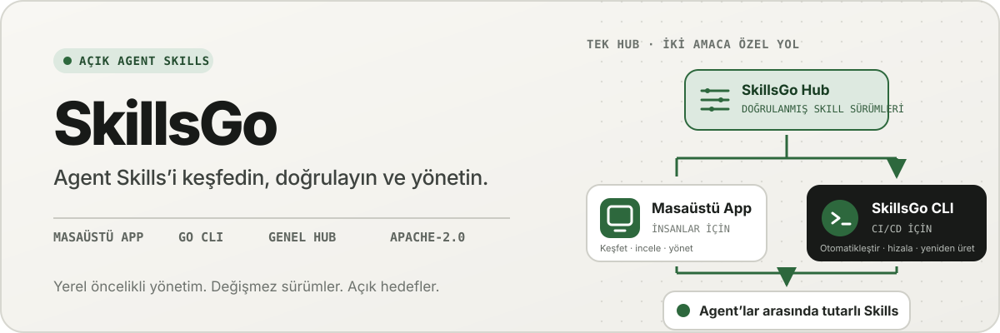
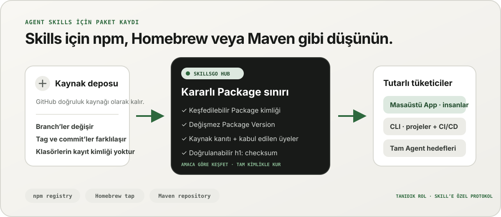
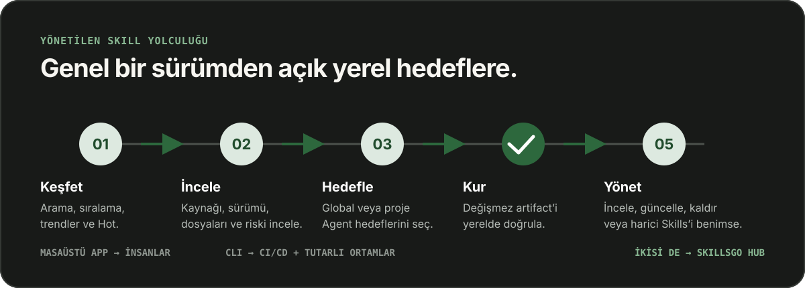

<p align="center">
  
</p>

**Agent Skills için tek iş akışı —** Kaynakla doğrulanabilen Skill'leri keşfedin, değişmez versiyonları sabitleyin ve aynı kurulumları masaüstü App veya otomasyon dostu CLI aracılığıyla çalıştırın.

<!-- README-I18N:START -->

  <p>
    <a href="../../README.md">English</a> ·
    <a href="./README.zh-CN.md">简体中文</a> ·
    <a href="./README.zh-TW.md">繁體中文（台灣）</a> ·
    <a href="./README.zh-HK.md">繁體中文（香港）</a> ·
    <a href="./README.ja.md">日本語</a> ·
    <a href="./README.ko.md">한국어</a> ·
    <a href="./README.fr.md">Français</a> ·
    <a href="./README.de.md">Deutsch</a> ·
    <a href="./README.it.md">Italiano</a> ·
    <a href="./README.es.md">Español</a> ·
    <a href="./README.pt-BR.md">Português (Brasil)</a> ·
    <a href="./README.ru.md">Русский</a> ·
    <a href="./README.ar.md">العربية</a> ·
    <a href="./README.hi.md">हिन्दी</a> ·
    <a href="./README.id.md">Bahasa Indonesia</a> ·
    <strong>Türkçe</strong> ·
    <a href="./README.nl.md">Nederlands</a> ·
    <a href="./README.pl.md">Polski</a> ·
    <a href="./README.th.md">ไทย</a> ·
    <a href="./README.vi.md">Tiếng Việt</a> ·
    <a href="./README.ms.md">Bahasa Melayu</a> ·
    <a href="./README.sv.md">Svenska</a> ·
    <a href="./README.uk.md">Українська</a>
  </p>
<!-- README-I18N:END -->

SkillsGo, Agent Skills'i keşfetmeye, sürüm oluşturmaya ve çalıştırmaya yönelik kaynak açısından doğrulanabilir bir ekosistemdir. Skill'leri keşfetmek ve yönetmek için masaüstü App'i, kurulumları tekrarlanabilir hale getirmek için CLI'yi ve değişmez Package Version'lar için paylaşılan veya şirket içinde barındırılan dağıtım kaynağı olarak Hub'ı kullanın.

> **Agent Skills için npm, Homebrew veya Maven gibi düşünün.** GitHub kodun doğruluk kaynağı olmaya devam eder; SkillsGo Hub desteklenen kaynakları, App ve CLI'nin Agent'lara ve makinelere tutarlı biçimde kurabileceği, keşfedilebilir, değişmez ve sağlama toplamıyla doğrulanabilir Skill Package'lara dönüştürür.

<p align="center">
  
</p>

**Hareketli kaynaktan istikrarlı bağımlılığa —** Hub, makinelere tam Package kimliği, değişmez sürümler, kabul edilen Skill üyeliği ve sağlama toplamları verirken insanlara amaca dayalı keşif olanağı sağlar.

## İşletim modelinizi seçin

| Modu | Şunun için en iyisi | SkillsGo neler sağlar |
| --- | --- | --- |
| **Kişisel App** | Skill'leri etkileşimli olarak keşfetme ve yönetme | Kaynak kanıtları, desteklenen-Agent hedefleri, proje ve küresel Kitaplıklar, güvenli güncelleme önizlemeleri ve yerel bağlam ayak izi öngörüleri |
| **CLI ve CI/CD** | Tekrarlanabilir geliştirici ortamları ve otomasyon | Makine tarafından okunabilen komutlar, tam Skill seçimi, `skills.yaml`, `skills-lock.yaml`, sağlama toplamı doğrulaması, çevrimdışı önbellek kurtarma ve kapsama duyarlı güncellemeler |
| **Kendi kendine barındırılan Hub** | Kontrollü bir Skill kataloğuna ihtiyaç duyan ekipler | Aynı genel protokole, değiştirilemez Package Version'lara, aranabilir meta verilere, statik Git artifact'lerine ve isteğe bağlı erişim kontrolüne sahip yapılandırılabilir bir Hub Origin |

Karşılaştırma protokol uyumluluğuyla değil rolle ilgilidir:

| Tanıdık model | SkillsGo Hub, Agent Skills'e neler getiriyor |
| --- | --- |
| **npm kaydı** | Bilinmeyen bir klasörü hareketli bir daldan kopyalamak yerine aranabilir Package kimliği ve açık, değişmez sürümler |
| **Homebrew tap'i** | App veya CLI'nin geliştirici makinelerinde kullanabileceği güvenilir bir dağıtım kaynağı |
| **Maven deposu** | Kararlı koordinatlar, değişmez yapılar, sağlama toplamları ve kilitlenebilir bağımlılık çözümü |
| **Skill'e özgü katman** | Kaynak kanıtı, kabul edilen Skill üyeliği, tam üye seçimi, desteklenen Agent meta verileri ve kurulum hedefleri |

Hub, GitHub'ın yerini almaz veya npm, Homebrew ya da Maven ile uyumluymuş gibi davranmaz. Agent Skills'e, bu ekosistemlerin diğer yazılım türleri için tanıdık hale getirdiği kayıt ve dağıtım güvencelerini sağlar.

## Neden SkillsGo

- **Kurulumdan önce kaynak kanıtı** — bir makineyi değiştirmeden önce kaynak deposunu, değişmez sürümü, desteklenen Agent'leri, dosyaları ve işlenmiş `SKILL.md`'yi inceleyin.
- **Yeniden üretilebilir ortamlar** — Bir etiketi, branch'i veya commit'i bir kez çözümleyin; ortaya çıkan değişmez sürümü kaydedin ve katı bir manifest ile lock dosyası üzerinden geri yükleyin.
- **Bir Package, açık üyeler** — Skill adlarını veya yollarını ve bunları alması gereken Agent hedeflerini seçerken eksiksiz bir Package Version dağıtın.
- **Önce yerel güvenlik** — yerel değişiklikleri koruyun, türetilmiş durumu yeniden oluşturulabilir halde tutun ve Hub mevcut olmadığında yerel envanter çalışmalarına devam edin.
- **Bağlam ayak izi öngörüleri** — yerleşik Skill adlarının ve açıklamalarının karakter ayak izini tahmin edin, ardından son 45 veya 90 gün içinde gözlemlenen çağrıları olmayan Skill'leri belirleyin. Bu, model faturalandırma telemetrisi değil, yerel bağlam proxy'sidir.
- **İki ürün arayüzü, tek protokol** — etkileşimli iş akışları için App'i ve otomasyon için CLI'yi kullanın; her ikisi de aynı Hub sözleşmesini kullanır.

## App'i çalışırken görün

Masaüstü App keşif, kaynak kanıtları, kurulum hedefleri ve yerel envanteri kullanıcı dostu tek bir akışta birleştirir. Kişisel kullanım hesap gerektirmez.

<p align="center">
  
</p>

**Canlı Hub keşfi —** Oturum açmadan sürekli olarak güncellenen bir kataloğa göz atın; böylece kullanışlı Skill'ler herhangi bir yerel kurulum veya yapılandırma değişikliğinden önce görünür.

### Keşfedin ve inceleyin

Skill veya kaynak deposuna göre arama yapın, sıralamayı ve arama sonuçlarını keşfedin ve kurulumdan önce kaynak deposunu, değişmez sürümü, desteklenen Agent'leri, çevrilmiş özeti ve oluşturulan `SKILL.md`'yi inceleyin.

<p align="center">
  
</p>

**Kaynak bilinçli arama —** Skill'leri yetenek veya depoya göre bulun ve Package bağlamlarını görün; bu, yalıtılmış bir parçacığa güvenmek yerine ilgili Skill'leri karşılaştırmanıza yardımcı olur.

<p align="center">
  
</p>

**Kurulumdan önce inceleyin —** Önce değişmez sürümü, desteklenen Agent'leri, kaynak dosyalarını ve işlenmiş talimatları gözden geçirerek tedarik zinciri sürprizlerini ve kazara makine değişikliklerini azaltın.

### Yerel Skill'leri kurun ve yönetin

Genel olarak veya seçilen projelere yükleyin, aynı Skill sürümünü alması gereken Agent hedeflerini seçin ve uygulamadan önce Package güncellemesinin sonuçlarını inceleyin.

<p align="center">
  
</p>

**Açık kurulum hedefleri —** Küresel veya proje kapsamını ve Skill alan tam Agent'leri seçerek, dosyaları elle kopyalamaya gerek kalmadan bir sürümün tutarlı olmasını sağlayın.

<p align="center">
  
</p>

**Etkiye duyarlı güncellemeler —** Bir güncellemeyi uygulamadan önce sürüm geçişlerine ve kaldırılan Skill'lere bakın, böylece bağımlılık değişiklikleri bilinçli ve kurtarılabilir kalır.

<p align="center">
  
</p>

**Global Kitaplık bilgileri —** 45/90 günlük yerel kullanımı, bağlam ayak izini ve Agent görünürlüğünü tek bir envanterde karşılaştırarak kullanılmayan Skill'lerin ve yerleşik bağlamın yönetilmesini kolaylaştırın.

<p align="center">
  
</p>

**Proje kapsamlı yönetişim —** Aynı envanteri tek bir projeye daraltın; böylece kurulumları, kullanım kanıtları ve yönetilmeyen Skill'ler küresel gürültü olmadan incelenebilir.

## CLI ve Hub aracılığıyla sürümlendirilmiş dağıtım

CLI ve Hub, SkillsGo'nun mühendislik yüzeyini oluşturur. Hub, hareketli bir kaynak deposunu kararlı bir bağımlılık sınırına dönüştürür: Package dağıtım birimidir ve her Package Version, bir kaynak revizyonunun ve onun kabul edilen tam Skill üyeliğinin değişmez bir anlık görüntüsüdür. Bu, makineler tam kimliğe göre yüklenirken insanların niyete göre keşfetmesine olanak tanır.

```yaml
dependencies:
  github.com/acme/skills:
    version: v1.2.3
    skills: [review, design]
    agents: [codex, claude-code]
```

`skills.yaml`, istenen Package sürümünü, seçilen üyeleri ve Agent hedeflerini kaydeder. Oluşturulan `skills-lock.yaml`, bu sürümü Package `h1:` toplamına bağlar. Yeni bir makine veya CI işi, hareketli bir dalı takip etmek yerine aynı yükleme akışını çalıştırabilir ve aynı artifact'i doğrulayabilir.

```sh
# Discover and inspect
npx skillsgo find typescript
npx skillsgo show github.com/acme/skills@v1.2.3

# Add exact members to a project or the global scope
npx skillsgo add github.com/acme/skills@v1.2.3 \
  --skill review --agent codex

# Restore, preview, and update reproducibly
npx skillsgo install
npx skillsgo update --dry-run
npx skillsgo update --yes
```

Aynı komutlar başka bir Hub Kaynağını hedefleyebilir:

```sh
npx skillsgo add github.com/acme/skills@v1.2.3 \
  --hub https://hub.example.com \
  --skill review --agent codex
```

## Ekipler için kendi kendine barındırılan Hub

Kuruluşlar, resmi hizmetle aynı SkillsGo protokolünü uygulayan bir Hub Origin çalıştırabilir. Bu, onaylanmış bir katalog oluşturmayı, Package Version geçmişini değiştirilemez halde tutmayı, aranabilir meta verileri sunmayı, doğrulanmış artifact'ler sağlamayı ve App veya CLI'yi tek bir kontrollü kaynağa yönlendirmeyi mümkün kılar.

```text
Source repository
       │
       ▼
Hub Package Version ── immutable metadata, artifact, and h1: sum
       │
       ├── SkillsGo App (interactive discovery and management)
       └── SkillsGo CLI (projects, CI/CD, and repeatable installs)
```

Halka açık Hub sözleşmesi şu anda desteklenen genel Skill Kaynaklarına odaklanmaktadır. Özel bir Hub, onaylanmış Package'lerin kontrollü dağıtımını sağlayabilir; özel kaynak alımı ve kurumsal kimlik entegrasyonları, istemcide gizli varsayımlar değil, ayrı dağıtım yetenekleridir.

## Nasıl çalışır?

<p align="center">
  
</p>

**Paylaşılan değişmez bir protokol —** Hub, kaynak kanıtlarını bir kez çözerken, App ve CLI aynı Package Version ve sağlama toplamını tüketerek etkileşimli ve otomatik kurulumlara aynı sonucu verir.

1. Desteklenen bir kaynak, değişmez bir Package Version'a çözümlenir.
2. Hub, Package meta verilerini, kabul edilen Skill üyeliğini, statik bir Git yapıtını ve doğrulanabilir bir Package toplamını yayınlar.
3. App veya CLI aynı protokolü okur ve kullanıcının tam üyeleri, kapsamları ve Agent hedeflerini seçmesine olanak tanır.
4. CLI, manifest ve kilitten korunan yerel Package ağaçlarını ve Agent projeksiyonlarını gerçekleştirir.
5. Güncellemeler, yeni ve değişmez bir sürümü çözer ve yerel durumu değiştirmeden önce etkisini gösterir.

## Monorepo'yu keşfedin

```text
skillsgo/
├── app/       Flutter desktop client and user experience
├── cli/       Go CLI, local state, and Skill execution engine
├── hub/       Public Hub service and reusable self-host runtime
├── protocol/  Shared executable contracts used by CLI and Hub
├── web/       Public product, Hub, and documentation surface
└── e2e/       Cross-product CLI/Hub and desktop journeys
```

Ürün sınırları ve etki alanı dili için [`CONTEXT-MAP.md`](../../CONTEXT-MAP.md) belgesini okuyun. Genel yayın ve yapı modeli [`docs/release-design.md`](../release-design.md) belgesinde belgelenmiştir.

## Yerel olarak çalıştır

Birleştirilmiş geliştirme topolojisi şu anda macOS'u hedefliyor ve Flutter, Go, Docker, [Process Compose](https://github.com/F1bonacc1/process-compose) ve [Air](https://github.com/air-verse/air) gerektiriyor.

```sh
make dev
```

Bu, tek bir denetimli oturum altında PostgreSQL'i, yerel Hub'ı, yeni oluşturulmuş bir CLI'yi ve Flutter masaüstü App'ini başlatır. Yapılandırılmış tüm çalışma alanlarını doğrulamak için:

```sh
make test
```

Her çalışma alanı için odaklanmış giriş noktaları mevcuttur:

| Çalışma Alanı | Geliştirme veya doğrulama |
| --- | --- |
| App | `cd app && flutter run -d macos` |
| CLI | `cd cli && go test ./...` |
| Hub | `cd hub && go test ./...` |
| Protokol | `cd protocol && go test ./...` |
| Web | `cd web && pnpm install && pnpm dev` |

Ürün davranışını değiştirmeden önce [CONTRIBUTING.md](../../CONTRIBUTING.md) adresine bakın.

## Proje durumu

SkillsGo aktif erken sürüm geliştirme aşamasındadır. App, CLI, Hub ve Protokol ayrı yayın birimleri olarak geliştirilirken paket yöneticisi çıktıları ve yerel arşivler aynı doğrulanmış CLI yapı matrisinden birleştirilir. Desteklenen hedefler, yapı bütünlüğü, güncelleme davranışı ve tedarik zinciri gereksinimleri için [sürüm tasarımına](../release-design.md) bakın.

## Topluluk

- Sorular, sorun giderme ve erken fikirler için [GitHub Tartışmaları](https://github.com/skillsgo/skillsgo/discussions) kullanın.
- Tekrarlanabilir hatalar, somut özellik talepleri ve dokümantasyon sorunları için odaklanmış [sorun formlarını](https://github.com/skillsgo/skillsgo/issues/new/choose) kullanın.
- Güvenlik açıklarını özel olarak bildirmek için [SECURITY.md](../../SECURITY.md) adresini takip edin.
- Katılım, [Davranış Kuralları](../../CODE_OF_CONDUCT.md) ve [yönetim modeli](../../GOVERNANCE.md) tarafından yönetilmektedir.

## Lisans

SkillsGo, [Apache Lisansı 2.0](../../LICENSE) kapsamında lisanslanmıştır.

Hub, [Athens](https://github.com/gomods/athens) projesinden türetilmiş kod içerir; bu kod Athens MIT Lisansı ve atıf bildirimlerine tabi olmaya devam eder. Bkz. [`NOTICE`](../../NOTICE) ve [`THIRD_PARTY_LICENSES/ATHENS-LICENSE`](../../THIRD_PARTY_LICENSES/ATHENS-LICENSE).
