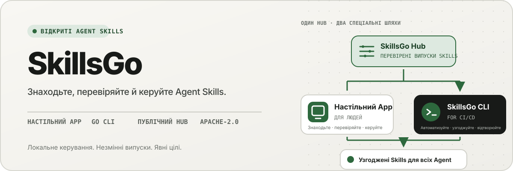
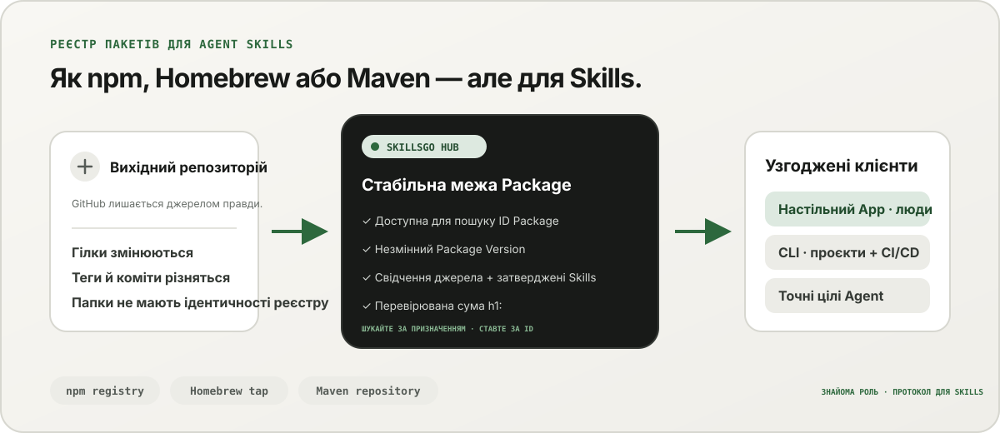
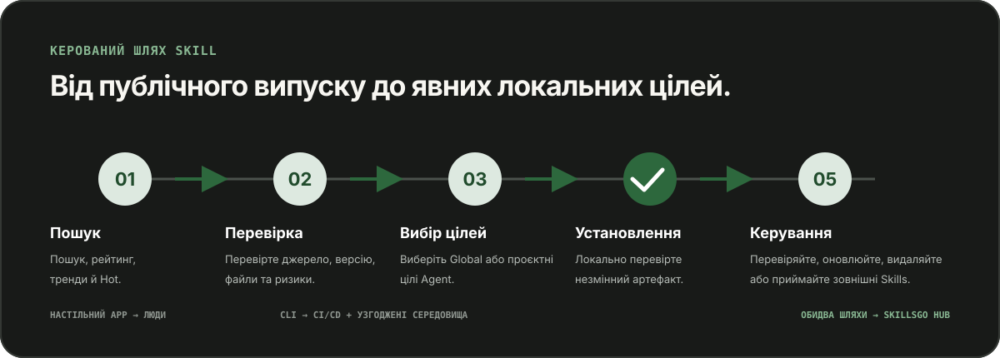

<p align="center">
  
</p>

**Єдиний робочий процес для Agent Skills —** Відкрийте для себе Skill, які можна перевірити, закріпіть незмінні версії та керуйте тими самими інсталяціями за допомогою ПК App або CLI, зручного для автоматизації.

<!-- README-I18N:START -->

  <p>
    <a href="../../README.md">English</a> ·
    <a href="./README.zh-CN.md">简体中文</a> ·
    <a href="./README.zh-TW.md">繁體中文（台灣）</a> ·
    <a href="./README.zh-HK.md">繁體中文（香港）</a> ·
    <a href="./README.ja.md">日本語</a> ·
    <a href="./README.ko.md">한국어</a> ·
    <a href="./README.fr.md">Français</a> ·
    <a href="./README.de.md">Deutsch</a> ·
    <a href="./README.it.md">Italiano</a> ·
    <a href="./README.es.md">Español</a> ·
    <a href="./README.pt-BR.md">Português (Brasil)</a> ·
    <a href="./README.ru.md">Русский</a> ·
    <a href="./README.ar.md">العربية</a> ·
    <a href="./README.hi.md">हिन्दी</a> ·
    <a href="./README.id.md">Bahasa Indonesia</a> ·
    <a href="./README.tr.md">Türkçe</a> ·
    <a href="./README.nl.md">Nederlands</a> ·
    <a href="./README.pl.md">Polski</a> ·
    <a href="./README.th.md">ไทย</a> ·
    <a href="./README.vi.md">Tiếng Việt</a> ·
    <a href="./README.ms.md">Bahasa Melayu</a> ·
    <a href="./README.sv.md">Svenska</a> ·
    <strong>Українська</strong>
  </p>
<!-- README-I18N:END -->

SkillsGo — це екосистема з можливістю перевірки джерела для виявлення, створення версій і керування Agent Skills. Використовуйте робочий стіл App, щоб досліджувати та керувати Skill, CLI, щоб зробити інсталяції відтворюваними, і Hub як спільний або власний джерело розповсюдження для незмінних Package Version.

> **Подумайте про npm, Homebrew або Maven, але для Agent Skills.** GitHub залишається джерелом правди для коду; SkillsGo Hub перетворює підтримувані джерела на доступні для пошуку незмінні Skill Package із перевірюваними контрольними сумами, які App і CLI можуть узгоджено встановлювати для різних Agent і на різних машинах.

<p align="center">
  
</p>

**Від мінливого джерела до стабільної залежності —** Hub допомагає людям шукати за призначенням, а машинам надає точну ідентичність Package, незмінні версії, затверджений склад Skills і контрольні суми.

## Виберіть операційну модель

| Режим | Найкраще для | Що забезпечує SkillsGo |
| --- | --- | --- |
| **Особистий App** | Інтерактивне виявлення та керування Skill | Вихідні докази, підтримувані цілі Agent, проектні та глобальні бібліотеки, попередній перегляд безпечних оновлень і аналіз локального контексту |
| **CLI і CI/CD** | Повторювані середовища розробника та автоматизація | Машиночитані команди, точний вибір Skill, `skills.yaml`, `skills-lock.yaml`, перевірка контрольної суми, відновлення кешу в автономному режимі та оновлення з урахуванням області дії |
| **Власний Hub** | Команди, яким потрібен керований каталог Skill | Настроюваний Hub Origin з тим самим загальнодоступним протоколом, незмінними Package Version, доступними для пошуку метаданими, статичними артефактами Git і додатковим контролем доступу |

Порівняння стосується ролі, а не сумісності протоколу:

| Знайома модель | Що привносить SkillsGo Hub у Agent Skills |
| --- | --- |
| **Реєстр npm** | Ідентифікація Package із можливістю пошуку та явні незмінні версії замість копіювання невідомої папки з рухомої гілки |
| **Homebrew tap** | Одне надійне джерело дистрибуції, яке App або CLI можуть використовувати на машинах розробника |
| **репозиторій Maven** | Стабільні координати, незмінні артефакти, контрольні суми та блоковане вирішення залежностей |
| **Рівень для Skills** | Свідчення джерела, затверджений склад Skills, точний вибір елементів, підтримувані метадані Agent і цілі встановлення |

Hub не замінює GitHub і не претендує на сумісність із npm, Homebrew або Maven. Це надає Agent Skills реєстр і гарантії розповсюдження тих екосистем, які звичні для інших видів програмного забезпечення.

## Чому SkillsGo

- **Доказ джерела перед встановленням** — перевірте сховище вихідних кодів, незмінний випуск, підтримувані Agent, файли та відрендерений `SKILL.md` перед зміною машини.
- **Відтворювані середовища** — один раз визначте тег, гілку або коміт, збережіть отриману незмінну версію та відновлюйте її за допомогою суворого маніфесту й файла блокування.
- **Один Package, явні члени** — розповсюджуйте повний Package Version, вибираючи точні імена або шляхи Skill і цілі Agent, які мають їх отримувати.
- **Локальна безпека на першому місці** — захищайте локальні модифікації, зберігайте можливість відновлення похідного стану та продовжуйте локальну інвентаризацію, коли Hub недоступний.
- **Аналіз контекстного відбитку** — оцініть кількість символів, яку займають постійно завантажені назви й описи Skills, а потім визначте Skills, для яких не спостерігалося викликів протягом останніх 45 або 90 днів. Це локальний непрямий показник використання контексту, а не телеметрія білінгу моделі.
- **Два інтерфейси продукту, один протокол** — використовуйте App для інтерактивних робочих процесів і CLI для автоматизації; обидва відповідають одному контракту Hub.

## Подивіться App у дії

Настільний застосунок об’єднує пошук, свідчення джерела, цілі встановлення та локальний інвентар у зручному для людини процесі. Особисте використання не обліковується.

<p align="center">
  
</p>

**Відкриття Hub в реальному часі —** Переглядайте безперервно оновлюваний каталог без входу, щоб корисні Skill були видимі до будь-якої локальної інсталяції чи зміни конфігурації.

### Знаходьте та перевіряйте

Шукайте за Skill або вихідним репозиторієм, досліджуйте рейтинг і результати пошуку, а також перевіряйте вихідний репозиторій, незмінний випуск, підтримувані Agent, перекладене резюме та відтворений `SKILL.md` перед установкою.

<p align="center">
  
</p>

**Пошук з урахуванням джерел —** Знайдіть Skill за можливостями чи сховищами та перегляньте їхній контекст Package, що допоможе вам порівняти пов’язані Skill замість того, щоб довіряти ізольованому фрагменту.

<p align="center">
  
</p>

**Перевірте перед встановленням —** Спочатку перегляньте незмінну версію, підтримувані Agent, вихідні файли та відтворені інструкції, щоб зменшити сюрпризи в ланцюжку постачання та випадкові зміни машини.

### Встановити та керувати локальними Skill

Встановіть глобально або у вибраних проектах, виберіть цілі Agent, які мають отримати той самий випуск Skill, і перегляньте наслідки оновлення Package перед його застосуванням.

<p align="center">
  
</p>

**Явні цілі встановлення —** Виберіть глобальну область або область проекту та точні Agent, які отримають Skill, зберігаючи узгодженість одного випуску без копіювання файлів вручну.

<p align="center">
  
</p>

**Оновлення з урахуванням впливу —** Дивіться зміни версій і видалені Skill перед застосуванням оновлення, тому зміни залежностей залишаються навмисними та відновлюваними.

<p align="center">
  
</p>

**Аналіз глобальної бібліотеки —** Порівняйте 45/90-денне локальне використання, контекстний відбиток і видимість Agent в одному інвентарі, полегшуючи керування невикористаними Skill і резидентним контекстом.

<p align="center">
  
</p>

**Управління в межах проекту —** звузьте той самий інвентар до одного проекту, щоб його інсталяції, докази використання та некеровані Skill можна було переглядати без глобального шуму.

## Розповсюдження з версіями через CLI і Hub

CLI і Hub утворюють інженерний інтерфейс SkillsGo. Hub перетворює мінливий вихідний репозиторій на стабільну межу залежності: Package є одиницею розповсюдження, а кожен Package Version — незмінним знімком однієї версії джерела та повного затвердженого складу Skills. Це дає людям змогу шукати за призначенням, а машинам — установлювати за точною ідентичністю.

```yaml
dependencies:
  github.com/acme/skills:
    version: v1.2.3
    skills: [review, design]
    agents: [codex, claude-code]
```

`skills.yaml` записує потрібну версію Package, вибрані учасники та цілі Agent. Згенерований `skills-lock.yaml` прив’язує цю версію до суми Package `h1:`. Нова машина або завдання CI може запускати той самий потік інсталяції та перевіряти той самий артефакт замість того, щоб слідувати рухомій гілці.

```sh
# Discover and inspect
npx skillsgo find typescript
npx skillsgo show github.com/acme/skills@v1.2.3

# Add exact members to a project or the global scope
npx skillsgo add github.com/acme/skills@v1.2.3 \
  --skill review --agent codex

# Restore, preview, and update reproducibly
npx skillsgo install
npx skillsgo update --dry-run
npx skillsgo update --yes
```

Ті самі команди можуть націлюватися на інший Hub Origin:

```sh
npx skillsgo add github.com/acme/skills@v1.2.3 \
  --hub https://hub.example.com \
  --skill review --agent codex
```

## Власний Hub для команд

Організації можуть запускати Hub Origin, який реалізує той самий протокол SkillsGo, що й офіційна служба. Це дає змогу керувати затвердженим каталогом, зберігати історію Package Version незмінною, відкривати доступні для пошуку метадані, обслуговувати перевірені артефакти та спрямовувати App або CLI на одне контрольоване джерело.

```text
Source repository
       │
       ▼
Hub Package Version ── immutable metadata, artifact, and h1: sum
       │
       ├── SkillsGo App (interactive discovery and management)
       └── SkillsGo CLI (projects, CI/CD, and repeatable installs)
```

Загальнодоступний контракт Hub наразі зосереджений на підтримуваних публічних джерелах Skill. Приватний Hub може забезпечити контрольоване розповсюдження схвалених Package; прийом із приватного джерела та інтеграція ідентифікаційної інформації підприємства є окремими можливостями розгортання, а не припущеннями, прихованими в клієнті.

## Як це працює

<p align="center">
  
</p>

**Спільний незмінний протокол —** Hub одноразово розпізнає докази джерела, тоді як App і CLI використовують однакові Package Version і контрольну суму, даючи однаковий результат для інтерактивних і автоматизованих установок.

1. Підтримуване джерело перетворюється на один незмінний Package Version.
2. Hub публікує метадані Package, затверджений склад Skills, статичний артефакт Git і перевірювану суму Package.
3. App або CLI читає той самий протокол і дозволяє користувачеві вибирати точні члени, області та цілі Agent.
4. CLI матеріалізує захищені локальні дерева Package і проекції Agent із маніфесту та блокування.
5. Оновлення вирішують нову незмінну версію та показують вплив перед зміною локального стану.

## Дослідіть monorepo

```text
skillsgo/
├── app/       Flutter desktop client and user experience
├── cli/       Go CLI, local state, and Skill execution engine
├── hub/       Public Hub service and reusable self-host runtime
├── protocol/  Shared executable contracts used by CLI and Hub
├── web/       Public product, Hub, and documentation surface
└── e2e/       Cross-product CLI/Hub and desktop journeys
```

Прочитайте [`CONTEXT-MAP.md`](../../CONTEXT-MAP.md), щоб дізнатися про межі продукту та мову домену. Загальнодоступний випуск і модель артефакту задокументовано в [`docs/release-design.md`](../release-design.md).

## Запустіть локально

Уніфікована топологія розробки наразі націлена на macOS і вимагає Flutter, Go, Docker, [Process Compose](https://github.com/F1bonacc1/process-compose) і [Air](https://github.com/air-verse/air).

```sh
make dev
```

Це запускає PostgreSQL, локальний Hub, нещодавно зібраний CLI і робочий стіл Flutter App під одним контрольованим сеансом. Щоб перевірити всі налаштовані робочі області:

```sh
make test
```

Сфокусовані точки входу доступні для кожної робочої області:

| Робоча область | Розробка або перевірка |
| --- | --- |
| App | `cd app && flutter run -d macos` |
| CLI | `cd cli && go test ./...` |
| Hub | `cd hub && go test ./...` |
| Протокол | `cd protocol && go test ./...` |
| Веб | `cd web && pnpm install && pnpm dev` |

Перегляньте [CONTRIBUTING.md](../../CONTRIBUTING.md), перш ніж змінювати поведінку продукту.

## Статус проекту

SkillsGo знаходиться в активній розробці раннього випуску. App, CLI, Hub і протокол розроблені як окремі випуски, тоді як вихідні дані менеджера пакетів і рідні архіви зібрані з однієї перевіреної матриці збірки CLI. Перегляньте [дизайн випуску](../release-design.md), щоб дізнатися про підтримувані цілі, цілісність артефактів, поведінку оновлення та вимоги до ланцюжка поставок.

## Спільнота

- Використовуйте [GitHub Discussions](https://github.com/skillsgo/skillsgo/discussions) для запитань, усунення несправностей і перших ідей.
- Використовуйте цілеспрямовані [форми проблем](https://github.com/skillsgo/skillsgo/issues/new/choose) для відтворюваних помилок, запитів конкретних функцій і проблем з документацією.
- Підпишіться на [SECURITY.md](../../SECURITY.md), щоб приватно повідомляти про вразливості.
- Участь регулюється [Кодексом поведінки](../../CODE_OF_CONDUCT.md) і [моделлю управління](../../GOVERNANCE.md).

## Ліцензія

SkillsGo ліцензовано згідно з [ліцензією Apache 2.0](../../LICENSE).

Hub містить код, отриманий від [Athens](https://github.com/gomods/athens), на який поширюється дія ліцензії Athens MIT і повідомлень про авторство. Див. [`NOTICE`](../../NOTICE) і [`THIRD_PARTY_LICENSES/ATHENS-LICENSE`](../../THIRD_PARTY_LICENSES/ATHENS-LICENSE).
