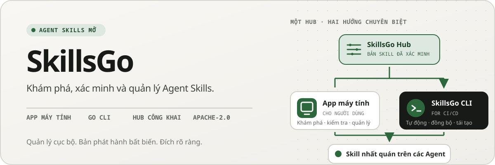
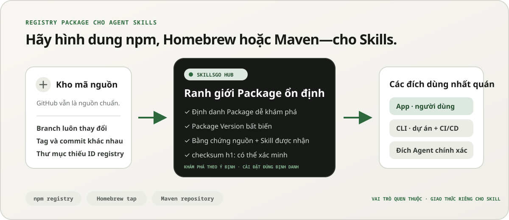
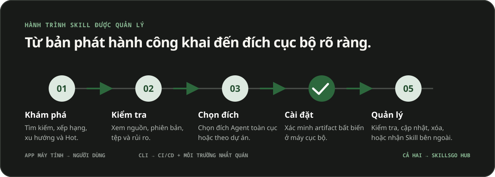

<p align="center">
  
</p>

**Một quy trình công việc dành cho Agent Skills —** Khám phá các Skill có thể xác minh nguồn, ghim các phiên bản không thể thay đổi và vận hành các cài đặt tương tự thông qua App trên máy tính để bàn hoặc CLI thân thiện với tự động hóa.

<!-- README-I18N:START -->

  <p>
    <a href="../../README.md">English</a> ·
    <a href="./README.zh-CN.md">简体中文</a> ·
    <a href="./README.zh-TW.md">繁體中文（台灣）</a> ·
    <a href="./README.zh-HK.md">繁體中文（香港）</a> ·
    <a href="./README.ja.md">日本語</a> ·
    <a href="./README.ko.md">한국어</a> ·
    <a href="./README.fr.md">Français</a> ·
    <a href="./README.de.md">Deutsch</a> ·
    <a href="./README.it.md">Italiano</a> ·
    <a href="./README.es.md">Español</a> ·
    <a href="./README.pt-BR.md">Português (Brasil)</a> ·
    <a href="./README.ru.md">Русский</a> ·
    <a href="./README.ar.md">العربية</a> ·
    <a href="./README.hi.md">हिन्दी</a> ·
    <a href="./README.id.md">Bahasa Indonesia</a> ·
    <a href="./README.tr.md">Türkçe</a> ·
    <a href="./README.nl.md">Nederlands</a> ·
    <a href="./README.pl.md">Polski</a> ·
    <a href="./README.th.md">ไทย</a> ·
    <strong>Tiếng Việt</strong> ·
    <a href="./README.ms.md">Bahasa Melayu</a> ·
    <a href="./README.sv.md">Svenska</a> ·
    <a href="./README.uk.md">Українська</a>
  </p>
<!-- README-I18N:END -->

SkillsGo là một hệ sinh thái có thể xác minh nguồn để khám phá, lập phiên bản và vận hành Agent Skills. Sử dụng máy tính để bàn App để khám phá và quản lý Skill, CLI để giúp các bản cài đặt có thể lặp lại và Hub làm nguồn phân phối được chia sẻ hoặc tự lưu trữ cho các Package Version bất biến.

> **Hãy hình dung npm, Homebrew hoặc Maven—nhưng dành cho Agent Skills.** GitHub vẫn là nguồn chuẩn cho mã nguồn; SkillsGo Hub biến các nguồn được hỗ trợ thành những Package Skill dễ khám phá, bất biến và có thể xác minh bằng checksum, để App và CLI cài đặt nhất quán trên các Agent và máy khác nhau.

<p align="center">
  
</p>

**Từ nguồn di chuyển đến phần phụ thuộc ổn định —** Hub mang đến cho mọi người khả năng khám phá dựa trên mục đích đồng thời cung cấp cho máy danh tính Package chính xác, các phiên bản không thể thay đổi, tư cách thành viên Skill được chấp nhận và tổng kiểm tra.

## Chọn mô hình hoạt động của bạn

| Chế độ | Tốt nhất cho | SkillsGo cung cấp những gì |
| --- | --- | --- |
| **App cá nhân** | Khám phá và quản lý Skill tương tác | Bằng chứng nguồn, mục tiêu Agent được hỗ trợ, Thư viện dự án và toàn cầu, bản xem trước cập nhật an toàn và thông tin chi tiết về dấu chân bối cảnh cục bộ |
| **CLI và CI/CD** | Môi trường nhà phát triển lặp lại và tự động hóa | Các lệnh có thể đọc được bằng máy, lựa chọn Skill chính xác, `skills.yaml`, `skills-lock.yaml`, xác minh tổng kiểm tra, khôi phục bộ nhớ đệm ngoại tuyến và cập nhật nhận biết phạm vi |
| **Hub tự lưu trữ** | Các đội cần danh mục Skill được kiểm soát | Nguồn gốc Hub có thể định cấu hình với cùng giao thức công khai, Package Version bất biến, siêu dữ liệu có thể tìm kiếm, tạo phẩm Git tĩnh và kiểm soát truy cập tùy chọn |

Sự so sánh là về vai trò chứ không phải về khả năng tương thích giao thức:

| Mô hình quen thuộc | SkillsGo Hub mang lại điều gì cho Agent Skills |
| --- | --- |
| **Đăng ký npm** | Nhận dạng Package có thể tìm kiếm và các phiên bản bất biến rõ ràng thay vì sao chép một thư mục không xác định từ một nhánh đang di chuyển |
| **Homebrew tap** | Một nguồn phân phối đáng tin cậy mà App hoặc CLI có thể dùng trên nhiều máy của nhà phát triển |
| **Kho lưu trữ Maven** | Tọa độ ổn định, tạo phẩm bất biến, tổng kiểm tra và độ phân giải phụ thuộc có thể khóa |
| **Lớp dành riêng cho Skill** | Bằng chứng nguồn, tư cách thành viên Skill được chấp nhận, lựa chọn thành viên chính xác, siêu dữ liệu Agent được hỗ trợ và mục tiêu cài đặt |

Hub không thay thế GitHub hay tuyên bố tương thích với npm, Homebrew hoặc Maven. Hub mang đến cho Agent Skills những bảo đảm về registry và phân phối vốn đã quen thuộc trong các hệ sinh thái phần mềm khác.

## Tại sao lại là SkillsGo

- **Bằng chứng nguồn trước khi cài đặt** — kiểm tra kho lưu trữ nguồn, bản phát hành không thay đổi, các tệp, Agent được hỗ trợ và `SKILL.md` được hiển thị trước khi thay đổi máy.
- **Môi trường có thể tái tạo** — giải quyết thẻ, nhánh hoặc cam kết một lần, duy trì phiên bản bất biến thu được và khôi phục phiên bản đó thông qua tệp kê khai và khóa nghiêm ngặt.
- **Một Package, thành viên rõ ràng** — phân phối Package Version hoàn chỉnh trong khi chọn tên hoặc đường dẫn Skill chính xác và các mục tiêu Agent sẽ nhận chúng.
- **An toàn ưu tiên cục bộ** — bảo vệ các sửa đổi cục bộ, duy trì khả năng xây dựng lại trạng thái dẫn xuất và tiếp tục công việc kiểm kê cục bộ khi không có Hub.
- **Thông tin chi tiết về dấu vết bối cảnh** — ước tính dấu vết ký tự của tên và mô tả Skill thường trú, sau đó xác định các Skill không có cuộc gọi nào được quan sát trong 45 hoặc 90 ngày qua. Đây là proxy ngữ cảnh cục bộ, không phải mô hình đo từ xa thanh toán.
- **Hai giao diện sản phẩm, một giao thức** — sử dụng App cho quy trình làm việc tương tác và CLI cho tự động hóa; cả hai đều nói về cùng một hợp đồng Hub.

## Xem App đang hoạt động

App dành cho máy tính kết nối khả năng khám phá, bằng chứng nguồn, mục tiêu cài đặt và kho Skill cục bộ trong một quy trình dễ sử dụng. Người dùng cá nhân không cần tài khoản.

<p align="center">
  
</p>

**Khám phá Hub trực tiếp —** Duyệt qua danh mục được cập nhật liên tục mà không cần đăng nhập, vì vậy các Skill hữu ích sẽ hiển thị trước khi thực hiện bất kỳ thay đổi cấu hình hoặc cài đặt cục bộ nào.

### Khám phá và kiểm tra

Tìm kiếm theo Skill hoặc kho lưu trữ nguồn, khám phá thứ hạng và kết quả tìm kiếm, đồng thời kiểm tra kho lưu trữ nguồn, bản phát hành bất biến, Agent được hỗ trợ, tóm tắt được dịch và hiển thị `SKILL.md` trước khi cài đặt.

<p align="center">
  
</p>

**Tìm kiếm nhận biết nguồn —** Tìm Skill theo khả năng hoặc kho lưu trữ và xem ngữ cảnh Package của chúng, giúp bạn so sánh các Skill có liên quan thay vì tin cậy vào một đoạn mã riêng biệt.

<p align="center">
  
</p>

**Kiểm tra trước khi cài đặt —** Xem lại phiên bản không thể thay đổi, Agent được hỗ trợ, tệp nguồn và hướng dẫn được kết xuất trước, giúp giảm thiểu những bất ngờ trong chuỗi cung ứng và những thay đổi máy do vô tình.

### Cài đặt và quản trị Skill cục bộ

Cài đặt trên toàn cầu hoặc vào các dự án đã chọn, chọn mục tiêu Agent sẽ nhận được bản phát hành Skill tương tự và xem xét hậu quả của bản cập nhật Package trước khi áp dụng.

<p align="center">
  
</p>

**Mục tiêu cài đặt rõ ràng —** Chọn phạm vi toàn cầu hoặc phạm vi dự án và các Agent chính xác nhận Skill, giữ cho một bản phát hành nhất quán mà không cần sao chép tệp bằng tay.

<p align="center">
  
</p>

**Cập nhật nhận biết tác động —** Xem các chuyển đổi phiên bản và loại bỏ Skill trước khi áp dụng bản cập nhật, do đó, các thay đổi phụ thuộc vẫn có chủ ý và có thể phục hồi.

<p align="center">
  
</p>

**Thông tin chi tiết về Thư viện Toàn cầu —** So sánh mức sử dụng cục bộ trong 45/90 ngày, dấu vết ngữ cảnh và khả năng hiển thị Agent trong một khoảng không quảng cáo, giúp quản lý Skill chưa sử dụng và bối cảnh thường trú dễ dàng hơn.

<p align="center">
  
</p>

**Quản trị theo phạm vi dự án —** Thu hẹp cùng một khoảng không quảng cáo cho một dự án, do đó, việc cài đặt, bằng chứng sử dụng và Skill không được quản lý có thể được xem xét mà không gây ồn ào trên toàn cầu.

## Phân phối theo phiên bản thông qua CLI và Hub

CLI và Hub tạo thành bề mặt kỹ thuật của SkillsGo. Hub chuyển đổi kho lưu trữ nguồn di chuyển thành ranh giới phụ thuộc ổn định: Package là đơn vị phân phối và mỗi Package Version là ảnh chụp nhanh bất biến của một bản sửa đổi nguồn và tư cách thành viên Skill hoàn chỉnh được chấp nhận của nó. Điều này cho phép mọi người khám phá theo mục đích trong khi máy cài đặt theo danh tính chính xác.

```yaml
dependencies:
  github.com/acme/skills:
    version: v1.2.3
    skills: [review, design]
    agents: [codex, claude-code]
```

`skills.yaml` ghi lại phiên bản Package mong muốn, các thành viên được chọn và mục tiêu Agent. `skills-lock.yaml` được tạo sẽ liên kết phiên bản đó với tổng Package `h1:`. Một máy mới hoặc tác vụ CI có thể chạy cùng quy trình cài đặt và xác minh cùng một artifact thay vì bám theo một nhánh luôn thay đổi.

```sh
# Discover and inspect
npx skillsgo find typescript
npx skillsgo show github.com/acme/skills@v1.2.3

# Add exact members to a project or the global scope
npx skillsgo add github.com/acme/skills@v1.2.3 \
  --skill review --agent codex

# Restore, preview, and update reproducibly
npx skillsgo install
npx skillsgo update --dry-run
npx skillsgo update --yes
```

Các lệnh tương tự có thể nhắm mục tiêu Nguồn gốc Hub khác:

```sh
npx skillsgo add github.com/acme/skills@v1.2.3 \
  --hub https://hub.example.com \
  --skill review --agent codex
```

## Hub tự lưu trữ dành cho nhóm

Các tổ chức có thể chạy Hub Origin triển khai cùng giao thức SkillsGo như dịch vụ chính thức. Điều này cho phép quản lý một danh mục đã được phê duyệt, giữ cho lịch sử Package Version không thể thay đổi, hiển thị siêu dữ liệu có thể tìm kiếm, phục vụ các tạo phẩm đã được xác minh và trỏ App hoặc CLI vào một nguồn gốc được kiểm soát.

```text
Source repository
       │
       ▼
Hub Package Version ── immutable metadata, artifact, and h1: sum
       │
       ├── SkillsGo App (interactive discovery and management)
       └── SkillsGo CLI (projects, CI/CD, and repeatable installs)
```

Hợp đồng Hub công khai hiện tập trung vào các Nguồn Skill công khai được hỗ trợ. Hub riêng có thể cung cấp khả năng phân phối có kiểm soát các Package đã được phê duyệt; việc nhập nguồn riêng và tích hợp nhận dạng doanh nghiệp là các khả năng triển khai riêng biệt, không phải là các giả định ẩn trong máy khách.

## Cách thức hoạt động

<p align="center">
  
</p>

**Một giao thức bất biến được chia sẻ —** Hub phân giải bằng chứng nguồn một lần, trong khi App và CLI sử dụng cùng một Package Version và tổng kiểm tra, mang lại kết quả tương tự cho các lượt cài đặt tương tác và tự động.

1. Một nguồn được hỗ trợ được phân giải thành một Package Version bất biến.
2. Hub xuất bản siêu dữ liệu Package, tư cách thành viên Skill được chấp nhận, tạo phẩm Git tĩnh và tổng Package có thể xác minh được.
3. App hoặc CLI đọc cùng một giao thức và cho phép người dùng chọn các thành viên, phạm vi và mục tiêu Agent chính xác.
4. CLI hiện thực hóa các cây Package cục bộ được bảo vệ và các phép chiếu Agent từ bảng kê khai và khóa.
5. Các bản cập nhật giải quyết một phiên bản mới không thể thay đổi và hiển thị tác động trước khi thay đổi trạng thái cục bộ.

## Khám phá monorepo

```text
skillsgo/
├── app/       Flutter desktop client and user experience
├── cli/       Go CLI, local state, and Skill execution engine
├── hub/       Public Hub service and reusable self-host runtime
├── protocol/  Shared executable contracts used by CLI and Hub
├── web/       Public product, Hub, and documentation surface
└── e2e/       Cross-product CLI/Hub and desktop journeys
```

Đọc [`CONTEXT-MAP.md`](../../CONTEXT-MAP.md) để biết ranh giới sản phẩm và ngôn ngữ miền. Mô hình tạo tác và phát hành công khai được ghi lại trong [`docs/release-design.md`](../release-design.md).

## Chạy cục bộ

Cấu trúc liên kết phát triển hợp nhất hiện nhắm mục tiêu vào macOS và yêu cầu Flutter, Go, Docker, [Process Compose](https://github.com/F1bonacc1/process-compose) và [Air](https://github.com/air-verse/air).

```sh
make dev
```

Thao tác này khởi động PostgreSQL, Hub cục bộ, CLI mới được xây dựng và máy tính để bàn Flutter App trong một phiên được giám sát. Để xác thực tất cả các không gian làm việc được định cấu hình:

```sh
make test
```

Điểm vào tập trung có sẵn cho mỗi không gian làm việc:

| Không gian làm việc | Phát triển hoặc xác nhận |
| --- | --- |
| App | `cd app && flutter run -d macos` |
| CLI | `cd cli && go test ./...` |
| Hub | `cd hub && go test ./...` |
| Giao thức | `cd protocol && go test ./...` |
| Web | `cd web && pnpm install && pnpm dev` |

Xem [CONTRIBUTING.md](../../CONTRIBUTING.md) trước khi thay đổi hành vi của sản phẩm.

## Trạng thái dự án

SkillsGo đang trong quá trình phát triển bản phát hành sớm. App, CLI, Hub và Giao thức được phát triển dưới dạng các đơn vị phát hành riêng biệt, trong khi đầu ra của trình quản lý gói và kho lưu trữ gốc được tập hợp từ cùng một ma trận xây dựng CLI đã được xác minh. Xem [thiết kế phát hành](../release-design.md) để biết các mục tiêu được hỗ trợ, tính toàn vẹn của vật phẩm, hành vi cập nhật và các yêu cầu về chuỗi cung ứng.

## Cộng đồng

- Sử dụng [Thảo luận GitHub](https://github.com/skillsgo/skillsgo/discussions) để đặt câu hỏi, khắc phục sự cố và ý tưởng ban đầu.
- Sử dụng [biểu mẫu vấn đề tập trung](https://github.com/skillsgo/skillsgo/issues/new/choose) cho các lỗi có thể tái tạo, các yêu cầu tính năng cụ thể và các vấn đề về tài liệu.
- Theo dõi [SECURITY.md](../../SECURITY.md) để báo cáo các lỗ hổng một cách riêng tư.
- Việc tham gia được điều chỉnh bởi [Quy tắc ứng xử](../../CODE_OF_CONDUCT.md) và [mô hình quản trị](../../GOVERNANCE.md).

## Giấy phép

SkillsGo được cấp phép theo [Giấy phép Apache 2.0](../../LICENSE).

Hub chứa mã có nguồn gốc từ [Athens](https://github.com/gomods/athens), vẫn tuân theo Giấy phép Athens MIT và thông báo ghi công. Xem [`NOTICE`](../../NOTICE) và [`THIRD_PARTY_LICENSES/ATHENS-LICENSE`](../../THIRD_PARTY_LICENSES/ATHENS-LICENSE).
