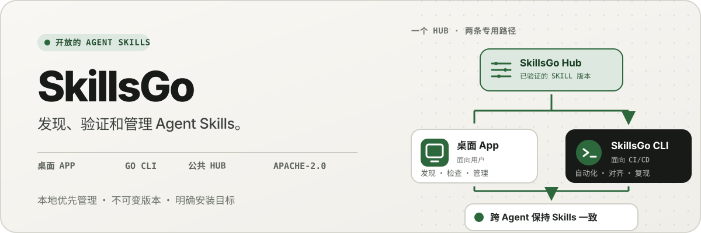
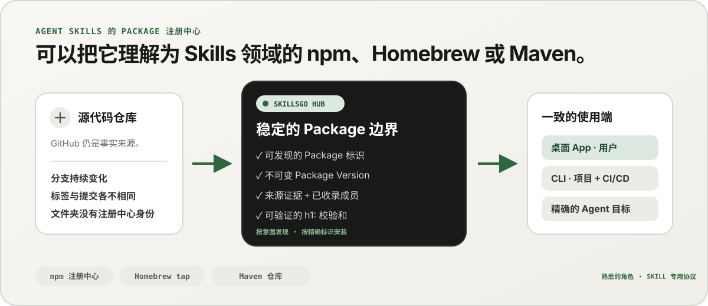
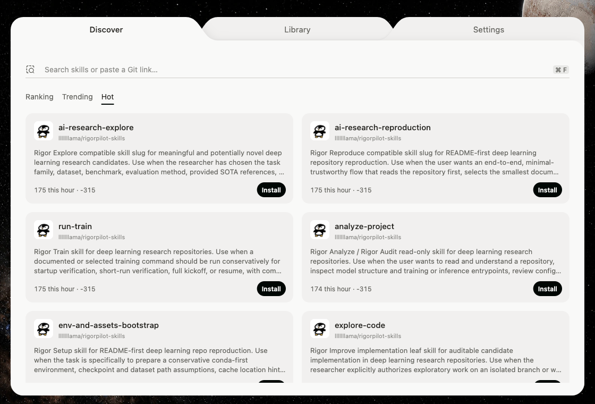
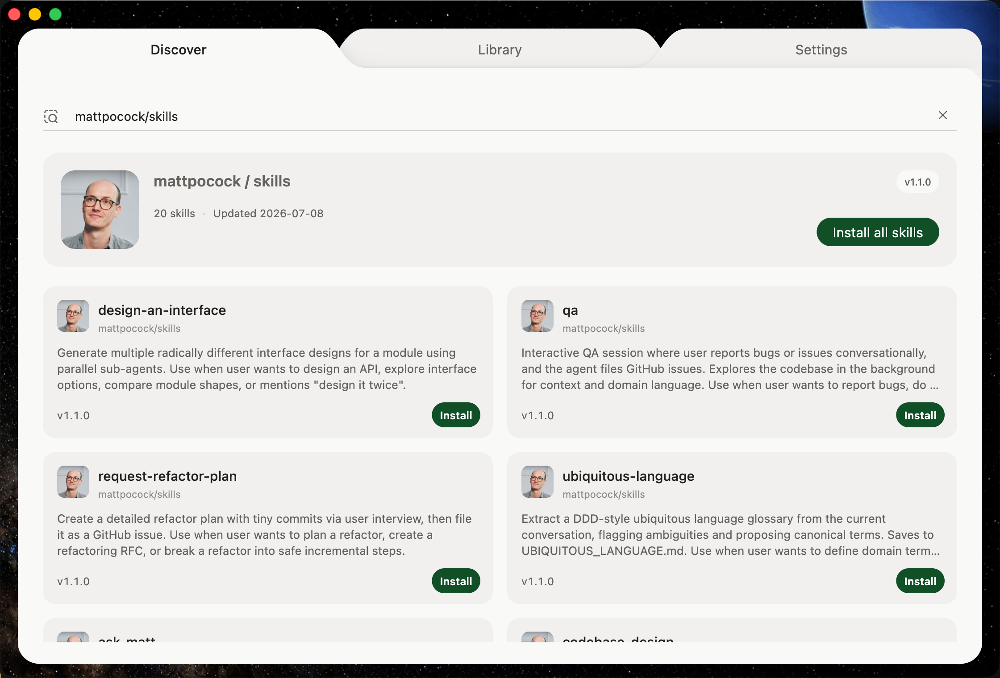
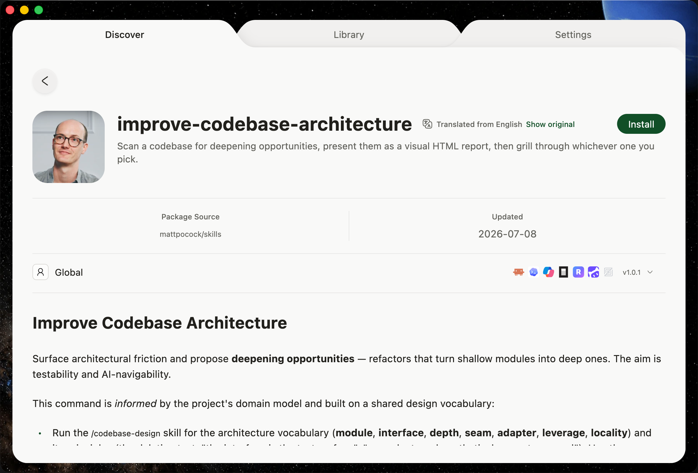
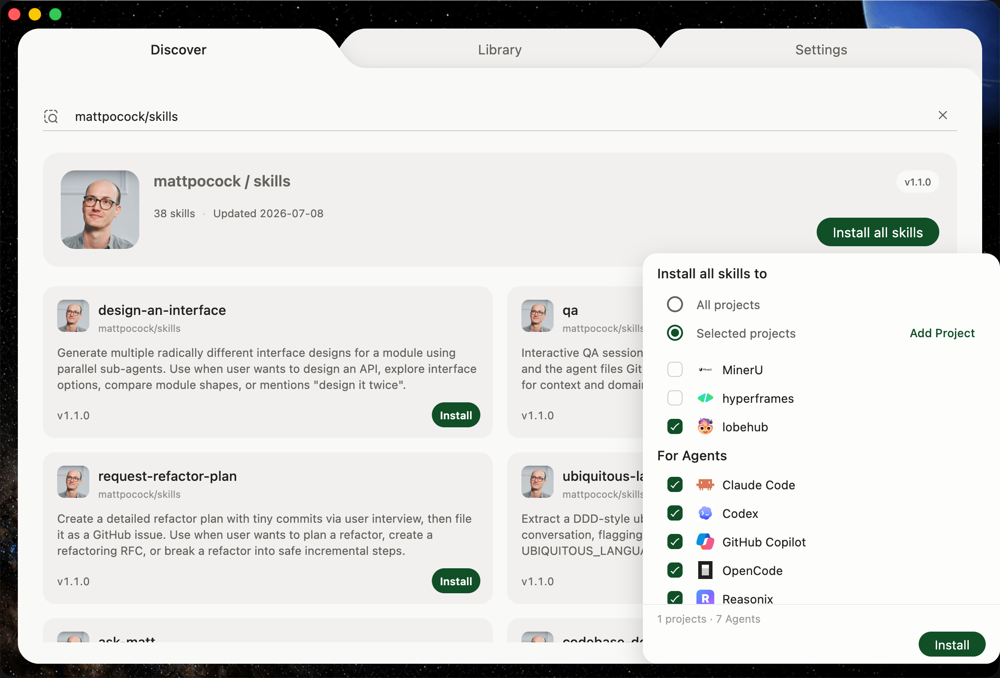
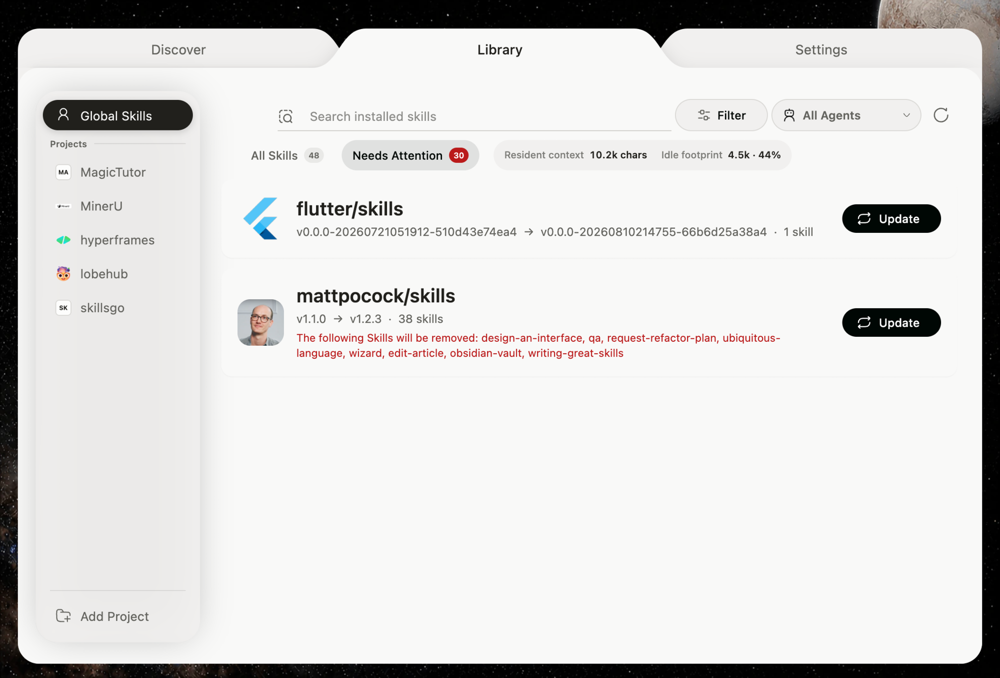
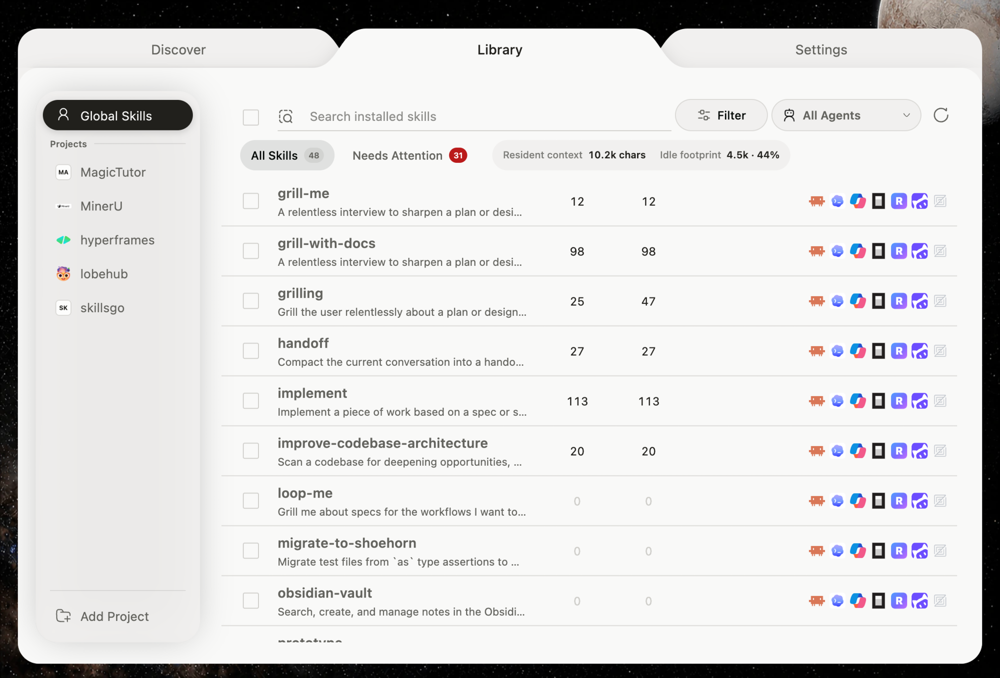
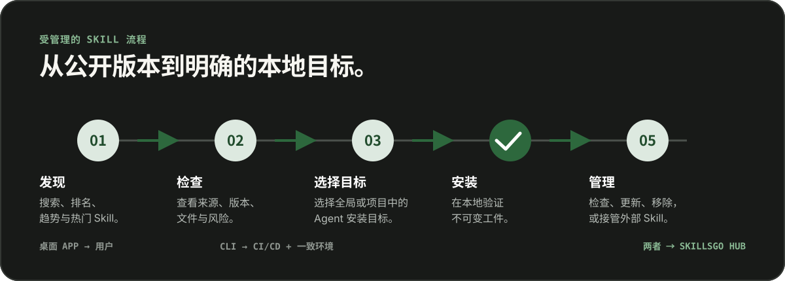

<p align="center">
  
</p>

**一套贯穿 Agent Skills 的工作流程 —** 发现来源可验证的 Skill、锁定不可变版本，并通过桌面 App 或便于自动化的 CLI 管理同一套安装。

<!-- README-I18N:START -->

  <p>
    <a href="../../README.md">English</a> ·
    <strong>简体中文</strong> ·
    <a href="./README.zh-TW.md">繁體中文（台灣）</a> ·
    <a href="./README.zh-HK.md">繁體中文（香港）</a> ·
    <a href="./README.ja.md">日本語</a> ·
    <a href="./README.ko.md">한국어</a> ·
    <a href="./README.fr.md">Français</a> ·
    <a href="./README.de.md">Deutsch</a> ·
    <a href="./README.it.md">Italiano</a> ·
    <a href="./README.es.md">Español</a> ·
    <a href="./README.pt-BR.md">Português (Brasil)</a> ·
    <a href="./README.ru.md">Русский</a> ·
    <a href="./README.ar.md">العربية</a> ·
    <a href="./README.hi.md">हिन्दी</a> ·
    <a href="./README.id.md">Bahasa Indonesia</a> ·
    <a href="./README.tr.md">Türkçe</a> ·
    <a href="./README.nl.md">Nederlands</a> ·
    <a href="./README.pl.md">Polski</a> ·
    <a href="./README.th.md">ไทย</a> ·
    <a href="./README.vi.md">Tiếng Việt</a> ·
    <a href="./README.ms.md">Bahasa Melayu</a> ·
    <a href="./README.sv.md">Svenska</a> ·
    <a href="./README.uk.md">Українська</a>
  </p>
<!-- README-I18N:END -->

SkillsGo 是一个来源可验证的 Agent Skills 生态系统，覆盖发现、版本管理和日常使用。你可以用桌面 App 探索和管理 Skill，用 CLI 实现可重现安装，并将 Hub 作为不可变 Package Version 的共享或自托管分发源。

> **可以把它理解为 Agent Skills 领域的 npm、Homebrew 或 Maven。** GitHub 仍是代码的事实来源；SkillsGo Hub 将受支持的来源转换为可发现、不可变且可通过校验和验证的 Skill Package，让 App 和 CLI 能在不同 Agent 与机器上获得一致的安装结果。

<p align="center">
  
</p>

**从持续变化的源码到稳定依赖 —** Hub 让用户按意图发现 Skill，同时为机器提供精确的 Package 标识、不可变版本、已收录的 Skill 清单和校验和。

## 选择使用方式

|模式|最适合 | SkillsGo 提供什么 |
| --- | --- | --- |
| **个人App** |交互式发现和管理 Skill |来源证据、支持的 Agent 目标、项目和全局库、安全更新预览以及本地上下文足迹见解 |
| **CLI 和 CI/CD** |可重复的开发环境和自动化|机器可读命令、精确的 Skill 选择、`skills.yaml`、`skills-lock.yaml`、校验和验证、离线缓存恢复和范围感知更新 |
| **自托管 Hub** |需要受控 Skill 目录的团队 |具有相同公共协议、不可变 Package Version、可搜索元数据、静态 Git 工件和可选访问控制的可配置 Hub Origin |

比较是关于角色，而不是协议兼容性：

|熟悉的模式| SkillsGo Hub 给 Agent Skills 带来了什么 |
| --- | --- |
| **npm 注册表** |可搜索的 Package 身份和显式不可变版本，而不是从移动分支复制未知文件夹 |
| **Homebrew tap** | App 或 CLI 可以跨开发人员机器使用的一种可信分发源 |
| **Maven 存储库** |稳定的坐标、不可变的工件、校验和和可锁定的依赖解析 |
| **Skill 特定层** |来源证据、接受的 Skill 成员资格、准确的成员选择、支持的 Agent 元数据和安装目标 |

Hub 不会取代 GitHub，也不声称兼容 npm、Homebrew 或 Maven；它只是把这些生态中成熟的注册与分发保障带到 Agent Skills。

## 为什么是SkillsGo

- **安装前的源证据** — 在更改机器之前检查源存储库、不可变版本、支持的 Agent、文件和渲染的 `SKILL.md`。
- **可重现的环境** - 解析标签、分支或提交一次，保留生成的不可变版本，并通过严格的清单和锁定来恢复它。
- **一个 Package，显式成员** — 分发完整的 Package Version，同时选择确切的 Skill 名称或路径以及应该接收它们的 Agent 目标。
- **本地优先安全** — 保护本地修改，保持派生状态可重建，并在 Hub 不可用时继续本地清单工作。
- **上下文足迹洞察** — 估算常驻 Skill 名称和描述占用的字符量，并识别过去 45 或 90 天内没有检测到调用的 Skill。这是本地上下文的近似指标，而不是模型计费数据。
- **两种产品接口，一套协议** — 使用 App 完成交互式工作流程，使用 CLI 实现自动化；两者都遵循同一套 Hub 协议。

## 查看 App 的实际应用

桌面 App 把发现、来源证据、安装目标和本地清单串成一套直观流程。个人使用无需登录。

<p align="center">
  
</p>

**实时 Hub 发现 —** 无需登录即可浏览持续更新的目录，因此在任何本地安装或配置更改之前都可以看到有用的 Skill。

### 发现和检查

按 Skill 或源存储库搜索，探索排名和搜索结果，并在安装前检查源存储库、不可变版本、支持的 Agent、翻译的摘要和渲染的 `SKILL.md`。

<p align="center">
  
</p>

**源感知搜索 —** 按功能或存储库查找 Skill 并查看其 Package 上下文，帮助您比较相关的 Skill，而不是信任孤立的代码片段。

<p align="center">
  
</p>

**安装前检查 —** 先检查不可变版本、支持的 Agent、源文件和渲染后的说明，减少供应链风险和误改本机环境。

### 安装并管理本地 Skill

全局安装或安装到选定的项目中，选择应接收相同 Skill 版本的 Agent 目标，并在应用 Package 更新之前检查其后果。

<p align="center">
  
</p>

**显式安装目标 —** 选择全局或项目范围以及接收 Skill 的确切 Agent，保持一个版本的一致性，而无需手动复制文件。

<p align="center">
  
</p>

**影响感知更新 —** 在应用更新前查看版本变化和将被移除的 Skill，让依赖变更保持可控且可恢复。

<p align="center">
  
</p>

**全局库洞察 —** 比较一个清单中的 45/90 天本地使用情况、上下文足迹和 Agent 可见性，使未使用的 Skill 和驻留上下文更易于管理。

<p align="center">
  
</p>

**项目范围的治理 —** 将同一清单缩小到一个项目，因此可以在没有全局噪音的情况下审查其安装、使用证据和未托管的 Skill。

## 通过 CLI 和 Hub 进行版本化分发

CLI 和 Hub 构成 SkillsGo 的工程化接口。Hub 将持续变化的源码仓库转换为稳定的依赖边界：Package 是分发单元，每个 Package Version 都是某个源码修订及其完整 Skill 清单的不可变快照。用户可以按意图发现 Skill，机器则按精确标识完成安装。

```yaml
dependencies:
  github.com/acme/skills:
    version: v1.2.3
    skills: [review, design]
    agents: [codex, claude-code]
```

`skills.yaml` 记录所需的 Package 版本、选定的成员和 Agent 目标。生成的 `skills-lock.yaml` 将该版本绑定到其 Package `h1:` 校验和。新机器或 CI 作业可以运行相同的安装流程并验证同一工件，而不必跟随持续变化的分支。

```sh
# Discover and inspect
npx skillsgo find typescript
npx skillsgo show github.com/acme/skills@v1.2.3

# Add exact members to a project or the global scope
npx skillsgo add github.com/acme/skills@v1.2.3 \
  --skill review --agent codex

# Restore, preview, and update reproducibly
npx skillsgo install
npx skillsgo update --dry-run
npx skillsgo update --yes
```

相同的命令可以针对另一个 Hub Origin：

```sh
npx skillsgo add github.com/acme/skills@v1.2.3 \
  --hub https://hub.example.com \
  --skill review --agent codex
```

## 团队自托管 Hub

组织可以运行 Hub Origin，它实现与官方服务相同的 SkillsGo 协议。这使得可以策划批准的目录、保持 Package Version 历史记录不可变、公开可搜索的元数据、提供经过验证的工件，并将 App 或 CLI 指向一个受控来源。

```text
Source repository
       │
       ▼
Hub Package Version ── immutable metadata, artifact, and h1: sum
       │
       ├── SkillsGo App (interactive discovery and management)
       └── SkillsGo CLI (projects, CI/CD, and repeatable installs)
```

公共 Hub 合约目前主要关注受支持的公共 Skill 源。私有Hub可以提供经批准的Package的受控分发；私有源摄取和企业身份集成是单独的部署功能，而不是隐藏在客户端中的假设。

## 它是如何工作的

<p align="center">
  
</p>

**共享的不可变协议 —** Hub 一次性解析源证据，而 App 和 CLI 消耗相同的 Package Version 和校验和，从而为交互式和自动安装提供相同的结果。

1. 支持的源解析为一个不可变的 Package Version。
2. Hub 发布 Package 元数据、已收录的 Skill 清单、静态 Git 工件以及可验证的 Package 校验和。
3. App 或 CLI 读取相同的协议，并让用户选择确切的成员、范围和 Agent 目标。
4. CLI 根据清单和锁文件生成受保护的本地 Package 树及 Agent 侧安装映射。
5. 更新会解析出新的不可变版本，并在更改本地状态前显示影响。

## 探索单一存储库

```text
skillsgo/
├── app/       Flutter desktop client and user experience
├── cli/       Go CLI, local state, and Skill execution engine
├── hub/       Public Hub service and reusable self-host runtime
├── protocol/  Shared executable contracts used by CLI and Hub
├── web/       Public product, Hub, and documentation surface
└── e2e/       Cross-product CLI/Hub and desktop journeys
```

请阅读 [`CONTEXT-MAP.md`](../../CONTEXT-MAP.md) 了解产品边界和领域语言。公开发布和工件模型记录在 [`docs/release-design.md`](../release-design.md) 中。

## 本地运行

统一开发拓扑目前针对 macOS，需要 Flutter、Go、Docker、[Process Compose](https://github.com/F1bonacc1/process-compose) 和 [Air](https://github.com/air-verse/air)。

```sh
make dev
```

这将在一个受监督会话下启动 PostgreSQL、本地 Hub、新构建的 CLI 和 Flutter 桌面 App。要验证所有配置的工作区：

```sh
make test
```

每个工作区都有可用的重点入口点：

|工作空间 |开发或验证|
| --- | --- |
| App | `cd app && flutter run -d macos` |
| CLI | `cd cli && go test ./...` |
| Hub | `cd hub && go test ./...` |
|协议| `cd protocol && go test ./...` |
|网页 | `cd web && pnpm install && pnpm dev` |

更改产品行为之前，请参阅 [CONTRIBUTING.md](../../CONTRIBUTING.md)。

## 项目状态

SkillsGo 正处于积极的早期发布开发阶段。 App、CLI、Hub 和协议作为单独的发布单元开发，而包管理器输出和本机档案则从相同的经过验证的 CLI 构建矩阵组装而成。请参阅[发布设计](../release-design.md)，了解支持的目标、工件完整性、更新行为和供应链要求。

## 社区

- 使用 [GitHub 讨论](https://github.com/skillsgo/skillsgo/discussions) 提出问题、故障排除和早期想法。
- 使用重点[问题表格](https://github.com/skillsgo/skillsgo/issues/new/choose) 来解决可重现的错误、具体的功能请求和文档问题。
- 按照[SECURITY.md](../../SECURITY.md)私下报告漏洞。
- 参与受[行为准则](../../CODE_OF_CONDUCT.md)和[治理模型](../../GOVERNANCE.md)约束。

## 执照

SkillsGo 根据 [Apache License 2.0](../../LICENSE) 获得许可。

Hub 包含源自 [Athens](https://github.com/gomods/athens) 的代码，该代码仍受 Athens MIT 许可证和归属声明的约束。请参阅[`NOTICE`](../../NOTICE)和[`THIRD_PARTY_LICENSES/ATHENS-LICENSE`](../../THIRD_PARTY_LICENSES/ATHENS-LICENSE)。
