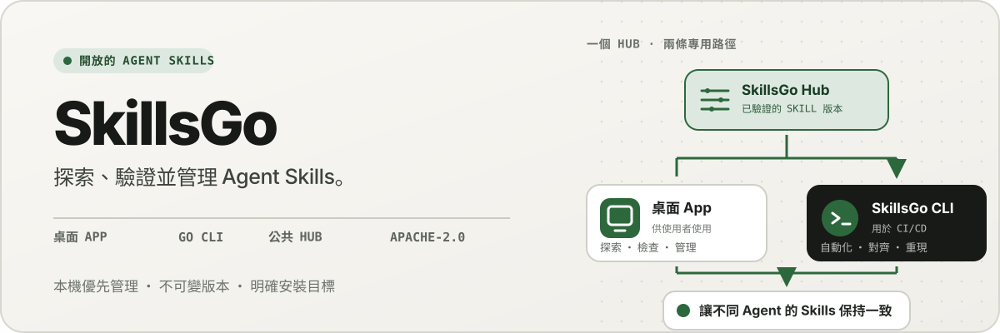
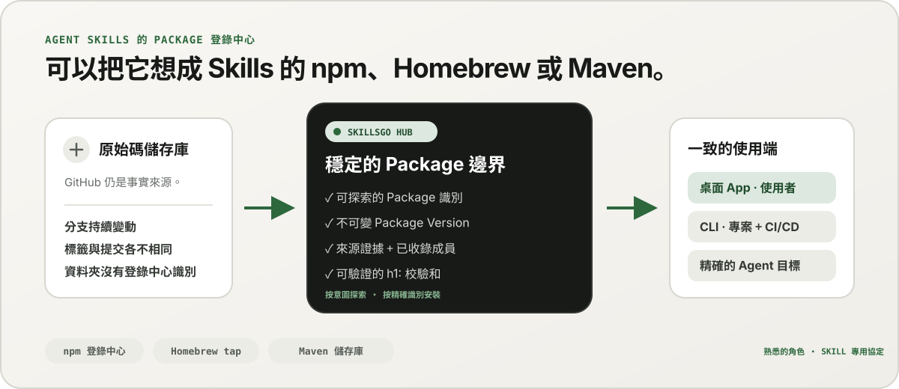
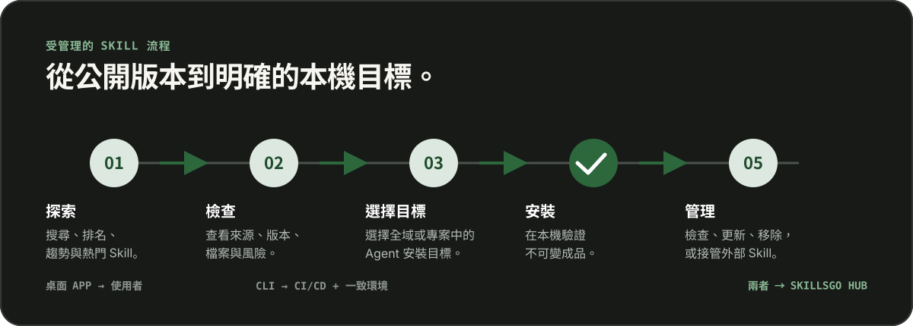

<p align="center">
  
</p>

**Agent Skills 的一個工作流程 —** 發現可驗證來源的 Skill、固定不可變版本，並透過桌上型 App 或自動化友善的 CLI 操作相同的安裝。

<!-- README-I18N:START -->

  <p>
    <a href="../../README.md">English</a> ·
    <a href="./README.zh-CN.md">简体中文</a> ·
    <strong>繁體中文（台灣）</strong> ·
    <a href="./README.zh-HK.md">繁體中文（香港）</a> ·
    <a href="./README.ja.md">日本語</a> ·
    <a href="./README.ko.md">한국어</a> ·
    <a href="./README.fr.md">Français</a> ·
    <a href="./README.de.md">Deutsch</a> ·
    <a href="./README.it.md">Italiano</a> ·
    <a href="./README.es.md">Español</a> ·
    <a href="./README.pt-BR.md">Português (Brasil)</a> ·
    <a href="./README.ru.md">Русский</a> ·
    <a href="./README.ar.md">العربية</a> ·
    <a href="./README.hi.md">हिन्दी</a> ·
    <a href="./README.id.md">Bahasa Indonesia</a> ·
    <a href="./README.tr.md">Türkçe</a> ·
    <a href="./README.nl.md">Nederlands</a> ·
    <a href="./README.pl.md">Polski</a> ·
    <a href="./README.th.md">ไทย</a> ·
    <a href="./README.vi.md">Tiếng Việt</a> ·
    <a href="./README.ms.md">Bahasa Melayu</a> ·
    <a href="./README.sv.md">Svenska</a> ·
    <a href="./README.uk.md">Українська</a>
  </p>
<!-- README-I18N:END -->

SkillsGo 是一個可驗證來源的生態系統，用於發現、版本控制和操作 Agent Skills。使用桌上型 App 探索和管理 Skill，使用 CLI 使安裝可重現，並使用 Hub 作為不可變 Package Version 的共用或自架分發來源。

> **可以把它想成 Agent Skills 的 npm、Homebrew 或 Maven。** GitHub 仍是程式碼的事實來源；SkillsGo Hub 將支援的來源轉換成可探索、不可變且可驗證校驗和的 Skill Package，讓 App 與 CLI 能在不同 Agent 和機器上得到一致的安裝結果。

<p align="center">
  
</p>

**從持續變動的原始碼到穩定依賴 —** Hub 讓使用者按意圖探索 Skill，同時為系統提供精確的 Package 識別、不可變版本、已收錄的 Skill 清單與校驗和。

## 選擇您的營運模式

|模式|最適合 | SkillsGo 提供什麼 |
| --- | --- | --- |
| **個人App** |互動式發現與管理 Skill |來源證據、支援的 Agent 目標、專案與全域函式庫、安全更新預覽、本機情境足跡見解 |
| **CLI 和 CI/CD** |可重複的開發環境和自動化|機器可讀命令、精確的 Skill 選擇、`skills.yaml`、`skills-lock.yaml`、校驗和驗證、離線快取恢復和範圍感知更新 |
| **自架 Hub** |需要受控 Skill 目錄的團隊 |具有相同公共協定、不可變 Package Version、可搜尋元資料、靜態 Git 工件和可選存取控制的可設定 Hub Origin |

比較是關於角色，而不是協定相容性：

|熟悉的模式| SkillsGo Hub 為 Agent Skills 帶來了什麼 |
| --- | --- |
| **npm 註冊表** |可搜尋的 Package 身分和明確不可變版本，而不是從行動分支複製未知資料夾 |
| **Homebrew tap** | App 或 CLI 可以跨開發人員機器使用的一種可信任分發來源 |
| **Maven 儲存庫** |穩定的座標、不可變的工件、校驗和和可鎖定的依賴解析 |
| **Skill 特定層** |來源證據、接受的 Skill 成員資格、準確的成員選擇、支援的 Agent 元資料和安裝目標 |

Hub 不會取代 GitHub 或假裝與 npm、Homebrew 或 Maven 相容。它為 Agent Skills 提供了註冊和分發保證，這些生態系統為其他類型的軟體所熟悉。

## 為什麼是SkillsGo

- **安裝前的來源證據** — 在更改機器之前檢查來源儲存庫、不可變版本、支援的 Agent、檔案和渲染的 `SKILL.md`。
- **可重現的環境** - 解析標籤、分支或提交一次，保留生成的不可變版本，並通過嚴格的清單和鎖定來恢復它。
- **一個 Package，明確成員** — 分發完整的 Package Version，同時選擇確切的 Skill 名稱或路徑以及應該接收它們的 Agent 目標。
- **本機優先安全性** — 保護本機修改，保持衍生狀態可重建，並在 Hub 不可用時繼續本機清單工作。
- **上下文足跡洞察** — 估算常駐 Skill 名稱與描述占用的字元量，再找出過去 45 或 90 天內未偵測到呼叫的 Skill。這是本機上下文的近似指標，而不是模型計費資料。
- **兩種產品介面，一套協定** — 使用 App 完成互動式工作流程，使用 CLI 實現自動化；兩者都遵循同一套 Hub 協定。

## 查看 App 的實際應用

桌面 App 把探索、來源證據、安裝目標與本機清單串成直覺易用的流程。個人使用不需登入。

<p align="center">
  
</p>

**即時 Hub 發現 —** 無需登入即可瀏覽持續更新的目錄，因此在任何本機安裝或設定變更之前都可以看到有用的 Skill。

### 發現和檢查

按 Skill 或來源儲存庫搜索，探索排名和搜尋結果，並在安裝前檢查來源儲存庫、不可變版本、支援的 Agent、翻譯的摘要和渲染的 `SKILL.md`。

<p align="center">
  
</p>

**來源感知搜尋 —** 按功能或儲存庫尋找 Skill 並查看其 Package 上下文，幫助您比較相關的 Skill，而不是信任孤立的程式碼片段。

<p align="center">
  
</p>

**安裝前檢查 —** 首先檢查不可變版本、支援的 Agent、原始檔和渲染指令，減少供應鏈意外和意外機器變更。

### 安裝並管理本機 Skill

全域安裝或安裝到選定的專案中，選擇應接收相同 Skill 版本的 Agent 目標，並在套用 Package 更新之前檢查其後果。

<p align="center">
  
</p>

**明確安裝目標 —** 選擇全域或專案範圍以及接收 Skill 的確切 Agent，保持一個版本的一致性，而無需手動複製檔案。

<p align="center">
  
</p>

**掌握更新影響 —** 套用更新前先查看版本變更與將移除的 Skill，讓依賴變更維持可控且可復原。

<p align="center">
  
</p>

**全域庫洞察 —** 比較一個清單中的 45/90 天本地使用情況、上下文足跡和 Agent 可見性，使未使用的 Skill 和駐留上下文更易於管理。

<p align="center">
  
</p>

**專案範圍管理 —** 將同一份清單縮小至單一專案，即可排除全域雜訊，檢視其安裝項目、使用證據與未受管理的 Skill。

## 透過 CLI 和 Hub 進行版本化分發

CLI 與 Hub 構成 SkillsGo 的工程化介面。Hub 將持續變動的原始碼儲存庫轉換成穩定的依賴邊界：Package 是分發單元，而每個 Package Version 都是某個來源修訂及其完整 Skill 清單的不可變快照。使用者可按意圖探索 Skill，系統則按精確識別完成安裝。

```yaml
dependencies:
  github.com/acme/skills:
    version: v1.2.3
    skills: [review, design]
    agents: [codex, claude-code]
```

`skills.yaml` 記錄所需的 Package 版本、選定的成員和 Agent 目標。產生的 `skills-lock.yaml` 將此版本綁定到其 Package `h1:` 總和。新機器或 CI 作業可以執行相同的安裝流程並驗證相同的工件，而不是遵循移動分支。

```sh
# Discover and inspect
npx skillsgo find typescript
npx skillsgo show github.com/acme/skills@v1.2.3

# Add exact members to a project or the global scope
npx skillsgo add github.com/acme/skills@v1.2.3 \
  --skill review --agent codex

# Restore, preview, and update reproducibly
npx skillsgo install
npx skillsgo update --dry-run
npx skillsgo update --yes
```

相同的指令可以針對另一個 Hub Origin：

```sh
npx skillsgo add github.com/acme/skills@v1.2.3 \
  --hub https://hub.example.com \
  --skill review --agent codex
```

## 團隊自架 Hub

組織可以運行 Hub Origin，它實現與官方服務相同的 SkillsGo 協議。這使得可以策劃批准的目錄、保持 Package Version 歷史記錄不可變、公開可搜尋的元資料、提供經過驗證的工件，並將 App 或 CLI 指向一個受控來源。

```text
Source repository
       │
       ▼
Hub Package Version ── immutable metadata, artifact, and h1: sum
       │
       ├── SkillsGo App (interactive discovery and management)
       └── SkillsGo CLI (projects, CI/CD, and repeatable installs)
```

公共 Hub 合約目前主要關注受支援的公共 Skill 來源。私有Hub可以提供經批准的Package的受控分發；私有來源攝取和企業身分整合是單獨的部署功能，而不是隱藏在客戶端中的假設。

## 它是如何工作的

<p align="center">
  
</p>

**共享的不可變協議 —** Hub 一次解析來源證據，而 App 和 CLI 消耗相同的 Package Version 和校驗和，從而為互動式和自動安裝提供相同的結果。

1. 支援的來源解析為一個不可變的 Package Version。
2. Hub 發布 Package 元資料、接受的 Skill 成員資格、靜態 Git 工件以及可驗證的 Package 總和。
3. App 或 CLI 讀取相同的協議，並讓使用者選擇確切的成員、範圍和 Agent 目標。
4. CLI 根據資訊清單與鎖定檔產生受保護的本機 Package 樹及 Agent 安裝映射。
5. 更新會解析新的不可變版本，並在變更本機狀態前顯示影響。

## 探索單一儲存庫

```text
skillsgo/
├── app/       Flutter desktop client and user experience
├── cli/       Go CLI, local state, and Skill execution engine
├── hub/       Public Hub service and reusable self-host runtime
├── protocol/  Shared executable contracts used by CLI and Hub
├── web/       Public product, Hub, and documentation surface
└── e2e/       Cross-product CLI/Hub and desktop journeys
```

請閱讀 [`CONTEXT-MAP.md`](../../CONTEXT-MAP.md) 以了解產品邊界和領域語言。公開發布和工件模型記錄在 [`docs/release-design.md`](../release-design.md) 中。

## 本機運行

統一開發拓樸目前針對 macOS，需要 Flutter、Go、Docker、[Process Compose](https://github.com/F1bonacc1/process-compose) 和 [Air](https://github.com/air-verse/air)。

```sh
make dev
```

這將在一個受監督會話下啟動 PostgreSQL、本地 Hub、新建的 CLI 和 Flutter 桌面 App。若要驗證所有配置的工作區：

```sh
make test
```

每個工作區都有可用的重點入口點：

|工作空間 |開發或驗證|
| --- | --- |
| App | `cd app && flutter run -d macos` |
| CLI | `cd cli && go test ./...` |
| Hub | `cd hub && go test ./...` |
|協定| `cd protocol && go test ./...` |
|網頁 | `cd web && pnpm install && pnpm dev` |

在更改產品行為之前，請參閱 [CONTRIBUTING.md](../../CONTRIBUTING.md)。

## 專案狀態

SkillsGo 正處於積極的早期發布開發階段。 App、CLI、Hub 和協定是作為單獨的發佈單元開發，而套件管理器輸出和本機檔案則從相同的經過驗證的 CLI 建置矩陣組裝而成。請參閱[發佈設計](../release-design.md)，以了解支援的目標、工件完整性、更新行為和供應鏈要求。

## 社區

- 使用 [GitHub 討論](https://github.com/skillsgo/skillsgo/discussions) 提出問題、故障排除和早期想法。
- 使用重點[問題表格](https://github.com/skillsgo/skillsgo/issues/new/choose) 來解決可重現的錯誤、特定的功能請求和文件問題。
- 依照[SECURITY.md](../../SECURITY.md)私下通報漏洞。
- 參與受[行為準則](../../CODE_OF_CONDUCT.md)和[治理模型](../../GOVERNANCE.md)約束。

## 執照

SkillsGo 根據 [Apache License 2.0](../../LICENSE) 授權。

Hub 包含源自 [Athens](https://github.com/gomods/athens) 的程式碼，仍受 Athens MIT 授權和歸屬聲明的約束。請參閱[`NOTICE`](../../NOTICE)和[`THIRD_PARTY_LICENSES/ATHENS-LICENSE`](../../THIRD_PARTY_LICENSES/ATHENS-LICENSE)。
